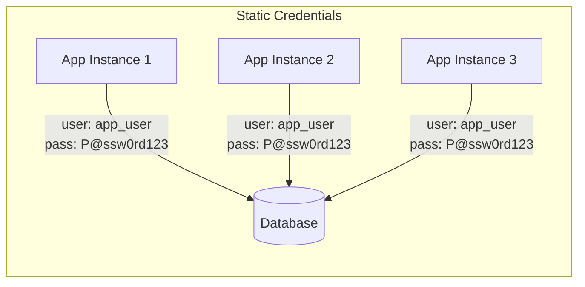
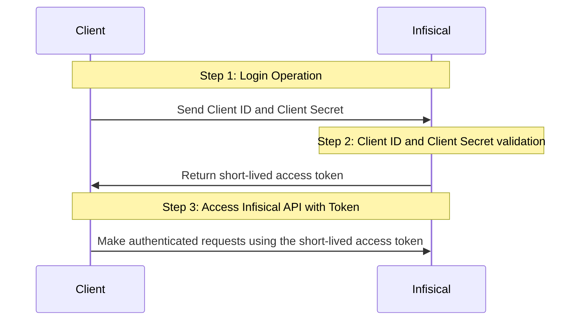
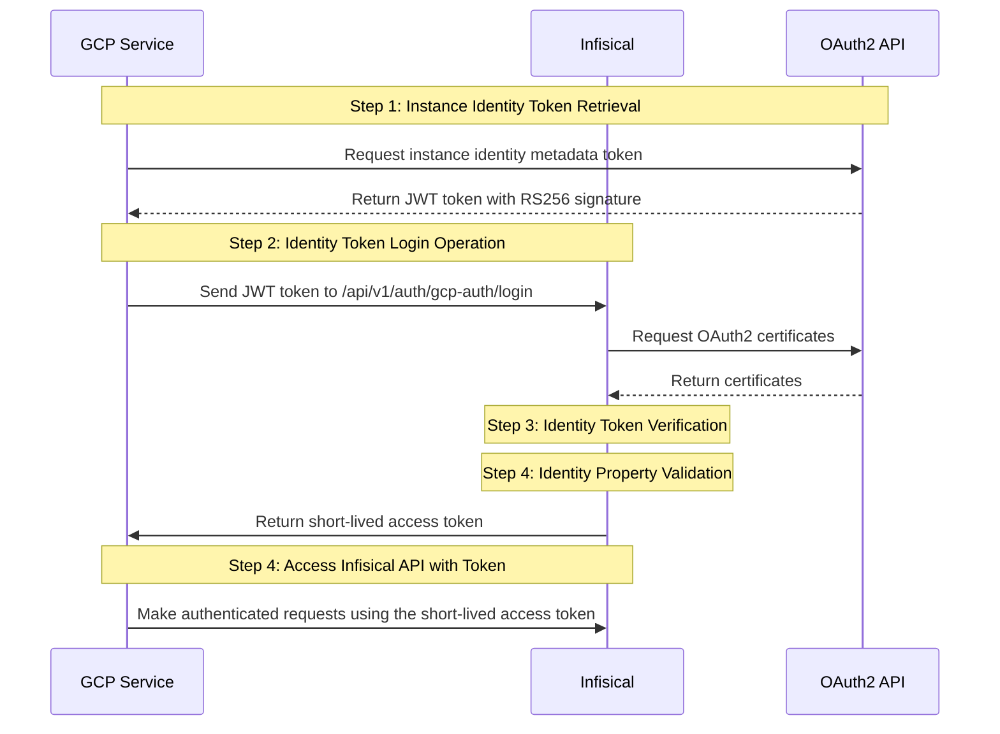

# Productized AI Agent Secrets Manager: plan and research walkthrough

**Session ID:** ses_34db78eedffeZVf2SKom2mimHk
**Created:** 3/3/2026, 11:30:17 AM
**Updated:** 3/3/2026, 1:33:32 PM

---

## User

let's plan out a product together basically, I want to make AI agent native secrets manager like 1password for AI agents, I want you to study recent successfull products where they make X for AI agents where X is well established product category, then study what the market needs the pain points that our producy 1password for AI agent would solve, look at the current solutions and let's make a better product. let's discuss what features it should have then We'll build it together. use exa mcp to do the research 

---

## Assistant (Plan · gpt-5.3-codex · 29.1s)

_Thinking:_

**Planning AI agent product research**

**Tool: exa_web_search_exa**

**Input:**
```json
{
  "query": "successful 'for AI agents' startup infrastructure examples 2024 2025",
  "numResults": 8,
  "livecrawl": "preferred"
}
```

**Output:**
```
Title: Real-world gen AI use cases from the world's leading organizations
URL: https://cloud.google.com/transform/101-real-world-generative-ai-use-cases-from-industry-leaders
Text: Real-world gen AI use cases from the world's leading organizations | Google Cloud Blog

AI & Machine Learning

# 1,001 real-world gen AI use cases from the world's leading organizations

October 9, 2025

- [Transform with Google Cloud]<web_link>

##### Matt Renner

President and Chief Revenue Officer, Google Cloud

##### Matt A.V. Chaban

Senior Editor, Transform

#### AI is here, AI is everywhere: Top companies, governments, researchers, and startups are already enhancing their work with Google's AI solutions.

##### Try Nano Banana 2

State-of-the-art image generation and editing

[Try now]<web_link>

Published April 12, 2024; last updated October 9, 2025.

---

A year and a half ago, during Google Cloud Next 24, we published this list for the first time. It numbered 101 entries.

It felt like a lot at the time, and served as a showcase of how much momentum both Google and the industry were seeing around generative AI adoption. In the brief period then of gen AI being widely available, organizations of all sizes had begun experimenting with it and p

Title: The AI Agent Infrastructure Stack — Three Defining Layers: Tools, Data ...
Author: Coral Garnick
URL: https://www.madrona.com/ai-agent-infrastructure-three-layers-tools-data-orchestration/
Text: AI Agent Infrastructure —Three Defining Layers: Tools, Data, Orchestration
[Skip to content]<web_link>
[Madrona]<web_link>
[All]<web_link>
[Madrona News]<web_link>
[Perspectives]<web_link>
[Podcasts]<web_link>
February 28, 2025
by[Jon Turow]<web_link>
# The AI Agent Infrastructure Stack —Three Defining Layers: Tools, Data, and Orchestration
Imagine a startup where a 20-person team can generate $100 million in annual recurring revenue in less than two years. This isn’t a futuristic fantasy —it’s the unfolding reality of AI-powered growth. Companies like Cursor, Bolt, Lovable, and Mercor are shattering traditional scaling rules, proving that lean teams armed with intelligent agents can disrupt entire industries.
What this reveals is a shift in startup dynamics. Founders are no longer constrained by headcount or conventional development cycles. As AI agents move from early successes to becoming a foundational part of modern software, they are driving a shift in infrastructure needs.
This shift follows a familiar pattern: As new appli

Title: Kernel Powers 1,000+ AI Agents on $444/Month of Railway Infrastructure
Author: 
Published Date: 2025-12-02T00:00:00.000Z
URL: https://blog.railway.com/p/kernel-ai-infra
Text: Kernel Powers 1,000+ AI Agents on $444/Month of Railway Infrastructure

Angelo Saraceno

Dec 2, 2025

For a Y Combinator startup providing AI infrastructure to over 1,000 AI companies, every millisecond of latency and every deployment matters. Kernel spins up cloud browsers for customers building AI agents that need to access the internet, serving as critical infrastructure for the exploding AI agent ecosystem.

When co-founder and CTO Rafael Garcia started Kernel in January, he brought hard-won lessons from his previous company Clever, which sold for $500 million in 2021 after building a six-person infrastructure team to manage AWS.

"Clever started on Heroku in 2012, which was like the Railway of the time. We quickly outgrew it and switched to home rolling our own tooling around AWS. My big learning from that experience was that we should have tried to hold on to Heroku longer than we did."

Garcia watched his previous company dedicate six full-time engineers to building an internal platform-as-a-service, reinventing products that eventually existe

Title: Blaxel raises $7.3M seed round led by First Round to build cloud infrastructure for the AI agent economy | Blaxel Blog
Author: Nicolas Lecomte
Published Date: 2025-12-03T00:00:00.000Z
URL: https://blog.blaxel.ai/Blaxel-Raises-7-3M-Seed-Round-led-by-First-Round-to-Build-Cloud-Infrastructure-for-the-AI-Agent-Eco-23247e47b1ea8067b923d998364e3ced
Text: Blaxel raises $7.3M seed round led by First Round to build cloud infrastructure for the AI agent economy | Blaxel Blog

We're excited to announce that Blaxel has raised $7.3M in seed funding from First Round, Y Combinator, Liquid 2, Multimodal and several others. This investment will accelerate our mission to provide the infrastructure layer that AI agents need to operate reliably at scale. Current cloud offerings were designed for the SaaS era of human users. Now, there's an urgent need for a new cloud platform that understands the unique requirements of autonomous agents.

## The Problem: AI Agents Need Different Infrastructure

The rise of AI agents has fundamentally changed how software is built and deployed. Agents are now managing calendars, responding to emails, generating code, and even creating entire applications autonomously. Yet they're running on infrastructure des

Title: What Do You Use for AI Agent Infrastructure? Complete Guide
Author: Alin Dobra December 11, 2025
URL: https://www.bunnyshell.com/blog/what-do-you-use-for-ai-agent-infrastructure/
Text: What Do You Use for AI Agent Infrastructure? Complete Guide

# What Do You Use for AI Agent Infrastructure? The Complete Guide to Building Production-Ready Agent Systems

Why Traditional Infrastructure Falls Short for AI Agents

The Core Components of AI Agent Infrastructure

Infrastructure Patterns for Different Agent Use Cases

Real-World Implementation: What Teams Are Actually Deploying

The Future of AI Agent Infrastructure

The question "what do you use for AI agent infrastructure?" has become one of the most searched queries in the DevOps and platform engineering space. And for good reason: the global AI agent market is projected to grow from $5.1 billion in 2024 to $47.1 billion by 2030, representing a compound annual growth rate of nearly 45%. With 85% of enterprises expected to implement AI agents by the end of 2025, getting the infrastructure right has never been more critical.

But here's the challenge most teams face: AI agents aren't like traditional applications. They're non-deterministic, they execute code dynamically, they i

Title: Stack AI raises $16M for Enterprises to Deploy AI agents at Scale
Author: 
Published Date: 2025-09-09T00:00:00.000Z
URL: https://stack-ai.com/blog/stack-ai-raises-16m-series-a-to-create-ai-agents-for-every-job
Text: Stack AI raises $16M for Enterprises to Deploy AI agents at Scale
[Blog]<web_link>
&gt;
[News]<web_link>
# Enterprise AI Agents for Every Job: StackAI Raises $16M
# Enterprise AI Agents for Every Job: StackAI Raises $16M
May 6, 2025
Today, over 82% of companies globally are either utilizing or actively exploring the use of artificial intelligence (AI) within their business operations. This rise in usage was fueled by the rapid growth of LLMs, including exceptional improvements in their versatility and reasoning capabilities.
Our recent exponential growth at Stack AI, coupled with this vast expansion of AI technologies, has led us to double down on our premise. We want to deploy[AI agents in enterprise]<web_link>companies that can perform any job.
And that’s why, as of today, we’re thrilled to announce our latest round of funding. We recently raised a Series A of $16 million to capitalize on this tremendous opportunity in generative AI and AI agents.
## **The Promise of AI Agents**
First, let’s add some context

Title: Sema4.ai Launches Enterprise AI Agent Platform That Runs Natively on Snowflake
Author: 
Published Date: 2025-09-08T00:00:00.000Z
URL: https://sema4.ai/newsroom/enterprise-ai-agent-platform-runs-natively-snowflake
Text: Sema4.ai Launches Enterprise AI Agent Platform That Runs Natively on Snowflake - Sema4.ai
[Skip to content]<web_link>
Sema4.ai Named a Cool Vendor in the 2025 Gartner® Agentic AI Report --&gt;[Read now]<web_link>
![Close]<image_link>
[![Image]<image_link>Back to newsroom]<web_link># Sema4.ai Launches Enterprise AI Agent Platform That Runs Natively on Snowflake
![Author]<image_link>
June 4, 2025
![]<image_link>
* ****Sema4.ai’s Team Edition makes it easy for teams to build, test, and deploy Sema4 Agents directly into Snowflake with a single click.****
* ****Powered by Anthropic Claude via Snowflake Cortex AI, Team Edition offers features like seamless deployment, multi-source data integration, and greater extensibility with new support for MCP servers.****
* ****A new $25M Series A extension from Snowflake Ventures, Rocketship VC, MVP Ventures, COX Enterprises, Mayfield, and Benchmark will support accelerated product development and drive enterprise platform adoption in the Snowflake ecosystem and beyond.***

Title: Building an AI Factory: 2,000 Real Solved Issues | by Anthony Chaudhary | Oct, 2025 | Medium
Author: Anthony Chaudhary
Published Date: 2025-10-28T00:00:00.000Z
URL: https://building.theatlantic.com/building-an-ai-factory-scaling-autonomous-development-to-18-000-commits-in-30-days-2e5f09d413bc
Text: Building an AI Factory: 2,000 Real Solved Issues | by Anthony Chaudhary | Oct, 2025 | Medium

[Sitemap]<web_link>

[Open in app]<web_link>

Sign up

[Sign in]<web_link>

[Medium Logo]<web_link>

[Write]<web_link>

[Search]<web_link>

Sign up

[Sign in]<web_link>

# Building an AI Factory: Scaling Autonomous Development to 2,000 Real Solved Issues in 30 Days

[Anthony Chaudhary]<web_link>

11 min read

Oct 28, 2025

--

Listen

Share

Press enter or click to view image in full size

Issues solved using autonomous factory

## The Experiment That Redefined Our Methodology

What began as a focused, one-month experiment in purely AI-driven development rapidly evolved into our core production methodology. This is the story of an experiment in an engineering a system — an “AI Factory” — that fundamentally changes the software development lifecycle.

We scaled autonomous agents to handle production-grade software engineering workloads.


```

**Tool: exa_web_search_exa**

**Input:**
```json
{
  "query": "Browserbase AI agents funding traction customers",
  "numResults": 5,
  "livecrawl": "preferred"
}
```

**Output:**
```
Title: Browserbase Raises $40M To Help AI Agents Work With Websites
Author: Alex Konrad
URL: https://www.upstartsmedia.com/p/browserbase-raises-40m-and-launches-director
Text: Browserbase Raises $40M Series B, Launches AI Automation Tool

SubscribeSign in

# Browserbase Raises $40M To Help AI Agents Work With Websites

### The 16-month-old infrastructure startup behind 'headless browsers' is now valued at $300 million and claims more than 1,000 customers. Now it's launching a tool for non-developers, called Director.

[Alex Konrad]<web_link>

Jun 17, 2025

13

1

1

Share

Browserbase CEO Paul Klein, bottom right, with early members of a team that has now reached 30. Credit: Browserbase

#### The Upshot

City streets would look different, perhaps radically so, if self-driving carmakers could redesign them from scratch. But since human drivers aren’t leaving the road anytime soon, they learn the paths available to them instead, with Waymo spending months, even years, [mapping]<web_link> each one.

The internet in the age of AI is in a similar “messy middle” state, to hear Browserbase founder Paul Klein IV tell it.

“It can be a little contrarian to say, but we’re not going to rewrite the whole internet for AI,” Klein tells Upstarts. “AI is going to get so smart that it’s able to use the internet for you.”

[Get 10% off for 1 year]<web_link>

Browserbase, the startup he launched earlier last year, hopes to help bridge that gap between human use and the AI bots. Klein operates in a wonkily-named area – the “headless browser” – but what his tool does is straightforward: spin up web browsers use by other software, not humans, meaning they lack the interface you might be using to read this article right now.

Why create a ghost browser? They still work with more human-friendly websites, able to authenticate users, click buttons and download data, only faster and at a large scale per project (think the equivalent of thousands of people, over even more hours). That data c

Title: Browserbase  – Funding, Valuation, Investors, News
Author: 
URL: https://o.parsers.vc/startup/browserbase.com/
Text: Browserbase –Funding, Valuation, Investors, News
![Browserbase]<image_link>
[Edit]<web_link># Browserbase
[https://www.browserbase.com/]<web_link>
Last activity: 30.04.2025
Active
Categories:Artificial IntelligenceCloudInfrastructurePlatformWeb
Open to developers everywhere. We can&#x27;t wait to see what you build.
Mentions**
8
**[Twitter]<web_link>
**[Email]<web_link>
## Investors2
Date|Name|Website|
13.03.2024|[base case ...]<web_link>|[basecase.v...]<web_link>|
-|[Developers...]<web_link>|[devtools.f...]<web_link>|
## Mentions in press and media8
Date|Title|Description|
02.05.2025|[The Rise of Agentic AI: Transforming Enterprise Operations]<web_link>|In the fast-paced world of technology, change is the only constant. Enter agentic AI, a game-changer in enterprise operations. Recently, Fabrix.ai hosted its inaugural Agentic AI Demo Day, a landmark event that showcased the future of auton...|
30.04.2025|[Fabrix.ai Successfully Concludes First of Its Kind Agentic AI Demo Day and Joins AGNTCY Collective]<web_link>|Fabrix.ai ( formerly CloudFabrix) a pioneer in enterprise-ready agentic AI solutions, and the leader in several leading analyst reports including The 2025 Gartner Market Guide for Event Intelligence Solutions, successfully hosted its highly...|
24.04.2025|[Rootly Launches AI Labs to Advance Reliability Engineering Through Community Innovation]<web_link>|Rootly, the leading AI-native incident response platform, today announced the launch of Rootly AI Labs, a fellow-led community dedicated to redefining the future of reliability engineering. Rootly AI Labs aims to accelerate operational exce...|
12.11.2024|[Browserbase: Web Browser Automation Company Raises $21 Million (Series A)]<web_link>|Browserbase, a leader in web browser automation, announced it raised $21 million in Series A funding co-led by CRV and Kleiner Perkins, with parti

Title: Building the future of web automation - Browserbase
URL: https://www.browserbase.com/blog/series-b-and-beyond
Text: Building the Future of Web Automation
[Browserbase]<web_link>
[Log In]<web_link>[Sign Up]<web_link>[Get a Demo]<web_link>
[Back to articles]<web_link>
[Back to articles]<web_link>
Announcement
# Building the Future of Web Automation
![Paul Klein]<image_link>
Paul KleinFounder &amp; CEO
June 18, 2025
4 min read
###### Share
* Copy link
* []<web_link>
* []<web_link>
> > Try our new product, [> Director.ai
]<web_link>> today
> In this hyper-fast world of AI, in order to compete you have to keep up. Even since starting Browserbase 16 months ago, I’ve seen the promises of AI turn into production-ready reality.
We&#x27;re proud to be part of this transformation, building the infrastructure that makes web automation accessible to everyone. What started with a thesis that AI agents would require great browser infrastructure, has turned into billion dollar companies using Browserbase to deliver better outcomes for their customers.
## Building on a foundation of primitives
The most transformative technology companies (Twilio, Stripe, Vercel) all share something in common: they&#x27;re primitives. They provide the fundamental building blocks that enable developers to create powerful applications.
Browser infrastructure represents the next critical primitive. It&#x27;s the foundation that will change how people interact with and automate the web, empowering developers to build software that fundamentally transforms online work.
## The opportunity ahead
Think about how often we interact with a web browser: buying products, sending messages, deploying code. Now consider all the routine online tasks, from sending emails to booking travel, that consume our time every single day.
The future of browsing is selective automation. Humans will still do the joyful, discovery-driven tasks. But repetitive, time-consuming work should be done by software. That’s what we

Title: Browserbase Raises $40M Series 🅱️ to Power AI Agents & Vibe ...
Author: Molly O’Shea
URL: https://www.sourcery.vc/p/breaking-browserbase-raises-40m-series
Text: BREAKING: Browserbase Raises $40M Series 🅱️to Power AI Agents &amp; Vibe Coders
[
![Sourcery]<image_link>
]<web_link>
# [![Sourcery]<image_link>]<web_link>
SubscribeSign in
#### Share this post
[
![]<image_link>
![Sourcery]<image_link>
Sourcery
BREAKING: Browserbase Raises $40M Series 🅱️to Power AI Agents &amp; Vibe Coders
]<web_link>
Copy link
Facebook
Email
Notes
More
# BREAKING: Browserbase Raises $40M Series 🅱️to Power AI Agents &amp; Vibe Coders
### Paul Klein IV, Founder &amp; CEO | $300M Valuation, Raising $67.5M in just 15 months
[
![Molly O’Shea's avatar]<image_link>
]<web_link>
[Molly O’Shea]<web_link>
Jun 17, 2025
3
#### Share this post
[
![]<image_link>
![Sourcery]<image_link>
Sourcery
BREAKING: Browserbase Raises $40M Series 🅱️to Power AI Agents &amp; Vibe Coders
]<web_link>
Copy link
Facebook
Email
Notes
More
[]<web_link>
1
[
Share
]<web_link>
[![Embedded YouTube video]<image_link>]<web_link>
## **Powering the Future of Web Automation Infrastructure**
**[Paul Klein IV]<web_link>, founder and CEO of[Browserbase]<web_link>**just announced their**$40 million Series B at a $300M valuation,**led by**Notable Capital***(fka GGV)*. In addition, 🅱️is launching a brand new product,[Director]<web_link>for “vibe coders.” This brings Browserbase’s total funding to $67.5 million in just 15 months (!!) since founding the company. Existing investors include big Silicon Valley funds like**Kleiner Perkins, CRV, Basecase**, and more.**Glenn Solomon of Notable Capital**will be joining the board with this new round.
#### →Listen on[X]<web_link>,[Spotify]<web_link>,[YouTube]<web_link>,[Apple]<web_link>
Collecting what[Paul]<web_link>calls**“Thanos’ rings of investors,”**the company has attracted a network of high profile angel investors including:**Twilio CEO Jeff Lawson, Vercel founder Guillermo Rauc

Title: Browserbase Launches "Director" to Automate the Web for Everyone; Announces $40M Series B
						
						
							
							
								 
									
										
										
											
												 
													USA - English
													 
												 
											
											
												 
											
											
												
											
											
											

										
									
										
										
											
											
											
												
													 
														 
															USA - English
														 
													 
												
											
											
											

										
									
										
										
											
											
											
												
													 
														 
															APAC - English
														 
													 
												
											
											
											

										
									
										
										
											
											
											
												
													 
														 
															Indonesia - Bahasa
														 
													 
												
											
											
											

										
									
										
										
											
											
											
												
													 
														 
															BRAZIL - Portuguese
														 
													 
												
											
											
											

										
									
										
										
											
											
											
												
													 
														 
															MEXICO - Spanish
														 
													 
												
											
											
											

										
									
										
										
											
											
											
												
													 
														 
															USA - Français
														 
													 
												
											
											
											

										
									
										
										
											
											
											
												
													 
														 
															USA - Deutsch
														 
													 
												
											
											
	


```

**Tool: exa_web_search_exa**

**Input:**
```json
{
  "query": "Composio OAuth for AI agents funding product",
  "numResults": 5,
  "livecrawl": "preferred"
}
```

**Output:**
```
Title: Agent Auth - Composio
URL: https://composio.dev/agentauth
Text: Composio - The Skill Layer of AI
[
]<web_link>
[
RUBE(MCP)
]<web_link>
[
pricing
]<web_link>
[
blog
]<web_link>
Solutions
[
docs
]<web_link>
[
Sign in
]<web_link>
[
]<web_link>
MCP
Pricing
blog
tools
docs
EXPLORE
[
AGENT AUTH
]<web_link>[
ENTERPRISES
]<web_link>
STARTUPS
[
]<web_link>
[
RUBE(MCP)
]<web_link>
[
pricing
]<web_link>
[
blog
]<web_link>
Solutions
[
docs
]<web_link>
[
Sign in
]<web_link>
![]<image_link>
AgentAuth
![]<image_link>
![]<image_link>
ConvenientAuthfor your Agents
[
Get started
]<web_link>
![]<image_link>
AgentAuth
![]<image_link>
![]<image_link>
ConvenientAuthfor your Agents
[
Get started
]<web_link>
Used by Agents from
* ![]<image_link>
* * * * ![]<image_link>
![]<image_link>
Authentication that
just works
Authentication that just works
Connect agents to toolkits securely with no refresh logic, no token pain, and no setup hurdles.
Connect agents to toolkits securely with no refresh logic, no token pain, and no setup hurdles.
![]<image_link>
![]<image_link>
![]<image_link>
Built-in Auth for every Agent
All your auth needs handled effortlessly, with no friction and complete security
![]<image_link>
Built-in Auth for every Agent
All your auth needs handled effortlessly, with no friction and complete security
![]<image_link>
Built-in Auth for every Agent
All your auth needs handled effortlessly, with no friction and complete security
![]<image_link>
Security Assured
Ensure all your authentication processes meet the highest standards, including SOC 2 compliance, and keep your auth tokens secure.
![]<image_link>
Security Assured
Ensure all your authentication processes meet the highest standards, including SOC 2 compliance, and keep your auth tokens secure.
![]<image_link>
Security Assured
Ensure all your authentication processes meet the highest standards, including SOC 2 compliance, and keep your auth tokens secure.
![]<image_link>
Bring Your Own Credentials
Sync lead status,

Title: Composio Raises $29M to Solve AI's Learning Problem: Building Skills That Actually Improve Over Time - intelligence360
Author: Craig Etkin
Published Date: 2025-08-01T00:00:00.000Z
URL: https://www.intelligence360.news/composio-raises-29m-to-solve-ais-learning-problem-building-skills-that-actually-improve-over-time/
Text: Composio Raises $29M to Solve AI's Learning Problem: Building Skills That Actually Improve Over Time - intelligence360

SAN FRANCISCO, July 22, 2025 /PRNewswire/ — [Composio]<web_link> today announces $25 million in Series A funding led by Lightspeed Venture Partners to tackle the fundamental limitation preventing AI agents from transforming enterprise workflows: they don’t learn from experience.

Several industry leaders also participated in the round, including Guillermo Rauch (Vercel CEO), Dharmesh Shah (HubSpot CTO & Founder), Gokul Rajaram, and Soham Mazumdar (Rubrik Co-founder), alongside institutional investors SV Angel, Blitzscaling Ventures, Operator Partners, and Agent Fund by Yohei Nakajima. Existing investors Elevation Capital and Together Fund also participated, bringing the total funding to $29 million.

The Real Reason AI Agents Aren’t Transforming Work Yet

Despite the hype, Fortune 500 companies aren’t using AI agents to transform their workflows, not because management is resistant to change, but because current AI lacks a fundamental capability: the ability to improve through practice.

“You can spend hundreds of hours building LLM tools, tweaking prompts, and refining instructions, but you hit a wall,” says Soham Ganatra, CEO of Composio. “These models don’t get better at their jobs the way a human employee would. They can’t build context, learn from mistakes, or develop the subtle understanding that makes human workers invaluable. We’re solving this at the infrastructure level.”

Composio’s approach centers on creating a shared learning layer for AI agents. When an agent on the platform learns how to handle a Salesforce

Title: Agentic AI startup Composio raises $25 million in funding round led by Lightspeed Venture Partners
Author: ET
Published Date: 2025-07-22T00:00:00.000Z
URL: https://m.economictimes.com/tech/funding/agentic-ai-startup-composio-raises-25-million-in-funding-round-led-by-lightspeed-venture-partners/articleshow/122838611.cms
Text: Agentic AI startup Composio raises $25 million in funding round led by Lightspeed Venture Partners - The Economic Times

[Business News]<web_link> [Tech]<web_link> [Funding]<web_link> Agentic AI startup Composio raises $25 million in funding round led by Lightspeed Venture Partners

# Agentic AI startup Composio raises $25 million in funding round led by Lightspeed Venture Partners

By

[Pranav Mukul]<web_link>

, ETtechLast Updated: Jul 22, 2025, 06:37:41 PM IST

[Follow us]<web_link>

Share

Font Size

AbcSmall

AbcMedium

AbcLarge

Save

[Print]<web_link>

### Synopsis

Existing investors Elevation Capital and Girish Mathrubootham's Together Fund, besides angel investors such as Gokul Rajaram, Rubrik cofounder Sohum Mazumdar, HubSpot founder Dharmesh Shah, and others, participated. The company will use the funds to expand its engineering and research team. To date, the startup has raised a total of $29 million.

Agencies(L-R), Karan Vaidya, Soham Ganatra, cofounders, Composio

Agentic artificial intelligence (AI) startup [Composio]<web_link> has raised $25 million in funding led by [Lightspeed Venture Partners]<web_link>, the company’s cofounder and CEO, [Soham Ganatra]<web_link>, told ET in an interaction. The round also saw participation from existing investors, such as Elevation Capital and Girish Mathrubootham's Together Fund, in addition to angel investors, such as Gokul Rajaram, Rubrik cofounder Sohum Mazumdar, HubSpot founder Dharmesh Shah, and others. The company had earlier raised $4 million in seed money, taking its total fundraise to $29 million.

Ganatra said that the company will use the funds to expand its engineering a

Title: Composio Raises $25M to Build AI Agents That Learn From Experience
Author: 
Published Date: 2025-07-22T00:00:00.000Z
URL: https://www.aitechsuite.com/ai-news/composio-raises-25m-to-build-ai-agents-that-learn-from-experience
Text: Composio Raises $25M to Build AI Agents That Learn From Experience | AI Tech Suite News
[
![AI Tech Suite]<image_link>
# AI Tech Suite
Discover AI Tools, News, and Jobs
]<web_link>
[Back to AI News]<web_link>
# Composio Raises $25M to Build AI Agents That Learn From Experience
## Composio&#x27;s $25M funding aims to teach AI agents to learn from experience, creating truly adaptable enterprise partners.
July 22, 2025
![Composio Raises $25M to Build AI Agents That Learn From Experience]<image_link>
Artificial intelligence startup Composio has secured $25 million in a Series A funding round to address a critical limitation holding back the widespread adoption of AI agents in the enterprise: their inability to learn from experience.[[1]]<web_link>[[2]]<web_link>The funding round was led by Lightspeed Venture Partners and saw participation from existing investors Elevation Capital and Together Fund.[[3]]<web_link>[[4]]<web_link>Several prominent angel investors, including HubSpot founder Dharmesh Shah and Vercel CEO Guillermo Rauch, also contributed to the round, bringing Composio's total funding to $29 million.[[1]]<web_link>[[3]]<web_link>This significant capital injection will be used to expand the company's engineering and research teams as it tackles the challenge of creating AI agents that can continuously improve and adapt within complex business environments.[[4]]<web_link>[[5]]<web_link>
Despite the considerable hype surrounding AI agents, their deployment in large-scale enterprise workflows has been limited.[[1]]<web_link>A core reason for this is that current AI models, while proficient at executing pre-defined tasks, lack the capacity to learn from their mistakes, build context over time, or develop the nuanced understanding

Title: We raised $29M to build skills that evolve with your agents - Composio
URL: https://composio.dev/blog/series-a
Text: We raised $29M to build skills that evolve with your agents - Composio
[
]<web_link>
[
RUBE(MCP)
]<web_link>
[
pricing
]<web_link>
[
blog
]<web_link>
Solutions
[
docs
]<web_link>
[
Sign in
]<web_link>
[
]<web_link>
[
RUBE(MCP)
]<web_link>
[
pricing
]<web_link>
[
blog
]<web_link>
Solutions
[
docs
]<web_link>
[
Sign in
]<web_link>
[
]<web_link>
MCP
Pricing
blog
tools
docs
EXPLORE
[
AGENT AUTH
]<web_link>[
ENTERPRISES
]<web_link>
STARTUPS
# We raised $29M to build skills that evolve with your agents
### We raised $29M to build skills that evolve with your agents
[Soham Ganatra]<web_link>
[Soham Ganatra]<web_link>
•Jul 22, 2025
Jul 22, 2025
•1 m 14 s
1 m 14 s
[
Composio
]<web_link>
![]<image_link>
![]<image_link>
![]<image_link>
![]<image_link>
Get started with Rube
#### Power your AI Assistant with 500+ tools
[
Try for free
]<web_link>
![]<image_link>
![]<image_link>
Get started with Rube
#### Power your AI Assistant with 500+ tools
[
Try for free
]<web_link>
![]<image_link>
![]<image_link>
Get started with Rube
#### Power your AI Assistant with 500+ tools
[
Try for free
]<web_link>
### Support us on[Twitter]<web_link>
*Join us in creating the infrastructure that transforms AI from static tools into systems with genuine intuition.*
AI agents today don't learn from experience. You can engineer prompts endlessly, but your agents won't build intuition over time. They won't learn why API edge cases need special handling or remember your specialized way of interacting with complex systems.
At Composio, we're building the infrastructure that enables AI agents to evolve, with $29M in funding.
## The Infrastructure for Intuition
We’re creating a shared learning infrastructure where every interaction makes the entire ecosystem smarter. When one agent masters a tool or discovers an optimal workflow, every agent on our platform benefits instantly.
Humans h


```

**Tool: exa_web_search_exa**

**Input:**
```json
{
  "query": "E2B sandbox for AI agents funding traction",
  "numResults": 5,
  "livecrawl": "preferred"
}
```

**Output:**
```
Title: We Raised $21M to Give Fortune 100 Cloud for AI Agents - E2B
URL: https://e2b.dev/blog/series-a
Text: We Raised $21M to Give Fortune 100 Cloud for AI Agents —E2B Blog
![Modal Image]<image_link>
[
CASESTUDY
Perplexity shipped advanced data analysis in 1 week
LEARN MORE →]<web_link>
[
CASESTUDY
How Manus Uses E2B to Provide Agents With Virtual Computers
LEARN MORE →]<web_link>
\*\*\*
\*\*\*
[
We raised$21M Series A
Learn what’s next →]<web_link>
\*\*\*
\*\*\*
[
]<web_link>
[
Download logo (SVG/PNG)
]<web_link>
[↩ BLOG]<web_link>
/
Product
# We Raised $21M to Give Fortune 100 Cloud for AI Agents
This Brings Our Total Funding to $32M to Build the Enterprise AI Agent Cloud, Close the 88% of F100 Using Us, and Hire Cracked Engineers
![]<image_link>
Vasek Mlejnsky
CEO
![]<image_link>
Jul 28, 2025
4
min
Share
[
]<web_link>
[
]<web_link>
JS/TS
PYTHON
Today, we’re excited to announce that E2B has raised a $21M Series A funding round led by global software investor Insight Partners, with participation from Decibel, Sunflower Capital, and Kaya, along with prominent angels such as Docker's former CEO Scott Johnston. This investment comes as**88% of the Fortune 100**are already signed up on our platform, validating our vision of giving every enterprise AI agent its own**cloud computer**to work with. We’ve grown from a handful of early adopters to hundreds of millions of cloud sandboxes initiated at more than half of Fortune 500.
Agents are already dramatically boosting human productivity, with compelling stats:
* Code copilots generate at least a[quarter of the world’s code]<web_link>.
* [JPMC saved 360,000 hours]<web_link>of manual work per year with document processing agents.
Yet, despite these gains, agent productivity remains capped due to inadequate infrastructure and tooling. Today's agents lack secure, scalable environments necessary to fully unleash their capabilities. And while enterprises are expecting to automate away between[15% to 50% of manual tasks with a

Title: Czech-founded startup E2B secures $21M Series A to ... - Vestbee
Author: Joy Laoun
URL: https://vestbee.com/insights/articles/e2-b-secures-21-m
Text: Czech-founded startup E2B secures $21M Series A to build the cloud runtime for AI agents | Vestbee
Join here
### CEE VC SUMMIT 2026
Join the biggest, invitation-only event for VC fund managers in CEE!
[Join here]<web_link>[Join here]<web_link>
![E2B secures $21M ]<image_link>
July 30, 2025·2 min read
[![]<image_link>
Joy Laoun
News Editor, Vestbee
]<web_link># Czech-founded startup E2B secures $21M Series A to build the cloud runtime for AI agents
San Francisco-based firm E2B, which provides a secure, open-source cloud platform for running AI-generated code and agentic workflows at scale,[has secured]<web_link>a $21 million Series A funding round, bringing its total funding to $32 million.
* Founded in 2023 by Vasek Mlejnsky and Tomas Valenta,[E2B]<web_link>develops a secure, open-source cloud platform that allows AI agents to execute code and run complex workflows at scale.
* The company provides sandboxed environments, virtual machines that start in under 200 milliseconds, where AI-generated code can be executed safely, without compromising enterprise security or stability.
* E2B’s core product is built to meet the infrastructure demands of production-grade AI agents. It enables agents to perform multi-step tasks by offering real-world computing tools, isolation via microVMs (powered by Firecracker), persistent storage, and integration with enterprise systems. The platform is LLM-agnostic and supports any programming language or AI framework
* Companies can deploy E2B in their cloud or on-premise, and use it to scale agentic systems, automate code execution, conduct research, and train models. The firm’s infrastructure is already in use by 88% of the Fortune 100 and has powered hundreds of millions of sandbox sessions to date.#### **Details of the deal**
* E2B’s $21 million Series A funding round was led by[

Title: E2B Raises $21M for Fortune 100 AI Agents - LinkedIn
URL: https://www.linkedin.com/posts/mlejva_e2b-raised-21m-to-give-fortune-100-cloud-activity-7355584386295025664-hTAe
Text: E2B raises $21M for AI agent cloud, used by 88% of Fortune 100 | Vasek Mlejnsky posted on the topic | LinkedIn
## LinkedIn respects your privacy
LinkedIn and 3rd parties use essential and non-essential cookies to provide, secure, analyze and improve our Services, and to show you relevant ads (including**professional and job ads**) on and off LinkedIn. Learn more in our[Cookie Policy]<web_link>.
Select Accept to consent or Reject to decline non-essential cookies for this use. You can update your choices at any time in your[settings]<web_link>.
AcceptReject
Agree & Join LinkedIn
By clicking Continue to join or sign in, you agree to LinkedIn’s[User Agreement]<web_link>,[Privacy Policy]<web_link>, and[Cookie Policy]<web_link>.
````````````[Skip to main content]<web_link>
[![View profile for Vasek Mlejnsky]<image_link>]<web_link>
[Vasek Mlejnsky]<web_link>
Building cloud for AI Agents - HIRING
2mo
* [Report this post]<web_link>
[E2B]<web_link>Raised $21M to Give Fortune 100 Cloud for AI Agents
I'm extremely proud to announce our $21M Series A led by[Insight Partners]<web_link>, alongside[Decibel Partners]<web_link>,[Sunflower Capital]<web_link>,[KAYA VC]<web_link>, and prominent angels like[Scott Johnston]<web_link>, former CEO of Docker.
Two years ago, my co-founder[Tomas Valenta]<web_link>and I faced a critical problem while building our coding agent. Spinning up a VM took forever, the code was unsecured, and scaling was a nightmare! We searched everywhere for fast, secure infrastructure to run AI agents at scale but couldn't find a solution. So, we built E2B.
Today, E2B, the Enterprise AI Agent Cloud, is used by 88% of Fortune 100 companies and hyper-growth AI startups, and has enabled hundreds of millions of secure, scalable agentic workflows.
AI agents have already delivered incredib

Title: E2B Raises $21M to Build the Cloud Designed for AI Agents
Author: Antoine Tardif
Published Date: 2025-07-28T00:00:00.000Z
URL: https://unite.ai/e2b-raises-21m-to-build-the-cloud-designed-for-ai-agents
Text: E2B Raises $21M to Build the Cloud Designed for AI Agents - Unite.AI
[![Unite.AI]<image_link>]<web_link>
Connect with us
* []<web_link>
* []<web_link>
* []<web_link>
[![Unite.AI]<image_link>]<web_link>## Unite.AI
#### E2B Raises $21M to Build the Cloud Designed for AI Agents
* AI Tools
* * * Generative AI
* [Business Plans]<web_link>
* [Cartoonize]<web_link>
* [Code]<web_link>
* [Emails]<web_link>
* [Headshots]<web_link>
* [Images]<web_link>
* [Media Kits]<web_link>
* [Music]<web_link>
* [Pitch Deck]<web_link>
* [Presentations]<web_link>
* [Sketch]<web_link>
* [Video]<web_link>
* [Voice]<web_link>
* [Writing]<web_link>
* * Business AI
* [Business]<web_link>
* [Chatbots]<web_link>
* [Doc Management]<web_link>
* [ETL]<web_link>
* [Legal Assistants]<web_link>
* [Marketing]<web_link>
* [Public Speaking]<web_link>
* [Recruiting]<web_link>
* [Resume & CV]<web_link>
* [SEO]<web_link>
* [Social Media]<web_link>
* [Text to Speech]<web_link>
* [White Label]<web_link>
* [Work Management]<web_link>
* * Optimization AI
* [AI Assistants]<web_link>
* [App Builders]<web_link>
* [Audio Enhancers]<web_link>
* [Chrome Extensions]<web_link>
* [Data Cleaning]<web_link>
* [Image Enhancers]<web_link>
* [Image Extenders]<web_link>
* [Image Resizer]<web_link>
* [Photo Editing]<web_link>
* [Transcription]<web_link>
* [Translation]<web_link>
* [Video Enhancers]<web_link>
* [Website Builders]<web_link>
* * Toolkit AI
* [CRM Platforms]<web_link>
* [Data Analysts]<web_link>
* [Education]<web_link>
* [Fashion Designers]<web_link>
* [Medical Scribes]<web_link>
* [Trading Crypto]<web_link>
* [Trading Stocks]<web_link>
* [Task Management]<web_link>
* [Trend Analysis]<web_link>
* * * * * Certifications
* [Blockchain Certifications]<web_link>
* [Chatbots]<web_link>
* [Cloud]<web_link>
* [C

Title: E2B | The Enterprise AI Agent Cloud
URL: https://e2b.dev/
Text: E2B | The Enterprise AI Agent Cloud

[CASE STUDYPerplexity shipped advanced data analysis in 1 weekLEARN MORE →]<web_link>

[CASE STUDYHow Manus Uses E2B to Provide Agents With Virtual ComputersLEARN MORE →]<web_link>

***

***

[We raised $21M Series ALearn what’s next →]<web_link>

***

***

NEW

[JOIN STARTUPS PROGRAM]<web_link>

Deep Research Agents

Computer Use Agents

Automations Agents

Background Agents

Reinforcement Learning

Secure MCPs

Deep Research Agents

# AI Sandboxes for

Open-source, secure environment with real-world tools for enterprise-grade agents.

[START FOR FREE]<web_link> [VIEW DOCS]<web_link>

TRUSTED BY

[How Perplexity implemented advanced data analysis for Pro users in 1 weekCASE STUDY]<web_link>

[How Hugging Face Is Using E2B to Replicate DeepSeek-R1CASE STUDY]<web_link>

[How Manus Uses E2B to Provide Agents With Virtual ComputersCASE STUDY]<web_link>

[Groq's Compound AI SystemsAre Powered by E2BCASE STUDY]<web_link>

[Lindy Powers AI WorkflowsWith E2B Code ActionCASE STUDY]<web_link>

[How Perplexity implemented advanced data analysis for Pro users in 1 weekCASE STUDY]<web_link>

[How Hugging Face Is Using E2B to Replicate DeepSeek-R1CASE STUDY]<web_link>

[How Manus Uses E2B to Provide Agents With Virtual ComputersCASE STUDY]<web_link>

[Groq's Compound AI SystemsAre Powered by E2BCASE STUDY]<web_link>

[Lindy Powers AI WorkflowsWith E2B Code ActionCASE STUDY]<web_link>

LLM

[.500][.873][.542][.704][.285][.717][.598][.557][.232][.746]

[.211][.013][.510][.718][.621][.223][.124][.801][.798][.117]️

[.817][.070][.353]‍[.833][.477][.620]

[.829][.195][.245][.891][.454][.145][.984][.634][.342][.746]

[.330][.103][.742][.004][.165][.459][.597][.910][.072][.336]

[.788][.400][.410][.273][.477][.087][.707][.212][.642][.829]

[.616][.805][.206][.505][.265][.043][.829][.195][.245][.891]

[.505][.265][.043]‍[.195][.245][.891]

[.410][.273][.505][.765][.143][.095][.3


```

**Tool: exa_web_search_exa**

**Input:**
```json
{
  "query": "best practices secrets management for LLM agents MCP tools",
  "numResults": 8,
  "livecrawl": "preferred"
}
```

**Output:**
```
Title: Understanding MCP servers and the risks of poor secrets management
Author: 
Published Date: 2026-02-17T00:00:00.000Z
URL: https://www.doppler.com/blog/mcp-server-secure-secrets-management
Text: Understanding MCP servers and the risks of poor secrets management

Feb 16, 2026

9 min read

# What is an MCP server and why it needs secure secrets management

[Dillon WattsGuest Contributor]<web_link>

## TLDR

MCP servers connect AI agents to real infrastructure, which makes them powerful and credential-heavy. When secrets are hardcoded in config files or stored in long-lived sessions, they become prime targets for token leakage, data exfiltration, and full-environment compromise. The fix is not more sanitization scripts. It is centralized, runtime-based secrets management with short-lived credentials, strict scoping, rotation, and built-in auditability from the start.

## Understanding MCP servers

Model Context Protocol (MCP) is an open standard that enables AI applications to securely connect to external data sources and tools. You can think of an MCP server as an integration layers that sit between Large Language Models and the services they need to access, translating AI requests into backend operations.

In the MCP archit

Title: Secure your MCP server - Speakeasy
Author: Speakeasy Team
URL: https://www.speakeasy.com/mcp/securing-mcp-servers
Text: # Secure your MCP server

MCP servers handle requests from LLM agents, not users. When a user calls your API, you have a good idea of what they're requesting. When an LLM agent calls your MCP server, you're trusting the agent's interpretation of what the user wanted.

This creates new attack vectors. An attacker doesn't need to compromise your server directly. They could inject malicious instructions into content the LLM reads, and the LLM would execute those instructions, thinking it's following the user's intent.

This guide explains the threats facing MCP servers and shows you which security controls to implement and why, covering authentication and authorization, credential protection, prompt‑injection defenses, encrypted transport, and monitoring.

## Understanding MCP security threats

MCP servers face unique threats because LLM agents sit between users and your tools. Attackers can exploit this intermediary to bypass traditional security controls.

### Prompt injection attacks

In a prompt injection attack, an attacker uses malicious prompts to manipulate an LLM into performing harmful acts. They 

Title: MCP Security Best Practices: How to Secure Model Context Protocol ...
Author: SSOJet - Enterprise SSO & Identity Solutions
URL: https://ssojet.com/blog/what-are-the-best-practices-for-mcp-security
Text: MCP Security Best Practices: How to Secure Model Context Protocol Deployments | SSOJet - Enterprise SSO & Identity Solutions

# MCP Security Best Practices: How to Secure Model Context Protocol Deployments

June 16, 2025 12 min read

Modern applications are increasingly powered by large language models (LLMs) presenting new [enterprise authentication and identity management]<web_link> challenges that don’t just generate text, they can call live APIs, query databases, and even trigger automated workflows. The MCP security (Model Context Protocol) makes this possible by standardizing how LLMs interface with external tools, turning your AI assistant into a fully programmable agent. With great power, however, comes greater risk, especially for [API security and access control]<web_link> in enterprise environments, especially when it comes to MCP security considerations. Every time your MCP server reaches out, to GitHub for issues, to AWS for temporary credentials, or to your own CI/CD pipeline—it carries sensitive secrets and 

Title: MCP Security Issues and Best Practices You Need to Know - Knostic
URL: https://www.knostic.ai/blog/mcp-security
Text: MCP Security Issues and Best Practices You Need to Know
[Skip to main content]<web_link>
[![logo-dark-svg]<image_link>![logo-icon]<image_link>![knostic-logo-white]<image_link>![logo-dark-svg]<image_link>]<web_link>
Open main navigationClose main navigation
[Book a Demo]<web_link>
![MCP Security Issues and Best Practices You Need to Know]<image_link>
### [MCP Security Issues and Best Practices You Need to Know]<web_link>
4 December 2025
![AI Coding Agents: Deployment and Adoption Playbook]<image_link>
### [AI Coding Agents: Deployment and Adoption Playbook]<web_link>
3 December 2025
![AI Coding Agent Governance Policies That Work]<image_link>
### [AI Coding Agent Governance Policies That Work]<web_link>
2 December 2025
![Top 10 AI Security Solutions in 2026]<image_link>
### [Top 10 AI Security Solutions in 2026]<web_link>
1 December 2025
[See all articles![arrow icon]<image_link>]<web_link>
* [![Home Icon]<image_link>]<web_link>
* [Blog]<web_link>
* MCP Security Issues and Best Practices You Need to Know
# MCP Security Issues and Best Practices You Need to Know
![Miroslav Milovanovic]<image_link>
by[Mirosla

Title: Securing Model Context Protocol (MCP) Servers: Threats and Best ...
URL: https://corgea.com/Learn/securing-model-context-protocol-(mcp)-servers-threats-and-best-practices
Text: Securing Model Context Protocol (MCP) Servers: Threats and Best Practices - Corgea - Home
[
Corgea selected for TechCrunch Startup Battlefield 200 🚀]<web_link>
[
![]<image_link>
]<web_link>
Products
Resources
[Docs]<web_link>
[Pricing]<web_link>
[Careers]<web_link>
[
Login
]<web_link>
[
Signup
]<web_link>
[
Corgea selected for TechCrunch Startup Battlefield 200 🚀]<web_link>
[
![]<image_link>
]<web_link>
[
Corgea selected for TechCrunch Startup Battlefield 200 🚀]<web_link>
[
![]<image_link>
]<web_link>
Products
Resources
[Docs]<web_link>
[Pricing]<web_link>
[Careers]<web_link>
[
Signup
]<web_link>
# Securing Model Context Protocol (MCP) Servers: Threats and Best Practices
#### Ahmad Sadeddin
#### CEO at Corgea
![]<image_link>
# Securing Model Context Protocol (MCP) Servers: Threats and Best Practices
## Introduction
The**Model Context Protocol (MCP)**is an open standard (introduced by Anthropic in late 2024) that allows AI models, especially large language models (LLMs), to interact with external tools and data sources in a standardized way[*[1]*

Title: MCP Security Threat Model: How to Stop AI Agents from Leaking Your API Keys - DEV Community
Author: 
Published Date: 2026-02-12T00:00:00.000Z
URL: https://dev.to/lucamorettibuilds/mcp-security-threat-model-how-to-stop-ai-agents-from-leaking-your-api-keys-11oi
Text: MCP Security Threat Model: How to Stop AI Agents from Leaking Your API Keys - DEV Community

If you're building with MCP (Model Context Protocol), your AI agents are probably holding your API keys hostage. Here's why that's terrifying — and what to do about it.

## The Problem Nobody Talks About

MCP lets AI agents call external APIs — Stripe, GitHub, AWS, you name it. But look at how most people configure it:

```
{
  "mcpServers": {
    "github": {
      "command": "npx",
      "args": ["-y", "@modelcontextprotocol/server-github"],
      "env": {
        "GITHUB_PERSONAL_ACCESS_TOKEN": "ghp_xxxxxxxxxxxx"
      }
    }
  }
}

```

That's your production API key in a plaintext JSON file. It gets:

- Visible in process listings
- Duplicated across Claude Desktop, Cursor, VS Code...
- Synced to cloud storage
- Committed to repos accidentally

And the agent has full access to whatever that key permits. No scoping. No audit trail. No kill switch.

## The Real Threa

Title: Securing MCP Workflows: Governance, Risks and Best Practices
Author: 
Published Date: 2026-02-17T00:00:00.000Z
URL: https://www.lasso.security/blog/securing-mcp-workflows
Text: Securing MCP Workflows: Governance, Risks and Best Practices

[Back to all posts]<web_link>

# MCP: Enabling Controlled & Composable AI Systems

The Lasso Team

December 28, 2025

8

min read

## What Is the Model Context Protocol (MCP)?

‍

The Model Context Protocol is an open standard for connecting LLMs to external systems in a structured way. It defines how models discover tools, retrieve context, and trigger operations without relying on custom integrations or improvised wrappers.

‍

By giving agents a predictable interface for interacting with data and services, MCP helps teams manage model behavior and reduces the ambiguity that usually comes with natural-language automation.

‍

### MCP vs Traditional API Integrations

‍

MCP provides a standardized pattern for connecting tools to LLMs, reducing the need for brittle, one-off integrations. Traditional APIs require the application to orchestrate every request, validation step, and access rule, while MCP treats tools as discoverable capabilities that an LLM can call with well-defined schemas

Title: The Hidden Truth About AI Agents and Secret Exfiltration: MCP, Ephemeral Credentials, and Least‑Privilege You Can’t Ignore - VOGLA
Author: 
Published Date: 2025-10-01T00:00:00.000Z
URL: https://vogla.com/mcp-credential-security-ephemeral-tokens-best-practices/
Text: The Hidden Truth About AI Agents and Secret Exfiltration: MCP, Ephemeral Credentials, and Least‑Privilege You Can’t Ignore - VOGLA

# The Hidden Truth About AI Agents and Secret Exfiltration: MCP, Ephemeral Credentials, and Least‑Privilege You Can’t Ignore

October 1, 2025

VOGLA AI

# MCP credential security: How to keep AI agents from hoarding secrets (Model Context Protocol best practices)

## Intro

Quick answer: MCP credential security means enforcing short‑lived, policy‑checked access to secrets for AI agents via the Model Context Protocol so credentials never become long‑lived in an agent’s memory — using ephemeral tokens for agents, strict policy evaluation, and full auditability for AI agents. Key benefits: reduced secret exposure, simpler revocation, and traceable agent actions. Why this matters: AI agents increasingly need automation privileges (agent credential access) but holding long‑lived secrets in agent memory is a major risk. MCP credential s


```

---

## Assistant (Plan · gpt-5.3-codex · 19.7s)

_Thinking:_

**Scoping credible AI agents sources**

**Tool: exa_web_search_advanced_exa**

**Input:**
```json
{
  "query": "\"for AI agents\" startup raises Series A",
  "numResults": 10,
  "includeDomains": [
    "techcrunch.com",
    "venturebeat.com",
    "forbes.com",
    "businesswire.com"
  ],
  "type": "auto",
  "livecrawl": "preferred",
  "enableHighlights": true,
  "highlightsPerUrl": 2,
  "highlightsNumSentences": 2
}
```

**Output:**
```


...96954 bytes truncated...

The tool call succeeded but the output was truncated. Full output saved to: /home/laxman/.local/share/opencode/tool-output/tool_cb2491d0b0016mgvCiedV3txW4
Use the Task tool to have explore agent process this file with Grep and Read (with offset/limit). Do NOT read the full file yourself - delegate to save context.
```

**Tool: exa_web_search_advanced_exa**

**Input:**
```json
{
  "query": "AI agent infrastructure startup funding 2025 browser sandbox authentication",
  "numResults": 10,
  "category": "news",
  "type": "auto",
  "livecrawl": "preferred",
  "enableSummary": true
}
```

**Output:**
```


...103186 bytes truncated...

The tool call succeeded but the output was truncated. Full output saved to: /home/laxman/.local/share/opencode/tool-output/tool_cb24928e80018N71QsPaCiByPY
Use the Task tool to have explore agent process this file with Grep and Read (with offset/limit). Do NOT read the full file yourself - delegate to save context.
```

**Tool: exa_web_search_advanced_exa**

**Input:**
```json
{
  "query": "enterprise security for AI agents secrets management startup",
  "numResults": 10,
  "category": "news",
  "type": "auto",
  "livecrawl": "preferred",
  "enableHighlights": true,
  "highlightsPerUrl": 2,
  "highlightsNumSentences": 2
}
```

**Output:**
```


...107485 bytes truncated...

The tool call succeeded but the output was truncated. Full output saved to: /home/laxman/.local/share/opencode/tool-output/tool_cb2492fc3001gpp7kVSV4SFOMB
Use the Task tool to have explore agent process this file with Grep and Read (with offset/limit). Do NOT read the full file yourself - delegate to save context.
```

---

## Assistant (Plan · gpt-5.3-codex · 72.6s)

_Thinking:_

**Planning multi-file parsing task**

**Tool: task**

**Input:**
```json
{
  "description": "Summarize Exa outputs",
  "subagent_type": "explore",
  "prompt": "Thoroughness: medium. Read and analyze these tool output files:\n- /home/laxman/.local/share/opencode/tool-output/tool_cb2491d0b0016mgvCiedV3txW4\n- /home/laxman/.local/share/opencode/tool-output/tool_cb24928e80018N71QsPaCiByPY\n- /home/laxman/.local/share/opencode/tool-output/tool_cb2492fc3001gpp7kVSV4SFOMB\nExtract a concise list of high-signal, credible examples of startups/products positioned as \"X for AI agents\" where X is an established category. Prefer reputable sources (company announcements + independent media). Return:\n1) Product name\n2) X category mapping (e.g., cloud runtime, browser infra, auth layer, observability)\n3) Evidence of success (funding, customer count, enterprise adoption)\n4) Source URLs used.\nAlso identify recurring market pain points across these sources related to auth, secrets, governance, and reliability for agents."
}
```

**Output:**
```
task_id: ses_34db6a668ffeSa6wAjLC1N31JK (for resuming to continue this task if needed)

<task_result>
Pulled from the three provided tool-output files only, here are the strongest “X for AI agents” examples with credible signals.

1) **E2B**
- **X category mapping:** Cloud runtime / sandboxed execution infra for AI agents
- **Evidence of success:** Reported **$21M Series A**; reported adoption by **88% of Fortune 100** (per VentureBeat citing company).
- **Source URLs used:**  
  - https://venturebeat.com/ai/how-e2b-became-essential-to-88-of-fortune-100-companies-and-raised-21-million  
  - https://www.insightpartners.com/ideas/e2b-raises-a-21m-series-a-to-offer-cloud-for-ai-agents-to-fortune-100/  
  - https://vestbee.com/insights/articles/e2-b-secures-21-m

2) **Scalekit**
- **X category mapping:** Authentication / agent identity stack
- **Evidence of success:** **$5.5M seed** launch round; explicit positioning around secure tool-calling + agent auth.
- **Source URLs used:**  
  - https://www.globenewswire.com/news-release/2025/09/16/3150871/0/en/Scalekit-gets-5-5m-as-it-launches-authentication-stack-for-AI-agents.html

3) **Keycard**
- **X category mapping:** Identity + access control plane for AI agents
- **Evidence of success:** Launched from stealth with **$38M funding** (a16z, Boldstart, Acrew named in headline/source).
- **Source URLs used:**  
  - https://www.globenewswire.com/news-release/2025/10/21/3170297/0/en/Keycard-Launches-to-Solve-the-AI-Agent-Identity-and-Access-Problem-With-38-Million-in-Funding-From-Andreessen-Horowitz-Boldstart-Ventures-and-Acrew-Capital.html

4) **GitGuardian**
- **X category mapping:** Secrets + non-human identity security for agent ecosystems
- **Evidence of success:** Reported **$50M Series C**; claims strong market traction (e.g., “#1 app on GitHub Marketplace” in source text).
- **Source URLs used:**  
  - https://cybernewswire.com/2026/02/11/gitguardian-raises-50m-series-c-to-address-non-human-identities-crisis-and-ai-agent-security-gap/

5) **Fiddler**
- **X category mapping:** Observability/control plane for compound AI agents
- **Evidence of success:** Reported **$30M Series C** with multiple institutional + strategic investors listed.
- **Source URLs used:**  
  - https://www.businesswire.com/news/home/20260127042634/en/Fiddler-Raises-%2430M-Series-C-to-Power-the-Control-Plane-for-AI-Agents

6) **Tavily**
- **X category mapping:** Web retrieval/browser data layer for AI agents
- **Evidence of success:** Reported **$25M raise**; positioned as infrastructure for policy-aligned web access by agents.
- **Source URLs used:**  
  - https://techcrunch.com/2025/08/06/tavily-raises-25m-to-connect-ai-agents-to-the-web/

7) **Sapiom**
- **X category mapping:** Payments/procurement rail for AI agents (agents buying tools/APIs/compute)
- **Evidence of success:** Reported **$15M raise**; framed as financial layer for autonomous tool purchasing.
- **Source URLs used:**  
  - https://techcrunch.com/2026/02/05/sapiom-raises-15m-to-help-ai-agents-buy-their-own-tech-tools

**Recurring pain points (auth, secrets, governance, reliability)**
- **Auth mismatch:** Human-centric IAM breaks for ephemeral/autonomous agents; teams over-privilege agents as a workaround.
- **Secrets/NHI sprawl:** Rapid growth of machine identities and credentials (API keys/tokens) creates leakage and takeover risk.
- **Governance gaps:** Need task-scoped permissions, policy enforcement, auditability, and accountability per agent action.
- **Enterprise trust blockers:** Security/compliance concerns (PII/HIPAA/sensitive internal data) delay production deployment.
- **Runtime reliability issues:** Agents need sandboxed execution, safe tool-calling, and dependable external data/tool integrations.
- **Operational control deficit:** Enterprises want a neutral “control plane” to monitor, govern, and debug multi-agent systems in production.

If useful, I can also give you a tighter “top 3 most credible” cut that only includes examples with both independent media + company/investor announcement pairs.
</task_result>
```

---

## Assistant (Plan · gpt-5.3-codex · 24.4s)

_Thinking:_

**Planning market research queries**

**Tool: exa_web_search_exa**

**Input:**
```json
{
  "query": "GitGuardian state of secrets sprawl 2025 machine identities statistics",
  "numResults": 5,
  "livecrawl": "preferred"
}
```

**Output:**
```
Title: State of Secrets Sprawl Report 2025 - GitGuardian
URL: https://www.gitguardian.com/state-of-secrets-sprawl-report-2025
Text: State of Secrets Sprawl Report 2025
🔒🤖NEW PRODUCT! Get full control of your Non-Human Identities
3
[DISCOVER]<web_link>
![]<image_link>
🔒🤖NEW PRODUCT! Get full control of your Non-Human Identities
3
[DISCOVER]<web_link>
![]<image_link>![]<image_link>
[![]<image_link>![]<image_link>]<web_link>
Download the State of Secrets Sprawl 2025 full report
[Download the Report]<web_link>
![]<image_link>
the state of
# Secrets Sprawl 2025
[Share]<web_link>[Download the Report]<web_link>
Data analysis byGitGuardian
![]<image_link>![]<image_link>
## Leaked Today, Vulnerable Tomorrow
23,770,171
+25%
New secrets detected in public GitHub commits in 2024
Data analysis by GitGuardian
in 2024 GitGuardian scanned**69.6M public repositories**of which at least**4.61% contained a secret.**
15%
![]<image_link>
commit authors leaked a secret
![]<image_link>
1.9 Million
![]<image_link>
pro-bono alert emails sent
![]<image_link>
70%
![]<image_link>
of the secrets leaked in 2022 are still valid
![]<image_link>
[Share]<web_link>[Share]<web_link>
## Secret Leaks: Slow Fix, Big Risk
![]<image_link>
Over the past 10 years, the use of stolen credentials has appeared in 31% of all breaches.
[Verizon&#x27;s 2024 Data Breach Investigations Report]<web_link>
![]<image_link>
Breaches involving stolen or compromised credentials take an average of 292 days to identify and remediate.
[IBM’s Cost of a Data Breach]<web_link>
### Secrets Sprawl Surges
#### New secrets detected on GitHub
![]<image_link>
Data analysis byGitGuardian
![]<image_link>
25%
![]<image_link>
Increase in leaked credentials
from the previous year, indicating that secrets sprawl is worsening over time.
![]<image_link>
**In 2024, we found 23,770,171 new hardcoded secrets added to public GitHub repositories. Secrets sprawl is steadily worsening over time.**
[Share]<web_link>[Share]<web_link>
### Generic S

Title: The State of Secrets Sprawl 2025 - GitGuardian Blog
Published Date: 2025-03-11T00:00:00.000Z
URL: https://blog.gitguardian.com/the-state-of-secrets-sprawl-2025/
Text: The State of Secrets Sprawl 2025GitHub iconLinkedIn iconYouTube iconTwitter icon
[Secrets detection]<web_link>
# The State of Secrets Sprawl 2025
GitGuardian&#x27;s 2025 report reveals 70% of leaked secrets remain active two years later. Discover the alarming state of secrets sprawl &amp; protect your organization.
* ![Soujanya Ain]<image_link>
## Soujanya Ain
Read[more posts]<web_link>by this author.
[![Soujanya Ain]<image_link>]<web_link>
#### [Soujanya Ain]<web_link>
11 Mar 2025&bull;3 min read
Share
[]<web_link>[]<web_link>
![The State of Secrets Sprawl 2025]<image_link>
###### Table of contents
Today, we’re unveiling the**State of Secrets Sprawl 2025**report, GitGuardian’s latest deep dive into the widespread exposure of sensitive credentials. This year’s findings show no improvement in the fight against secrets sprawl, with**23.8 million secrets**leaked on public GitHub repositories in 2024, marking a**25% year-over-year increase**.
![]<image_link>
Despite GitHub Push Protection’s efforts to curb exposure, secrets sprawl is accelerating, particularly with**generic secrets**, which accounted for**58% of all leaked credentials**.
More troubling,**70% of secrets leaked in 2022 remain active today**, dramatically expanding the attack surface for threat actors. This ongoing crisis highlights the urgent need for proactive remediation and better security hygiene across all industries.
Download the Full Report
## Secrets Sprawl on GitHub: A Worsening Crisis
GitHub remains the primary battleground for exposed secrets. In 2024, our analysis of**1.4 billion commits**revealed the staggering scale of the issue:
* **1.9M pro-bono**[**alerts**]<web_link>sent.
* **4.6% of all public repositories**contain a secret.
* **35% of private repositories**contain secrets.
* **15% of commit authors**leaked a secr

Title: The GitGuardian State of Secrets Sprawl 2025: Expert Panel
Author: GitGuardian
Published Date: 2025-03-31T00:00:00.000Z
URL: https://www.youtube.com/watch?v=ZpyeeqwggbE
Text: GitGuardian's 2025 State of Secrets Sprawl Report reveals that nearly 24 million new hardcoded secrets were exposed on public GitHub in 2024 alone–a staggering 25% increase from the previous year.\n\nTogether with Chris Smith from Cyberark, our expert panel dives deep into the report's most concerning findings:\n\n58% of leaked credentials are now generic secrets that bypass standard detection methods\n35% of private repositories contain exposed credentials\nwhy repositories using AI coding assistants like GitHub Copilot experience 40% more secret leaks\n70% of secrets detected in 2022 remain active today, creating persistent vulnerability\nFrom Docker layer exploits to excessive API permissions, this webinar offers essential insights into one of cybersecurity's most overlooked yet dangerous threats.
| view_count: 112 views | short_view_count: 112 views | num_likes: 2 likes | num_subscribers: 3.5 thousand | duration: 59 minutes 30 seconds

Title: Explosive Growth of Non-Human Identities Creating Massive ...
Author: The Hacker News
Published Date: 2025-04-09T00:00:00.000Z
URL: https://thehackernews.com/2025/04/explosive-growth-of-non-human.html
Text: Explosive Growth of Non-Human Identities Creating Massive Security Blind Spots
#1 Trusted Cybersecurity News Platform
Followed by 5.20+ million[*&#61593;*]<web_link>[*&#61665;*]<web_link>[*&#61594;*]<web_link>
[]<web_link>
[*&#61641;*]<web_link>
*&#59392;*
[
*&#61664;*Subscribe &#8211; Get Latest News
]<web_link>
[*&#59402;*]<web_link>
Contact/Tip Us
[
*&#61664;*
Reach out to get featured&#8212;contact us to send your exclusive story idea, research, hacks, or ask us a question or leave a comment/feedback!]<web_link>
Follow Us On Social Media
[*&#61594;*]<web_link>[*&#61593;*]<web_link>[*&#61665;*]<web_link>[*&#61799;*]<web_link>[*&#61805;*]<web_link>
[*&#61598;*RSS Feeds]<web_link>[*&#61683;*Email Alerts]<web_link>
# [Explosive Growth of Non-Human Identities Creating Massive Security Blind Spots]<web_link>
*&#59394;*Apr 09, 2025*&#59396;*The Hacker NewsSecrets Management / DevOps
[]<web_link>
[GitGuardian's State of Secrets Sprawl report for 2025]<web_link>reveals the alarming scale of secrets exposure in modern software environments. Driving this is the rapid growth of non-human identities (NHIs), which have been outnumbering human users for years. We need to get ahead of it and prepare security measures and governance for these machine identities as they continue to be deployed, creating an unprecedented level of security risk.
This report reveals an astounding 23.77 million new secrets were leaked on GitHub in 2024 alone. This is a 25% surge from the previous year. This dramatic increase highlights how the proliferation of non-human identities (NHIs), such as service accounts, microservices, and AI agents, are rapidly expanding the attack surface for threat actors.
## **The Non-Human Identity Crisis**
NHI secrets, including API keys, service accounts,

Title: Stop Secrets Sprawl in 2025: The Shift to Machine Identities - Defakto
Published Date: 2025-03-14T00:00:00.000Z
URL: https://www.defakto.security/blog/its-2025-lets-talk-about-secrets-sprawl/
Text: Stop Secrets Sprawl in 2025: The Shift to Machine Identities
SPIRL is now Defakto
[Learn More]<web_link>
[![Defakto]<image_link>]<web_link>
* [Home]<web_link>
* [Product]<web_link>
## Non-Human IAM Platform
One platform to discover, issue, enforce and govern non-human identities everywhere.
[Explore the Platform]<web_link>
Infrastructure
* [Multi-Cloud Access and Federation]<web_link>
* [Hybrid]<web_link>
* [On Prem]<web_link>
Platforms
* [Secure CI/CD Pipelines]<web_link>
* [Kubernetes]<web_link>
* Use Cases
Use Cases
* [Reduce Risk of AD Service Accounts]<web_link>
* [Simplify Secrets Management]<web_link>
* [Secure Agentic AI]<web_link>
* [Zero Trust Security]<web_link>
* [Non-Human IGA]<web_link>
* [Company]<web_link>
Company
* [About Us]<web_link>
* [Careers]<web_link>
* [Blog]<web_link>
[Get Started]<web_link>
![Menu icon]<image_link>Open menu
* [Home]<web_link>
* Product
* Non-Human IAM Platform
[Explore the platform]<web_link>
* Infrastructure
* [Multi-Cloud Access and Federation]<web_link>
* [On Prem]<web_link>
* [Hybrid Infrastructure]<web_link>
* Platforms
* [Secure CI/CD Pipelines]<web_link>
* [Kubernetes]<web_link>
* Use Cases
* Use Cases
* [Reduce Risk of AD Service Accounts]<web_link>
* [Simplify Secrets Management]<web_link>
* [Secure Agentic AI]<web_link>
* [Zero Trust Security]<web_link>
* [Non-Human IGA]<web_link>
* Company
* Company
* [About]<web_link>
* [Careers]<web_link>
* [Blog]<web_link>
March 14, 2025
[Secret Sprawl]<web_link>
# It’s 2025. Let’s Talk About Secrets Sprawl
![]<image_link>
> Fixel Web Agency
![Pieter Kasselman picture]<image_link>
> Pieter Kasselman Director of Product Engineering
![Marcel Levy picture]<image_link>
> Marcel Levy Director of Customer Experience
![]<image_link>
Your browser doesn’t support HTML5 video.
Share 


```

**Tool: exa_web_search_exa**

**Input:**
```json
{
  "query": "CyberArk non-human identities growth report 2025",
  "numResults": 5,
  "livecrawl": "preferred"
}
```

**Output:**
```
Title: 2025 State of Machine Identity Security Report - CyberArk
URL: https://www.cyberark.com/state-of-machine-identity-security-report/
Text: State of Machine Identity Security Report | CyberArk[]<web_link>
[Skip to content]<web_link>
# 2025 State of Machine Identity Security Report
## Machine identities significantly outnumber human identities, creating a pressing need for dedicated security programs.
[Download Now]<web_link>
 
![report cover]<image_link>
 
## Organizations are leaning hard into machine identity security—but are they doing enough?
As teams work to prepare for shorter certificate lifespans, authenticate cloud native workloads, safeguard AI models and ready themselves for quantum computing, they recognize that machine identity security must be a cornerstone of their enterprise security strategy.
However, despite this level of critical understanding,**only 23% admit they prioritize securing machine identities exclusively**, which can leave potential gaps for cybercriminals to exploit.
How does your company’s program measure up?[Read our 2025 report]<web_link>to explore how you can stay ahead of the ever-evolving complexities of machine identity security.
 
![Move Up Icon]<image_link>
#### Exponential growth
79% of organizations anticipate a spike in machine identities, by as much as 150%.
 
![Social Login Icon]<image_link>
#### Rising risks
50% have reported breaches linked to compromised machine identities, with API keys and TLS certificates leading as primary threat vectors.
 
![question mark icon]<image_link>
#### Incohesive strategies
42% of respondents say they lack a unified approach to securing machine identities.
 
 
## By the Numbers
Your snapshot of actionable insights.[Read the report]<web_link>today for full details.
 
## 79%
Expect the number of machine identities to grow over the next year
 
## 50%
Reported security breaches linked to compromised machine identities
 
## 77%
Say every undiscovered machine identity is a potential point

Title: Machine Identities Outnumber Humans by More Than 80 to 1: New Report Exposes the Exponential Threats of Fragmented Identity Security | CyberArk
Author: 
Published Date: 2025-04-23T00:00:00.000Z
URL: https://www.cyberark.com/press/machine-identities-outnumber-humans-by-more-than-80-to-1-new-report-exposes-the-exponential-threats-of-fragmented-identity-security/
Text: Machine Identities Outnumber Humans by More Than 80 to 1: New Report Exposes the Exponential Threats of Fragmented Identity Security | CyberArk
[]<web_link>
[Skip to content]<web_link>
**[Newsroom]<web_link>
# Machine Identities Outnumber Humans by More Than 80 to 1: New Report Exposes the Exponential Threats of Fragmented Identity Security
April 23, 2025
* *More than two-thirds of organizations unprepared for threats targeting AI*
* *Machine identities – most with unsecured access &#8211; are skyrocketing, increasing enterprise risk *
* *Primary causes of risk-generating identity silos are hybrid infrastructures and shadow AI *
**NEWTON, Mass. &amp; PETACH TIKVA, Israel – April 23, 2025** **–** [CyberArk]<web_link> (NASDAQ: [CYBR]<web_link>), the global leader in [identity security]<web_link>, today announced the release of the [2025 Identity Security Landscape]<web_link>, an international study revealing how organizations are inadvertently creating a new identity-centric attack surface through growing use of AI and cloud. The report shows that machine identities are mostly unknown and uncontrolled within organizations, while the primary roadblocks to Agentic AI adoption involve security concerns around external manipulation and sensitive access, signposting the emergence of a new and potent identity security challenge.
**2025 Identity Security Landscape Highlights**
**‘Rise of the machines’ contributes to unsecured privilege sprawl:** Machine identities, driven primarily by cloud and AI, now vastly outnumber human identities within organizations, and nearly half have sensitive or privileged ac

Title: [PDF] 2025 State of Machine Identity Security Report - CyberArk
URL: https://www.cyberark.com/CyberArk-2025-state-of-machine-identity-security-report.pdf
Text: 2025 State of Machine 
Identity Security Report
From Blind Spots to Breaches: The Cyber Debt of Neglecting 
Machine Identity Security
2025 State of Machine Identity Security Report 2
Table of Contents
3 Organizations Are Leaning Hard into Machine Identity Security
4 Machine Identities Increasingly Vulnerable to Compromise
7 Spotlight: AI Looms Large on the Machine Identity Threat Horizon
8 Machine Identities Growing Faster than Human Identities
9 Value of Machine Identity Security Lauded, But Largely Untapped
12 Machine Identity Security Becoming More Complex to Manage
13 Machine Identity Security Challenges Will Only Intensify Over Time
14 Spotlight: Cloud Native Machine Identities Getting More Attention in Security Strategies 
15 Focus on Machine Identities Is Increasing, But Not Fast Enough
16 Why Machine Identity Security Programs Lack Maturity 
 and Need to Be Programmatically Strengthened
2025 State of Machine Identity Security Report 3
Organizations Are Leaning Hard into Machine Identity Security
Machine identity security is rapidly becoming one of the most critical aspects of modern 
cybersecurity strategies. While CISOs and IT leaders recognize its importance, many are 
still struggling to build a cohesive approach to protect these digital credentials. Machine 
identities play a unique and foundational role in both modern and traditional systems, 
connecting devices, applications, APIs and cloud native technologies securely. However, 
as their use continues to expand, so does the complexity of managing them effectively.
Machine identities now outnumber human identities by an overwhelming margin. This 
sheer scale is driven by several factors, including the rise of cloud native technologies, 
artificial intelligence (AI) and the shrinking lifespans of machine credentials in today’s 
fast-pace

Title: State of Machine Identity Security Report | CyberArk
Author: 
Published Date: 2025-03-13T00:00:00.000Z
URL: https://www.cyberark.com/state-of-machine-identity-security-report/?cq_net=%7Bnetwork%7D&cq_plac=%7Bplacement%7D&cq_plt=gdp
Text: END CHEQ INVOCATION TAG -- State of Machine Identity Security Report | CyberArk End CHEQ INVOCATION TAG (noscript) --

# 2025 State of Machine Identity Security Report

## Machine identities significantly outnumber human identities, creating a pressing need for dedicated security programs.

Download Now

## Organizations are leaning hard into machine identity security—but are they doing enough?

As teams work to prepare for shorter certificate lifespans, authenticate cloud native workloads, safeguard AI models and ready themselves for quantum computing, they recognize that machine identity security must be a cornerstone of their enterprise security strategy.

However, despite this level of critical understanding, only 23% admit they prioritize securing machine identities exclusively, which can leave potential gaps for cybercriminals to exploit.

How does your company’s program measure up? Read our 2025 report to explore how you can stay ahead of the ever-evolving complexities of machine identity security.

#### Exponential growth

79% of organizations anticipate a spike in machine identities, by as much as 150%.

#### Rising risks

50% have reported breaches linked to compromised machine identities, with API keys and TLS certificates leading as primary threat vectors.

#### Incohesive strategies

42% of respondents say they lack a unified approach to securing machine identities.

## By the Numbers

Your snapshot of actionable insights. Read the report today for full details.

## 79%

Expect the number of machine identities to grow over the next year

## 50%

Reported security breaches linked to compromised machine identities

## 77%

Say every undiscovered machine identity is a potential point of compromise

## 72%

Had at 

Title: Strategies for Managing Non-Human Identities
Author: CyberArk Blog Team
Published Date: 2025-01-07T00:00:00.000Z
URL: https://www.cyberark.com/resources/blog/strategies-for-managing-non-human-identities
Text: [Home]<web_link>» [The CyberArk Blog]<web_link>»Strategies for Managing Non-Human Identities

[×]<web_link> Share this Article

- [Facebook]<web_link>
- [Twitter]<web_link>
- [Email]<web_link>
- [LinkedIn]<web_link>

# Strategies for Managing Non-Human Identities

January 7, 2025CyberArk Blog Team

- Share this Article
- [Facebook]<web_link>
- [Twitter]<web_link>
- [Email]<web_link>
- [LinkedIn]<web_link>

_This blog was originally published by Zilla Security,_ [_now a CyberArk Company_]<web_link> _and may reference legacy product names that are now part of the CyberArk IGA portfolio._

Since the emergence of Identity Governance and Administration over 20 years ago, identity management has only grown more complex. Adding to this complexity is the rapid explosion of machine identities. Statistics vary, but recent research suggests that non-human identities in the digital ecosystem outnumber human identities by as much as 20 to 1.

These non-human identities, including service accounts, bots and APIs are critical to the enterprise. They facilitate system access, automate tedious manual processes, and are foundational to how cloud infrastructure functions. However, if left unchecked, non-human identities can pose serious risks to organizations.

Because the effective management of non-human identities can be so tricky for organizations, we at Zilla wanted to share some of the most effective strategies for managing non-human identities that we’ve seen based on our extensive experience.

## 1\. Identify the Human Behind the NHI

Non-human identities (NHIs) don’t appear out of nowhere; each is created with a specific purpose. Identifying who is accountable for each identity is essential. This can be challenging because the individual who creates the identity


```

**Tool: exa_web_search_exa**

**Input:**
```json
{
  "query": "1Password Secrets Automation service accounts SDK CLI",
  "numResults": 5,
  "livecrawl": "preferred"
}
```

**Output:**
```
Title: 1Password Secrets Automation
URL: https://developer.1password.com/docs/secrets-automation/
Text: 1Password Secrets Automation | 1Password Developer

On this page

Manage your secrets with a Secrets Automation workflow that allows you to securely access your 1Password items and vaults in your company's apps and cloud infrastructure. You can manage secrets with 1Password Service Accounts or 1Password Connect servers.

## 1Password Service Accounts​

[Service accounts]<web_link> allow you to automate secrets management in your applications and infrastructure without the need to deploy additional services.

Service accounts work well for shared environments because they provide an authentication method for 1Password CLI that isn't associated with an individual.

[Get started with service accounts]<web_link>

## 1Password Connect Servers​

Alternatively, secure your infrastructure secrets with one or more self-hosted [Connect servers]<web_link>. Connect servers allow for more control, scalability, and reduced dependency on the availability of the 1Password API.

While 1Password Service Accounts are capped with strict [rate limits]<web_link>, Connect servers cache your data in your infrastructure. This enables unlimited re-requests after the server fetches your secrets for the first time.

1Password also maintains several SDK libraries for the [Connect API]<web_link> so you can integrate with your existing applications.

[Get started with Connect]<web_link>

## Comparison​

Review the following comparison table to learn about the different features and limitations of service accounts and Connect servers.

| Service accounts | Connect servers |
| --- | --- |
| [1Password CLI]<web_link> | Yes | Yes |
| REST API | No | Yes |
| Self-hosted | No | Yes |
| Infrastructure requirements | No | Yes |
| Low overhead | Yes | No |
| Low latency | No | Yes |
| [Kubernetes integrations]<web_link> | Yes | Yes |
| [CI/CD integrations]<web_link> | Yes | Yes |
| Rate limits | Yes |

Title: 1Password Service Accounts
URL: https://developer.1password.com/docs/service-accounts/
Text: 1Password Service Accounts | 1Password Developer
[Skip to main content]<web_link>
**New!**You can now access secrets from[1Password Environments]<web_link>on your device with a new[local .env file destination]<web_link>.
Choose a topic
On this page
# 1Password Service Accounts
1Password Service Accounts help automate secrets management in your applications and infrastructure without the need to deploy additional services.
Service accounts work well for shared environments because they provide an authentication method for[1Password CLI]<web_link>that isn&#x27;t associated with an individual. You control which vaults are accessible and which actions the service account can perform. And you can see what items a service account accesses by creating a[usage report]<web_link>.
You can create up to 100 service accounts.
Not sure if service accounts are for you?
See the[secrets automation comparison table]<web_link>.
## Use cases[​]<web_link>
You can use 1Password Service Accounts to accomplish a variety of tasks:
## Web services
### Provision web services with secrets
Use a service account to provision an account with a secret stored in 1Password.
If a web service needs access to a database (and the credentials for the database are in 1Password), you can use a service account to provision an account with the needed secret and allow the web service to access the secret during test runs.
## CI/CD pipelines
### Load secrets into CI/CD pipelines
Use a service account to automatically access your secrets in continuous integration environments.
If you&#x27;ve committed code and want to automatically run your CI/CD pipeline with credentials stored in a 1Password vault, you can use a service account to automatically access your secrets and use them for testing and deploying code while maintaining security without tying sensitive information to a personal user account.
## Secrets m

Title: Use service accounts with 1Password CLI
URL: https://developer.1password.com/docs/service-accounts/use-with-1password-cli/
Text: Use service accounts with 1Password CLI | 1Password Developer

On this page

You can use 1Password Service Accounts with 1Password CLI to manage vaults and items. See supported commands.

## Requirements​

Before you use service accounts with 1Password CLI, you need to:

- [Create a service account.]<web_link>
- Install [1Password CLI]<web_link>. Service Accounts require 1Password CLI version 2.18.0 or later.
- [Sign up for 1Password.]<web_link>

## Get started​

To use a service account with 1Password CLI:

Set the`OP_SERVICE_ACCOUNT_TOKEN` environment variable to the service account token:

- Powershell
- fish
- bash, sh, zsh

Run the following command to make sure the service account is configured:

See result...

caution

If you have 1Password CLI configured to work with [1Password Connect]<web_link>, the`OP_CONNECT_HOST` and`OP_CONNECT_TOKEN` environment variables take precedence over`OP_SERVICE_ACCOUNT_TOKEN`.

Clear the Connect environment variables to configure a service account instead.

### Supported commands​

You can now run supported 1Password CLI commands authenticated as the service account:

- [op service-account ratelimit]<web_link>
- [op inject]<web_link>
- [op read]<web_link>

- [op vault create]<web_link>
- [op run]<web_link>

To use the following commands, you must specify a vault with the`--vault` flag if the service account has access to more than one vault:

- [op item]<web_link>

- [op document]<web_link>

The following commands are only supported for vaults created by the service account:

- [op vault user grant]<web_link>
- [op vault group grant]<web_link>
- [op vault delete]<web_link>

- [op vault user revoke]<web_link>
- [op vault group revoke]<web_link>

Unsupported commands

When using a service account, the following commands aren't supported:

- [op user recovery]<web_link>
- [op user delete]<web_l

Title: Manage & Secure Secrets - 1Password
URL: https://1password.com/features/secrets-management
Text: Secrets Management: Manage & Secure Secrets | 1Password

## Developer-friendly security built into 1Password

### Integrate secrets into your workflows, automatically

Automatically fetch secrets into your CI/CD pipeline, CLI tools, and applications. Use the 1Password CLI, service accounts, or SDKs to inject secrets directly where you need them—no manual copy/paste or risky .env files.

### Run your own secrets infrastructure with 1Password Connect

1Password Connect gives you complete control over how secrets are accessed and stored. Secrets are cached locally for high availability and unlimited requests, without hitting rate limits.

### Sync secrets to AWS

Simplify secrets management with 1Password's integration to AWS Secrets Manager, allowing you to sync secrets directly to AWS from within the 1Password desktop app. This simplifies workflows and reduces the risk of critical credentials being lost, leaked, hardcoded, or forgotten.

[Learn more]<web_link>

Security meets speed

## Protect and manage your secrets across the development life cycle

Give developers a better way to store and share infrastructure secrets. No more .env files, hardcoded keys, or copy-pasting between tools. With 1Password, secrets are centralized, encrypted, and accessible exactly when and where they’re needed.

[Request a demo]<web_link>

## Frequently asked questions

### What types of secrets can I store in 1Password?

1Password supports a wide range of secrets, including API tokens, SSH keys, database credentials, cloud provider access keys, and any other sensitive credentials your teams need to store and share. Secrets are encrypted end to end, so only authorized users and systems can access them.

### How is this different from using .env files or a secrets manager built into a cloud provider?

Title: 1Password SDKs
URL: https://developer.1password.com/docs/sdks/
Text: 1Password SDKs | 1Password Developer

On this page

# 1Password SDKs

1Password SDKs allow you to build integrations that programmatically interact with 1Password using Go, JavaScript, or Python. With 1Password SDKs, you can:

- Support automated access: Build integrations that authenticate with [service account tokens]<web_link> for least-privilege access and automated environments.
- Support biometric authorization: Build local integrations that users authorize with prompts from the [1Password desktop app]<web_link> for human-in-the-loop approval and minimal setup for end users.
- Manage vaults and access: [Manage your team's vaults]<web_link> and the [permissions groups have]<web_link> in them.
- Securely share items: [Share items]<web_link> with anyone, whether or not they have a 1Password account.
- Automate item management: Programmatically [manage items]<web_link> in your 1Password account.
- Secure your applications: Load secrets into your code with [secret references]<web_link> or read [environment variables]<web_link> from 1Password Environments.

See a full list of [supported functionality]<web_link>.

## Supported languages​

[Golang]<web_link>

[JavaScript]<web_link>

[Python]<web_link>

## Example integrations​

See examples of how our partners have used SDKs to build integrations with 1Password:

[Postman]<web_link>

Securely load API keys and other secrets stored in 1Password into Postman without exposing any secrets in plaintext.

[Learn more]<web_link>

[Pulumi ESC]<web_link>

Dynamically import secrets from 1Password into your environment. The provider will return a map of names to Secrets.

[Learn more]<web_link>

## About the current version​

1Password SDKs are currently in version 0, which means they can meet the stability and scalability requirements of production use cases. During version 0, expect more frequent releases as we add additional features and languages.


```

**Tool: exa_web_search_exa**

**Input:**
```json
{
  "query": "HashiCorp Vault dynamic secrets short-lived credentials best practices",
  "numResults": 5,
  "livecrawl": "preferred"
}
```

**Output:**
```
Title: How to Implement Dynamic Database Credentials with Vault
URL: https://oneuptime.com/blog/post/2026-02-02-vault-dynamic-database/view
Text: How to Implement Dynamic Database Credentials with Vault
[Skip to main content]<web_link>
[
OneUptime
![OneUptime logo]<image_link>
]<web_link>
Open menu
[Sign
in]<web_link>
[Sign up]<web_link>
![OneUptime]<image_link>
Close menu
Enterprise
[
DevOps
]<web_link>
[
SRE
]<web_link>
[
Platform
]<web_link>
[Pricing]<web_link>
[Docs]<web_link>
[Request Demo]<web_link>
[Support]<web_link>
[Sign
up]<web_link>
Existing customer?
[Sign in]<web_link>
#
How to Implement Dynamic Database Credentials with Vault
Learn how to implement dynamic database credentials using HashiCorp Vault, eliminating static passwords and providing automatic credential rotation for enhanced security.
[
![Nawaz Dhandala]<image_link>
@nawazdhandala
]<web_link>
•
Feb 02, 2026
•
Reading time
[
Vault
]<web_link>
[
HashiCorp
]<web_link>
[
Database
]<web_link>
[
Security
]<web_link>
[
Secrets Management
]<web_link>
[
PostgreSQL
]<web_link>
[
MySQL
]<web_link>
[
DevOps
]<web_link>
##
On this page
[
]<web_link>
[
]<web_link>
[
]<web_link>
Static database credentials are a security nightmare. Once leaked, they provide unlimited access until someone manually rotates them. HashiCorp Vault solves this problem by generating short-lived, unique credentials for each application instance on demand.
## Why Dynamic Database Credentials Matter
Traditional database access looks like this:

With Vault, each application gets unique, time-limited credentials:
```mermaid
flowchart LR
    subgraph Solution["Dynamic Credent

Title: How to Use HashiCorp Vault Dynamic Secrets for Databases
Author: 
Published Date: 2026-02-20T00:00:00.000Z
URL: https://oneuptime.com/blog/post/2026-02-20-vault-dynamic-secrets/view
Text: How to Use HashiCorp Vault Dynamic Secrets for Databases
[Skip to main content]<web_link>
[
OneUptime
![OneUptime logo]<image_link>
]<web_link>
Open menu
[Sign
in]<web_link>
[Sign up]<web_link>
![OneUptime]<image_link>
Close menu
Enterprise
[
DevOps
]<web_link>
[
SRE
]<web_link>
[
Platform
]<web_link>
[Pricing]<web_link>
[Docs]<web_link>
[Request Demo]<web_link>
[Support]<web_link>
[Sign
up]<web_link>
Existing customer?
[Sign in]<web_link>
![]<image_link>
#
How to Use HashiCorp Vault Dynamic Secrets for Databases
Learn how to use Vault dynamic secrets to generate short-lived database credentials for improved security.
[
![Nawaz Dhandala]<image_link>
@nawazdhandala
]<web_link>
•
Feb 20, 2026
•
Reading time
[
Vault
]<web_link>
[
Dynamic Secrets
]<web_link>
[
Database
]<web_link>
[
HashiCorp
]<web_link>
[
Security
]<web_link>
##
On this page
[
]<web_link>
[
]<web_link>
[
]<web_link>
Static database credentials are a security risk. They rarely get rotated, often get shared, and remain valid long after they should expire. Vault dynamic secrets solve this by generating unique, short-lived credentials on demand. This guide shows you how to set up dynamic database secrets with Vault.
## What Are Dynamic Secrets?
Dynamic secrets are generated on demand and automatically revoked after a configurable TTL. Each request produces a unique set of credentials, so there is no credential sharing and no stale passwords.
```mermaid
flowchart LR
    A[Application] -->|Request Credentials| B[Vault]
    B -->|Generate Unique Creds| C[PostgreSQL]
    C -->|CREATE ROLE...| C
    B -->|Return Creds + TTL| A
    A -->|Use Creds| C

    style B fill:#7B68EE,color:#fff
```
## Static vs Dynamic Secrets
```mermaid
flowchart TD
    subgraph Static Secrets
        S1[One password for all apps]
        S2[

Title: Dynamic secrets for database credential management | Vault
URL: https://developer.hashicorp.com/vault/tutorials/db-credentials/database-secrets
Text: Dynamic secrets for database credential management | Vault | HashiCorp Developer
[HashiConf 2025 Don&#x27;t miss the live stream of HashiConf Day 2 happening now View live stream]<web_link>
[
Vault
]<web_link>
Search
⌘/ctrl
Command or control key
K
K key
* Sign in
* [Sign up]<web_link>
*
* Theme
[
Database credentials
]<web_link>
# Dynamic secrets for database credential management
* 16min
* |
*
Vault
*
Interactive
Show Terminal
Deployment
Deployment
HCP Vault Dedicated
* [Self hosted]<web_link>
Organizations need a credential management strategy to protect critical data.
Most security frameworks require that organizations regularly rotate credentials
to prevent misuse. These security frameworks also require that organizations
assign a different set of permissions for each user, system, or
application that accesses data following the principle of least privilege.
Vault&#x27;s database secrets engine provides a credential management
solution so that the username and password can be dynamically generated upon
request, and you can control the lifecycle of the credentials.
![Dynamic Secret Workflow]<image_link>
In this set of tutorials, you will follow the HashiCups organization as they
configure Vault to provide dynamic credentials using the database secrets engine.
This collection is designed to help you learn about Vault&#x27;s dynamic secrets
capabilities and apply various concepts to your environment. If you are already
familiar with how to configure and request dynamic credentials, use the left
navigation menu to go to any of the other tutorials to learn more about specific
features.
## []<web_link>Scenario
HashiCups requires each app to use unique credentials so that they are not shared between
services. By making the credentials short-lived, you reduce the chance that they
might be compromised. If an app b

Title: implementing-hashicorp-vault-dynamic-secrets
Author: LobeHub
URL: https://lobehub.com/nl/skills/mukul975-anthropic-cybersecurity-skills-implementing-hashicorp-vault-dynamic-secrets
Text: # implementing-hashicorp-vault-dynamic-secrets

Implements HashiCorp Vault dynamic secrets engines for database credentials, AWS IAM keys, and PKI certificates with automatic generation, lease management, and credential rotation to eliminate static secrets in application configurations. Activates for requests involving Vault secrets engine configuration, dynamic database credentials, ephemeral cloud credentials, or automated secret rotation.

| Field | Value |
| --- | --- |
| Identifier | `mukul975-anthropic-cybersecurity-skills-implementing-hashicorp-vault-dynamic-secrets` |
| Version | 1.0 |
| Author | mukul975 |
| Category | developer |
| Installs | |
| Rating | / 5 ( ratings) |
| License | MIT |

GitHub: [mukul975/Anthropic-Cybersecurity-Skills]<web_link> — ⭐ | Forks:

---

## Skill Overview

This Skill guides implementing HashiCorp Vault dynamic secrets engines to generate ephemeral database credentials, AWS IAM access keys, and PKI certificates with automatic lease management, revocation, and rotation. It covers production-grade Vault deployment, auto-unseal configuration, enabling database/AWS/PKI engines, role definitions, credential templates, and policy-driven access for applications and CI/CD pipelines. Use cases include replacing static credentials in configs, enforcing zero-trust secret handling, meeting compliance requirements (e.g., PCI-DSS, NIST), and reducing credential sprawl and blast radius. Key features include per-request secret issuance, TTL-based expiry, programmatic revocation, audit logging, and integration patterns for microservices and cloud resources. Do not use dynamic engines for immutable static secrets—instead use Vault KV. Prerequisites: Vault 1.15+, admin credentials for target systems, network connectivity, and appropriate Vault auth poli

Title: Why we need short-lived credentials and how to adopt them
Author: Roopesh Chandran
URL: https://www.hashicorp.com/en/blog/why-we-need-short-lived-credentials-and-how-to-adopt-them
Text: Why we need short-lived credentials and how to adopt themSkip to main content

# Why we need short-lived credentials and how to adopt them

Go from static credentials, to auto-rotation, to fully ephemeral “dynamic” credentials with two example roadmaps and see why short-lived credentials are so important.

- [Roopesh Chandran]<web_link>

- [Vault]<web_link>
- [Solution Engineering]<web_link>

Mar 31, 2025

- [Roopesh Chandran]<web_link>

Share article

Copy URL

- Facebook share
- LinkedIn share
- Twitter share

Static, long-lived credentials or “secrets” (e.g. passwords, API keys, SSH keys) remain [one of the most significant security vulnerabilities]<web_link> in modern infrastructures. Rotating these credentials manually is time-consuming and not scalable. [Canva realized]<web_link> it needed a better secrets automation and management system when teams had to stop work on development priorities in order to do rotations:

"We had to stop what we were working on and divert engineers away from priorities."— Moe Abbas, Senior Engineering Manager and Cloud Governance Lead, Canva

Adopting a centralized secrets manager is the first step to removing the biggest risk in your IT environment. Getting your secret rotation on a fixed schedule (daily, weekly, monthly) is a common best practice. But to truly minimize the risks of credential theft as much as possible requires adoption of [“dynamic” secrets]<web_link>(sometimes called “ephemeral secrets” or “just-in-time secrets”). By issuing short-lived credentials that expire automatically — often within minutes or hours — organizations can drastically minimize the attack window if a secret becomes compromised.

This post will cover:

- Common hurdles (organizational, operational) and how to integrate Vault with popular CI/CD tools.
- 


```

**Tool: exa_web_search_exa**

**Input:**
```json
{
  "query": "Doppler MCP server secrets management AI agents",
  "numResults": 5,
  "livecrawl": "preferred"
}
```

**Output:**
```
Title: Secure secrets management for MCP servers
URL: https://www.doppler.com/blog/mcp-server-secure-secrets-management
Text: Understanding MCP servers and the risks of poor secrets management
[![Doppler Logo]<image_link>]<web_link>
[Get Demo]<web_link>[Start for Free
]<web_link>[Sign In]<web_link>
Engineering
Feb 16, 2026
9 min read
# What is an MCP server and why it needs secure secrets management
## How to prevent credential leakage, token misuse, and infrastructure compromise in AI workflows
Feb 16, 2026
[
![Dillon Watts Avatar]<image_link>
Dillon Watts
Guest Contributor
]<web_link>
![What is an MCP server and why it needs secure secrets management]<image_link>
[Back to the blog]<web_link>
What is an MCP server and why it needs secure secrets management
Share
[]<web_link>[]<web_link>[]<web_link>[]<web_link>
Engineering
## TLDR
MCP servers connect AI agents to real infrastructure, which makes them powerful and credential-heavy. When secrets are hardcoded in config files or stored in long-lived sessions, they become prime targets for token leakage, data exfiltration, and full-environment compromise. The fix is not more sanitization scripts. It is centralized, runtime-based secrets management with short-lived credentials, strict scoping, rotation, and built-in auditability from the start.
## Understanding MCP servers
Model Context Protocol (MCP) is an open standard that enables AI applications to securely connect to external data sources and tools. You can think of an MCP server as an integration layers that sit between Large Language Models and the services they need to access, translating AI requests into backend operations.
In the MCP architecture, there are three core components: MCP clients that run inside AI agents and make requests, MCP servers that act as integration layers, exposing tools and actions, and third-party services such as GitHub, databases, or cloud APIs that the MCP servers connect to. The server wraps these external systems and translates i

Title: Doppler MCP Integration for AI Agents
URL: https://composio.dev/toolkits/doppler
Text: Doppler MCP Integration for AI Agents | Composio

[Home]<web_link>

[All Toolkits]<web_link>

Doppler

# Doppler Integration for AI Agents

Securely connect your AI agents and chatbots (Claude, ChatGPT, Cursor, etc) with Doppler MCP or direct API to fetch secrets, update environment variables, manage projects, and audit access through natural language.

[GET STARTED FOR FREE]<web_link>

Doppler is a secrets management platform for organizing and syncing environment variables. It lets teams securely centralize, share, and update secrets across infrastructure.

Category

[developer tools & devops]<web_link>

26 TOOLS

api key

### Connect Doppler without Auth hassles

We manage OAuth, API Key, token refresh, and scopes, you just build.

[Try for Free]<web_link>

## Try Doppler now

Enter a prompt below to test the integration in our Tool Router playground. You'll be redirected to sign in and try it live.

Get secrets for staging environment in DopplerAdd a new secret to marketing projectList all projects and their environments

## Supported Tools

Tools

Get Authenticated User InfoTool to retrieve information about the authenticated user or token.

Get Config LogTool to retrieve a specific config log from Doppler.

List Config LogsTool to retrieve configuration change logs for a specific config in a project.

Get ConfigTool to retrieve a specific Doppler config by project and config name.

List Doppler ConfigsTool to list configurations from a Doppler project.

Create Encrypted Share LinkTool to generate a Doppler Share link by sending an encrypted secret.

Create Plain Text Share LinkTool to generate a Doppler Share link by sending a plain text secret.

List EnvironmentsTool to list all environments in a Doppler project.

List IntegrationsTool to retrieve all existing integrations in Doppler.

List Change RequestsTool to list existing change requests in the Doppler workpla

Title: Doppler secretops MCP Integration with open-ai-agents-sdk | Composio
Author: 
Published Date: 2026-02-27T00:00:00.000Z
URL: https://composio.dev/toolkits/doppler_secretops/framework/open-ai-agents-sdk
Text: Doppler secretops MCP Integration with open-ai-agents-sdk | Composio
[Home]<web_link>
[All Toolkits]<web_link>
[Doppler secretops]<web_link>
Doppler secretops with open-ai-agents-sdk
# How to integrate Doppler secretops MCP with OpenAI Agents SDK
[GET STARTED FOR FREE]<web_link>
![Framework Integration Gradient]<image_link>
![Doppler secretops Logo]<image_link>
![open-ai-agents-sdk Logo]<image_link>
![divider]<image_link>
### Table of Contents
[Introduction]<web_link>[TL;DR]<web_link>[What is open-ai-agents-sdk]<web_link>[What is the Doppler secretops MCP server]<web_link>[Supported Tools &amp; Triggers]<web_link>[Creating MCP Server - Stand-alone vs Tool Router]<web_link>[Step-by-step Guide]<web_link>[Complete Code]<web_link>[Conclusion]<web_link>[How to build Doppler secretops MCP Agent with another framework]<web_link>[Explore Other Toolkits]<web_link>[FAQ]<web_link>
### Connect Doppler secretops without Auth hassles
We manage OAuth, API Key, token refresh, and scopes, you just build.
[Try for Free]<web_link>
## Introduction
This guide walks you through connecting Doppler secretops to the OpenAI Agents SDK using the Composio tool router. By the end, you'll have a working Doppler secretops agent that can list all recent config changes for project x, rollback staging config to previous version, clone production config to a new branch, lock main config to prevent accidental edits through natural language commands.
This guide will help you understand how to give your OpenAI Agents SDK agent real control over a Doppler secretops account through Composio's Doppler secretops MCP server.
Before we dive in, let's take a quick look at the key ideas and tools involved.
## TL;DR
Here's what you'll learn:
* Get and set up your **OpenAI** and **Composio** API keys


Title: Doppler secretops MCP Integration with CrewAI | Composio
Author: 
Published Date: 2026-02-27T00:00:00.000Z
URL: https://composio.dev/toolkits/doppler_secretops/framework/crew-ai
Text: Doppler secretops MCP Integration with CrewAI | Composio

[Home]<web_link>

[All Toolkits]<web_link>

[Doppler secretops]<web_link>

Doppler secretops with CrewAI

# How to integrate Doppler secretops MCP with CrewAI

[GET STARTED FOR FREE]<web_link>

### Table of Contents

IntroductionTL;DRWhat is CrewAIWhat is the Doppler secretops MCP serverSupported Tools & TriggersCreating MCP Server - Stand-alone vs Tool RouterStep-by-step GuideComplete CodeConclusionHow to build Doppler secretops MCP Agent with another frameworkExplore Other ToolkitsFAQ

### Connect Doppler secretops without Auth hassles

We manage OAuth, API Key, token refresh, and scopes, you just build.

Try for Free

## Introduction

This guide walks you through connecting Doppler secretops to CrewAI using the Composio tool router. By the end, you'll have a working Doppler secretops agent that can list all recent config changes for project x, rollback staging config to previous version, clone production config to a new branch, lock main config to prevent accidental edits through natural language commands.

This guide will help you understand how to give your CrewAI agent real control over a Doppler secretops account through Composio's Doppler secretops MCP server.

Before we dive in, let's take a quick look at the key ideas and tools involved.

## TL;DR

Here's what you'll learn:

- Build a conversational loop where your agent can execute Doppler secretops operations
- Create a Tool Router session or standalone MCP server for Doppler secretops
- Set up CrewAI with an MCP enabled agent
- Get a Composio API key and configure your Doppler secretops connection

## What is CrewAI?

CrewAI is a powerful framework for building multi-agent AI systems. It provides primitives for defining agents with specific roles, creating 

Title: Doppler secretops MCP Integration with LangChain | Composio
Author: 
Published Date: 2026-03-01T00:00:00.000Z
URL: https://composio.dev/toolkits/doppler_secretops/framework/langchain
Text: Doppler secretops MCP Integration with LangChain | Composio
[Home]<web_link>
[All Toolkits]<web_link>
[Doppler secretops]<web_link>
Doppler secretops with LangChain
# How to integrate Doppler secretops MCP with LangChain
[BOOK A CALL]<web_link>[GET STARTED FOR FREE]<web_link>
![Framework Integration Gradient]<image_link>
![Doppler secretops Logo]<image_link>
![LangChain Logo]<image_link>
![divider]<image_link>
### Table of Contents
[Introduction]<web_link>[TL;DR]<web_link>[What is LangChain]<web_link>[What is the Doppler secretops MCP server]<web_link>[Supported Tools &amp; Triggers]<web_link>[Creating MCP Server - Stand-alone vs Tool Router]<web_link>[Step-by-step Guide]<web_link>[Complete Code]<web_link>[Conclusion]<web_link>[How to build Doppler secretops MCP Agent with another framework]<web_link>[Explore Other Toolkits]<web_link>[FAQ]<web_link>
## Introduction
This guide walks you through connecting Doppler secretops to LangChain using the Composio tool router. By the end, you'll have a working Doppler secretops agent that can list all recent config changes for project x, rollback staging config to previous version, clone production config to a new branch, lock main config to prevent accidental edits through natural language commands.
This guide will help you understand how to give your LangChain agent real control over a Doppler secretops account through Composio's Doppler secretops MCP server.
Before we dive in, let's take a quick look at the key ideas and tools involved.
## TL;DR
Here's what you'll learn:
* Get and set up your**OpenAI**and**Composio**API keys
* Connect your Doppler secretops project to Composio
* Create a Tool Router MCP session for Doppler secretops
* Initialize an MCP client and retrieve Doppler secretops tools
* Build a LangChain agent that can


```

**Tool: exa_web_search_exa**

**Input:**
```json
{
  "query": "Infisical machine identities workload identities short-lived credentials",
  "numResults": 5,
  "livecrawl": "preferred"
}
```

**Output:**
```
Title: Introducing Machine Identities - Infisical
URL: https://infisical.com/blog/introducing-machine-identities
Text: Introducing Machine Identities
Infisical
[Stars]<web_link>
Docs
Careers
Blog
Pricing
[
Get a Demo
]<web_link>[Sign Up]<web_link>
[← Back]<web_link>
Blog post•5 min read
# Introducing Machine Identities
Published onWednesday, February 21, 2024
### []<web_link>**Introduction**
Traditionally, Infisical offered two methods to authenticate with its REST API that is via[Service Token]<web_link>or API Key. The former was designed for machines to manage secrets in Infisical and therefore was scoped to projects, environments, and path(s) within them. Meanwhile, the latter was meant for developers to access the platform as themselves with full programmatic access to the API in case they wanted to perform any additional automations.
While both authentication methods served their use-cases well, they also had many shortcomings:
* In order to automate both organization-level and project-level resources, you often needed to use both Service Tokens and API Keys in tandem.
* To access secrets across multiple projects, you needed to create multiple service tokens, one for each project.
* Both API Keys and Service Tokens were designed as static credentials with little security configuration used to access the API.
Seeing room for improvement, the team reimagined how authentication with the API should work. Today, we&#x27;re announcing a more complete machine authentication method: Identities. With identities, you can apply the same permission system used for users but to provision your machines granular access to the full REST API.
### []<web_link>**What are identities?**
At its core, an identity is an entity that you can create in an Infisical organization to represent a workload or application that requires access to the Infisical API. Once created, an entity can be added to projects
The concept is similar to that of an IAM user in AWS or a service account in GCP

Title: Machine Identities - Infisical
URL: https://infisical.com/docs/documentation/platform/identities/machine-identities
Text: > Fetch the complete documentation index at: https://infisical.com/docs/llms.txt
> Use this file to discover all available pages before exploring further.
> 
> ## Documentation Index

# Machine Identities

> Learn how to use Machine Identities to programmatically interact with Infisical.

## Concept

An Infisical machine identity is an entity that represents a workload or application that require access to various resources in Infisical. This is conceptually similar to an IAM user in AWS or service account in Google Cloud Platform (GCP).

Each identity must authenticate with the Infisical API using a supported authentication method like [Token Auth]<web_link>, [Universal Auth]<web_link>, [Kubernetes Auth]<web_link>, [AWS Auth]<web_link>, [Azure Auth]<web_link>, or [GCP Auth]<web_link> to get back a short-lived access token to be used in subsequent requests.

Key Features:

- Auth/Token Configuration: Identities must be configured with corresponding authentication methods and access token properties to securely interact with the Infisical API.
- Role Assignment: Identities must be assigned [roles]<web_link>. These roles determine the scope of access to resources, either at the organization level or project level.

## Scopes

Identities can be created either at the organization-level or the project-level. Outside of identity management and scope of operation, organization and project identities are functionally identical.

- Organization identities are managed at the organization-level and can be assigned to one or more projects, as well as
perform organization-level operations. Organization-level identities are useful for organizations that have cross-project operations.
- Project identities are managed at the project-level and can only operate within their respective project.
Project-level identities are useful for organizations that del

Title: Universal Auth - Infisical
URL: https://infisical.com/docs/documentation/platform/identities/universal-auth
Text: > Fetch the complete documentation index at: https://infisical.com/docs/llms.txt
> Use this file to discover all available pages before exploring further.
> 
> ## Documentation Index

# Universal Auth

> Learn how to authenticate to Infisical from any platform or environment.

Universal Auth is a platform-agnostic authentication method that can be configured for a [machine identity]<web_link> to authenticate from any platform/environment using a Client ID and Client Secret.
This authentication method supports setting token periods, which can help [overcome secret zero]<web_link>.

## Diagram

The following sequence diagram illustrates the Universal Auth workflow for authenticating clients with Infisical.



## Concept

In this method, Infisical authenticates a client by verifying the credentials issued for it at the `/api/v1/auth/universal-auth/login` endpoint. If successful,
then Infisical returns a short-lived access token that can be used to make authenticated requests to the Infisical API.

To be more specific:

1. If all is well, Infisical returns a short-lived access token that the client can use to make authenticated requests to the Infisical API.
2. Infisical verifies the credential pair.
3. The client submits a Client ID and Client Secret to Infisical at the `/api/v1/auth/universal-auth/login` endpoint.

## Guide

In the following steps, we explore how to create and use identities fo

Title: Dynamic Secrets - Infisical
URL: https://infisical.com/docs/documentation/platform/secrets-mgmt/concepts/dynamic-secrets
Text: Dynamic Secrets - Infisical
[Infisicalhome page![light logo]<image_link>![dark logo]<image_link>]<web_link>
Search...
⌘KAsk AI
Search...
Navigation
Concepts
Dynamic Secrets
[Platform
]<web_link>
Products
[CLI Reference
]<web_link>[API Reference
]<web_link>[SDKs
]<web_link>[Changelog
]<web_link>
##### Secrets Management
* [
Overview
]<web_link>
* Concepts
* [
Secrets Management
]<web_link>
* [
Scoping Secrets
]<web_link>
* [
Fetching Secrets
]<web_link>
* [
Secrets Rotation
]<web_link>
* [
Dynamic Secrets
]<web_link>
* Guides
##### Product Reference
* [
Projects
]<web_link>
* [
Folders
]<web_link>
* [
Secret Versioning
]<web_link>
* [
Point-in-Time Recovery
]<web_link>
* [
Referencing and Importing
]<web_link>
* Secret Rotation
* Dynamic Secrets
* [
Webhooks
]<web_link>
##### Infrastructure Integrations
* [
Ansible
]<web_link>
* [
Apache Airflow
]<web_link>
* Kubernetes Operator
* [
Kubernetes Agent Injector
]<web_link>
* [
Kubernetes CSI
]<web_link>
* Agent
* Docker
* [
Packer
]<web_link>
* [
Pulumi
]<web_link>
* [
Terraform
]<web_link>
##### Secret Syncs
* [
Explore Options
]<web_link>
* [
Overview
]<web_link>
* Syncs
##### Native Integrations
* AWS
* [
Vercel
]<web_link>
* [
Azure Key Vault
]<web_link>
* [
Azure App Configuration
]<web_link>
* [
Azure DevOps
]<web_link>
* [
GCP Secret Manager
]<web_link>
* Cloudflare
* [
Terraform Cloud
]<web_link>
* [
Databricks
]<web_link>
* View more
##### CI/CD Integrations
* [
Jenkins Plugin
]<web_link>
* [
GitHub Actions
]<web_link>
* [
GitLab
]<web_link>
* [
Bitbucket
]<web_link>
* [
TeamCity
]<web_link>
* View more
##### Framework Integrations
* [
Explore Options
]<web_link>
* [
Spring Boot with Maven
]<web_link>
* [
React
]<web_link>
* [
Vue
]<web_link>
* [
Express, Fastify, Koa
]<web_link>
* View more
##### Build Tool Integrations
* [
Gradle
]<web_link>
##### Others
* [
Backstage Infisic

Title: GCP Auth - Infisical
URL: https://infisical.com/docs/documentation/platform/identities/gcp-auth
Text: > Fetch the complete documentation index at: https://infisical.com/docs/llms.txt
> Use this file to discover all available pages before exploring further.
> 
> ## Documentation Index

# GCP Auth

> Learn how to authenticate with Infisical for services on Google Cloud Platform

GCP Auth is a GCP-native authentication method for GCP resources to access Infisical. It consists of two sub-methods/approaches:

- GCP IAM Auth: For Google Cloud Platform (GCP) service accounts to authenticate with Infisical.
- GCP ID Token Auth: For GCP services including [Compute Engine]<web_link>, [App Engine standard environment]<web_link>, [App Engine flexible environment]<web_link>, [Cloud Functions]<web_link>, [Cloud Run]<web_link>, [Google Kubernetes Engine]<web_link>, and [Cloud Build]<web_link> to authenticate with Infisical.

## Google ID Token Auth

## Diagram

The following sequence diagram illustrates the GCP ID Token Auth workflow for authenticating GCP resources with Infisical.



## Concept

At a high-level, Infisical authenticates a GCP resource by verifying it


```

---

## Assistant (Plan · gpt-5.3-codex · 15.8s)

_Thinking:_

**Researching AI-agent secret management**

**Tool: exa_web_search_exa**

**Input:**
```json
{
  "query": "MCP server env secrets in config Claude Desktop mcpServers env github token",
  "numResults": 5,
  "livecrawl": "preferred"
}
```

**Output:**
```
Title: Why Every MCP Setup Guide Is Teaching You to Store API Keys Wrong - DEV Community
Author: 
Published Date: 2026-03-03T00:00:00.000Z
URL: https://dev.to/the_seventeen/why-every-mcp-setup-guide-is-teaching-you-to-store-api-keys-wrong-4ghf
Text: Why Every MCP Setup Guide Is Teaching You to Store API Keys Wrong - DEV Community

If you have set up Claude Desktop, Cursor, or any MCP server in the last six months, you followed a guide that told you to do something like this:

```
{
  "mcpServers": {
    "github": {
      "command": "npx",
      "args": ["-y", "@modelcontextprotocol/server-github"],
      "env": {
        "GITHUB_PERSONAL_ACCESS_TOKEN": "ghp_xxxxxxxxxxxxxxxxxxxx"
      }
    }
  }
}

```

Your actual token. In a JSON config file. On your filesystem.

Every MCP setup guide tells you to do this. The official documentation shows this pattern. Tutorials, YouTube videos, blog posts — all of them. It is the de facto standard for MCP configuration.

It is also a serious security mistake. And almost nobody is talking about it.

---

## What You Just Did

When you put your API key in`claude_desktop_config.json` or`~/.cursor/mcp.json`, you:

Stored a plaintext credential in a file any process on your machine can read.

Your AI assistant reads that config file to start the MCP server. Which means the contents of that config file — including your actual token values — are now in your AI assistant's context. Every session. Every conversation.

Here is what that means in practice.

Your AI coding assistant can be asked to read it:

```
"Hey, can you show me my MCP config file so I can debug something?"

```

Most assistants will happily show you the file. Including the token values.

Prompt injection can instruct it to exfiltrate the values: A malicious website, a compromised npm package, a carefully crafted document your agent processes — any of these can embed instructions that cause your agent to read and transmit the config file contents.

Every tool with fi

Title: github-mcp-server/docs/installation-guides/install-claude.md at main
Author: github
URL: https://github.com/github/github-mcp-server/blob/main/docs/installation-guides/install-claude.md
Text: github-mcp-server/docs/installation-guides/install-claude.md at main ·github/github-mcp-server ·GitHub
[Skip to content]<web_link>
## Navigation Menu
Toggle navigation
[]<web_link>
[Sign in]<web_link>
Appearance settings
Search or jump to...
# Search code, repositories, users, issues, pull requests...
 
Search
Clear
[Search syntax tips]<web_link>
# Provide feedback
 
We read every piece of feedback, and take your input very seriously.
Include my email address so I can be contacted
CancelSubmit feedback
# Saved searches
## Use saved searches to filter your results more quickly
 
Name
Query
To see all available qualifiers, see our[documentation]<web_link>.
CancelCreate saved search
[Sign in]<web_link>
[Sign up]<web_link>
Appearance settings
Resetting focus
You signed in with another tab or window.[Reload]<web_link>to refresh your session.You signed out in another tab or window.[Reload]<web_link>to refresh your session.You switched accounts on another tab or window.[Reload]<web_link>to refresh your session.Dismiss alert
{{ message }}
[github]<web_link>/**[github-mcp-server]<web_link>**Public
* [Notifications]<web_link>You must be signed in to change notification settings
* [Fork3.1k]<web_link>
* [Star24.7k]<web_link>
 
You can’t perform that action at this time.


Title: GitHub MCP Server
URL: https://mcpservers.org/servers/MCP-Mirror/shibdad_github-mcp-server
Text: GitHub MCP Server | Awesome MCP Servers
# GitHub MCP Server
Integrate with GitHub to access repositories, issues, and pull requests.
[GitHub]<web_link>
# 🔗GitHub MCP Server for Claude Desktop
> > Supercharge your Claude Desktop with seamless GitHub integration!
> This MCP server connects Claude Desktop directly to your GitHub repos and git commands, letting you interact with your code and repositories through natural conversation.
## ✨Features
* 🔄`git-clone`- Clone any repository with a simple request
* 📊`git-status`- Check what&#x27;s happening in your git repos
* 📋`github-list-repos`- Browse your GitHub repositories
* 🔍`github-repo-info`- Get detailed information about any repository
* 📝`git-commit`- Commit changes to your repositories
* 🚀`git-push`- Push your commits to GitHub
* 🆕`github-create-repo`- Create new GitHub repositories## 🚀Quick Start
1. Clone this repo:
```
`git clone https://github.com/shibdad/github-mcp-server.git
cd github-mcp-server`
```
2. Install dependencies:
```
`npm install`
```
3. Make it executable:
```
`chmod +x start.sh index.js`
```
4. Add your GitHub token (for private repos and API access):
```
`echo &quot;&quot;your-github-token&quot;&quot; &gt;&gt; .github\_token`
```
5. Hook it up to Claude Desktop:
Edit Claude&#x27;s config file:
* macOS:`\~/Library/Application Support/Claude/claude\_desktop\_config.json`
* Windows:`%APPDATA%\\Claude\\claude\_desktop\_config.json`
Add this to your config:
```
`{
&quot;mcpServers&quot;: {
&quot;github&quot;: {
&quot;command&quot;: &quot;/bin/sh&quot;,
&quot;args&quot;: [&quot;-c&quot;, &quot;/path/to/github-mcp-server/start.sh&quot;]
}
}
}`
```
* Restart Claude and you&#x27;re good to go!
## 💬Try These Prompts
Once connected, ask Claude things like:
* &quot;Clone the tensorflow/models repository to my downloads folder&quot;
* &quot;What&#x27;s the git status of my project directory?&q

Title: justinwlin/claude-mcp-guide - GitHub
URL: https://github.com/justinwlin/claude-mcp-guide
Text: # Repository: justinwlin/claude-mcp-guide

Reference guide for adding and managing MCP servers in Claude Code CLI and Claude Desktop

- Stars: 1
- Forks: 1
- Watchers: 1
- Open issues: 0
- Default branch: main
- Created: 2026-02-01T21:22:48Z
- Last push: 2026-02-01T21:23:50Z
- Contributors: 1 (top: justinwlin)

---

# Claude MCP Guide

Reference guide for adding and managing MCP (Model Context Protocol) servers in **Claude Code CLI** and **Claude Desktop**.

## Table of Contents

- [What is MCP?]<web_link>
- [Claude Code CLI]<web_link>

- [Adding a Server]<web_link>
 - [Transport Types]<web_link>
 - [Scope Options]<web_link>
 - [Environment Variables]<web_link>
 - [Managing Servers]<web_link>

- [Claude Desktop]<web_link>

- [Config File Location]<web_link>
 - [Configuration Format]<web_link>

- [Common Patterns]<web_link>

- [npm Package (npx)]<web_link>
 - [Local Node.js Server]<web_link>
 - [Python Server]<web_link>
 - [Docker Container]<web_link>
 - [Remote HTTP/SSE Server]<web_link>

- [Real-World Examples]<web_link>

- [Actual Budget MCP]<web_link>
 - [Linear MCP]<web_link>
 - [Playwright MCP]<web_link>
 - [Notion MCP]<web_link>
 - [Filesystem MCP]<web_link>

- [Troubleshooting]<web_link>
- [Tips]<web_link>

---

## What is MCP?

The [Model Context Protocol]<web_link> is an open standard that lets AI assistants connect to external tools and data sources. MCP servers expose "tools" that Claude can call — things like reading databases, calling APIs, managing files, etc.

MCP servers communicate over one of three transports:

- **stdio** — Claude spawns the server as a subprocess and communicates over stdin/stdout (most common for local servers)
- **SSE** — Server-Sent Events over HTTP
- **HTTP** — Streamable HTTP transport

## Claude Code CLI

### Adding a Server

```bash
claude mcp add <server-name> [options] -- <command> [args...]
```

The `--` separates Cla

Title: Configuring MCP Clients | Agent Factory
Author: 
Published Date: 2026-02-24T00:00:00.000Z
URL: https://agentfactory.panaversity.org/docs/Building-Custom-Agents/mcp-fundamentals/configuring-mcp-clients
Text: Configuring MCP Clients | Agent Factory

On this page

Teach Me

Sign in to access Teach Me mode

Ask

Sign in to ask questions

Copy as MarkdownCtrl+⇧+C

Updated Feb 27, 2026

[Version history]<web_link>

You've understood MCP architecture: the Host-Client-Server model, transport layers, and the three primitives (tools, resources, prompts). Now comes the practical question: How do you actually connect MCP servers to your tools so they can use them?

Configuration is where theory meets reality. And it's deceptively straightforward—JSON files that define which servers to launch, how to authenticate, what parameters to pass. But getting it wrong breaks everything silently. A misconfigured environment variable means your agent can't access GitHub. A wrong path means the server won't start. A typo means no error message—the tool simply fails to load.

This lesson covers configuration across every major platform: Claude Code (where you probably started), Claude Desktop (the standalone application), VS Code (for developers integrating MCP), and programmatic clients (when you build agents in Python or Node.js). By the end, you'll understand how to set up production-ready MCP configurations that work reliably.

## Configuration Locations: Where MCP Looks for Servers​

MCP clients search for configuration in predictable locations:

### Claude Code (Project-Level Configuration)​

Path:`.claude/settings.json`(in your project root)

This is project-specific. Each project can have different MCP servers configured.

```json
{  "mcpServers": {    "filesystem": {      "command": "npx",      "args": ["-y", "@modelcontextprotocol/server-filesystem", "/path/to/project"]    },    "github": {      "command": "npx",      "args": ["-y", "@modelcontextprotocol/server-github"], 


```

**Tool: exa_web_search_exa**

**Input:**
```json
{
  "query": "Akeyless machine identity secrets manager AI agents",
  "numResults": 5,
  "livecrawl": "preferred"
}
```

**Output:**
```
Title: Akeyless: Identity Security for Machines, AI Agents & Humans
URL: https://www.akeyless.io/
Text: Identity Security for Machines, AI Agents & Humans | Akeyless

[Join our Episode Series: Identity Security – Unleashed for the AI Era →]<web_link>

- [Start Free]<web_link>
- [Get a Demo]<web_link>
- [Sign in]<web_link>

[See a Preview]<web_link> [Product Tour]<web_link> [Get a Demo]<web_link>

# Identity Security for AI Agents, Machines, and Humans

Secure every identity with Just-In-Time access and Zero Standing Privileges. Control secrets across clouds and vaults. Automate PKI. All from one unified platform.

## Discover the Series:

### Identity Security – Unleashed for the AI Era

AI is reshaping the rules of identity and access. These episodes take you inside the conversations where security leaders explore what’s changing, what’s at risk, and how enterprises can prepare.

## Identity Security Platform

- [Multi-Vault Governance]<web_link>
- [Certificate Lifecycle Management & PKI]<web_link>
- [Workload Identity Federation]<web_link>
- [Password Management]<web_link>
- [Secrets Management]<web_link>
- [Encryption & Multi-Cloud KMS]<web_link>
- [Modern PAM]<web_link>
- [AI Agent Identity Security]<web_link>

## Identity Has Changed. Has Your Security Caught Up?

### 85% of identities are now AI agent or machine based

From AI agents to DevOps services, the new perimeter is identity.

### Standing credentials are a top attack vector

Certificates, Keys, tokens, and passwords remain a leading cause of breaches.

### Traditional IAM and PAM fall short

They weren’t built for cloud-native, ephemeral, or federated environments.

Akeyless Identity Security Platform

Secure every identity, from machines, to AI agents, to humans, through one cloud-native solution. Powered by Distributed Fragments Cryptography™ (DFC), Akeyless keeps every secret and key protected with zero-knowledge assurance.

[Secrets Management Secure, store, and deliver secrets dynamically, with

Title: Identity Security In the Age of AI Agents | Akeyless
Author: Developer AXE-WEB
Published Date: 2026-01-30T00:00:00.000Z
URL: https://www.akeyless.io/blog/rethinking-identity-security-for-ai-agents/
Text: Identity Security In the Age of AI Agents | Akeyless

[Join our Episode Series: Identity Security – Unleashed for the AI Era →]<web_link>

- [Start Free]<web_link>
- [Get a Demo]<web_link>
- [Sign in]<web_link>

## Identity Security Enters the Era of AI Agents

AI agents are quickly becoming first-class actors inside the enterprise. They do not just assist humans. They make decisions, connect systems, and operate autonomously across clouds, tools, and data sources. For identity and security leaders, that shift creates both urgency and opportunity.

This opening session of the [Identity Security Unleashed for the AI Era series]<web_link> set the stage for what comes next. Akeyless CEO Oded Hareven explained why AI agents fundamentally change the identity security equation and why familiar approaches can no longer keep up with autonomous systems.

Why AI agents demand a new identity security model

## How AI Agents Change the Identity Equation

AI agents introduce a scale and behavior that identity systems were never designed to manage. Oded Hareven warned that their growth in volume, complexity, and autonomy will outpace anything enterprises experienced with traditional machine identities. Each agent creates new connections across systems and environments, increasing the volume and frequency of identity decisions that security teams must manage.

What once involved predictable, human-driven access now happens continuously, without pause, and often without direct oversight.

Scale alone would be challenging enough, but AI agents introduce a more fundamental shift. Unlike traditional workloads, agents can reason about their environment, including their own access. Oded pointed to recent Black Hat research showing how attackers poisoned AI connectors to extract

Title: AI Agent Deployments Demand Identity Security | Akeyless
Author: Developer AXE-WEB
Published Date: 2026-02-12T00:00:00.000Z
URL: https://www.akeyless.io/blog/ai-agent-deployments-demand-identity-security/
Text: AI Agent Deployments Demand Identity Security | Akeyless

[Join our Episode Series: Identity Security – Unleashed for the AI Era →]<web_link>

- [Start Free]<web_link>
- [Get a Demo]<web_link>
- [Sign in]<web_link>

AI agents have quietly crossed a line. They’re no longer summarizing tickets or drafting emails. In production environments, they pull records, trigger workflows, change infrastructure, and touch the same systems humans rely on. The real question is not whether the agent can produce a good answer. It’s whether it should have been allowed to do anything at all.

That shift is what we unpack in AI Agent Identity Security: The 2026 Deployment Guide. Because what’s derailing agent projects isn’t model quality. It’s authority.

[Download the Guide]<web_link>

Gartner has warned that more than 40% of agentic AI projects will be cancelled by the end of 2027, citing rising costs, unclear value, and insufficient risk controls. When agents begin operating across real systems, identity and access become the limiting factor.

## Where Secure Agent Deployments Actually Fail

Most breakdowns don’t look like a single catastrophic mistake. They look like a chain of reasonable shortcuts:

- Security becomes forensic: teams can see what happened later, but cannot reliably prevent it at decision time.
- Secrets bleed into places they don’t belong: tool calls, agent traces, logs, memory, downstream services.
- Permissions expand to avoid blocking workflows, and rarely shrink again.
- Agents inherit shared identities (service accounts, integration users, “temporary” tokens that become permanent).

The result is operational uncertainty. You can’t confidently answer which agent did what, under which authority, and why it was permitted.

## Secure Agent Access I

Title: Implementing Secure AI Agents with Akeyless SecretlessAI
URL: https://www.akeyless.io/secrets-management/secretless-ai-agents/
Text: Implementing Secretless AI Agents with Akeyless | Akeyless
[Skip to content]<web_link>
[Just Released:**The****2025 Definitive Guide to Managing Secrets and Non-Human Identities at Scale**]<web_link>
[![Akeyless]<image_link>]<web_link>
* [Get a Demo]<web_link>
* [Start Free]<web_link>
# Implementing Secretless AI Agents with Akeyless
### **Protect AI Agents and Workloads with Centralized Identity, Secrets, and Access**
Akeyless empowers AI-driven organizations to secure API keys, secrets, and identities across cloud, on-premises, and container platforms. With seamless integration and zero-knowledge architecture, Akeyless ensures robust governance and security for agentic AI systems.
1. **Unified Authentication:** Automatically verify secretless AI agents across AWS, Azure, Google Cloud, Kubernetes, and hybrid environments without static credentials via unified authentication.
2. **Centralized Secrets Management:**Securely store and manage API keys, credentials, and encryption keys with policy-driven controls.
3. **OIDC for Machines:** Enable standards-based authentication for AI workloads to access third-party services via short-lived tokens.
4. **Granular Access Control:** Define precise policies and monitor AI activities with detailed audit logs.
Benefits
* Prevent Unauthorized Access: Safeguard API keys to control AI agents&#8217; interactions across environments.
* Reduce Operational Complexity: Simplify identity and secrets management under a single platform.
* Ensure Compliance: Maintain visibility with comprehensive logging and short-lived credentials.
## Future-Proof Your AI Security
Secure your AI systems with Akeyless—empowering innovation with confidence.
* ### Integrations
The Akeyless platform includes out-of-the-box integrations with all the tools your team uses on a daily basis
* ### Auditing and Compliance
Akey

Title: Akeyless Launches SecretlessAI™: Pioneering approach to Secure AI Agents | Akeyless
Author: Developer AXE-WEB
Published Date: 2025-07-16T00:00:00.000Z
URL: https://www.akeyless.io/blog/akeyless-launches-secretlessai-pioneering-approach-to-secure-ai-agents/
Text: Akeyless Launches SecretlessAI™: Pioneering approach to Secure AI Agents | Akeyless
[Skip to content]<web_link>
[**[Last Chance to Register] LIVE Demo: Akeyless vs HashiCorp Vault to see why teams are switching to Akeyless**]<web_link>
[![Akeyless]<image_link>]<web_link>
* [Get a Demo]<web_link>
* [Start Free]<web_link>
[Back]<web_link>
1. [Home]<web_link>
2. [Blog]<web_link>
3. Akeyless Launches SecretlessAI™: Pioneering approach to Secure AI Agents
* [AI]<web_link>
# Akeyless Launches SecretlessAI™: Pioneering approach to Secure AI Agents
*Groundbreaking solution that provides Identity &amp;&amp; Access Management capabilities for AI-Driven Services through a unified secrets &amp;&amp; machine identity platform *
New York and Tel Aviv,July 15th, 2025 —Akeyless, the Unified Secrets &amp;&amp; Machine Identity Platform for the AI-driven Era, today announced the launch of Akeyless SecretlessAI™, a breakthrough solution purpose-built to secure the rapidly expanding universe of AI agents and Model Context Protocol (MCP) servers. As enterprises accelerate AI adoption, these autonomous systems are increasingly entrusted with accessing sensitive data, APIs, and internal tools to fulfill their tasks. This shift demands a new security paradigm —one that protects machine-to-machine communication at scale, without compromising agility or trust.
## ****The Challenge: Eliminating Hardcoded Secrets in AI Agents****
AI agents now operate in dynamic, distributed environments and frequently act on behalf of users or other systems. To function effectively, these agents must access a wide array of resources —including applications across multiple cloud environments, internal databases, Large Language Models (LLMs), a


```

**Tool: exa_web_search_exa**

**Input:**
```json
{
  "query": "HashiCorp Vault MCP server integration AI agents",
  "numResults": 5,
  "livecrawl": "preferred"
}
```

**Output:**
```
Title: Build secure, AI-driven workflows with Terraform and Vault ...
Author: Mike Doheny
URL: https://www.hashicorp.com/en/blog/build-secure-ai-driven-workflows-with-new-terraform-and-vault-mcp-servers
Text: Build secure, AI-driven workflows with Terraform and Vault MCP serversSkip to main content

# Build secure, AI-driven workflows with Terraform and Vault MCP servers

At AWS Summit New York, HashiCorp introduced new capabilities that bring Terraform, Vault, and Vault Radar into the age of AI agents — advancing secure, automated infrastructure through composable, agentic systems.

- [Mike Doheny]<web_link>
- [Gautam Baghel,]<web_link>

- [AWS]<web_link>
- [AI]<web_link>

Jul 16, 2025

- [Mike Doheny]<web_link>
- [Gautam Baghel]<web_link>

Share article

Copy URL

- Facebook share
- LinkedIn share
- Twitter share

This week at AWS Summit New York City, HashiCorp introduced new capabilities designed to help platform teams explore the future of AI-driven infrastructure. As organizations evaluate how to scale AI and modern workloads securely, HashiCorp is offering composable, trusted integrations that extend existing workflows and lay the foundation for intelligent automation. At the Summit, AWS and HashiCorp shared three exciting updates that push this vision forward:

- The launch of Amazon Bedrock AgentCore, with HashiCorp Terraform MCP server leading the launch as a key partner for infrastructure-aware AI agent capabilities.
- Enhancements to the Terraform MCP server, delivering greater flexibility and usability for agent-based provisioning.
- The launch of the [Vault]<web_link> and [HCP Vault Radar]<web_link> MCP servers via AWS marketplace, enabling secure, AI-assisted discovery and remediation of unmanaged secrets.

HashiCorp MCP servers represent a step toward a more intelligent, automated cloud operating model — where infrastructure is provisioned, secured, and managed through trusted systems of record like Terraform and Vault, and enhanced by generative A

Title: Secure AI agent authentication using HashiCorp Vault ...
URL: https://developer.hashicorp.com/validated-patterns/vault/ai-agent-identity-with-hashicorp-vault
Text: Secure AI agent authentication using HashiCorp Vault dynamic secrets | HashiCorp Developer

[HashiConf 2025 Don't miss the live stream of HashiConf Day 2 happening now View live stream]<web_link>

[Vault]<web_link>

Authors: Simon Lynch and Ravi Panchal

This validated pattern enables organizations to securely integrate AI agents with HashiCorp Vault Enterprise (or HCP Vault Dedicated) for dynamic secrets management. Standard OAuth 2.0 authentication and token exchange enables tools to securely authenticate with HashiCorp Vault with user attribution and comprehensive audit trails, while enforcing role-based access controls, keeping AI tool usage traceable, compliant, and secure.

As an application developer building custom web applications with AI agents, you need a secure way to manage the credentials your agents use to access databases, APIs, and backend services, all without embedding static secrets or losing user attribution.

This validated pattern shows you how to integrate your custom AI web application with HashiCorp Vault for dynamic, user-attributed secrets management. Instead of managing static secrets, your AI agent tool calls can request just-in-time credentials that are automatically scoped based on role based access.

When you integrate AI agents with Vault you gain the following benefits:

- Dynamic secrets: Automated credential lifecycle management with just-in-time provisioning and automatic rotation eliminates credential sprawl and reduces exposure windows.
- Complete auditability: The system logs every secret request, access, and rotation, enabling comprehensive compliance reporting and security monitoring.
- Centralized control: Unified secrets management across all AI agents eliminates operational silos and enforces consistent security policies enterprise-wide.

Better ident

Title: HashiCorp Vault MCP Server
Author: LobeChat
URL: https://lobehub.com/mcp/ashgw-vault-mcp
Text: HashiCorp Vault MCP Server | MCP Ser... ·LobeHub
[![LobeHub]<image_link>]<web_link>
[62.9K]<web_link>[Get Started]<web_link>
Ctrl
K
![avatar]<image_link>
# HashiCorp Vault MCP Server
[
Unvalidated
]<web_link>
Docker[
Github
]<web_link>
1.0.0
[ashgw]<web_link>
Published onJun 24, 2025
[Developer Tools]<web_link>
TypeScript
MIT License
2
Overview
Installation Method2
Plugin Features
Related Recommendations
Score
Version History
[Need Help?]<web_link>[View Source Code]<web_link>[Report Issue]<web_link>
What can you do with this MCP Server?
A Model Context Protocol (MCP) server implementation that provides a secure interface to HashiCorp Vault enabling LLMs and other MCP clients to interact with Vault&#x27;&#x27;s secret and policy management features. Requires environment variables VAULT\_ADDR and VAULT\_TOKEN to configure Vault server address and authentication token.
# HashiCorp Vault MCP Server
A Model Context Protocol (MCP) server implementation that provides a secure interface to HashiCorp Vault which enables LLMs and other MCP clients to interact with Vault&#x27;s secret and policy management features.
## Overview[]<web_link>
This allows you to prompt an LLM to:
* Secure secret management through structured API
* Policy creation and management
* Resource discovery and listing
* Automated policy generation## Installation[]<web_link>
There are multiple ways to use this server depending on your setup.
### Cursor (recommended)[]<web_link>
Add this to your Cursor MCP configuration:
json
```
`{
&quot;&quot;mcpServers&quot;&quot;: {
&quot;&quot;Vault MCP&quot;&quot;: {
&quot;&quot;command&quot;&quot;: &quot;&quot;docker&quot;&quot;,
&quot;&quot;args&quot;&quot;: [
&quot;&quot;run&quot;&quot;,
&quot;&quot;-i&quot;&quot;,
&quot;&quot;--rm&quot;&quot;,
&quot;&quot;-e&quot;&quot;,
&quot;&quot;VAULT\_ADDR=https://your-vault-server:8200&quot;&quot;,
&quot;&quot;-e&quot;&quo

Title: HashiCorp Introduces MCP Servers for Terraform and Vault
URL: https://www.infoq.com/news/2025/08/hashicorp-mcp-servers-terraform-/
Text: HashiCorp Introduces MCP Servers for Terraform and Vault - InfoQ

[BT]<web_link>

[InfoQ Homepage]<web_link> [News]<web_link> HashiCorp Introduces MCP Servers for Terraform and Vault

[DevOps]<web_link>

[QCon San Francisco (Nov 16-20): Deep technical sessions. Peer conversations that change how you think.]<web_link>

# HashiCorp Introduces MCP Servers for Terraform and Vault

This item in [japanese]<web_link>

#### Write for InfoQ

Feed your curiosity. Help 550k+ global senior developers each month stay ahead. [Get in touch]<web_link>

Listen to this article - 0:00

Like

- [Reading list]<web_link>

HashiCorp has announced the availability of experimental Model Context Protocol (MCP) servers for Terraform, Vault, and Vault Radar. These offerings aim to extend how organisations can integrate AI into infrastructure provisioning, security management, and risk analysis workflows. MCP is an open standard that enables Large Language Models (LLMs) to connect with trusted automation systems while maintaining a secure, controlled, and auditable environment. As [HashiCorp]<web_link> explains, these servers are designed to provide a “critical new interface layer between trusted automation systems and emerging AI ecosystems.” They are currently experimental, recommended only for development and evaluation purposes, and not intended for production use.

The Terraform MCP Server provides LLMs with structured access to “ [query the Terraform Registry for provider, module, and policy information and request recommendations]<web_link>”. This allows AI assistants to base recommendations on accurate, validated configuration patterns, ensuring that suggested changes align with current best practices. In practical use, prompts given to an AI system can be transformed into Terraform commands for provisioning resources, adjusting infrastructure

Title: Building agentic AI systems with MCP and A2A protocols
Author: Tola Ore-Aruwaji
URL: https://thecraftman.medium.com/building-agentic-ai-systems-with-mcp-and-a2a-protocols-86a8c2ca3d41
Text: Building agentic AI systems with MCP and A2A protocols | by Tola Ore-Aruwaji | Dec, 2025 | Medium

[Sitemap]<web_link>

[Open in app]<web_link>

Sign up

[Sign in]<web_link>

[Medium Logo]<web_link>

Get app

[Write]<web_link>

[Search]<web_link>

Sign up

[Sign in]<web_link>

Member-only story

# Building agentic AI systems with MCP and A2A protocols

[Tola Ore-Aruwaji]<web_link>

10 min read

Dec 31, 2025

--

Share

Press enter or click to view image in full size

Photo by Dave Lowe from unsplash

Two complementary open protocols now form the foundation of interoperable AI agent systems. Model Context Protocol (MCP), created by Anthropic in November 2024, standardizes how AI agents connect to tools and data sources — the “USB-C for AI applications.” Agent-to-Agent Protocol (A2A), launched by Google in April 2025, enables autonomous agents to discover and collaborate with each other across platforms. Both protocols have been donated to the Linux Foundation, with MCP reporting over 97 million monthly SDK downloads and 10,000+ active servers, while A2A has attracted 150+ supporting organizations including Microsoft, AWS, Salesforce, and Adobe.

These protocols address different layers of the AI agent stack: MCP provides vertical integration (connecting agents to external resources), while A2A enables horizontal collaboration (agent-to-agent communication). Understanding when and how to use each — and how they work together — is essential for engineers building production-grade agentic systems.

## What MCP does and how it works

The Model Context Protocol solves the N×M integration problem that plagued early AI applications. Before MCP, developers built custom connectors for each combination of AI model and external system, creating fragmented, unmaintainable integration


```

**Tool: exa_web_search_exa**

**Input:**
```json
{
  "query": "AWS Secrets Manager best practices short lived credentials STS",
  "numResults": 5,
  "livecrawl": "preferred"
}
```

**Output:**
```
Title: Preventing breaches: Why short-lived secrets are key to security
Author: 
Published Date: 2026-02-17T00:00:00.000Z
URL: https://www.doppler.com/blog/preventing-breaches-why-short-lived-secrets-are-key-to-security
Text: Preventing breaches: Why short-lived secrets are key to security

Security

Mar 03, 2025

9 min read

# Preventing breaches: Why short-lived secrets are key to security

## Prevent breaches with short-lived secrets. Learn how Doppler helps implement expiring credentials to reduce risk and improve compliance.

Mar 03, 2025

[Dillon WattsGuest Contributor]<web_link>

[Back to the blog]<web_link>

Preventing breaches: Why short-lived secrets are key to security

Share

Security

Working as both a cloud and security engineer has exposed me to the various ways organizations tackle cloud infrastructure security. You have most likely seen the scenario where your organization invests millions of dollars in third-party vendor security tools like firewalls, IDS, and endpoint security protection only to suffer a breach because of a single leaked API key that had too many permissions associated with it.

The 2023 [CircleCI breach]<web_link> exposed customer secrets across thousands of organizations when attackers obtained a privileged access token with excessive permissions and no expiration date. Similarly, when [Uber's AWS keys were compromised]<web_link> in 2022, attackers gained access to sensitive customer data simply because static credentials with broad permissions had been inadvertently exposed.

These incidents highlight a critical vulnerability even the most sophisticated security architectures often have trouble with: long-lived secrets. While organizations focus on building complex defensive edge protections, they often overlook the credentials that remain valid for months, or years, expanding the attack surface for adversaries to exploit.

In the cloud today, environments are ephemeral by nature, where infrastructure is provisioned and destr

Title: Secrets management best practices for ephemeral environments
URL: https://www.doppler.com/blog/secrets-management-best-practices-for-ephemeral-environments
Text: Secrets management best practices for ephemeral environments | Guide

Nov 16, 2025

9 min read

# Secrets management best practices for ephemeral environments

[Goodness E. EbohCloud/DevOps Engineer and Technical Writer]<web_link>

Secrets vaulting was designed for persistent systems, such as databases, long-running servers, and applications that remain active for months. Ephemeral environments don’t work that way. Kubernetes jobs, serverless functions, and CI/CD pipelines spin up, execute, and shut down in minutes. If your secrets last longer than the workload, you’ve already created a risk.

This mismatch breaks traditional strategies because long-lived credentials embedded in images or injected at build time can leak through logs. Others remain cached in containers or stay valid long after the job is complete. Instead, you need secrets that [expire as quickly]<web_link> as the workload itself.

Comparison of secrets lifecycle in persistent vs. ephemeral environments. Traditional systems rely on long-lived credentials that must be rotated, while ephemeral workloads require dynamic secret access that expires within a defined time.

Take a CI/CD job that fails and dumps logs. If you injected a permanent database key, that secret lingers and can be misused long after the run. If you instead inject an OIDC token or other short-lived credential, the exposure window closes as soon as the job ends.

In this article, I explain why vault-based strategies can fail in ephemeral systems, the risks of treating them like persistent ones, and the principles that you can apply in practice.

## TL;DR

- Centralize orchestration with a platform like Doppler.
- Scrub logs and disable debug endpoints to avoid leaks.
- Automate rotation and revocation through your cloud provider or a secrets manager.
- Inject secrets

Title: Enhancing AWS Security with Temporary Credentials from AWS STS
URL: https://www.cloudthat.com/resources/blog/enhancing-aws-security-with-temporary-credentials-from-aws-sts/
Text: Enhancing AWS Security with Temporary Credentials from AWS STS Resource | Cloudthat --

AWS, Cloud Computing

4 Mins Read

# Enhancing AWS Security with Temporary Credentials from AWS STS

- March 12, 2025
- By [Sidharth Karichery]<web_link>

Voiced by [Amazon Polly]<web_link>

## Introduction

AWS Security Token Service (STS) is a key component of AWS security that provides temporary, limited-privilege credentials to users and applications. Instead of using long-term credentials, which can pose security risks if exposed, STS generates temporary credentials that expire after a set duration. This reduces the attack surface and improves security, making it an essential tool for managing access across AWS accounts and services.

Whether you are working with cross-account access, federated authentication, or automated workflows, AWS STS ensures that access is granted securely and efficiently. In this blog, we’ll explore how STS works, its key use cases, and best practices for implementing it in your AWS environment.

### Pioneers in Cloud Consulting & Migration Services

- Accelerated application deployment
- Reduced infrastructural costs

[Get Started]<web_link>

## Why Use AWS STS?

1. Least Privilege Principle: Credentials grant only the permissions required for a task.
2. Federated Authentication: Enables integration with identity providers (IdPs) like Active Directory, Google, and Okta.
3. Cross-Account Access: Users from one AWS account can securely access resources in another.
4. Enhanced Security: Temporary credentials minimize exposure as they expire automatically.

## How AWS STS Works?

AWS STS issues temporary credentials that consist of:

- Session Token
- Secret Access Key
- Access Key ID

These credentials are valid for a configurable duration (from a few minutes up to 1

Title: Securing Temporary Credentials in AWS: Best Practices for Safe Role Usage
Author: Javier Pulido
Published Date: 2025-05-11T00:00:00.000Z
URL: https://thehiddenport.dev/posts/aws-temporary-credentials-security
Text: Securing Temporary Credentials in AWS: Best Practices for Safe Role Usage | The Hidden Port
[Home]<web_link>»[Posts]<web_link>
# Securing Temporary Credentials in AWS: Best Practices for Safe Role Usage
Learn how to secure temporary AWS credentials using IAM roles, STS, and automation. Prevent misuse and follow least privilege best practices.
May 11, 2025·4 min·763 words·Javier Pulido
Temporary credentials are one of the most powerful —and misunderstood —access mechanisms in AWS. They’re essential for enabling short-lived, tightly scoped access without the long-term baggage of static IAM user credentials. But with this flexibility comes a new surface for mistakes, misuse, and oversights.
In this post, I’ll walk through the core use cases for temporary credentials, how they work, where they go wrong, and the best ways to keep them secure in your environment.
## What Are Temporary Credentials, Really?[#]<web_link>
AWS uses temporary credentials via the Security Token Service (STS) to grant access to resources for a limited duration. These credentials are usually assumed via IAM roles, either directly (e.g.,`sts:AssumeRole`) or through identity federation setups (like AWS IAM Identity Center, formerly SSO).
They consist of an access key ID, a secret access key, and a session token —all tied to an expiration time. Once expired, they’re useless.
Compared to static IAM user keys, this is a huge win: there’s no need to rotate them manually, and there’s less risk of long-term exposure. But only*if*you manage them correctly.
## When Should You Use Temporary Credentials?[#]<web_link>
Temporary credentials make the most sense in scenarios like:
* **Cross-account access**: Letting resources or users in one AWS account access another securely
* **Federated us

Title: What is Secrets Management? Best Practices & Tools - Wiz
URL: https://www.wiz.io/academy/application-security/secrets-management
Text: What is Secrets Management? Best Practices &amp; Tools | Wiz
[Wiz]<web_link>
[Pricing]<web_link>[Get a demo]<web_link>
[Get a demo]<web_link>
[All articles]<web_link>[Application Security]<web_link>
# What is Secrets Management? Best Practices &amp; Tools
Wiz Experts Team
October 17, 2025
[Secure Coding Cheat Sheet]<web_link>[Watch 5-min demo]<web_link>
##### Key takeaways
* Secrets management is the practice of securely storing, controlling access to, and managing the lifecycle of digital credentials like API keys, tokens, and certificates used by applications and services
* The rise of cloud-native environments has led to &quot;secret sprawl,&quot; where credentials are scattered across code, configuration files, and developer tools, dramatically increasing the attack surface
* Core best practices include centralizing secrets in a secure vault, enforcing the principle of least privilege, automating secret rotation, and removing hardcoded credentials from source code
* Modern secrets management must span the entire development lifecycle—from scanning code and pull requests for exposed secrets, to preventing injection at deployment time through pipeline guardrails, to detecting malicious use of compromised credentials at runtime. This end-to-end approach ensures secrets are protected at every stage where they could be exposed or misused.
## **What is secrets management?**
Secrets management is the practice of securely storing, controlling access to, and managing digital credentials like passwords, API keys, and certificates. This means protecting the sensitive information that applications and services use to authenticate with each other and access resources automatically.
Unlike password management for human users, secrets management focuses on programmatic credentials. These are the API keys, tokens, and certificates that 


```

**Tool: exa_web_search_exa**

**Input:**
```json
{
  "query": "OpenAI Agents SDK secrets management best practices",
  "numResults": 5,
  "livecrawl": "preferred"
}
```

**Output:**
```
Title: Production best practices | OpenAI API
URL: https://developers.openai.com/api/docs/guides/production-best-practices/
Text: # Production best practices

This guide provides a comprehensive set of best practices to help you transition from prototype to production. Whether you are a seasoned machine learning engineer or a recent enthusiast, this guide should provide you with the tools you need to successfully put the platform to work in a production setting: from securing access to our API to designing a robust architecture that can handle high traffic volumes. Use this guide to help develop a plan for deploying your application as smoothly and effectively as possible.

If you want to explore best practices for going into production further, please check out our Developer Day talk:

## Setting up your organization

Once you [log in]<web_link> to your OpenAI account, you can find your organization name and ID in your [organization settings]<web_link>. The organization name is the label for your organization, shown in user interfaces. The organization ID is the unique identifier for your organization which can be used in API requests.

Users who belong to multiple organizations can [pass a header]<web_link> to specify which organization is used for an API request. Usage from these API requests will count against the specified organization's quota. If no header is provided, the [default organization]<web_link> will be billed. You can change your default organization in your [user settings]<web_link>.

You can invite new members to your organization from the [Team page]<web_link>. Members can be readers or owners.

Readers:

- Can create, update, and delete resources (like Assistants) in the organization, unless otherwise noted.
- Can view basic organization information.
- Can make API requests.

Owners:

- Can manage members within the organization.
- Can modify billing information.
- Have all the permissions of readers.

### Managing billing limits

Once you’ve 

Title: OpenAI API Security: How to Deploy Safely in Production - Reco AI
URL: https://www.reco.ai/hub/openai-api-security
Text: OpenAI API Security: How to Deploy Safely in Production
[![]<image_link>]<web_link>[![]<image_link>
Chat with us
]<web_link>
![]<image_link>
[
Home
]<web_link>
[
IT Hub
]<web_link>
OpenAI API Security: How to Deploy Safely in Production
AI
# OpenAI API Security: How to Deploy Safely in Production
[
![]<image_link>
Reco Security Experts
Updated
September 28, 2025
November 3, 2025
]<web_link>
Deploying OpenAI’s API in production environments is fundamentally different from working with traditional APIs. Generative AI models accept unstructured, unpredictable inputs and generate outputs that can influence critical workflows, customer experiences, or even financial and regulatory decisions. This flexibility creates new opportunities for innovation, but also introduces novel risks that demand strong security.
‍Unlike static APIs, where inputs and outputs are tightly defined, generative systems are dynamic and adaptive. That very strength makes them a potential vector for misuse if not deployed carefully. From sensitive data being unintentionally exposed in prompts to models producing unsafe outputs, the risks extend beyond infrastructure security. Enterprises must therefore approach OpenAI deployment with the mindset of building a multi-layered defense, treating security as a continuous practice rather than a one-time checklist.
‍## Secure API Key Management
![Screenshot of the OpenAI dashboard showing the API keys page, listing secret keys with creation dates, last used status, and options to create or delete keys.]<image_link>
Image caption: OpenAI API keys
[Image Source]<web_link>
‍API keys act as the front door to OpenAI’s systems. If these credentials are mishandled or leaked, attackers can exploit them to consume quotas, trigger billing fraud, or access enterprise data pipelines. Securing keys is therefore the very first - and arguably m

Title: Securing AI Agents and LLM Workflows Without Secrets - Aembit
Author: Ashur Kanoon
URL: https://aembit.io/blog/securing-ai-agents-without-secrets/
Text: Securing AI Agents and LLM Workflows Without Secrets Securing AI Agents Without Secrets

[Blog]<web_link>

X

[Blog]<web_link>

- [Best Practices]<web_link>, [zFeatured]<web_link>

# Securing AI Agents and LLM Workflows Without Secrets

- [Ashur Kanoon]<web_link>

- Sep 2025

10 min read

shareicon

- [LinkedIn]<web_link>
- [Twitter]<web_link>
- [Facebook]<web_link>

- [LinkedIn]<web_link>
- [Twitter]<web_link>
- [Facebook]<web_link>

AI agents are fundamentally changing how applications interact with external services, but their security architecture remains stuck in 2019. Despite high-profile breaches at Uber, CircleCI, and Cloudflare—all involving compromised API keys—the standard approach for AI agent authentication is still hardcoded credentials in environment variables.

This isn’t an oversight. It’s the inevitable result of AI agents operating in a security model designed for human users, not autonomous software that makes dozens of API calls per minute across multiple LLM providers. When OpenAI’s documentation recommends storing API keys in environment variables, and when every major AI framework assumes static credentials, the path of least resistance leads directly to the most vulnerable implementation.

The problem is compounded by AI agents’ unique attack surface: unlike traditional applications, AI agents can be socially engineered through prompt injection to reveal their own credentials. When an attacker can convince an agent to “help debug authentication issues” by printing environment variables, hardcoded API keys become directly accessible through conversation.

## Why AI Agents Default to Static Credentials

AI agents use static API keys for three practical reasons that have nothing to do with security best practices:

### SDK Design Assumptions

Most LLM SDKs were designed assuming a sing

Title: Security best practices when building AI agents - Render
URL: https://render.com/articles/security-best-practices-when-building-ai-agents
Text: Security best practices when building AI agents

Render raises $100M at a $1.5B valuation

[Read the announcement]<web_link>

## Technical prerequisites and context

Before you implement the security patterns detailed in this architecture guide, ensure you meet the following technical prerequisites:

- Security Baseline: Knowledge of standard REST API authentication (Bearer tokens) and [OWASP Top 10 vulnerabilities]<web_link>.
- Infrastructure: Understanding of [containerized deployments]<web_link>(Docker) and environment variable configuration in cloud PaaS contexts.
- Dependencies: Familiarity with`pydantic`(Python) or`zod`(Node.js) for data validation, and SDKs such as`openai` or`anthropic`.
- Runtime Environment: Python 3.9+ or Node.js 18+ (recommended for AI libraries) deployed on [Render Web Services]<web_link>.

## The shift from chatbots to autonomous agents

The main architectural difference between a standard chatbot and an AI agent involves execution capability. While chatbots are passive systems that generate text tokens, AI agents are active systems that generate executable actions (tool calls) to manipulate external systems, databases, or files. This shift turns the Large Language Model (LLM) from a data processor into a potential attack vector.

With a chatbot, malicious prompts yield offensive text. With an agent, a malicious prompt (known as [Prompt Injection]<web_link>) can result in unauthorized data exfiltration, database corruption, or [Server-Side Request Forgery (SSRF)]<web_link>. The core vulnerability involves the Confused Deputy Problem. The AI agent acts as a deputy for the user, possessing elevated permissions (API keys, database access) that the user lacks. If an attacker manipulates the agent's context via natural language, they leverage the agent's privileges to perform actions on thei

Title: AI Agents Don't Understand Secrets. That's Your Problem. - DEV Community
Author: 
Published Date: 2026-03-01T00:00:00.000Z
URL: https://dev.to/0x711/ai-agents-dont-understand-secrets-thats-your-problem-43n4
Text: AI Agents Don't Understand Secrets. That's Your Problem. - DEV Community

23.8 million new secrets were leaked on public GitHub in 2024. A 25% increase year-over-year. And 70% of them are still active two years later.

Now add AI coding assistants to the mix.

GitGuardian found that repositories where GitHub Copilot is active have a 40% higher secret leak rate than the baseline: 6.4% vs 4.6%. In a controlled test, Copilot generated 3.0 valid secrets per prompt on average across 8,127 code suggestions.

AI agents write code fast. They also hardcode credentials fast. And they do it without understanding what a secret is, why it matters, or what happens when it ships.

This post walks through the problem, the real-world data, and the practical defenses you can apply today.

---

## The numbers

These are not projections. They come from published research:

| Stat | Source |
| --- | --- |
| 23.8M secrets leaked on public GitHub in 2024 | GitGuardian State of Secrets Sprawl 2025 |
| 25% year-over-year increase | GitGuardian 2025 |
| 70% of leaked secrets still active 2 years later | GitGuardian 2025 |
| 6.4% of Copilot-active repos leak at least one secret | GitGuardian Copilot Research |
| 3.0 valid secrets per Copilot prompt (avg) | GitGuardian Copilot Research |
| 1,212x surge in OpenAI API key leaks (2023) | GitGuardian 2024 |
| 72% of Android AI apps contain hardcoded secrets | Cybernews |
| 196 of 198 iOS AI apps had Firebase misconfigurations | CovertLabs |
| 11,908 live API keys in Common Crawl (2.67B web pages) | Truffle Security |
| 35% of private repos contain plaintext secrets | GitGuardian 2025 |
| 7,000 valid AWS keys exposed on DockerHub | GitGuardian 2025 |
| 1 in 5 vibe-coded websites exposes at least one secret | RedHuntLabs |
| 90% of


```

---

## Assistant (Plan · gpt-5.3-codex · 15.7s)

_Thinking:_

**Locating official env config example**

**Tool: exa_web_search_exa**

**Input:**
```json
{
  "query": "Anthropic Model Context Protocol quickstart GitHub personal access token env example",
  "numResults": 5,
  "livecrawl": "preferred"
}
```

**Output:**
```
Title: Extending GitHub Copilot Chat with Model Context ...
URL: https://docs.github.com/copilot/customizing-copilot/using-model-context-protocol/extending-copilot-chat-with-mcp
Text: # Extending GitHub Copilot Chat with Model Context Protocol (MCP) servers

Connect MCP servers to Copilot Chat to share context from other applications.

## Introduction

The Model Context Protocol (MCP) is an open standard that defines how applications share context with large language models (LLMs). For an overview of MCP, see [About Model Context Protocol (MCP)]<web_link>.

For information on currently available MCP servers, see [the MCP servers repository]<web_link>.

Enterprises and organizations can choose to enable or disable use of MCP for members of their organization or enterprise with the MCP servers in Copilot policy. The policy is disabled by default. See [Managing policies and features for GitHub Copilot in your enterprise]<web_link> and [Managing policies and features for GitHub Copilot in your organization]<web_link>. The MCP policy only applies to users who have a Copilot Business or Copilot Enterprise subscription from an organization or enterprise that configures the policy. Copilot Free, Copilot Pro, or Copilot Pro+ do not have their MCP access governed by this policy.

## Prerequisites

- If you are a member of an organization or enterprise with a Copilot Business or Copilot Enterprise plan, the "MCP servers in Copilot" policy must be enabled in order to use MCP with Copilot.
- Visual Studio Code version 1.99 or later. For information on installing Visual Studio Code, see the [Visual Studio Code download page]<web_link>.
- Access to Copilot. See [What is GitHub Copilot?]<web_link>.

## Configuring MCP servers in Visual Studio Code

MCP servers can be configured manually in a configuration file, or through the GitHub MCP Registry. The GitHub MCP Registry provides a curated list of MCP servers that you can easily add to your Visual Studio Code instance.

### Using 

Title: Model Context Protocol (MCP) Quickstart Guide - Mohit's blog
URL: https://blog.mohitnagaraj.in/blog/202503/MCP_Quick_Start
Text: Model Context Protocol (MCP) Quickstart Guide | Mohit&#x27;s blog - My coding journey
[
![Mohit&#x27;s blog]<image_link>
]<web_link>
[Blog]<web_link>[Projects]<web_link>[About]<web_link>
More
[#AI]<web_link>[#GOLANG]<web_link>[#LLM]<web_link>
# Model Context Protocol (MCP) Quickstart Guide
![Mcp.webp]<image_link>
Published on**Mar 29, 2025/
**6mins read
/
**–––views
Share:
Since 2022, Large Language Models (LLMs) have gradually entered the public eye and quickly become the hottest topic in the AI field.
We&#x27;re accustomed to typing questions into dialog boxes and waiting for models to generate seemingly intelligent responses. However, have you noticed that when you want AI to help you book flights, it only teaches you to &quot;open a certain app to search for flights&quot; instead of directly helping you complete the operation? This &quot;armchair strategy&quot; embarrassment exposes the fatal shortcoming of current LLMs—they lack the ability to interact with the real world.
All of this is being changed by a protocol called MCP.
## []<web_link>1. What is MCP?
MCP first appeared on November 25, 2024, in an article published by Anthropic:[Introducing the Model Context Protocol]<web_link>.
MCP stands for Model Context Protocol, which defines a standard for exchanging contextual information between applications and AI LLMs. It enables developers to provide various data and tools to AI in a consistent manner. You can think of it as AI&#x27;s &quot;USB-C interface.&quot;
Just like USB-C interfaces can connect phones, computers, headphones, and other devices, MCP provides a standardized way for LLMs (like Claude, GPT) to safely and flexibly call external tools and data sources, evolving from &quot;answering questions&quot; to &quot;executing tasks.&quot;
![MCP as USB-C]<image_link>
## []<web_link>2. Why Do We Need MCP?
Before MCP, usi

Title: MCP: Model Context Protocol - Tutorial
URL: https://institute.sfeir.com/en/claude-code/claude-code-mcp-model-context-protocol/tutorial/
Text: MCP: Model Context Protocol - Tutorial | SFEIR Institute

[🏆SFEIR is the Google Cloud EMEA Training Partner of the Year 2025]<web_link> [🤝New partnership: Official GitLab Training]<web_link> [🤖New training: AI-Augmented Developer]<web_link>

[🏆SFEIR is the Google Cloud EMEA Training Partner of the Year 2025]<web_link> [🤝New partnership: Official GitLab Training]<web_link> [🤖New training: AI-Augmented Developer]<web_link>

### TL;DR

This tutorial guides you step by step through configuring the Model Context Protocol in Claude Code, connecting external MCP servers (GitHub, Brave Search, Playwright), and securing your integrations. You will learn to add, test, and use MCP tools in under 30 minutes.

This tutorial guides you step by step through configuring the Model Context Protocol in Claude Code, connecting external MCP servers (GitHub, Brave Search, Playwright), and securing your integrations. You will learn to add, test, and use MCP tools in under 30 minutes.

The Model Context Protocol (MCP) is an open standard created by Anthropic that allows Claude Code to communicate with external services via standardized tool servers. MCP supports three transport modes: stdio, SSE, and HTTP streamable.

MCP was designed to unify the way language models access external data and actions, reducing the integration code needed by 70% compared to ad hoc approaches.

For an overview of the protocol before diving into practice, check the [MCP: Model Context Protocol reference page]<web_link> which covers the architecture and fundamental concepts.

## What are the prerequisites before starting?

Verify that your environment meets these conditions before launching MCP configuration.

| Prerequisite | Minimum version | Verification command |
| --- | --- | --- |
| Node.js | 18.0+ (recommended: 22 LTS) | `node --version` |
| Claude C

Title: MCP: Model Context Protocol - Quickstart | SFEIR Institute
Author: 
Published Date: 2026-02-19T00:00:00.000Z
URL: https://institute.sfeir.com/en/claude-code/claude-code-mcp-model-context-protocol/quickstart/
Text: MCP: Model Context Protocol - Quickstart | SFEIR Institute

[🏆SFEIR is the Google Cloud EMEA Training Partner of the Year 2025]<web_link> [🤝New partnership: Official GitLab Training]<web_link> [🤖New training: AI-Augmented Developer]<web_link>

[🏆SFEIR is the Google Cloud EMEA Training Partner of the Year 2025]<web_link> [🤝New partnership: Official GitLab Training]<web_link> [🤖New training: AI-Augmented Developer]<web_link>

### TL;DR

Set up your first MCP server in Claude Code in under 5 minutes. This guide shows you how to add an MCP server via stdio or SSE, test the available tools, and secure your connections - step by step, with no unnecessary theory.

Set up your first MCP server in Claude Code in under 5 minutes. This guide shows you how to add an MCP server via stdio or SSE, test the available tools, and secure your connections - step by step, with no unnecessary theory.

Adding an MCP server (stdio, SSE, HTTP) in 5 minutes is an essential aspect of mastering Claude Code.

MCP (Model Context Protocol) is an open standard created by Anthropic that allows Claude Code to connect to external tools - databases, browsers, APIs - via a unified protocol. MCP supports three transport modes: stdio, SSE, and Streamable HTTP. over 50 community MCP servers are available, covering use cases ranging from web search to browser automation.

## What are the prerequisites to get started with MCP?

Before launching your first MCP server, verify these four points. If you have already [installed Claude Code]<web_link>, you are almost ready.

- A GitHub account with a personal token (for the GitHub MCP server)
- npx available in your terminal (`npx --version`)
- Claude Code v1.0.33 or higher (`claude --version`)
- Node.js 22 or higher installed (`node -v`)

Title: Model Context Protocol for GitHub Integration
Author: Eleventh Hour Enthusiast
URL: https://medium.com/@EleventhHourEnthusiast/model-context-protocol-for-github-integration-0605ecf29f96
Text: Model Context Protocol for GitHub Integration | by Eleventh Hour Enthusiast | Medium

[Sitemap]<web_link>

[Open in app]<web_link>

Sign up

[Sign in]<web_link>

[Medium Logo]<web_link>

Get app

[Write]<web_link>

[Search]<web_link>

Sign up

[Sign in]<web_link>

# Model Context Protocol for GitHub Integration

## A Practical Implementation

[Eleventh Hour Enthusiast]<web_link>

17 min read

Jul 30, 2025

--

Listen

Share

Press enter or click to view image in full size

Introduction

Model Context Protocol (MCP) is an open standard developed by Anthropic that enables AI assistants to connect securely to external data sources and tools. The protocol defines a unified interface for AI systems to interact with services, eliminating the need for custom integration for each service.

MCP acts as a bridge between AI applications and external APIs. MCP servers expose external functionality as standardized tools. AI clients discover and invoke these tools without prior knowledge of implementation details. Intelligent hosts built on MCP clients translate natural language queries into service calls, enabling conversational interaction instead of raw API requests.

This post demonstrates building a GitHub integration using MCP. It begins with creating a server that wraps GitHub API functionality and continues with constructing clients and intelligent hosts that consume those services.

Server Architecture

An MCP server acts as an adapter between external APIs and AI clients. It exposes service capabilities as tools that clients can discover and invoke. Each tool defines an input schema and returns structured responses, creating a consistent interface regardless of underlying service complexity.

The FastMCP framework simplifies server creation through decorators and automatic


```

**Tool: exa_web_search_exa**

**Input:**
```json
{
  "query": "modelcontextprotocol docs stdio configuration env GITHUB_PERSONAL_ACCESS_TOKEN",
  "numResults": 5,
  "livecrawl": "preferred"
}
```

**Output:**
```
Title: MCP StdioServerParameters - General - Agno
URL: https://community.agno.com/t/mcp-stdioserverparameters/842
Text: MCP StdioServerParameters - General - Agno

Title: Overview - Model Context Protocol
Author: 
URL: https://modelcontextprotocol.io/specification/draft/basic
Text: > Fetch the complete documentation index at: https://modelcontextprotocol.io/llms.txt
> Use this file to discover all available pages before exploring further.
> 
> ## Documentation Index

# Overview

Protocol Revision: draft

The Model Context Protocol consists of several key components that work together:

- Utilities: Cross-cutting concerns like logging and argument completion
- Client Features: Sampling and root directory lists provided by clients
- Server Features: Resources, prompts, and tools exposed by servers
- Authorization: Authentication and authorization framework for HTTP-based transports
- Lifecycle Management: Connection initialization, capability negotiation, and
session control
- Base Protocol: Core JSON-RPC message types

All implementations MUST support the base protocol and lifecycle management
components. Other components MAY be implemented based on the specific needs of the
application.

These protocol layers establish clear separation of concerns while enabling rich
interactions between clients and servers. The modular design allows implementations to
support exactly the features they need.

## Messages

All messages between MCP clients and servers MUST follow the
[JSON-RPC 2.0]<web_link> specification. The protocol defines
these types of messages:

### Requests

[Requests]<web_link> are sent from the client to the server or vice versa, to initiate an operation.

```typescript
{
  jsonrpc: "2.0";
  id: string | number;
  method: string;
  params?: {
    [key: string]: unknown;
  };
}

```

- The request ID MUST NOT have been previously used by the requestor within the same
session.
- Unlike base JSON-RPC, the ID MUST NOT be `null`.
- Requests MUST include a string or integer ID.

### Responses

Responses are sent in reply to requests, containing either the result or error of the operation.

#### Result Responses

[Result re

Title: Specification - Model Context Protocol
Author: 
Published Date: 2023-12-21T00:00:00.000Z
URL: https://modelcontextprotocol.io/specification/2024-11-05/index
Text: > Fetch the complete documentation index at: https://modelcontextprotocol.io/llms.txt
> Use this file to discover all available pages before exploring further.
> 
> ## Documentation Index

# Specification

[Model Context Protocol]<web_link> (MCP) is an open protocol that
enables seamless integration between LLM applications and external data sources and
tools. Whether you're building an AI-powered IDE, enhancing a chat interface, or creating
custom AI workflows, MCP provides a standardized way to connect LLMs with the context
they need.

This specification defines the authoritative protocol requirements, based on the
TypeScript schema in
[schema.ts]<web_link>.

For implementation guides and examples, visit
[modelcontextprotocol.io]<web_link>.

The key words "MUST", "MUST NOT", "REQUIRED", "SHALL", "SHALL NOT", "SHOULD", "SHOULD
NOT", "RECOMMENDED", "NOT RECOMMENDED", "MAY", and "OPTIONAL" in this document are to be
interpreted as described in [BCP 14]<web_link>
[[RFC2119]<web_link>]
[[RFC8174]<web_link>] when, and only when, they
appear in all capitals, as shown here.

## Overview

MCP provides a standardized way for applications to:

- Build composable integrations and workflows
- Expose tools and capabilities to AI systems
- Share contextual information with language models

The protocol uses [JSON-RPC]<web_link> 2.0 messages to establish
communication between:

- Servers: Services that provide context and capabilities
- Clients: Connectors within the host application
- Hosts: LLM applications that initiate connections

MCP takes some inspiration from the
[Language Server Protocol]<web_link>, which
standardizes how to add support for programming languages across a whole ecosystem of
development tools. In a similar way, MCP standardizes how to integrate additional context
and tools into the ecosy

Title: Search code, repositories, users, issues, pull requests...
Author: modelcontextprotocol
Published Date: 2025-02-05T00:00:00.000Z
URL: https://github.com/modelcontextprotocol/registry/blob/main/docs/modelcontextprotocol-io/authentication.mdx
Text: # File: modelcontextprotocol/registry/docs/modelcontextprotocol-io/authentication.mdx

- Repository: modelcontextprotocol/registry | A community driven registry service for Model Context Protocol (MCP) servers. | 7K stars | Go
- Branch: main

```mdx
---
title: How to Authenticate When Publishing to the Official MCP Registry
sidebarTitle: Authentication
---

<Note>
  The MCP Registry is currently in preview. Breaking changes or data resets may occur before general availability. If you encounter any issues, please report them on [GitHub]<web_link>.
</Note>

You must authenticate before publishing to the official MCP Registry. The MCP Registry supports different authentication methods. Which authentication method you choose determines the namespace of your server's name.

If you choose GitHub-based authentication, your server's name in `server.json` **MUST** be of the form `io.github.username/*` (or `io.github.orgname/*`). For example, `io.github.alice/weather-server`.

If you choose domain-based authentication, your server's name in `server.json` **MUST** be of the form `com.example.*/*`, where `com.example` is the reverse-DNS form of your domain name. For example, `io.modelcontextprotocol/everything`.

| Authentication | Name Format                                     | Example Name                         |
| -------------- | ----------------------------------------------- | ------------------------------------ |
| GitHub-based   | `io.github.username/*` or `io.github.orgname/*` | `io.github.alice/weather-server`     |
| domain-based   | `com.example.*/*`                               | `io.modelcontextprotocol/everything` |

## GitHub Authentication

GitHub authentication uses an OAuth flow initiated by the `mcp-p

Title: Extending GitHub Copilot Chat with the Model Context Protocol (MCP) - GitHub Docs
Author: 
URL: https://docs.github.com/en/copilot/how-tos/provide-context/use-mcp/extend-copilot-chat-with-mcp
Text: # Extending GitHub Copilot Chat with Model Context Protocol (MCP) servers

Connect MCP servers to Copilot Chat to share context from other applications.

## Introduction

The Model Context Protocol (MCP) is an open standard that defines how applications share context with large language models (LLMs). For an overview of MCP, see [About Model Context Protocol (MCP)]<web_link>.

For information on currently available MCP servers, see [the MCP servers repository]<web_link>.

Enterprises and organizations can choose to enable or disable use of MCP for members of their organization or enterprise with the MCP servers in Copilot policy. The policy is disabled by default. See [Managing policies and features for GitHub Copilot in your enterprise]<web_link> and [Managing policies and features for GitHub Copilot in your organization]<web_link>. The MCP policy only applies to users who have a Copilot Business or Copilot Enterprise subscription from an organization or enterprise that configures the policy. Copilot Free, Copilot Pro, or Copilot Pro+ do not have their MCP access governed by this policy.

## Prerequisites

- If you are a member of an organization or enterprise with a Copilot Business or Copilot Enterprise plan, the "MCP servers in Copilot" policy must be enabled in order to use MCP with Copilot.
- Visual Studio Code version 1.99 or later. For information on installing Visual Studio Code, see the [Visual Studio Code download page]<web_link>.
- Access to Copilot. See [What is GitHub Copilot?]<web_link>.

## Configuring MCP servers in Visual Studio Code

MCP servers can be configured manually in a configuration file, or through the GitHub MCP Registry. The GitHub MCP Registry provides a curated list of MCP servers that you can easily add to your Visual Studio Code 


```

**Tool: exa_web_search_exa**

**Input:**
```json
{
  "query": "Claude Desktop MCP configuration env token official docs",
  "numResults": 5,
  "livecrawl": "preferred"
}
```

**Output:**
```
Title: How to Set Up MCP in Claude Desktop (Complete 2026 Guide) | MCP Playground
Author: Nikhil Tiwari
Published Date: 2026-01-12T00:00:00.000Z
URL: https://mcpplaygroundonline.com/blog/how-to-setup-mcp-claude-desktop
Text: How to Set Up MCP in Claude Desktop (Complete 2026 Guide) | MCP Playground

[Back to Blog]<web_link>

📖 TL;DR - Quick Setup

1. Look for 🔨 icon to verify tools are loaded
2. Restart Claude Desktop completely
3. Add MCP servers to`claude_desktop_config.json`
4. Open Claude Desktop → Settings → Developer → Edit Config

Claude Desktop supports the Model Context Protocol (MCP), allowing you to extend Claude's capabilities with external tools and data sources. This guide shows you exactly how to set up MCP servers in Claude Desktop, step by step.

## Prerequisites

💻

Claude Desktop Latest version [Download →]<web_link>

🟢

Node.js 18+ For npm servers

🐍

Python 3.10+ For Python servers

## Step 1: Find the Config File Location

Claude Desktop stores MCP configuration in a JSON file. The location depends on your operating system:

🍎 macOS

`~/Library/Application Support/Claude/claude_desktop_config.json`

🪟 Windows

`%APPDATA%\Claude\claude_desktop_config.json`

💡 Pro Tip: The easiest way to open this file is through Claude Desktop itself. Go to Settings → Developer → Edit Config.

## Step 2: Understand the Config Structure

The config file uses this JSON structure:

```
{
  "mcpServers": {
    "server-name": {
      "command": "executable",
      "args": ["arg1", "arg2"],
      "env": {
        "API_KEY": "your-api-key"
      }
    }
  }
}
```

| Field | Description | Example |
| --- | --- | --- |
| `command` | The executable to run | `npx`,`uvx`,`node`,`python` |
| `args` | Array of command-line arguments | `["-y", "@server/name"]` |
| `env` | Environment variables | `{"API_KEY": "xxx"}` |

## Step 3: Add Your First MCP Server

Let's start with a simple example - the filesystem MCP server that lets Claude read and write files:

```
{
  "m

Title: Integrate Claude with dbt MCP | dbt Developer Hub
Author: 
Published Date: 2026-03-02T00:00:00.000Z
URL: https://docs.getdbt.com/docs/dbt-ai/integrate-mcp-claude
Text: Integrate Claude with dbt MCP | dbt Developer Hub
[Skip to main content]<web_link>
[
Register now for Coalesce 2025 ✨The Analytics Engineering Conference!
]<web_link>
[![dbt Logo]<image_link>![dbt Logo]<image_link>]<web_link>
On this page
# Integrate Claude with dbt MCP[beta]<web_link>
Claude is an AI assistant from Anthropic with two primary interfaces:
* [Claude Code]<web_link>: a terminal/IDE tool for development
* [Claude for desktop]<web_link>: a GUI with MCP support for file access and commands as well as basic coding features## Claude Code[​]<web_link>
You can set up Claude Code with both the local and remote`dbt-mcp`server. We recommend using the local`dbt-mcp`for more developer-focused workloads.
### Setup with local dbt MCP server[​]<web_link>
Prerequisites:
* Have an .env file with your environment variables
* Local dbt-mcp setup
1. Run the following command to add the MCP server to Claude Code:
```
`claude mcpadddbt -- uvx --env-file&lt;path-to-.env-file\>dbt-mcp
`
```
Remember to update the file path.
### Claude Code scopes[​]<web_link>
By default, the MCP server is installed in the "local" scope, meaning that it will be active for Claude Code sessions in the current directory for the user who installed it.
It is also possible to install the MCP server:
* In the "user" scope, to have it installed for all Claude Code sessions, independently of the directory used
* In the "project" scope, to create a config file that can be version controlled so that all developers of the same project can have the MCP server already installed
To install it in the project scope, run the following and commit the`.mcp.json`file. Be sure to use an env var file path that is the same for all users.
```
`claude mcpadddbt-sproject -- uvx --env-file&lt;path-to-.env-file\>dbt-mcp
`
```
More info on scopes[he

Title: Configuring MCP Clients | Agent Factory
Author: 
Published Date: 2026-02-24T00:00:00.000Z
URL: https://agentfactory.panaversity.org/docs/Building-Custom-Agents/mcp-fundamentals/configuring-mcp-clients
Text: Configuring MCP Clients | Agent Factory

On this page

Teach Me

Sign in to access Teach Me mode

Ask

Sign in to ask questions

Copy as MarkdownCtrl+⇧+C

Updated Feb 27, 2026

[Version history]<web_link>

You've understood MCP architecture: the Host-Client-Server model, transport layers, and the three primitives (tools, resources, prompts). Now comes the practical question: How do you actually connect MCP servers to your tools so they can use them?

Configuration is where theory meets reality. And it's deceptively straightforward—JSON files that define which servers to launch, how to authenticate, what parameters to pass. But getting it wrong breaks everything silently. A misconfigured environment variable means your agent can't access GitHub. A wrong path means the server won't start. A typo means no error message—the tool simply fails to load.

This lesson covers configuration across every major platform: Claude Code (where you probably started), Claude Desktop (the standalone application), VS Code (for developers integrating MCP), and programmatic clients (when you build agents in Python or Node.js). By the end, you'll understand how to set up production-ready MCP configurations that work reliably.

## Configuration Locations: Where MCP Looks for Servers​

MCP clients search for configuration in predictable locations:

### Claude Code (Project-Level Configuration)​

Path:`.claude/settings.json`(in your project root)

This is project-specific. Each project can have different MCP servers configured.

```json
{  "mcpServers": {    "filesystem": {      "command": "npx",      "args": ["-y", "@modelcontextprotocol/server-filesystem", "/path/to/project"]    },    "github": {      "command": "npx",      "args": ["-y", "@modelcontextprotocol/server-github"], 

Title: Using the MCP Server in Claude Desktop - Omni Docs
URL: https://docs.omni.co/ai/mcp/claude-desktop
Text: > Fetch the complete documentation index at: https://docs.omni.co/llms.txt
> Use this file to discover all available pages before exploring further.
> 
> ## Documentation Index

# Using the MCP Server in Claude Desktop

> Connect your Omni data to Claude Desktop with Omni's MCP Server.

Claude Desktop is the app version of Anthropic's AI assistant, Claude. Once successfully connected to Omni, you can interact with your Omni data right in the Claude Desktop interface.

Looking for Claude Code? Check out the [Claude Code guide]<web_link>.

## Requirements

Every person who wants to use the MCP Server must complete the setup.

To follow the steps in this guide, you'll need:

- For API key setup only: [npm and Node.js]<web_link> installed. Check with:
- The MCP Server AI setting enabled in your Omni instance. An Organization Admin can enable this setting by navigating to Settings > AI > General.
- The latest version of [Claude Desktop]<web_link> installed

```bash
node -v
npm -v

```

## Setup

Choose your authentication method. See the [MCP authentication guide]<web_link> if you need help selecting a method.

## OAuth (Recommended)

OAuth provides streamlined setup without manually managing API keys.

## Open Claude Desktop settings

In Claude Desktop, navigate to Settings > Connectors.

## Add a custom connector

Click Add custom connector.

## Configure the connector

In the dialog that displays, fill in the following:

- Remote MCP Server URL - Paste the following URL:
- Name - Enter a name for the connector, such as `Omni`

```
https://callbacks.omniapp.co/callback/mcp

```

Your configuration should look like this:

Click Add to create the connector.

## Authorize the connection

Claude Desktop will add the connector to the connector list.

1. Review the requested permissions and click Authorize.
2. Your browser will open and redirect you to an Omni au

Title: Claude Desktop MCP Setup: Config File Location & .mcpb Installation | MCP Bundles
Author: 
Published Date: 2025-04-18T00:00:00.000Z
URL: https://www.mcpbundles.com/blog/claude-desktop-mcp
Text: Claude Desktop MCP Setup: Config File Location & .mcpb Installation | MCP Bundles

Ask AI:

[Perplexity]<web_link> [Claude]<web_link> [ChatGPT]<web_link> [Google]<web_link> [Grok]<web_link>

I spent two hours staring at Claude Desktop wondering why my MCP server wouldn't connect. The config looked perfect. The server ran fine standalone. But Claude showed no tools. The problem? A single trailing comma in my JSON config that Claude silently ignored.

This is everything I wish the docs had told me upfront.

New to MCP? Start with [Introduction to MCP]<web_link> to understand what it is and how it works.

Set up MCP servers with Claude Desktop using .mcpb files or manual config. Find locations, examples, and troubleshooting tips.

## What This Guide Covers​

You've built an MCP server (or grabbed one from GitHub). Now you need Claude Desktop to actually use it. This involves:

1. Testing tool calls and reading logs
2. Debugging when tools don't appear (they won't, the first time)
3. Restarting Claude Desktop the right way (closing the window isn't enough)
4. Writing valid JSON config (one syntax error breaks everything silently)
5. Finding the right config file (it's in different places on Mac/Windows/Linux)

This assumes you have a working MCP server. If you don't, start with [Building Your First MCP Server]<web_link>.

## Quick Option: Use .mcpb Files Instead​

Before diving into manual config, there's an easier way: .mcpb files are pre-packaged MCP servers that install with a double-click.

Download a .mcpb file from [MCPBundles]<web_link>, double-click it, and Claude Desktop automatically configures everything. This is the fastest way to add MCP tools to Claude.

The rest of this guide covers the manual configuration approach - useful when you're building custom ser


```

---

## Assistant (Plan · gpt-5.3-codex · 4.7s)

_Thinking:_

**Refining search strategy with targeted query**

**Tool: exa_get_code_context_exa**

**Input:**
```json
{
  "query": "modelcontextprotocol server-github README env GITHUB_PERSONAL_ACCESS_TOKEN mcpServers config example",
  "tokensNum": 4000
}
```

**Output:**
```
## Using the GitHub MCP Server - GitHub Docs
https://docs.github.com/en/copilot/how-tos/provide-context/use-mcp/use-the-github-mcp-server

how to use the GitHub Model Context Protocol (MCP) server to interact with repositories, issues, pull requests, and other GitHub features, directly from Copilot Chat. The GitHub MCP server is available to all GitHub users regardless of plan type. However, specific tools within the MCP server inherit the same access requirements as their corresponding GitHub features. If a feature requires a paid GitHub ... The GitHub MCP server is a Model Context Protocol (MCP) server provided and maintained by GitHub. MCP allows you to integrate AI capabilities with other tools and services, enhancing your development experience by providing ... ## Prerequisites - If you are a member of an organization or enterprise with a Copilot Business or Copilot Enterprise plan, the "MCP ... - The GitHub MCP server, configured in your editor. See Setting up the GitHub MCP Server . ... ### Authorization issues

If you are having trouble authorizing the MCP server, ensure that: - You are signed in to GitHub in your choice of IDE. If you are authenticating with a personal access token (PAT), ensure that: ... - Your GitHub PAT is valid and has the necessary scopes for the actions you want to perform. ... The GitHub MCP server is a Model Context Protocol (MCP) server provided and maintained by GitHub. MCP allows you to integrate AI capabilities with other tools and services, enhancing your development experience by providing ... ## Prerequisites - If you are a member of an organization or enterprise with a Copilot Business or Copilot Enterprise plan, the "MCP servers in Copilot" policy must be enabled in order to use MCP with Copilot. - Sign in to GitHub from Visual Studio. ... - Visual Studio version 17.14 or later. For more information on installing Visual Studio, see the [Visual Studio ... The GitHub MCP server is a Model Context Protocol (MCP) server provided and maintained by GitHub. MCP allows you to ... ## Prerequisites - If you are a member of an organization or enterprise with a Copilot Business or Copilot Enterprise plan, the "MCP ... - The GitHub MCP server, configured in your editor. See Setting up the GitHub MCP Server . - Sign in to GitHub in your JetBrains IDE. For authentication instructions, see Installing the GitHub Copilot ... The GitHub MCP server is a Model Context Protocol (MCP) server provided and maintained by GitHub. MCP allows you to ... The GitHub MCP server is a Model Context Protocol (MCP) server provided and maintained by GitHub. MCP allows you to ... (MCP) . ## Prerequisites - Sign in to GitHub from Eclipse. ... ## About MCP in Copilot Chat in GitHub The GitHub MCP server is a Model Context Protocol (MCP) server provided and maintained by GitHub. MCP allows you to integrate AI capabilities with other tools and services, enhancing your development experience by providing ... For more information on MCP, see the official MCP documentation . Within Copilot Chat in GitHub, the GitHub MCP server is automatically configured, with a limited set of skills available. This allows you to instruct Copilot Chat to perform tasks such as creating branches or merging pull requests ... 1. Copilot

## modelcontextprotocol/servers: Model Context Protocol Servers
https://github.com/modelcontextprotocol/servers

- Languages: TypeScript (70.2%), Python (18.2%), JavaScript (10.3%), Dockerfile (1.2%)
- License: Other (NOASSERTION) - Default branch: main
- Homepage: https://modelcontextprotocol.io
- Created: 2024-11-19T01:10:17Z - Last push: 2026-02-28T21:17:22Z ... ---

# Model Context Protocol servers This repository is a collection of *reference implementations* for the Model Context Protocol (MCP), as well as references to community-built servers and additional resources. > [!IMPORTANT] > If you are looking for a list of MCP servers, you can browse published servers on the MCP Registry . The repository served by this README is dedicated to housing just the small number of reference servers maintained by the ... > The servers in this repository are intended as **reference implementations** to demonstrate MCP features and SDK usage. They are meant to serve as educational examples for developers building their own MCP servers, not as production-ready solutions. Developers should evaluate their own security requirements and implement appropriate safeguards based on their specific threat model and use case. The servers in this repository showcase the versatility and extensibility of MCP, demonstrating how it can be used to ... - C# MCP SDK 
- Go MCP SDK 
- Java MCP SDK 
- Kotlin MCP SDK ... ## 🌟 Reference Servers

These servers aim to demonstrate MCP features and the official SDKs. - ** Everything ** - Reference / test server with prompts, resources, and tools. - ** Fetch ** - Web content fetching and conversion for efficient LLM usage. - ** Filesystem ** - Secure file operations with configurable access controls. ... - ** EverArt ** - AI image generation using various models. - ** GitHub ** - Repository management, file operations, and GitHub API integration. - ** GitLab ** - GitLab API, enabling project management. - ** Google Drive ** - File access and search capabilities for Google Drive. ... The server lists in this README are no longer maintained and will eventually be removed.

### 🎖️ Official Integrations ... - ** Auth0 ** - MCP server for interacting with your Auth0 tenant, supporting creating and modifying actions, ... - ** Backdocket ** - Search, Retrieve, and Update your ** Backdocket ** data. This currently includes Claims, Matters, Contacts, Tasks and Advanced Searches. To easily use the Remote Mcp Server utilize the following url: ** https://ai.backdocket.com/mcp ** ... - ** Cheqd ** - Enable AI Agents to be trusted, verified, prevent fraud, protect your reputation, and more through cheqd's Trust Registries and Credentials. - ** Chiki StudIO ** - Create your own configurable MCP servers purely via configuration (no code), with instructions, prompts, and tools support. - **[

## GitHub - garotm/github-mcp: Model Context Protocol (MCP) server for GitHub integration
https://github.com/garotm/github-mcp

: Python - Languages: Python (92.7%), Shell (7.3%)
- License: MIT License (MIT)
- Default branch: main - Created: 2025-05-23T14:35:38Z
- Last push: 2025-05-23T21:16:10Z
- Contributors: 1 (top: garotm) ... A Model Context Protocol (MCP) server that provides GitHub integration tools for AI assistants. This server implements a set of tools that allow AI models to interact with GitHub repositories, issues, pull requests, and content. ## Features

- Repository Management

- List repositories
 - Get repository details

- Issue Management ... - Content Management

- Get file content
 - List directory contents

## Installation

1. Clone the repository: ```bash
git clone https://github.com/yourusername/github-mcp.git
cd github-mcp
```

1. Install the package: ```bash
pip install -e.
```

## Authentication This server uses `githubauthlib` for secure GitHub authentication. The library retrieves GitHub tokens from your system's keychain: - macOS: Uses Keychain Access
- Windows: Uses Credential Manager
- Linux: Uses libsecret

To set up authentication: ... # Fedora
 sudo dnf install libsecret
 ```

1. Configure your GitHub credentials: - The server will automatically use your Git credentials from the system keychain ... ## Usage

1. Start the server:

```bash
python -m github_mcp.server
``` The server will start on `http://localhost:8000` by default.

1. Configure Cursor IDE: - Open Cursor IDE settings
 - Add the following MCP server configuration: ```json
 {
 "mcp": {
 "servers": [
 {
 "name": "github-mcp", "url": "http://localhost:8000/sse"
 }
 ]
 }
 }
 ``` ## API Endpoints - `GET /`:

## GitHub - shanksxz/gh-mcp-server: GitHub context server for AI models. Fetch files, structure, filter, and more.
https://github.com/shanksxz/gh-mcp-server

- Primary language: JavaScript
- Languages: JavaScript - License: MIT License (MIT)
- Topics: cursor, mcp, mcp-server
- Default branch: master
- Created: 2025-03-07T23:38:21Z - Last push: 2025-04-24T14:52:22Z
- Contributors: 1 (top: shanksxz) ... This Model Context Protocol (MCP) server allows AI models to access GitHub repository contents as context. It provides tools to fetch file contents, repository structure, and entire repositories for use as context in AI interactions. ... - Fetch entire repository contents as context
- Get specific file contents from a repository ... ## Installation

```bash
# clone the repository
git clone https://github.com/shanksxz/github-mcp.git
cd github-mcp # install dependencies
npm install

# build the project
npm run build
```

## Usage ### Setting up GitHub Authentication While the server can work with public repositories without authentication, GitHub API has strict rate limits for unauthenticated requests (60 requests/hour). To increase this limit to 5000 requests/hour, set the `GITHUB_TOKEN` environment variable: ```bash
# create a file called gh.sh and add the following line:
export GITHUB_TOKEN=your_github_personal_access_token # make the file executable
chmod +x gh.sh
# run the file
./gh.sh
``` You can create a personal access token in your GitHub Developer Settings .

### Using with Cursor ... 1. Open Cursor Settings
2. Search for "MCP"
3. Click on "Add a new MCP Server"
4. Enter the following information: - Name: github-repo-context (or any name you want)
 - Type: Command
 - Command: /path/to/your-local-repo-setup/gh.sh ... 1. **get-repo-context**: Get all files from a GitHub repository to use as context - Parameters:
 - `owner`: GitHub repository owner/organization name
 - `repo`: GitHub repository name - `maxFiles` (optional): Maximum number of files to include (default: 50) ... - Parameters:
 - `owner`: GitHub repository owner/organization name
 - `repo`: GitHub repository name

## Example

## GitHub - ibraheem4/github-mcp: Allows AI agents to manage GitHub repositories and issues with integrated Linear project tracking. MCP server.
https://github.com/ibraheem4/github-mcp

Allows AI agents to manage GitHub repositories and issues with integrated Linear project tracking. MCP server. ... .gitignore 
|
 .gitignore 
|
|
|
 LICENSE 
|
 LICENSE 
|
|
| README.md 
|
 README.md 
|
|
|
 package-lock.json 
|
 package-lock.json 
|
|
| ... View all files
|
## Repository files navigation
# GitHub PR MCP Server
 An enhanced GitHub Pull Request management server built on the Model Context Protocol (MCP). This server extends the base @modelcontextprotocol/server-github functionality with rich PR creation features, providing a more structured and ... * Labels, reviewers, and assignees management
* Issue linking and tagging
## Prerequisites
 
* Node.js 18+ * GitHub Personal Access Token with repo scope ... Run directly using npx:
``` #Make sure GITHUB\_TOKEN environment variable is setexportGITHUB\_TOKEN=your\_github\_personal\_access\_token ... ## Environment Variables
 The server requires both a GitHub Personal Access Token and a Linear API Key. You can provide these in two ways: ### Option 1: Environment File (for local development)
 
Copy`.env.example`to`.env`in the project root:
``` cp.env.example.env
```
Then edit`.env`to add your tokens:
``` #Required for GitHub API accessGITHUB\_TOKEN=your\_github\_personal\_access\_token#Required for Linear API ... 1. GitHub Token: Create a personal access token at https://github.com/settings/tokens with`repo`scope ... This enhanced GitHub PR server can run alongside the base GitHub server in various environments. Here's how to ... {"mcpServers": {"github-ibraheem4": {"command":"npx","args": ["-y","@modelcontextprotocol/server-github"],"env": {"GITHUB\_TOKEN":"your\_github\_personal\_access\_token"} },// Option 1: Using npx (Recommended)"github-pr-ibraheem4": {"command":"npx","args": ... {"mcpServers": {"github-ibraheem4": {"command":"npx","args": ["-y","@modelcontextprotocol/server-github"],"env": ... ├──index.ts # Main MCP server implementation
├──api/ # API routes and middleware
├──config/ # Configuration ... 1. Define types in`src/types/index.ts`
2. Update server implementation in`src/index.ts` ... Allows AI agents to

## Setting Up the Official GitHub MCP Server, A simple Guide
https://debbie.codes/blog/github-mcp-server

GitHub MCP (Model Context Protocol) Server is a powerful tool that provides seamless integration with GitHub APIs, enabling advanced automation and interaction capabilities. This guide will walk you through how to set up and use the ... The GitHub MCP Server implements the Model Context Protocol , allowing AI tools and applications to interact with GitHub's ecosystem. This server acts as a bridge between AI tools and GitHub's APIs, making it easier to automate ... ## Prerequisites

Before getting started, make sure you have: 1. A GitHub Personal Access Token with appropriate permissions for the GitHub APIs you plan to use ... The easiest way to get started is using the one-click installation buttons that GitHub provides in the repository README . ### Option 2: Manual Configuration in VS Code

To manually set up the GitHub MCP Server in VS Code: 1. Add the following JSON configuration:
2. Type "Preferences: Open User Settings (JSON)" and select it ... ```json
{
 "mcp": {
 "inputs": [
 {
 "type": "promptString",
 "id": "github_token", "description": "GitHub Personal Access Token",
 "password": true
 }
 ],
 "servers": { "github": {
 "command": "docker",
 "args": [
 "run",
 "-i",
 "--rm", "-e",
 "GITHUB_PERSONAL_ACCESS_TOKEN",
 "ghcr.io/github/github-mcp-server"
 ], "env": {
 "GITHUB_PERSONAL_ACCESS_TOKEN": "<YOUR_TOKEN>"
 }
 }
 }
 }
} ... ```json
{
 "mcpServers": {
 "github": {
 "command": "docker",
 "args": [
 "run",
 "-i", "--rm",
 "-e",
 "GITHUB_PERSONAL_ACCESS_TOKEN",
 "ghcr.io/github/github-mcp-server" ],
 "env": {
 "GITHUB_PERSONAL_ACCESS_TOKEN": "<YOUR_TOKEN>"
 }
 }
 }
} ... The GitHub MCP Server provides a powerful way to integrate AI tools with GitHub's ecosystem. Open Copilot

## Mcp-github: Model Context Protocol Server with GitHub API
https://mcpmarket.com/server/mcp-github

AboutREADMEFAQ

## About This server implements the Model Context Protocol, leveraging the GitHub API to provide contextual information. It enables interactions with GitHub data within the MCP framework. ## Key Features

- 0 GitHub stars

Sponsored

Mcp-github: Model Context Protocol Server with GitHub API

## Configuring the GitHub MCP Server for GitHub Enterprise
https://docs.github.com/en/copilot/how-tos/provide-context/use-mcp/enterprise-configuration

GitHub Model Context Protocol (MCP) server to work with GitHub Enterprise Server or GitHub ... The GitHub MCP server can be configured to work with GitHub Enterprise Server and GitHub Enterprise Cloud with data ... ## About enterprise MCP server configuration

The GitHub MCP server supports two enterprise deployment types: - GitHub Enterprise Server : Supports only local MCP server configuration ... > GitHub Enterprise Server does not support remote MCP server hosting. If you are using GitHub Enterprise Server, you ... 2. When using OAuth with GitHub Enterprise Cloud with data residency, configure your VS Code settings to point to your ... 4. Update the `url` field to point to your GitHub Enterprise Cloud instance. Option A: With PAT authentication{ "servers": {
 "github": {
 "type": "http",
 "url": "https://copilot-api.SUBDOMAIN.ghe.com/mcp",
 "headers": { "Authorization": "Bearer ${input:github_mcp_pat}"
 }
 }
 },
 "inputs": [
 {
 "type": "promptString", ... 2. In the "Configure MCP server" pop-up window, fill out the fields. For "Server ID", type `github`. For "Type", select "HTTP/SSE" from the dropdown. For "URL", type `https://copilot-api.YOURSUBDOMAIN.ghe.com/mcp`, replacing ... 1. In the `mcp.json` file, add the following configuration, replacing `YOURSUBDOMAIN` with your GitHub Enterprise Cloud ... ## Configuring the local MCP server for enterprise Both GitHub Enterprise Server and GitHub Enterprise Cloud with data residency support the local MCP server. You can configure the local server using either the `GITHUB_HOST` environment variable or the `--gh-host` command-line flag. ### Important considerations - For GitHub Enterprise Cloud with data residency: Use `https://YOURSUBDOMAIN.ghe.com` as the hostname. ... ### Configuration with Docker

To configure the local MCP server with Docker in Visual Studio Code: ... 3. Add the following configuration: For GitHub Enterprise Server:{
 "inputs": [
 {
 "type": "promptString", "id": "github_token",
 "description": "GitHub PAT",
 "password": true
 }
 ],
 "servers": {
 "github": { "command": "docker",
 "args": [
 "run",
 "-i",
 "--rm",
 "-e",
 "GITHUB_PERSONAL_ACCESS_TOKEN",
 "-e",
 "GITHUB_HOST", "ghcr.io/github/github-mcp-server"
 ],
 "env": {
 "GITHUB_PERSONAL_ACCESS_TOKEN": "${input:github_token}", ... If you are building the MCP server from source instead of using Docker, you can set the `GITHUB_HOST` environment ... Using environment variable:

```bash
export GITHUB_HOST="https://YOUR_GHES_OR_GHEC_HOSTNAME"
./github-mcp-server stdio ```

Using command-line flag:

```bash
./github-mcp-

## Supercharge VSCode GitHub Copilot using Model Context ...
https://dev.to/pwd9000/supercharge-vscode-github-copilot-using-model-context-protocol-mcp-easy-setup-guide-371e

Chat allows developers to use natural language in a conversational manner, asking questions and getting ... There are many MCP servers available, each designed to work with different platforms and...


```

---

## Assistant (Plan · gpt-5.3-codex · 15.8s)

_Thinking:_

**Planning comprehensive market research**

**Tool: exa_deep_researcher_start**

**Input:**
```json
{
  "instructions": "Research and synthesize the market for 'X for AI agents' products where X is an established software category. Focus on 2024-2026 and prioritize credible sources (TechCrunch, major press, company announcements, investor posts, official docs). Deliver:\n1) 8-12 examples of successful products with category mapping ('Stripe for AI agents', 'browser infra for agents', etc.), with evidence of success (funding, adoption, customer counts, revenue indicators if available).\n2) Lessons from these winners: go-to-market, product wedge, developer UX, trust/safety posture.\n3) Pain points and unmet needs specifically around secrets management for AI agents and MCP ecosystems.\n4) Competitive landscape for AI-agent secrets/security: traditional secrets managers (Vault, AWS Secrets Manager, 1Password, Doppler, Infisical), and AI-specific entrants (if any). Include strengths/weaknesses.\n5) A concrete opportunity map and product recommendations for building a '1Password for AI agents' startup: MVP scope, differentiators, ICPs, pricing model hypotheses, and key risks.\nPlease provide source URLs inline.",
  "model": "exa-research"
}
```

**Output:**
```
{
  "success": true,
  "researchId": "r_01kjs4px34n2pekks26vq6gh60",
  "model": "exa-research",
  "instructions": "Research and synthesize the market for 'X for AI agents' products where X is an established software category. Focus on 2024-2026 and prioritize credible sources (TechCrunch, major press, company announcements, investor posts, official docs). Deliver:\n1) 8-12 examples of successful products with category mapping ('Stripe for AI agents', 'browser infra for agents', etc.), with evidence of success (funding, adoption, customer counts, revenue indicators if available).\n2) Lessons from these winners: go-to-market, product wedge, developer UX, trust/safety posture.\n3) Pain points and unmet needs specifically around secrets management for AI agents and MCP ecosystems.\n4) Competitive landscape for AI-agent secrets/security: traditional secrets managers (Vault, AWS Secrets Manager, 1Password, Doppler, Infisical), and AI-specific entrants (if any). Include strengths/weaknesses.\n5) A concrete opportunity map and product recommendations for building a '1Password for AI agents' startup: MVP scope, differentiators, ICPs, pricing model hypotheses, and key risks.\nPlease provide source URLs inline.",
  "message": "Deep research task started successfully with exa-research model. IMMEDIATELY use deep_researcher_check with research ID 'r_01kjs4px34n2pekks26vq6gh60' to monitor progress. Keep checking every few seconds until status is 'completed' to get the research results.",
  "nextStep": "Call deep_researcher_check with researchId: \"r_01kjs4px34n2pekks26vq6gh60\""
}
```

---

## Assistant (Plan · gpt-5.3-codex · 8.7s)

_Thinking:_

**Planning repeated poll check**

**Tool: exa_deep_researcher_check**

**Input:**
```json
{
  "researchId": "r_01kjs4px34n2pekks26vq6gh60"
}
```

**Output:**
```
{
  "success": true,
  "status": "running",
  "researchId": "r_01kjs4px34n2pekks26vq6gh60",
  "message": "Research in progress. Continue polling...",
  "nextAction": "Call deep_researcher_check again with the same research ID"
}
```

---

## Assistant (Plan · gpt-5.3-codex · 10.5s)

_Thinking:_


**Tool: exa_deep_researcher_check**

**Input:**
```json
{
  "researchId": "r_01kjs4px34n2pekks26vq6gh60"
}
```

**Output:**
```
{
  "success": true,
  "status": "running",
  "researchId": "r_01kjs4px34n2pekks26vq6gh60",
  "message": "Research in progress. Continue polling...",
  "nextAction": "Call deep_researcher_check again with the same research ID"
}
```

---

## Assistant (Plan · gpt-5.3-codex · 13.4s)

_Thinking:_


**Tool: exa_deep_researcher_check**

**Input:**
```json
{
  "researchId": "r_01kjs4px34n2pekks26vq6gh60"
}
```

**Output:**
```
{
  "success": true,
  "status": "running",
  "researchId": "r_01kjs4px34n2pekks26vq6gh60",
  "message": "Research in progress. Continue polling...",
  "nextAction": "Call deep_researcher_check again with the same research ID"
}
```

---

## Assistant (Plan · gpt-5.3-codex · 9.3s)

_Thinking:_


**Tool: exa_deep_researcher_check**

**Input:**
```json
{
  "researchId": "r_01kjs4px34n2pekks26vq6gh60"
}
```

**Output:**
```
{
  "success": true,
  "status": "running",
  "researchId": "r_01kjs4px34n2pekks26vq6gh60",
  "message": "Research in progress. Continue polling...",
  "nextAction": "Call deep_researcher_check again with the same research ID"
}
```

---

## Assistant (Plan · gpt-5.3-codex · 9.6s)

_Thinking:_


**Tool: exa_deep_researcher_check**

**Input:**
```json
{
  "researchId": "r_01kjs4px34n2pekks26vq6gh60"
}
```

**Output:**
```
{
  "success": true,
  "status": "running",
  "researchId": "r_01kjs4px34n2pekks26vq6gh60",
  "message": "Research in progress. Continue polling...",
  "nextAction": "Call deep_researcher_check again with the same research ID"
}
```

---

## Assistant (Plan · gpt-5.3-codex · 13.6s)

_Thinking:_


**Tool: exa_deep_researcher_check**

**Input:**
```json
{
  "researchId": "r_01kjs4px34n2pekks26vq6gh60"
}
```

**Output:**
```
{
  "success": true,
  "status": "running",
  "researchId": "r_01kjs4px34n2pekks26vq6gh60",
  "message": "Research in progress. Continue polling...",
  "nextAction": "Call deep_researcher_check again with the same research ID"
}
```

---

## Assistant (Plan · gpt-5.3-codex · 13.9s)

_Thinking:_


**Tool: exa_deep_researcher_check**

**Input:**
```json
{
  "researchId": "r_01kjs4px34n2pekks26vq6gh60"
}
```

**Output:**
```
{
  "success": true,
  "status": "running",
  "researchId": "r_01kjs4px34n2pekks26vq6gh60",
  "message": "Research in progress. Continue polling...",
  "nextAction": "Call deep_researcher_check again with the same research ID"
}
```

---

## Assistant (Plan · gpt-5.3-codex · 12.2s)

_Thinking:_

**Retrying with delay**

**Tool: exa_deep_researcher_check**

**Input:**
```json
{
  "researchId": "r_01kjs4px34n2pekks26vq6gh60"
}
```

**Output:**
```
{
  "success": true,
  "status": "running",
  "researchId": "r_01kjs4px34n2pekks26vq6gh60",
  "message": "Research in progress. Continue polling...",
  "nextAction": "Call deep_researcher_check again with the same research ID"
}
```

---

## Assistant (Plan · gpt-5.3-codex · 14.7s)

_Thinking:_

**Mapping dynamic secrets landscape**

**Tool: exa_web_search_exa**

**Input:**
```json
{
  "query": "prompt injection can exfiltrate secrets from AI agents with tool access research",
  "numResults": 6,
  "livecrawl": "preferred"
}
```

**Output:**
```
Title: AI Agents Are the Biggest Data Security Threat You're Not Governing
Author: Patrick Spencer
URL: https://www.kiteworks.com/cybersecurity-risk-management/ai-agents-data-security-threat/
Text: AI Agents: The Ungoverned Data Security Threat You Must Address
[Skip to content]<web_link>
[![Kiteworks | Your Private Data Network]<image_link>]<web_link>
[Kiteworks | Your Private Data Network]<web_link>
Enabling Zero Trust Data Exchange in One Platform
To search this site, enter a search term Submit
[Free Trial]<web_link> [EXPLORE KITEWORKS]<web_link>
[Home]<web_link> &gt; [Security and Compliance Blog]<web_link> &gt; [Cybersecurity Risk Management]<web_link> &gt; AI Agents Are the Biggest Data Security Threat You’re Not Governing
![]<image_link> # AI Agents Are the Biggest Data Security Threat You’re Not Governing
by [Patrick Spencer]<web_link> updated February 25, 2026 Cybersecurity Risk Management
Reading Time: 12 minutes
Something quietly changed in enterprise security over the past year, and most organizations missed it.
AI agents — autonomous systems that reason, act, and interact with enterprise resources independently — moved from pilot programs into production workflows. They’re adjusting cloud resource allocations, executing multi-step business processes, querying databases, and interacting with external APIs. They’re doing this with substantial independence, at machine speed, and often without continuous human oversight.
Table of Contents
[Toggle]<web_link>
And here’s the part that should concern every CISO: the security infrastructure governing these agents hasn’t kept pace with their deployment. Not even close.
Microsoft’s Cy

Title: Prompt Injection Vulnerabilities in GitHub Actions Using AI Agents
URL: https://www.aikido.dev/blog/promptpwnd-github-actions-ai-agents
Text: Prompt Injection Inside GitHub Actions: The New Frontier of Supply Chain Attacks
[![Aikido]<image_link>]<web_link>
Menu
[![Aikido]<image_link>]<web_link>
EN
[Login]<web_link>[
Start for Free
No CC required
]<web_link>
[
Blog
]<web_link>
/
[
Vulnerabilities &amp; Threats
]<web_link>
# PromptPwnd: Prompt Injection Vulnerabilities in GitHub Actions Using AI Agents
Written by
[Rein Daelman]<web_link>
Published on:
Dec 4, 2025
*
Table of Contents
[Text Link]<web_link>
## Key takeaways
* Aikido Security discovered a new class of vulnerabilities, which we have named PromptPwnd, in GitHub Actions or GitLab CI/CD pipelines when combined with AI agents like Gemini CLI, Claude Code, OpenAI Codex, and GitHub AI Inference in CI/CD pipelines.
* At least 5 Fortune 500 companies are impacted, with early indicators suggesting the same flaw is likely present in many others.
* Aikido was the first to identify and disclose this vulnerability pattern, open-sourcing [Opengrep rules]<web_link> for all security vendors to trace this vulnerability
* Google’s own Gemini CLI repository was affected by this vulnerability pattern, and Google patched it within four days of Aikido’s responsible disclosure.
* The pattern:
Untrusted user input → injected into prompts → AI agent executes privileged tools → secrets leaked or workflows manipulated.
* First confirmed real-world demonstration that AI prompt injection can compromise CI/CD pipelines.##
TLDR: How to see if you are affected:
Option 1) Use Aikido on your GitHub and 

Title: [2602.22450] Silent Egress: When Implicit Prompt Injection Makes LLM Agents Leak Without a Trace
Author: 
URL: https://arxiv.org/abs/2602.22450
Text: [2602.22450] Silent Egress: When Implicit Prompt Injection Makes LLM Agents Leak Without a Trace
[Skip to main content]<web_link>
[![Cornell University]<image_link>]<web_link>
We gratefully acknowledge support from the Simons Foundation, [member institutions]<web_link>, and all contributors.
[Donate]<web_link>
[]<web_link>
[![arxiv logo]<image_link>]<web_link> &gt; [cs]<web_link> &gt; arXiv:2602.22450
[Help]<web_link> | [Advanced Search]<web_link>
All fields
Title
Author
Abstract
Comments
Journal reference
ACM classification
MSC classification
Report number
arXiv identifier
DOI
ORCID
arXiv author ID
Help pages
Full text
Search
[![arXiv logo]<image_link>]<web_link>
[
![Cornell University Logo]<image_link>
]<web_link>
open search
GO
open navigation menu
# Computer Science \> Cryptography and Security
**arXiv:2602.22450** (cs)
[Submitted on 25 Feb 2026]
# Title:Silent Egress: When Implicit Prompt Injection Makes LLM Agents Leak Without a Trace
Authors:[Qianlong Lan]<web_link>, [Anuj Kaul]<web_link>, [Shaun Jones]<web_link>, [Stephanie Westrum]<web_link>
View a PDF of the paper titled Silent Egress: When Implicit Prompt Injection Makes LLM Agents Leak Without a Trace, by Qianlong Lan and 3 other authors
[View PDF]<web_link>
[HTML (experimental)]<web_link>
>
> Abstract:
> Agentic large language model systems increasingly automate tasks by retrieving URLs and calling external tools. We show that this workflow gives rise to implicit prompt injection: adversarial instructions embedded in au

Title: Exploiting Web Search Tools of AI Agents for Data Exfiltration
URL: https://arxiv.org/html/2510.09093v1
Text: Exploiting Web Search Tools of AI Agents for Data Exfiltration
# Exploiting Web Search Tools of AI Agents for Data Exfiltration
Rall Dennis
  
Bauer Bernhard
  
Mittal Mohit
  
Fraunholz Thomas
###### Abstract
Large language models (LLMs) are now routinely used to autonomously execute complex tasks, from natural language processing to dynamic workflows like web searches. The usage of tool-calling and Retrieval Augmented Generation (RAG) allows LLMs to process and retrieve sensitive corporate data, amplifying both their functionality and vulnerability to abuse. As LLMs increasingly interact with external data sources, indirect prompt injection emerges as a critical and evolving attack vector, enabling adversaries to exploit models through manipulated inputs. Through a systematic evaluation of indirect prompt injection attacks across diverse models, we analyze how susceptible current LLMs are to such attacks, which parameters—including model size and manufacturer-specific implementations—shape their vulnerability, and which attack methods remain most effective. Our results reveal that even well-known attack patterns continue to succeed, exposing persistent weaknesses in model defenses. To address these vulnerabilities, we emphasize the need for strengthened training procedures to enhance inherent resilience, a centralized database of known attack vectors to enable proactive defense, and a unified testing framework to ensure continuous security validation. These steps are essential to push developers toward integrating secur

Title: Overcoming the Retrieval Barrier: Indirect Prompt Injection in the Wild for LLM Systems
Author: Hongyan Chang; Ergute Bao; Xinjian Luo; Ting Yu
URL: https://arxiv.org/pdf/2601.07072
Text: Overcoming the Retrieval Barrier:
Indirect Prompt Injection in the Wild for LLM Systems
Hongyan Chang, Ergute Bao, Xinjian Luo∗, Ting Yu
Mohamed bin Zayed University of Artificial Intelligence
Abstract
Large language models (LLMs) increasingly rely on retrieving information from external corpora. This creates a new
attack surface: indirect prompt injection (IPI), where hidden
instructions are planted in the corpora and hijack model behavior once retrieved. Previous studies have highlighted this
risk but often avoid the hardest step: ensuring that malicious
content is actually retrieved. In practice, unoptimized IPI is
rarely retrieved under natural queries, which leaves its realworld impact unclear.
We address this challenge by decomposing the malicious
content into a trigger fragment that guarantees retrieval and
an attack fragment that encodes arbitrary attack objectives.
Based on this idea, we design an efficient and effective blackbox attack algorithm that constructs a compact trigger fragment to guarantee retrieval for any attack fragment. Our attack requires only API access to embedding models, is costefficient (as little as $0.21 per target user query on OpenAI’s
embedding models), and achieves near-100% retrieval across
11 benchmarks and 8 embedding models (including both
open-source models and proprietary services).
Based on this attack, we present the first end-to-end IPI
exploits under natural queries and realistic external cor

Title: Introducing AI Unlocked: An Interactive Prompt Injection Challenge
Author: John Gamble - Vanessa Villa
URL: https://www.crowdstrike.com/en-us/blog/introducing-ai-unlocked-interactive-prompt-injection-challenge/
Text: Introducing AI Unlocked: An Interactive Prompt Injection Challenge --

[BLOG]<web_link>

[Featured]<web_link>

- [Introducing "AI Unlocked: Decoding Prompt Injection," a New Interactive ChallengeFeb 18, 2026]<web_link>
- [The Art of Deception: How Threat Actors Master Typosquatting Campaigns to Bypass DetectionFeb 23, 2026]<web_link>
- [CrowdStrike 2026 Global Threat Report: The Evasive Adversary Wields AIFeb 24, 2026]<web_link>
- [CrowdStrike FalconID Brings Phishing-Resistant MFA to Falcon Next-Gen Identity SecurityFeb 26, 2026]<web_link>

[Recent]<web_link>

- [Introducing "AI Unlocked: Decoding Prompt Injection," a New Interactive ChallengeFeb 18, 2026]<web_link>
- [The Art of Deception: How Threat Actors Master Typosquatting Campaigns to Bypass DetectionFeb 23, 2026]<web_link>
- [CrowdStrike 2026 Global Threat Report: The Evasive Adversary Wields AIFeb 24, 2026]<web_link>
- [CrowdStrike FalconID Brings Phishing-Resistant MFA to Falcon Next-Gen Identity SecurityFeb 26, 2026]<web_link>

[Video]<web_link>

- [Qatar’s Commercial Bank Chooses CrowdStrike Falcon®: A Partnership Based on Trust [VIDEO]Aug 20, 2018]<web_link>
- [Analyzing Targeted Intrusions Through the ATT&CK Framework Lens [VIDEO]Jan 22, 2019]<web_link>
- [Helping Non-Security Stakeholders Understand ATT&CK in 10 Minutes or Less [VIDEO]Feb 21, 2019]<web_link>
- [Video Highlights the 4 Key Steps to Successful Incident ResponseDec 02, 2019]<web_link>

[C


```

**Tool: exa_web_search_exa**

**Input:**
```json
{
  "query": "OWASP Top 10 for LLM applications 2025 sensitive information disclosure agent tool misuse",
  "numResults": 6,
  "livecrawl": "preferred"
}
```

**Output:**
```
Title: 2025 Security Updates: OWASP Top 10 for LLMs & GenAI
Author: 
Published Date: 2026-02-26T00:00:00.000Z
URL: https://www.lasso.security/blog/owasp-top-10-for-llm-applications-generative-ai-key-updates-for-2025
Text: 2025 Security Updates: OWASP Top 10 for LLMs &amp; GenAI
[
]<web_link>
[
Back to all posts
]<web_link>
# OWASP Top 10 for LLM Applications &amp; Generative AI: Key Updates for 2025
![Ophir Dror]<image_link>
Ophir Dror
November 24, 2024
6
min read
![OWASP Top 10 for LLM Applications &amp; Generative AI: Key Updates for 2025]<image_link>
[
]<web_link>[
]<web_link>[
]<web_link>
## On this page
[
This is a h2
]<web_link>
[
This is a h3
]<web_link>
[
This is a h4
]<web_link>
The OWASP Top 10 for LLM Applications reflects a maturing understanding of how**Large Language Models (LLMs)**and generative AI technologies are used in real-world applications. The 2025 updates provide essential guidance for mitigating evolving risks, empowering organizations to innovate safely and securely.
‍By addressing these foundational risks, organizations have been able to establish baseline protections while fostering trust in GenAI-driven applications. The 2025 updates build upon this groundwork, adapting to the rapid evolution of LLM technology and expanding upon the challenges first identified in the earlier report.
‍You can access the previous OWASP Top 10 for LLM Applications[here]<web_link>.
‍## What’s New
‍The 2025 top 10 for LLMs list introduces several significant updates, reflecting the rapid evolution of LLM applications and the lessons learned from real-world deployments:
‍![]<image_link>
‍### LLM01 Prompt Injection
‍Prompt injectio

Title: 2025 OWASP Top 10 for LLM Applications - CoreWin
Author: Parkhomenko Anna
Published Date: 2025-03-03T00:00:00.000Z
URL: https://corewin.ua/en/news-en/2025-owasp-top-10-for-llm-applications-a-quick-guide/
Text: 2025 OWASP Top 10 for LLM Applications - CoreWin

First published as a whitepaper in late 2024, the 2025 OWASP Top 10 for LLM Applications represents yet another significant milestone by OWASP, made possible through the contributions of numerous experts in AI, cybersecurity, cloud technologies, and beyond-including [Mend.io]<web_link> Head of AI, Bar-El Tayouri.

LLMs remain a relatively new technology, but they are rapidly evolving, and the OWASP Top 10 for LLM Applications is evolving alongside them. Unlike other OWASP Top 10 lists, this latest version is not ranked based on real-world exploitation frequency. However, it incorporates increased feedback from real-world use cases, with only three categories remaining unchanged from the 2023 version.

Below is a concise overview of each vulnerability and its potential impact. The [original report]<web_link> provides further details on mitigation strategies, prevention techniques, and attack scenarios.

## OWASP Top 10 for LLM Applications

### LLM01: Prompt Injection

Prompt injection occurs when maliciously crafted inputs manipulate an LLM into performing unintended actions, exposing sensitive data, or executing unauthorized operations such as remote code execution. This vulnerability is particularly concerning because it exploits the fundamental design of LLMs rather than a flaw that can be patched.

Prompt injection falls into two primary categories:

- Direct prompt inje

Title: OWASP Top 10 for LLMs 2025 - Pawan K. Pradhan - Medium
Author: Pawan K. Pradhan
Published Date: 2025-07-10T00:00:00.000Z
URL: https://medium.com/@p.pradhan1997/owasp-top-10-for-llms-2025-762fc9e23d75
Text: OWASP Top 10 for LLMs 2025. Date: 07/10/2025 | by Pawan K. Pradhan | Medium

[Sitemap]<web_link>

[Open in app]<web_link>

Sign up

[Sign in]<web_link>

[Medium Logo]<web_link>

Get app

[Write]<web_link>

[Search]<web_link>

Sign up

[Sign in]<web_link>

# OWASP Top 10 for LLMs 2025

[Pawan K. Pradhan]<web_link>

9 min read

Jul 10, 2025

--

Listen

Share

Date: 07/10/2025

Press enter or click to view image in full size

## Securing Your AI Applications

The rapid adoption of [Large Language Models (LLMs)]<web_link> across industries has transformed how we build and interact with AI-powered applications. However, with this revolutionary technology comes a new landscape of security vulnerabilities that organisations must understand and mitigate. The [Open Web Application Security Project (OWASP)]<web_link> has responded to this challenge by developing the OWASP Top 10 for LLM Applications 2025, a comprehensive framework identifying the most critical security risks facing LLM-based systems today.

This guide will walk you through the ten vulnerabilities, providing practical insights, real-world examples, and actionable mitigation strategies to help you secure your AI applications effectively.

Press enter or click to view image in full size

## What’s New in the 2025 Edition

The 2025 OWASP Top 10 for LLMs represents a significant evolution from the 2023 version, reflecting lessons learned from real-world deployments and emerg

Title: 2025 OWASP Top 10 for LLM Applications: Quick Guide
Author: 
Published Date: 2025-02-06T00:00:00.000Z
URL: https://www.mend.io/blog/2025-owasp-top-10-for-llm-applications-a-quick-guide/
Text: 2025 OWASP Top 10 for LLM Applications: A Quick Guide
[]<web_link>
* Platform
[
Mend RenovateAutomate dependency updates
]<web_link>[
Mend SCADecrease open source risk
]<web_link>[
Mend ContainerContainer security done right
]<web_link>[
Mend SASTSecure proprietary code 10x faster
]<web_link>[
Mend AIIncrease AI model visibility and control
]<web_link>
### MEND PLATFORM
[]<web_link>
[Mend Platform]<web_link>[Repo Integration]<web_link>[Scalability]<web_link>[Reachability]<web_link>
### Expand AppSec Coverage
[DAST]<web_link>[API Security]<web_link>[EOL Support]<web_link>
* Solutions
[
Code ScanningFind and fix vulnerabilities &amp; coding errors
]<web_link>[
Open Source SecurityPrevent. Prioritize. Automate.
]<web_link>[
Open Source License ComplianceRisk management for OSS licenses
]<web_link>[
SBOMMove from static to effective SBOMs
]<web_link>[
Runtime SecurityDetect and remediate runtime vulnerabilities
]<web_link>
[
Software Supply Chain SecurityFind and block threats across the SDLC
]<web_link>[
Container Security ScanningContainer security, simplified
]<web_link>[
Dependency UpdatesReduced risk, better code
]<web_link>[
AI Models Risk AnalysisSecurity risks and vulnerabilities in AI-generated code
]<web_link>
* [Pricing]<web_link>
* Company
[
About UsWho we are
]<web_link>[
CareersJoin our team
]<web_link>[
PartnersMeet our partners
]<web_link>
[
EventsUpcoming events
]<web_link>[
NewsroomThe latest Mend.io news
]<web_link>[
Contact U

Title: Breaking Down OWASP Top 10 LLM (Large Language Model)2025
Author: appsecwarrior
Published Date: 2025-06-01T00:00:00.000Z
URL: https://medium.com/@appsecwarrior/breaking-down-owasp-top-10-llm-2025-cd99ed46761b
Text: Breaking Down OWASP Top 10 LLM (Large Language Model)2025 | by appsecwarrior | Medium

[Sitemap]<web_link>

[Open in app]<web_link>

Sign up

[Sign in]<web_link>

[Medium Logo]<web_link>

Get app

[Write]<web_link>

[Search]<web_link>

Sign up

[Sign in]<web_link>

# Breaking Down OWASP Top 10 LLM (Large Language Model)2025

[appsecwarrior]<web_link>

10 min read

Jun 1, 2025

--

1

Listen

Share

Press enter or click to view image in full size

owasp 2025 LLM

## Introduction to LLM Security Risks in 2025

The rapid adoption of Large Language Models (LLMs) across industries has introduced unprecedented security challenges. The OWASP Top 10 for LLM Applications 2025 outlines the most critical vulnerabilities that organizations must address when developing, deploying, and managing LLM systems . As LLMs become more autonomous and integrated into sensitive workflows — from healthcare to financial services — their security implications grow exponentially .

This comprehensive guide provides security professionals, AI developers, and risk managers with detailed analysis of each OWASP LLM risk category, including:

- Current industry best practices
- Realistic attack scenarios demonstrating potential impact
- Specialized security tools for detection and prevention
- Practical test cases for vulnerability verification
- Effective mitigation strategies with implementation guidance
- Real-world exploitation techniques attacker

Title: [PDF] OWASP Top 10 for LLM Applications 2025
URL: https://owasp.org/www-project-top-10-for-large-language-model-applications/assets/PDF/OWASP-Top-10-for-LLMs-v2025.pdf
Text: OWASP PDF v4.2.0a 20241114-202703
OWASP Top 10 for
LLM Applications 2025
Version 2025
November 18, 2024
LICENSE AND USAGE
This document is licensed under Creative Commons, CC BY-SA 4.0.
You are free to:
 Share — copy and redistribute the material in any medium or format for any purpose,
 even commercially.
 Adapt — remix, transform, and build upon the material for any purpose,
 even commercially.
 The licensor cannot revoke these freedoms as long as you follow the license terms.
Under the following terms:
 Attribution — You must give appropriate credit, provide a link to the license, and indicate
 if changes were made. You may do so in any reasonable manner, but not in any way
 that suggests the licensor endorses you or your use.
 ShareAlike — If you remix, transform, or build upon the material, you must distribute
 your contributions under the same license as the original.
 No additional restrictions — You may not apply legal terms or technological measures
 that legally restrict others from doing anything the license permits.
Link to full license text: https://creativecommons.org/licenses/by-sa/4.0/legalcode
The information provided in this document does not, and is not intended to constitute
legal advice. All information is for general informational purposes only.
This document contains links to other third-party websites. Such links are only for
convenience and OWASP does not recommend or endorse the contents of the third-party
sites.
REVISION HISTORY
 20


```

**Tool: exa_web_search_exa**

**Input:**
```json
{
  "query": "Anthropic MCP security best practices auth least privilege",
  "numResults": 6,
  "livecrawl": "preferred"
}
```

**Output:**
```
Title: Least-Privilege MCP Agents: Capability Tokens, Tool Scopes, and a Policy Gate That Stops Bad Tool Calls
Author: Ali Elborey
Published Date: 2026-01-21T00:00:00.000Z
URL: https://appropri8.com/blog/2026/01/21/least-privilege-mcp-agents/
Text: Least-Privilege MCP Agents: Capability Tokens, Tool Scopes, and a Policy Gate That Stops Bad Tool Calls

# Least-Privilege MCP Agents: Capability Tokens, Tool Scopes, and a Policy Gate That Stops Bad Tool Calls

---

[View sample code on GitHub https://github.com/appropri8/sample-code/tree/main/2026/01/21/least-privilege-mcp-agents]<web_link>

The Anthropic Model Context Protocol (MCP) is gaining traction. Servers expose tools. Clients connect agents to those tools. Agents call tools to get work done.

But there’s a problem. Most MCP implementations give agents ambient permissions. The agent can call any tool. With any arguments. On any resource. This is dangerous.

Prompt injection attacks can trick agents into calling tools they shouldn’t. Indirect injection from retrieved documents can do the same. Tool chaining can combine harmless operations into dangerous ones.

This article shows how to build least-privilege MCP agents. Every tool call goes through a policy gate. Permissions are scoped. Capability tokens enforce access. Decisions are auditable.

## MCP in 90 Seconds

MCP is a protocol. Clients connect to servers. Servers expose tools and data. Agents use tools to complete tasks.

Here’s the flow:

```
Client (agent) ↔ MCP Server
                  ↓
            Tools exposed:
            - repo.read(path)
            - repo.write(path, content)
            - ticket.create(project, title

Title: MCP security: The current situation - Red Hat
URL: https://www.redhat.com/en/blog/mcp-security-current-situation
Text: MCP security: The current situation

# MCP security: The current situation

February 25, 2026 [Huzaifa Sidhpurwala]<web_link> 4-minute read

[Artificial intelligence]<web_link> [Security]<web_link>

Share

Subscribe to RSS

The [Model Context Protocol (MCP)]<web_link> is an open protocol designed to standardize how large language models (LLMs) connect to external tools, APIs, and data sources. Rather than relying on ad hoc, model-specific integrations, MCP defines a structured [client–server architecture]<web_link> that allows AI applications to request context and invoke tools in a more consistent and interoperable way.

This abstraction layer is becoming more important as enterprises move beyond isolated chat interfaces toward AI systems that must integrate with ticketing platforms, code repositories, CI/CD pipelines, knowledge bases, cloud services, and more. MCP offers a shared interface for using tools and sharing data, which makes it easier to connect systems, allowing improvements in portability, and helps build scalable AI-driven automation.

MCP is particularly significant in the era of agentic AI, where models do more than generate text—they plan, “reason,” and take actions across external systems. In such architectures, an AI agent may autonomously retrieve data, execute commands, and trigger workflows. This expanded capability dramatically increases the security stakes, as MCP's design allows it to act on the user's behalf.

A core principle is the agent should only do what the user is permitted to do

Title: MCP Authentication: Step by Step Guide and Security Best Practices
URL: https://obot.ai/resources/learning-center/mcp-authentication/
Text: MCP Authentication: Step by Step Guide and Security Best Practices | Obot AI

## How Does Model Context Protocol Handle Authorization and Authentication?

[Model context protocol (MCP)]<web_link> defines an authorization mechanism that enables clients to access restricted MCP servers on behalf of a resource owner. This mechanism operates at the transport layer and is for HTTP-based interactions. When implemented, MCP clients act as OAuth 2.1 clients, and protected MCP servers function as OAuth 2.1 resource servers. The system uses access tokens issued by an authorization server to control access.

MCP supports optional authorization, and when it is enabled over HTTP transports, implementations should conform to the defined protocol. However, STDIO-based transports are handled differently and rely on credentials from the environment instead of this specification. For other transports, implementers must apply protocol-specific security best practices.

Learn more in our detailed guide to [MCP security]<web_link>.

The MCP authorization system is built on a subset of OAuth standards to maintain both security and simplicity. It aligns with OAuth 2.1 and related specifications like RFC8414 for authorization server metadata, RFC7591 for dynamic client registration, and RFC9728 for protected resource metadata. Additionally, draft standards for client ID metadata are also supported.

#### Try Obot Today

⬇️ [Download]<web_link> the Obot open-source gateway on [GitHub]<web_link> and begin integrating 

Title: Five Security Must-Haves for MCP Servers - Oso
URL: https://www.osohq.com/post/five-security-must-haves-for-mcp-servers
Text: Five Security Must-Haves for MCP Servers

×

Coding agents are everywhere. [See what yours are doing.]<web_link>

In this article, we’ll explain the role of MCP servers before getting into the concrete security threats they introduce, and how to defend against them. Read on for real-world exploit examples from Notion, Anthropic, and GitHub, and a five-point, actionable security checklist you can use to harden any MCP deployment.

## The Role of MCP and MCP Servers

Model Context Protocol (MCP) is an open standard that connects AI agents with external tools, data, and services. It defines a common interface so agents can discover and invoke tools (functions), access resources (data), or use prompts (predefined instructions) in a consistent way.

An MCP server exposes these capabilities. It sits between the agent and backend systems, translating requests into real actions through APIs or data queries. For example, a Gmail MCP server might offer a “read email” and “send email” tool, handling authentication and execution behind the scenes.

In short, MCP standardizes how agents interact with the outside world. The server acts as the secure adapter that grants access to services, manages credentials and permissions, and enforces boundaries.

## Security Risks of MCP

Like any system that bridges AI with external actions, MCP introduces serious security concerns. The main risks center on credential theft, server compromise, prompt injection, and overly-broad permissions.

- Overly-Broad Permissions: MCP servers 

Title: MCP Permissions: The Complete Guide to Securing AI Tool Access
Author: Becky Brooks
Published Date: 2026-02-15T00:00:00.000Z
URL: https://mcpmanager.ai/blog/mcp-permissions/
Text: MCP Permissions: The Complete Guide to Securing AI Tool Access

If you’re implementing MCP servers, you’ve likely encountered a critical challenge: how do you control what AI agents can actually do? MCP unlocks powerful capabilities by connecting AI models to real-world tools and data sources. However, there are also significant [MCP security risks]<web_link> and context bloat to contend with.

This is where MCP permissions become critical. Without proper permission controls, you’re essentially handing an AI agent the keys to your systems with no guardrails. In this guide, we’ll cover what MCP permissions are, why they’re more complex than traditional API security, the vulnerabilities you need to know about, and how to implement fine-grained control that actually works.

## What Are MCP Permissions?

MCP permissions are the policies and controls that determine what an AI agent can do with a given tool or resource. At their core, they answer one fundamental question: “Who (or what) can do what?”

When an AI agent acts on behalf of a user, it should only be able to perform actions that user is authorized to perform. This concept is called delegated permissions where the agent operates under an attenuated (limited) version that reflects the access controls that the user deploying the agent also has.

For example:

- If a user has read-only access to certain repositories, the agent must respect that boundary
- If a user can only approve expenses under $1,00

Title: MCP Authorization: Securing Model Context Protocol Servers With Fine-Grained Access Control | Cerbos
Author: 
Published Date: 2026-02-13T00:00:00.000Z
URL: https://www.cerbos.dev/blog/mcp-authorization
Text: MCP Authorization: Securing Model Context Protocol Servers With Fine-Grained Access Control | Cerbos

Authorization cannot be an afterthought in regulated environments 👉 [Explore Cerbos for fintech]<web_link>

[4.2k]<web_link>

Back

# MCP authorization: Securing Model Context Protocol servers with fine-grained access control

Published by Alex Olivier on February 13, 2026

AI agents and large language models (LLMs) are rapidly evolving beyond simple question-answering. With the advent of the Model Context Protocol (MCP), these agents can now directly interact with external tools, databases, and APIs - essentially taking actions rather than just returning text.

This new capability unlocks powerful use cases, but it also introduces a critical challenge: how do we control “who can do what” on these MCP-connected tools? In other words, how do we enforce fine-grained authorization for AI agents operating via MCP? Ensuring proper MCP authorization is crucial to prevent unintended or malicious actions by AI agents and to protect sensitive data.

In this article, we’ll explain what MCP is and why securing MCP servers is so important. We’ll then explore the role of fine-grained authorization in mitigating MCP security risks (with real examples of what can go wrong), and how a solution like Cerbos can help implement dynamic, scalable access control for MCP servers.

## What is the Model Context Protocol (MCP)?

Model Context Protoco


```

---

## Assistant (Plan · gpt-5.3-codex · 7.1s)

_Thinking:_

**Listing successful agent-related products**

**Tool: exa_web_search_exa**

**Input:**
```json
{
  "query": "\"for AI agents\" \"raises\" \"Series\" \"TechCrunch\"",
  "numResults": 10,
  "livecrawl": "preferred"
}
```

**Output:**
```
Title: Nimble raises $47M to give AI agents access to real-time web data
Author: Ram Iyer
URL: https://techcrunch.com/2026/02/24/nimble-way-raises-47m-to-give-ai-agents-better-cleaner-data/
Text: Nimble raises $47M to give AI agents access to real-time web data | TechCrunch

–:–:–:–

Founder Summit 2026 in Boston: Don’t miss ticket savings of up to $300. [Register Now.]<web_link>

Save up to $680 on your Disrupt 2026 pass. Ends 11:59 p.m. PT tonight. [REGISTER NOW]<web_link>.

Image Credits:Nimble Way

[Enterprise]<web_link>

# Nimble raises $47M to give AI agents access to real-time web data

[Ram Iyer]<web_link>

5:00 AM PST · February 24, 2026

Believe it or not, web search is still thriving as an industry. As businesses invest in using AI agents to make the most of their data, there’s demand for tools that not only scrape the web to inform what those AI bots do, but also return those results in a way that’s easier to use with modern data tools.

That’s the promise behind web sear

Title: Sapiom raises $15M to help AI agents buy their own tech tools | TechCrunch
Author: Marina Temkin
Published Date: 2026-02-05T00:00:00.000Z
URL: https://techcrunch.com/2026/02/05/sapiom-raises-15m-to-help-ai-agents-buy-their-own-tech-tools
Text: Sapiom raises $15M to help AI agents buy their own tech tools | TechCrunch

–:–:–:–

Save up to $680 on your pass with Super Early Bird rates. [REGISTER NOW]<web_link>.

Save up to $680 on your Disrupt 2026 pass. Ends 11:59 p.m. PT tonight. [REGISTER NOW]<web_link>.

Image Credits:Sapiom

[Fintech]<web_link>

# Sapiom raises $15M to help AI agents buy their own tech tools

[Marina Temkin]<web_link>

3:53 PM PST · February 5, 2026

People without coding backgrounds are discovering that they can build their [own custom apps]<web_link> using vibe coding — solutions like Lovable that turn plain-language descriptions into working code.

While these prompt-to-code tools can help create nice prototypes, launching them into full-scale production

Title: Sapiom raises $15M to help AI agents buy their own tech tools
URL: https://www.linkedin.com/posts/simokarkkulainen_sapiom-raises-15m-to-help-ai-agents-buy-activity-7425466119295094784-h8Ja
Text: Sapiom raises $15M to help AI agents buy their own tech tools | TechCrunch | Simo Karkkulainen
Agree & Join LinkedIn
By clicking Continue to join or sign in, you agree to LinkedIn’s [User Agreement]<web_link>, [Privacy Policy]<web_link>, and [Cookie Policy]<web_link>.
``
``
``
``
``
``
``
[
Skip to main content
]<web_link>
#
Simo Karkkulainen’s Post
[
![View profile for Simo Karkkulainen]<image_link>
]<web_link>
[
Simo Karkkulainen
]<web_link>
2w
* [
Report this post
]<web_link>
⚠️ Software buying is about to get a lot less "human," and honestly, our calendars couldn't be happier. 🗓️🤖
For decades, we thought the peak of innovation was the Distributor model. Then came the Marketplace era—the holy grail of "click and buy." We thought we were living in the future. We were wrong.
We were

Title: Nimble raises $47M to give AI agents access to real-time web data | TechCrunch
Author: Ram Iyer
Published Date: 2026-02-24T00:00:00.000Z
URL: https://ift.tt/iJut6Uw
Text: Nimble raises $47M to give AI agents access to real-time web data | TechCrunch

–:–:–:–

Save up to $680 on your pass with Super Early Bird rates. [REGISTER NOW]<web_link>.

Save up to $680 on your Disrupt 2026 pass. Ends February 27. [REGISTER NOW]<web_link>.

Image Credits:Nimble Way

[Enterprise]<web_link>

# Nimble raises $47M to give AI agents access to real-time web data

[Ram Iyer]<web_link>

5:00 AM PST · February 24, 2026

Believe it or not, web search is still thriving as an industry. As businesses invest in using AI agents to make the most of their data, there’s demand for tools that not only scrape the web to inform what those AI bots do, but also return those results in a way that’s easier to use with modern data tools.

That’s the promise behind web search startup [Nimble]<web_link>, which recen

Title: Reload wants to give your AI agents a shared memory | TechCrunch
Author: Dominic-Madori Davis
Published Date: 2026-02-19T00:00:00.000Z
URL: https://techcrunch.com/2026/02/19/reload-an-ai-employee-agent-management-platform-raises-2-275m-and-launches-an-ai-employee/
Text: Reload wants to give your AI agents a shared memory | TechCrunch

–:–:–:–

Founder Summit 2026 in Boston: Don’t miss ticket savings of up to $300. [Register Now.]<web_link>

Save up to $680 on your Disrupt 2026 pass. Ends 11:59 p.m. PT tonight. [REGISTER NOW]<web_link>.

Image Credits:Reload

[Startups]<web_link>

# Reload wants to give your AI agents a shared memory

[Dominic-Madori Davis]<web_link>

7:00 AM PST · February 19, 2026

There came a point when Newton Asare realized AI agents weren’t just tools anymore. “They were operating more like teammates,” he told TechCrunch.

The realization crystallized when Asare and Kiran Das, both serial founders, noticed they were using AI agents to perform tasks they u

Title: Relevance AI raises $24M to help businesses build AI agents
Author: Kate Park
URL: https://techcrunch.com/2025/05/06/relevance-ai-raises-24m-series-b-to-help-anyone-build-teams-of-ai-agents/
Text: Relevance AI raises $24M to help businesses build AI agents | TechCrunch

–:–:–:–

Founder Summit 2026 in Boston: Don’t miss ticket savings of up to $300. [Register Now.]<web_link>

Save up to $680 on your Disrupt 2026 pass. Ends 11:59 p.m. PT tonight. [REGISTER NOW]<web_link>.

Image Credits:RelevanceAI / RelevanceAI

[AI]<web_link>

# Relevance AI raises $24M to help businesses build AI agents

[Kate Park]<web_link>

6:00 AM PDT · May 6, 2025

Individuals may work closely with AI agents as they become increasingly prevalent in the workplace. [According to a report by Boston Consulting Group]<web_link>, the market for AI agents is expected to grow at a 45% compound annual growth rate over the next five years.

Just like human employees, AI agents could be onboarded to learn various 

Title: Wonderful raised $100M Series A to put AI agents on the front lines of customer service
Author: Rebecca Bellan
Published Date: 2025-11-11T00:00:00.000Z
URL: https://techcrunch.com/2025/11/11/wonderful-raised-100m-series-a-to-put-ai-agents-on-the-front-lines-of-customer-service/
Text: Wonderful raised $100M Series A to put AI agents on the front lines of customer service | TechCrunch
[![]<image_link>TechCrunch Desktop Logo]<web_link>[![]<image_link>TechCrunch Mobile Logo]<web_link>
Search
Submit
* Site Search Toggle
Mega Menu Toggle
### Topics
[Latest]<web_link>
[AI]<web_link>
[Amazon]<web_link>
[Apps]<web_link>
[Biotech &amp; Health]<web_link>
[Climate]<web_link>
[Cloud Computing]<web_link>
[Commerce]<web_link>
[Crypto]<web_link>
[Enterprise]<web_link>
[EVs]<web_link>
[Fintech]<web_link>
[Fundraising]<web_link>
[Gadgets]<web_link>
[Gaming]<web_link>
[Google]<web_link>
[Government &amp; Policy]<web_link>
[Hardware]<web_link>
[Instagram]<web_link>
[Layoffs]<web_link>
[Media &amp

Title: Serval raises $47M to bring AI agents to IT service management | TechCrunch
Author: Russell Brandom
Published Date: 2025-10-21T00:00:00.000Z
URL: https://techcrunch.com/2025/10/21/serval-raises-47-million-to-bring-ai-agent-to-it-service-management/
Text: Serval raises $47M to bring AI agents to IT service management | TechCrunch
[![]<image_link>TechCrunch Desktop Logo]<web_link>[![]<image_link>TechCrunch Mobile Logo]<web_link>
Search
Submit
* Site Search Toggle
Mega Menu Toggle
### Topics
[Latest]<web_link>
[AI]<web_link>
[Amazon]<web_link>
[Apps]<web_link>
[Biotech &amp; Health]<web_link>
[Climate]<web_link>
[Cloud Computing]<web_link>
[Commerce]<web_link>
[Crypto]<web_link>
[Enterprise]<web_link>
[EVs]<web_link>
[Fintech]<web_link>
[Fundraising]<web_link>
[Gadgets]<web_link>
[Gaming]<web_link>
[Google]<web_link>
[Government &amp; Policy]<web_link>
[Hardware]<web_link>
[Instagram]<web_link>
[Layoffs]<web_link>
[Media &amp; Entertainment]<web_link>
[Meta]<web_link>
[Microsoft]

Title: Meridian raises $17 million to remake the agentic spreadsheet | TechCrunch
Author: Russell Brandom
Published Date: 2026-02-11T00:00:00.000Z
URL: https://techcrunch.com/2026/02/11/meridian-ai-raises-17-million-to-remake-the-agentic-spreadsheet
Text: Meridian raises $17 million to remake the agentic spreadsheet | TechCrunch

–:–:–:–

Founder Summit 2026 in Boston: Don’t miss ticket savings of up to $300. [Register Now.]<web_link>

Save up to $680 on your Disrupt 2026 pass. Ends 11:59 p.m. PT tonight. [REGISTER NOW]<web_link>.

Image Credits:Meridian

[AI]<web_link>

# Meridian raises $17 million to remake the agentic spreadsheet

[Russell Brandom]<web_link>

6:00 AM PST · February 11, 2026

The fight to tame spreadsheets with AI isn’t over yet. A new company called [Meridian]<web_link> has emerged from stealth with a more comprehensive IDE-based approach to agentic financial modeling — and plenty of funding to build it. On Wednesday, the company announced $17 million in seed fun

Title: Accel doubles down on Fibr AI as agents turn static websites into one-to-one experiences | TechCrunch
Author: Jagmeet Singh
Published Date: 2026-02-04T00:00:00.000Z
URL: https://techcrunch.com/2026/02/04/accel-doubles-down-on-fibr-ai-as-agents-turn-static-websites-into-one-to-one-experiences
Text: Accel doubles down on Fibr AI as agents turn static websites into one-to-one experiences | TechCrunch

–:–:–:–

Save up to $680 on your pass with Super Early Bird rates. [REGISTER NOW]<web_link>.

Save up to $680 on your Disrupt 2026 pass. Ends February 27. [REGISTER NOW]<web_link>.

Image Credits:Fibr AI

[AI]<web_link>

# Accel doubles down on Fibr AI as agents turn static websites into one-to-one experiences

[Jagmeet Singh]<web_link>

5:00 AM PST · February 4, 2026

While advertising and targeting have become increasingly personalized, the website — the final destination for that traffic — has remained largely static. [Fibr AI]<web_link> aims to bridge that gap by using AI agents


```

---

## Assistant (Plan · gpt-5.3-codex · 16.9s)

_Thinking:_

**Identifying credible use cases and market pain points**

**Tool: exa_web_search_exa**

**Input:**
```json
{
  "query": "AWS Secrets Manager rotation best practices official docs",
  "numResults": 5,
  "livecrawl": "preferred"
}
```

**Output:**
```
Title: Rotate AWS Secrets Manager secrets
URL: https://docs.aws.amazon.com/secretsmanager/latest/userguide/rotating-secrets.html
Text: Rotate AWS Secrets Manager secrets - AWS Secrets Manager

Rotate AWS Secrets Manager secrets - AWS Secrets Manager

# Rotate AWS Secrets Manager secrets

Rotation is the process of periodically updating a secret. When you rotate a secret, you update the credentials in both the secret and the database or service. In Secrets Manager, you can set up automatic rotation for your secrets. There are two forms of rotation:

[Managed rotation]<web_link>– For most [managed secrets]<web_link>, you use managed rotation, where the service configures and manages rotation for you. Managed rotation doesn't use a Lambda function.

[Rotate Secrets Manager managed external secrets]<web_link>– For secrets held by Secrets Manager partners, you use managed external secrets rotation to update the secret on the partner's system. This doesn't require a Lambda function.

[Rotation by Lambda function]<web_link>– For other types of secrets, Secrets Manager rotation uses a Lambda function to update the secret and the database or service.

[Document Conventions]<web_link>

Parameter Store

Managed rotation

Did this page help you? - Yes

Thanks for letting us know we're doing a good job!

If you've got a moment, please tell us what we did right so we can do more of it.

Did this page help you? - No

Thanks for letting us know this page needs work. We're sorry we let you down.

If you've got a moment, please tell us how we can make the documentation better.

Title: AWS Secrets Manager best practices
URL: https://docs.aws.amazon.com/secretsmanager/latest/userguide/best-practices.html
Text: AWS Secrets Manager best practices - AWS Secrets Manager

AWS Secrets Manager best practices - AWS Secrets Manager

Store credentials and other sensitive information in AWS Secrets ManagerFind unprotected secrets in your codeChoose an encryption key for your secretUse caching to retrieve secretsRotate your secretsMitigate risks of using CLILimit access to secretsReplicate secretsMonitor secretsRun your infrastructure on private networks

# AWS Secrets Manager best practices

Secrets Manager provides a number of security features to consider as you develop and implement your own security policies. The following best practices are general guidelines and don't represent a complete security solution. Because these best practices might not be appropriate or sufficient for your environment, treat them as helpful considerations rather than prescriptions.

###### Consider the following best practices for storing and managing secrets:

Store credentials and other sensitive information in AWS Secrets Manager

Find unprotected secrets in your code

Choose an encryption key for your secret

Use caching to retrieve secrets

Rotate your secrets

Mitigate risks of using CLI

Limit access to secrets

Replicate secrets

Monitor secrets

Run your infrastructure on private networks

## Store credentials and other sensitive information in AWS Secrets Manager

Secrets Manager can help improve your security posture and compliance, and reduce the risk of unauthorized access to your sensitive information. Secrets Manager encrypts secrets at rest using encryption keys that you own and store in AWS Key Management Service (AWS KMS). When you retrieve a secret, Secrets Manager decrypts the secret and transmits it securely over TLS to your local environment. For more information, see [Create an AWS Secrets Manager secret]<web_link>.

## Find unprotected secrets 

Title: How to configure rotation and rotation windows for secrets stored in AWS Secrets Manager | Amazon Web Services
Author: 
Published Date: 2023-01-04T00:00:00.000Z
URL: https://aws.amazon.com/blogs/security/how-to-configure-rotation-windows-for-secrets-stored-in-aws-secrets-manager/
Text: How to configure rotation and rotation windows for secrets stored in AWS Secrets Manager | AWS Security Blog Skip to Main Content

## AWS Security Blog

# How to configure rotation and rotation windows for secrets stored in AWS Secrets Manager

November 21, 2022: We updated this post to reflect the fact that AWS Secrets Manager now supports rotating secrets as often as every four hours.

[AWS Secrets Manager]<web_link> helps you manage, retrieve, and rotate database credentials, API keys, and other secrets throughout their lifecycles. You can specify a rotation window for your secrets, allowing you to rotate secrets during non-critical business hours or scheduled maintenance windows for your application. Secrets Manager now supports rotation of secrets as often as every four hours, on a predefined schedule you can configure to conform to your existing maintenance windows. Previously, you could only specify the rotation interval in days. AWS Secrets Manager would then rotate the secret within the last 24 hours of the scheduled rotation interval. You can [rotate]<web_link> your secrets using an [AWS Lambda]<web_link> rotation function provided by AWS, or create a custom Lambda rotation function.

With this release, you can now use Secrets Manager to automate the rotation of credentials and access tokens that must be refreshed more than once per day. This enables greater flexibility for common developer workflows through a single managed service. Additionally, you can continue to use integrations with [AWS Config]<web_link> and [AWS CloudTrail]<web_link> to manage and monitor your secret rotation configurations in accordance with your organization’s security and compliance requi

Title: AWS Secrets Manager rotation function templates
URL: https://docs.aws.amazon.com/secretsmanager/latest/userguide/reference_available-rotation-templates.html
Text: AWS Secrets Manager rotation function templates - AWS Secrets Manager

AWS Secrets Manager rotation function templates - AWS Secrets Manager

Amazon RDS and Amazon AuroraAmazon DocumentDBAmazon RedshiftAmazon Timestream for InfluxDBAmazon ElastiCacheActive DirectoryOther types of secrets

# AWS Secrets Manager rotation function templates

AWS Secrets Manager provides a set of rotation function templates that help automate the secure management of credentials for various database systems and services. The templates are ready-to-use Lambda functions that implement best practices for credential rotation, helping you maintain your security posture without manual intervention.

The templates support two primary rotation strategies:

Single-user rotation which updates the credentials for a single user.

Alternating-users rotation which maintains two separate users to help eliminate downtime during credential changes.

Secrets Manager also provides a generic template that serves as a starting point for any type of secret.

To use the templates, see:

[Automatic rotation for database secrets (console)]<web_link>

[Automatic rotation for non-database secrets (console)]<web_link>

To write your own rotation function, see [Write a rotation function]<web_link>.

###### Templates

[Amazon RDS and Amazon Aurora]<web_link>

[Amazon RDS Db2 single user]<web_link>

[Amazon RDS Db2 alternating users]<web_link>

[Amazon RDS MariaDB single user]<web_link>

[Amazon RDS MariaDB alternating users]<web_link>

[Amazon RDS and Amazon Aurora MySQL single user]<web_link>

[Amazon RDS and Amazon Aurora MySQL alternating users]<web_link>

[Amazon RDS Oracle single user]<web_link>

[Amazon RDS Oracle alternating users]<web_link>

[Amazon RDS and Amazon Aurora PostgreSQL single user]<web_link>

[Amazon RDS and Amazon Aurora Post

Title: Set up automatic rotation for Amazon RDS, Amazon Aurora, Amazon Redshift, or Amazon DocumentDB secrets - AWS Secrets Manager
Author: 
URL: https://docs.aws.amazon.com/secretsmanager/latest/userguide/rotate-secrets_turn-on-for-db.html
Text: Set up automatic rotation for Amazon RDS, Amazon Aurora, Amazon Redshift, or Amazon DocumentDB secrets - AWS Secrets Manager
Set up automatic rotation for Amazon RDS, Amazon Aurora, Amazon Redshift, or Amazon DocumentDB secrets - AWS Secrets Manager
[]<web_link>
[Documentation]<web_link>[AWS Secrets Manager]<web_link>[User Guide]<web_link>
[Step 1: Choose a rotation strategy and (optionally) create a superuser secret]<web_link>[Step 2: Configure rotation and create a rotation function]<web_link>[Step 3: (Optional) Set additional permissions conditions on the rotation function]<web_link>[Step 4: Set up network access for the rotation function]<web_link>[Next steps]<web_link>
# Set up automatic rotation for Amazon RDS, Amazon Aurora, Amazon Redshift, or Amazon DocumentDB secrets
This tutorial describes how to set up[Rotation by Lambda function]<web_link>for database secrets. Rotation is the process of periodically updating a secret. When you rotate a secret, you update the credentials in both the secret and the database. In Secrets Manager, you can set up automatic rotation for your database secrets.
To set up rotation using the console, you need to first choose a rotation strategy. Then you configure the secret for rotation, which creates a Lambda rotation function if you don't already have one. The console also sets permissions for the Lambda function execution role. The last step is to make sure that the Lambda rotation function can access both Secrets Manager and your database through the network.
###### Warning
To turn on automatic rotation, you must have permission to create an IAM execution role for the Lambda rotation function
and attach a permission policy to it. You need both`iam:CreateRole`and`iam:AttachRolePolic


```

**Tool: exa_web_search_exa**

**Input:**
```json
{
  "query": "AWS STS temporary security credentials official documentation",
  "numResults": 5,
  "livecrawl": "preferred"
}
```

**Output:**
```
Title: Temporary security credentials in IAM - AWS Documentation
URL: https://docs.aws.amazon.com/IAM/latest/UserGuide/id_credentials_temp.html
Text: Temporary security credentials in IAM - AWS Identity and Access Management

Temporary security credentials in IAM - AWS Identity and Access Management

AWS STS and AWS regionsCommon scenarios for temporary credentialsSample applications that use temporary credentialsAdditional resources for temporary credentials

# Temporary security credentials in IAM

You can use the AWS Security Token Service (AWS STS) to create and provide trusted users with temporary security credentials that can control access to your AWS resources. Temporary security credentials work almost identically to long-term access key credentials, with the following differences:

Temporary security credentials are short-term, as the name implies. They can be configured to last for anywhere from a few minutes to several hours. After the credentials expire, AWS no longer recognizes them or allows any kind of access from API requests made with them.

Temporary security credentials are not stored with the user but are generated dynamically and provided to the user when requested. When (or even before) the temporary security credentials expire, the user can request new credentials, as long as the user requesting them still has permissions to do so.

As a result, temporary credentials have the following advantages over long-term credentials:

You do not have to distribute or embed long-term AWS security credentials with an application.

You can provide access to your AWS resources to users without having to define an AWS identity for them. Temporary credentials are the basis for [roles]<web_link> and [identity federation]<web_link>.

The temporary security credentials have a limited lifetime, so you do not have to update them or explicitly revoke them when they're no longer needed. After temporary security credentials expire, they cannot be reused. You can s

Title: Requesting temporary security credentials - AWS Identity and Access Management
Author: 
Published Date: 2019-07-15T00:00:00.000Z
URL: https://docs.aws.amazon.com/IAM/latest/UserGuide/id_credentials_temp_request.html?sc_channel=sm&sc_publisher=REDDIT&sc_outcome=AWS%20Support&linkId=202006640
Text: Request temporary security credentials - AWS Identity and Access Management

Request temporary security credentials - AWS Identity and Access Management

Using AWS STS with AWS RegionsRequesting credentials with AssumeRoleRequesting credentials with AssumeRoleWithWebIdentityRequesting credentials with AssumeRoleWithSAMLRequesting credentials with GetFederationTokenRequesting credentials with GetSessionToken

# Request temporary security credentials

To request temporary security credentials, you can use AWS Security Token Service (AWS STS) operations in the AWS API. These include operations to create and provide trusted users with temporary security credentials that can control access to your AWS resources. For more information about AWS STS, see [Temporary security credentials in IAM]<web_link>. To learn about the different methods that you can use to request temporary security credentials by assuming a role, see [Methods to assume a role]<web_link>.

To call the API operations, you can use one of the [AWS SDKs]<web_link>. The SDKs are available for a variety of programming languages and environments, including Java, .NET, Python, Ruby, Android, and iOS. The SDKs take care of tasks such as cryptographically signing your requests, retrying requests if necessary, and handling error responses. You can also use the AWS STS Query API, which is described in the [AWS Security Token Service API Reference]<web_link>. Finally, two command line tools support the AWS STS commands: the [AWS Command Line Interface]<web_link>, and the [AWS Tools for Windows PowerShell]<web_link>.

The AWS STS API operations create a new session with temporary security credentials that include an

Title: Request temporary security credentials - AWS Identity and Access ...
URL: https://docs.aws.amazon.com/IAM/latest/UserGuide/id_credentials_temp_request.html
Text: Request temporary security credentials - AWS Identity and Access Management

Request temporary security credentials - AWS Identity and Access Management

Using AWS STS with AWS RegionsRequesting credentials with AssumeRoleRequesting credentials with AssumeRoleWithWebIdentityRequesting credentials with AssumeRoleWithSAMLRequesting credentials with GetFederationTokenRequesting credentials with GetSessionToken

# Request temporary security credentials

To request temporary security credentials, you can use AWS Security Token Service (AWS STS) operations in the AWS API. These include operations to create and provide trusted users with temporary security credentials that can control access to your AWS resources. For more information about AWS STS, see [Temporary security credentials in IAM]<web_link>. To learn about the different methods that you can use to request temporary security credentials by assuming a role, see [Methods to assume a role]<web_link>.

To call the API operations, you can use one of the [AWS SDKs]<web_link>. The SDKs are available for a variety of programming languages and environments, including Java, .NET, Python, Ruby, Android, and iOS. The SDKs take care of tasks such as cryptographically signing your requests, retrying requests if necessary, and handling error responses. You can also use the AWS STS Query API, which is described in the [AWS Security Token Service API Reference]<web_link>. Finally, two command line tools support the AWS STS commands: the [AWS Command Line Interface]<web_link>, and the [AWS Tools for Windows PowerShell]<web_link>.

The AWS STS API operations create a new session with temporary security credentials that include an access key pair and a session token. The access key pair consists of an access key ID and a secret key. Users (or an application that t

Title: Use temporary credentials with AWS resources - AWS Documentation
URL: https://docs.aws.amazon.com/IAM/latest/UserGuide/id_credentials_temp_use-resources.html
Text: Use temporary credentials with AWS resources - AWS Identity and Access Management

Use temporary credentials with AWS resources - AWS Identity and Access Management

Using temporary credentials in Amazon EC2 instancesUsing temporary security credentials with the AWS SDKsUsing temporary security credentials with the AWS CLIUsing temporary security credentials with API operationsMore information

# Use temporary credentials with AWS resources

You can use temporary security credentials to make programmatic requests for AWS resources using the AWS CLI or AWS API (using the [AWS SDKs]<web_link>). The temporary credentials provide the same permissions as long-term security credentials, such as IAM user credentials. However, there are a few differences:

When you make a call using temporary security credentials, the call must include a session token, which is returned along with those temporary credentials. AWS uses the session token to validate the temporary security credentials.

Temporary credentials expire after a specified interval. After temporary credentials expire, any calls that you make with those credentials will fail, so you must generate a new set of temporary credentials. Temporary credentials cannot be extended or refreshed beyond the original specified interval.

When you use temporary credentials to make a request, your principal might include a set of tags. These tags come from session tags and tags that are attached to the role that you assume. For more information about session tags, see [Pass session tags in AWS STS]<web_link>.

If you are using the [AWS SDKs]<web_link>, the [AWS Command Line Interface]<web_link>(AWS CLI), or the [Tools for Windows PowerShell]<web_link>, the way to get and use temporary security credentials differs with the context. If you are running code, AWS CLI

Title: How to Use AWS STS Temporary Credentials in Applications
URL: https://oneuptime.com/blog/post/2026-02-12-use-aws-sts-temporary-credentials-applications/view
Text: How to Use AWS STS Temporary Credentials in Applications

# How to Use AWS STS Temporary Credentials in Applications

Learn how to use AWS Security Token Service to generate and manage temporary credentials in your applications for improved security and access control.

[@nawazdhandala]<web_link>• Feb 12, 2026 •

[AWS]<web_link> [IAM]<web_link> [STS]<web_link> [Security]<web_link>

## On this page

---

Long-lived access keys are one of the biggest security risks in AWS. They sit in config files, environment variables, and CI/CD pipelines indefinitely. If they leak, an attacker has access until someone notices and revokes them. AWS Security Token Service (STS) solves this by issuing temporary credentials that automatically expire - typically after an hour or so.

This guide shows you how to use STS in your applications, from basic assume-role patterns to advanced federation scenarios.

## What STS Does

STS issues temporary security credentials consisting of three parts:

1. Session Token (this is the extra piece that makes them temporary)
2. Secret Access Key
3. Access Key ID (starts with "ASIA" instead of "AKIA" for permanent keys)

These credentials work exactly like regular access keys but expire automatically. No rotation needed, no cleanup required.

## Common STS Operations

STS provides several operations, each for a different use case:

| Operation | Use Case |
| --- | --- |
| `AssumeRole` | Cross-account access, service-to-service auth |
| `AssumeRoleWithSAML` | Federated access via SAML IdP |
| `AssumeRoleWithWebIdentity` | Federation via web identity (Google, Facebook, Cognito) |
| `GetSessionToken` | Add MFA to existing IAM user credentials |
| `GetFederationToken` | Custom federated access for non-AWS users |
| `GetCallerIdentity` | Check who you are (debugging) |

## AssumeRole: The


```

**Tool: exa_web_search_exa**

**Input:**
```json
{
  "query": "Google Secret Manager best practices workload identity federation",
  "numResults": 5,
  "livecrawl": "preferred"
}
```

**Output:**
```
Title: Best practices for using Workload Identity Federation
Author: Don't rely on attributes that aren't stable or authoritative
Published Date: 2025-10-16T00:00:00.000Z
URL: https://docs.cloud.google.com/iam/docs/best-practices-for-using-workload-identity-federation
Text: Best practices for using Workload Identity Federation | Identity and Access Management (IAM) | Google Cloud Documentation

# Best practices for using Workload Identity Federation

Workload Identity Federation lets applications running outside Google Cloud impersonate a service account by using credentials from an external identity provider.

Using Workload Identity Federation can help you improve security by letting applications use the authentication mechanisms that the external environment provides and can help [replace service account keys]<web_link>.

To use Workload Identity Federation securely, you must configure it in a way that protects you from the following threats:

- Malicious credential configurations: A bad actor could provide a malicious credential configuration to circumvent your security defenses.
- Non-repudiation: A bad actor might conceal their identity and actions by using external credentials that make it difficult to trace actions back to them.
- Privilege escalation: A bad actor might take advantage of Workload Identity Federation to gain access to resources they otherwise wouldn't have access to.
- Spoofing: A bad actor might attempt to spoof another user's identity to gain unauthorized access to Google Cloud resources.

This guide presents best practices for deciding when to use Workload Identity Federation, and how to configure it in a way that helps you minimize risks.

## When to use Workload Identity Federation

Best practices:

Use Workload Identity Federation for applications that have access to ambient credentials. Use an additional token exchange to use ambient credentials that aren't supported by Workload Identity Federation. Use Workload Identity Federation t

Title: Configure Workload Identity Federation with deployment pipelines
Author: 
Published Date: 2025-10-16T00:00:00.000Z
URL: https://docs.cloud.google.com/iam/docs/workload-identity-federation-with-deployment-pipelines
Text: Configure Workload Identity Federation with deployment pipelines | Identity and Access Management (IAM) | Google Cloud Documentation

# Configure Workload Identity Federation with deployment pipelines

This guide describes how to use Workload Identity Federation to let deployment pipelines authenticate to Google Cloud.

Depending on the CI/CD system you're using, your deployment pipelines might have access to ambient, environment-specific credentials. For example:

- HCP Terraform can provide an [OIDC token]<web_link> to your Terraform configuration that uniquely identifies the workspace and environment.
- GitLab SaaS lets CI/CD jobs access an [ID token]<web_link> that uniquely identifies the job and its project, environment, and repository.
- GitHub Actions workflows can obtain a [GitHub OIDC token]<web_link> that uniquely identifies the workflow and its repository.
- Azure DevOps pipelines can use a [Microsoft Entra workload identity federation service connection]<web_link> to obtain an ID token that uniquely identifies the Azure DevOps project.

You can configure your deployment pipelines to use these credentials to authenticate to Google Cloud by using Workload Identity Federation. This approach eliminates the maintenance and security burden associated with [service account keys]<web_link>.

## Before you begin

### Set up authentication

Select the tab for how you plan to use the samples on this page:

### Console

When you use the Google Cloud console to access Google Cloud services and APIs, you don't need to set up authentication.

### gcloud

In the Google Cloud console, activate Cloud Shell.

[Activate Cloud Shell]<web_link>

At the bottom of the Google Cloud console, a [Cloud Shell]<web_link> session starts and displays a command-

Title: Best Practices for Secrets Management in the Cloud - Aembit
Author: Ashur Kanoon
URL: https://aembit.io/blog/best-practices-for-secrets-management-in-the-cloud/
Text: Best Practices for Secrets Management in the Cloud[Skip to content]<web_link>
[![Aembit logo]<image_link>]<web_link>
[**TRY AEMBIT]<web_link>
[Blog]<web_link>
[X]<web_link>
[Blog]<web_link>
* [Best Practices]<web_link>
# Best Practices for Secrets Management in the Cloud
* [![Picture of Ashur Kanoon]<image_link>Ashur Kanoon]<web_link>
* Jun 2025
5min read
shareicon
* [**
Facebook
]<web_link>
* [**
Twitter
]<web_link>
* [**
LinkedIn
]<web_link>
![secrets management in the cloud]<image_link>
* [**
Facebook
]<web_link>
* [**
Twitter
]<web_link>
* [**
LinkedIn
]<web_link>
As organizations accelerate their cloud adoption, managing sensitive data like API keys, passwords, and certificates has become more complex than ever.
Poor[secrets management]<web_link>is a leading cause of data breaches.
The[2025 Verizon Data Breach Investigations Report]<web_link>shows that credential abuse (use of stolen or compromised credentials) is cited as the initial attack vector in 22% of breaches, making it one of the top two entry points for attackers, alongside exploitation of vulnerabilities.
This guide covers the essential best practices for securing your organization&#8217;s secrets in cloud environments, helping you avoid common pitfalls and implement a robust secrets management strategy.
## What Are Secrets and Why Do They Matter?
Secrets are any sensitive pieces of information that authenticate, authorize, or encrypt communications between systems. Common examples include:
* **API keys and tokens**for third-party services
* **Database credentials**for application connections
* **SSL/TLS certificates**for secure communications
* **Encryption keys**for data protection
* **OAuth tokens**for user authentication
When secrets are compromised, attackers can access sensitive data, impersonate legitimate users or workl

Title: Configure Workload Identity Federation with other identity providers
Author: 
Published Date: 2025-10-16T00:00:00.000Z
URL: https://docs.cloud.google.com/iam/docs/workload-identity-federation-with-other-providers
Text: Configure Workload Identity Federation with other identity providers | Identity and Access Management (IAM) | Google Cloud Documentation

# Configure Workload Identity Federation with other identity providers

This guide describes how to use Workload Identity Federation with other identity providers (IdPs).

To authenticate to Google Cloud, you can let the workload exchange its environment-specific credentials for short-lived Google Cloud credentials by using Workload Identity Federation.

Workloads that run outside of Google Cloud might have access to existing, environment-specific credentials, for example:

A workload might be able to obtain an OpenID Connect (OIDC) assertion token from an identity provider (IdP).

A workload might be able to obtain a SAML assertion token from an identity provider (IdP).

Using Workload Identity Federation can help you [reduce the number of credentials that require rotation]<web_link>.

The following sections describe how you can use Workload Identity Federation with IdPs that support either OpenID Connect (OIDC) or SAML authentication protocols.

## Prepare your external IdP

You need to perform these steps once for each IdP.

Before you begin, verify that your external IdP meets the following requirements:

### OIDC

The IdP supports OpenID Connect 1.0.

The IdP has an issuer URI.

Google Cloud can access a [JSON web key set (JWKS)]<web_link> that contains [JSON web keys (JWKs)]<web_link>. The JWKs are used to validate OIDC assertion tokens. You can provide access to the JWKS through one of the following methods:

Google Cloud downloads [OIDC metadata]<web_link> from the IdP, through a publicly available, well-known, internet-accessible discovery URL. Within the metadata, the JWKS URL must be secured with

Title: Workload Identity Federation on Google Cloud | Datatonic
Author: 
Published Date: 2025-11-20T00:00:00.000Z
URL: https://datatonic.com/insights/workload-identity-federation-google-cloud/
Text: Workload Identity Federation on Google Cloud | Datatonic
[
]<web_link>
* [
Services
]<web_link>
[###### Generative AI
]<web_link>
[###### Agentspace
]<web_link>[###### Retail Assistant
]<web_link>[###### Gameplay Assistant
]<web_link>[###### Fan Engagement
]<web_link>[###### Media Search + Discovery
]<web_link>[###### Creative Assistant
]<web_link>
[###### Cloud Data Migration
]<web_link>
[###### Managed Services
]<web_link>
[###### Marketing Analytics
]<web_link>
[###### Looker
]<web_link>
* [
Industries
]<web_link>
[###### Retail
]<web_link>
[###### Telecommunications
]<web_link>
[###### Gaming
]<web_link>
[###### Media
]<web_link>
[###### Financial Services
]<web_link>
* [
Our work
]<web_link>
* [
The hub
]<web_link>
[###### Events
]<web_link>
[###### Whitepapers
]<web_link>
[###### Insights
]<web_link>
* [
Partners
]<web_link>
* [
Careers
]<web_link>
* [
Academy
]<web_link>
[
]<web_link>[
Let&#x27;s talk
Let&#x27;s talk
]<web_link>
Menu
Insights
# Authenticating a Service Identity into Google Cloud with Workload Identity Federation
[]<web_link>
Cloud Data Engineering
![Workload Identity Federation]<image_link>
**Author:****Ben Morgan-Smith, Principal Cloud Architect**
This article will first explore using a service account, look at a few common methods for protecting your data when operating across two clouds, and highlight some of the issues with these methods. We’ll then discuss the key advantages of**Workload Identity Federation**, and walk you through how to use it to authenticate an automated process into Google Cloud!
## **Using a Service Account**
The flexibility of a web console works very well for Development and Testing environments when working interactively, but we need more stability in Production. To achieve this, we can set our services to run under 


```

**Tool: exa_web_search_exa**

**Input:**
```json
{
  "query": "Azure Key Vault managed identities overview",
  "numResults": 5,
  "livecrawl": "preferred"
}
```

**Output:**
```
Title: Authenticate to Azure Key Vault
Author: msmbaldwin
URL: https://learn.microsoft.com/en-us/azure/key-vault/general/authentication
Text: Authenticate to Azure Key Vault | Microsoft Learn
[Skip to main content]<web_link>[Skip to Ask Learn chat experience]<web_link>
This browser is no longer supported.
Upgrade to Microsoft Edge to take advantage of the latest features, security updates, and technical support.
[Download Microsoft Edge]<web_link>[More info about Internet Explorer and Microsoft Edge]<web_link>
Table of contentsExit editor mode
Ask LearnAsk LearnFocus mode
Table of contents[Read in English]<web_link>AddAdd to plan[Edit]<web_link>
#### Share via
[Facebook]<web_link>[x.com]<web_link>[LinkedIn]<web_link>[Email]<web_link>
Print
Note
Access to this page requires authorization. You can try[signing in]<web_link>orchanging directories.
Access to this page requires authorization. You can trychanging directories.
# Authentication in Azure Key Vault
Feedback
Summarize this article for me
Authentication with Key Vault works in conjunction with[Microsoft Entra ID]<web_link>, which is responsible for authenticating the identity of any given**security principal**.
A security principal is an object that represents a user, group, service, or application that's requesting access to Azure resources. Azure assigns a unique**object ID**to every security principal.
* A**user**security principal identifies an individual who has a profile in Microsoft Entra ID.
* A**group**security principal identifies a set of users created in Microsoft Entra ID. Any roles or permissions assigned to the group are granted to all of the users within the group.
* A**service principal**is a type of security principal that identifies an application or service, which is to say, a piece of code rather than a user or group. A service principal's object ID acts like its username; the service principal's**client secret**acts like its password.
For applications, there are two ways to obtain a servi

Title: Managed identities for Azure resources
Author: kengaderdus
URL: https://learn.microsoft.com/en-us/entra/identity/managed-identities-azure-resources/overview
Text: Managed identities for Azure resources - Managed identities for Azure resources | Microsoft Learn

Ask Learn Ask Learn

# What is managed identities for Azure resources?

A common challenge for developers is the management of secrets, credentials, certificates, and keys used to secure communication between services. Manual handling of secrets and certificates are a known source of security issues and outages. Managed identities eliminate the need for developers to manage these credentials. Applications can use managed identities to obtain Microsoft Entra tokens without having to manage any credentials.

## What are managed identities?

At a high level, there are two types of identities: human and machine/non-human identities. Machine / non-human identities consist of device and workload identities. In Microsoft Entra, workload identities are applications, service principals, and managed identities.

A managed identity is an identity that can be assigned to an Azure compute resource (Azure Virtual Machine, Azure Virtual Machine Scale Set, Service Fabric Cluster, Azure Kubernetes cluster) or any App hosting platform supported by Azure. Once a managed identity is assigned on the compute resource, it can be authorized, directly or indirectly, to access downstream dependency resources, such as a storage account, SQL database, Cosmos DB, and so on. Managed identity replaces secrets such as access keys or passwords. In addition, managed identities can replace certificates or other forms of authentication for service-to-service dependencies.

The following video shows how you can use managed identities:

Here are some of the benefits of using managed identities:

- Managed identities can be used at no extra cost.
- You can use managed identities to authenticate to any resource that supports [Microsoft Ent

Title: Vault authentication with managed identities for Azure resources - Training
Author: msmbaldwin
Published Date: 2024-03-28T00:00:00.000Z
URL: https://learn.microsoft.com/en-us/training/modules/manage-secrets-with-azure-key-vault/4-authentication-with-managed-identities-for-azure-resources
Text: Vault authentication with managed identities for Azure resources - Training | Microsoft Learn
[Skip to main content]<web_link>
This browser is no longer supported.
Upgrade to Microsoft Edge to take advantage of the latest features, security updates, and technical support.
[Download Microsoft Edge]<web_link>[More info about Internet Explorer and Microsoft Edge]<web_link>
[Learn]<web_link>[]<web_link>
Suggestions will filter as you type
[Sign in]<web_link>
![]<image_link>
![]<image_link>
* [Profile]<web_link>
* [Settings]<web_link>
[Sign out]<web_link>
[]<web_link>
[Learn]<web_link>
Suggestions will filter as you type
[Sign in]<web_link>
![]<image_link>
![]<image_link>
* [Profile]<web_link>
* [Settings]<web_link>
[Sign out]<web_link>
[Training]<web_link>
1%
Table of contentsExit focus mode
[Read in English]<web_link>Save
* Add to Collections
* Add to Plan
[Read in English]<web_link>Add to CollectionsAdd to Plan
Table of contents
[Previous]<web_link>
[Next]<web_link>
# Vault authentication with managed identities for Azure resources
Completed200 XP
* 4 minutes
Azure Key Vault uses Microsoft Entra ID to authenticate users and apps that try to access a vault. To grant our web app access to the vault, you first need to register your app with Microsoft Entra ID. Registering creates an identity for the app. After the app has an identity, you can assign vault permissions to it.
Apps and users authenticate to Key Vault using a Microsoft Entra authentication token. Getting a token from Microsoft Entra ID requires a secret or certificate. Anyone with a token could use the app identity to access all of the secrets in the vault.
Your app secrets are secure in the vault, but you sti

Title: Connect Azure Spring Apps to Key Vault Using Managed Identities
Author: KarlErickson
Published Date: 2025-08-19T00:00:00.000Z
URL: https://learn.microsoft.com/en-us/azure/spring-apps/basic-standard/tutorial-managed-identities-key-vault
Text: Connect Azure Spring Apps to Key Vault Using Managed Identities | Microsoft Learn
[Skip to main content]<web_link>[Skip to Ask Learn chat experience]<web_link>
This browser is no longer supported.
Upgrade to Microsoft Edge to take advantage of the latest features, security updates, and technical support.
[Download Microsoft Edge]<web_link>[More info about Internet Explorer and Microsoft Edge]<web_link>
[Learn]<web_link>[]<web_link>
Suggestions will filter as you type
[Sign in]<web_link>
![]<image_link>
![]<image_link>
* [Profile]<web_link>
* [Settings]<web_link>
[Sign out]<web_link>
[]<web_link>
[Learn]<web_link>
Suggestions will filter as you type
[Sign in]<web_link>
![]<image_link>
![]<image_link>
* [Profile]<web_link>
* [Settings]<web_link>
[Sign out]<web_link>
[Azure]<web_link>
[Portal]<web_link>[Free account]<web_link>
Table of contentsExit editor mode
Ask LearnAsk LearnFocus mode
Table of contents[Read in English]<web_link>Add to CollectionsAdd to plan[Edit]<web_link>
#### Share via
[Facebook]<web_link>[x.com]<web_link>[LinkedIn]<web_link>[Email]<web_link>
Print
Note
Access to this page requires authorization. You can try[signing in]<web_link>orchanging directories.
Access to this page requires authorization. You can trychanging directories.
# Connect Azure Spring Apps to Key Vault using managed identities
Feedback
Select an Azure Spring Apps plan
Basic/StandardEnterprise
Summarize this article for me
Note
The**Basic**,**Standard**, and**Enterprise**plans entered a retirement period on March 17, 2025. For more information, see the[Azure Spring Apps retirement announcement]<web_link>.
**This article applies to:**✅ Java ❎C#
This article shows you how to create a system-assigned or user-assigned managed identity for 

Title: Developer introduction and guidelines - Managed identities for Azure resources
Author: rwike77
Published Date: 2024-10-12T00:00:00.000Z
URL: https://learn.microsoft.com/en-us/entra/identity/managed-identities-azure-resources/overview-for-developers?tabs=dotnet
Text: Developer introduction and guidelines - Managed identities for Azure resources | Microsoft Learn
[Skip to main content]<web_link>
This browser is no longer supported.
Upgrade to Microsoft Edge to take advantage of the latest features, security updates, and technical support.
[Download Microsoft Edge]<web_link>[More info about Internet Explorer and Microsoft Edge]<web_link>
[Learn]<web_link>[]<web_link>
Suggestions will filter as you type
[Sign in]<web_link>
![]<image_link>
![]<image_link>
* [Profile]<web_link>
* [Settings]<web_link>
[Sign out]<web_link>
[]<web_link>
[Learn]<web_link>
Suggestions will filter as you type
[Sign in]<web_link>
![]<image_link>
![]<image_link>
* [Profile]<web_link>
* [Settings]<web_link>
[Sign out]<web_link>
[Microsoft Entra]<web_link>
[Admin center]<web_link>
Table of contentsExit focus mode
[Read in English]<web_link>Save
* Add to Collections
* Add to plan
[]<web_link>
Table of contents[Read in English]<web_link>Add to CollectionsAdd to plan[Edit]<web_link>
#### Share via
[Facebook]<web_link>[x.com]<web_link>[Email]( ```
`usingAzure.Identity;usingAzure.Storage.Blobs;// code omitted for brevity// Specify the Client ID if using user-assigned managed identitiesvarclientID = Environment.GetEnvironmentVariable("Managed\_Identity\_Client\_ID");varcredentialOptions =newDefaultAzureCredentialOptions
{
ManagedIdentityClientId = clientID
};varcredential =newDefaultAzureCredential(credentialOptions);varblobServiceClient1 =newBlobServiceClient(newUri("&lt;URI of Storage account&gt;"), credential);
BlobContainerClient containerClient1 = blobServiceClient1.GetBlobContainerClient("&lt;name of blob&gt;");
BlobClient blobClient1 = containerClient1.GetBlobClient("&lt;name of file&gt;"


```

---

## Assistant (Plan · gpt-5.3-codex · 13.0s)

_Thinking:_

**Planning product example capture**

**Tool: exa_web_search_exa**

**Input:**
```json
{
  "query": "TechCrunch Browserbase raises 2025 AI agents browser automation",
  "numResults": 5,
  "livecrawl": "preferred"
}
```

**Output:**
```
Title: Browser Use, the tool making it easier for AI 'agents' to ...
Author: Ivan Mehta
URL: https://techcrunch.com/2025/03/23/browser-use-the-tool-making-it-easier-for-ai-agents-to-navigate-websites-raises-17m/
Text: Browser Use, the tool making it easier for AI 'agents' to navigate websites, raises $17M | TechCrunch

–:–:–:–

Founder Summit 2026 in Boston: Don’t miss ticket savings of up to $300. [Register Now.]<web_link>

Save up to $680 on your Disrupt 2026 pass. Ends 11:59 p.m. PT tonight. [REGISTER NOW]<web_link>.

Image Credits:Felicis Ventures

[AI]<web_link>

# Browser Use, the tool making it easier for AI ‘agents’ to navigate websites, raises $17M

[Ivan Mehta]<web_link>

7:00 AM PDT · March 23, 2025

We may not have [an agreed-upon definition of AI “agent”]<web_link> yet, but a multitude of startups want to create “agentic” tools to automate various tasks online. One such firm, [Browser Use]<web_link>, has attracted a ton of interest from developers and investors thanks to its solution that makes websites more “readable” for AI agents.

Browser Use told TechCrunch that it has raised a sizable $17 million seed funding round led by Felicis’ Astasia Myers with participation from Paul Graham, A Capital, and Nexus Venture Partners. The company’s funding hasn’t previously been reported.

Browser use’s website.Image Credits:Browser Use (screenshot)

Browser Use, part of Y Combinator’s 2025 winter batch, has gained notoriety in recent months. Chinese startup Butterfly Effect’s use of Browser Use in its viral Manus tool [drove awareness to new heights.]<web_link>

Magnus Müller and Gregor Žunič founded Browser Use last year through ETH Zurich’s Student Project House accelerator. Müller had been working on web-scraping tools for years and met Zunic in 2024 while the pair were getting their master’s degrees in data science. Together, according to Müller, they came up with the idea of combining web scraping with data science to prompt a browser to perform a task.


Title: Browserbase Launches Director and Secures $40M Series B for AI Web Automation
Author: 
Published Date: 2025-06-19T00:00:00.000Z
URL: https://techintelpro.com/AI/AI-Assistants/browserbase-launches-director-and-secures-40m-series-b-for-ai-web-automation
Text: Browserbase Launches Director and Secures $40M Series B for AI Web Automation
Subscribe to Newsletter
[**]<web_link>[**]<web_link>
[![TechIntelPro Logo]<image_link>]<web_link>**
[![TechIntelPro Logo]<image_link>]<web_link>**
[Home]<web_link>
[News]<web_link>
[Tech Grid**]<web_link>
Data &amp; Analytics
[Data Processing]<web_link>[Data Management]<web_link>[Analytics]<web_link>[Data Infrastructure]<web_link>[Data Integration &amp; ETL]<web_link>[Data Governance &amp; Quality]<web_link>[Business Intelligence]<web_link>[DataOps]<web_link>[Data Lakes &amp; Warehouses]<web_link>[Data Quality]<web_link>[Data Engineering]<web_link>
Enterprise Tech
[Digital Transformation]<web_link>[Enterprise Solutions]<web_link>[Collaboration &amp; Communication]<web_link>[Low-Code/No-Code]<web_link>[Automation]<web_link>[IT Compliance &amp; Governance]<web_link>[Innovation]<web_link>[Enterprise AI]<web_link>[Data Management]<web_link>[HR]<web_link>
Cybersecurity
[Risk &amp; Compliance]<web_link>[Data Security]<web_link>[Identity &amp; Access Management]<web_link>[Application Security]<web_link>[Threat Detection &amp; Incident Response]<web_link>[Threat Intelligence]<web_link>[AI]<web_link>[Cloud Security]<web_link>[Network Security]<web_link>[Endpoint Security]<web_link>[Edge AI]<web_link>
AI
[Ethical AI]<web_link>[Agentic AI]<web_link>[Enterprise AI]<web_link>[AI Assistants]<web_link>[Innovation]<web_link>[Generative AI]<web_link>[Computer Vision]<web_link>[Deep Learning]<web_link>[Machine Learning]<web_link>[Robotics &amp; Automation]<web_link>[LLMs]<web_link>[Document Intelligence]<web_link>[Business Intelligence]<web_link>[Low-Code/No-Code]<web_link>[Edge AI]<web_link>[Automation]<web_link>[NLP]<web_link>[AI Cloud]<web_li

Title: Meet the AI Disruptors 60: The Startups Defining AI's Future
URL: https://techcrunch.com/sponsor/greenfield-partners/meet-the-ai-disruptors-60-the-startups-defining-ais-future/
Text: Meet the AI Disruptors 60: The Startups Defining AI’s Future | TechCrunch
[![]<image_link>TechCrunch Desktop Logo]<web_link>[![]<image_link>TechCrunch Mobile Logo]<web_link>
Search
Submit
* Site Search Toggle
Mega Menu Toggle
### Topics
[Latest]<web_link>
[AI]<web_link>
[Amazon]<web_link>
[Apps]<web_link>
[Biotech &amp; Health]<web_link>
[Climate]<web_link>
[Cloud Computing]<web_link>
[Commerce]<web_link>
[Crypto]<web_link>
[Enterprise]<web_link>
[EVs]<web_link>
[Fintech]<web_link>
[Fundraising]<web_link>
[Gadgets]<web_link>
[Gaming]<web_link>
[Google]<web_link>
[Government &amp; Policy]<web_link>
[Hardware]<web_link>
[Instagram]<web_link>
[Layoffs]<web_link>
[Media &amp; Entertainment]<web_link>
[Meta]<web_link>
[Microsoft]<web_link>
[Privacy]<web_link>
[Robotics]<web_link>
[Security]<web_link>
[Social]<web_link>
[Space]<web_link>
[Startups]<web_link>
[TikTok]<web_link>
[Transportation]<web_link>
[Venture]<web_link>
### More from TechCrunch
[Staff]<web_link>
[Events]<web_link>
[Startup Battlefield]<web_link>
[StrictlyVC]<web_link>
[Newsletters]<web_link>
[Podcasts]<web_link>
[Videos]<web_link>
[Partner Content]<web_link>
[TechCrunch Brand Studio]<web_link>
[Crunchboard]<web_link>
[Contact Us]<web_link>
![]<image_link>**Image Credits:**Greenfield Partners
Sponsored
[]<web_link>[]<web_link>[]<web_link>[]<web_link>[]<web_link>[]<web_link>
# Meet the AI Disruptors 60: The Startups Defining AI’s Future
This article is presented by TC Brand Studio. This is paid content, TechCrunch editorial was not involved in the development of this article.[Reach out]<web_link>to learn more about partnering with TC Brand Studio.
Sponsored by:
[![Greenfield Partners]<image_link>]<web_link>
[]<web_link>[]<web_link>[]<web_link>[]<web_link>[]<web_link>[]<web_link>
There are only a few times in life wh

Title: Browserbase raises $40M, launches Director for web ...
Published Date: 2025-06-17T17:28:22.000Z
URL: https://www.linkedin.com/posts/tbpn_tech-startups-ai-activity-7340792438753501185-lQIm
Text: Browserbase raises $40M, launches Director for web automation | TBPN posted on the topic | LinkedIn
Agree & Join LinkedIn
By clicking Continue to join or sign in, you agree to LinkedIn’s[User Agreement]<web_link>,[Privacy Policy]<web_link>, and[Cookie Policy]<web_link>.
``````````````[Skip to main content]<web_link>
# Browserbase raises $40M, launches Director for web automation
This title was summarized by AI from the post below.
[![View organization page for TBPN]<image_link>]<web_link>
[TBPN]<web_link>
21,154 followers
5mo
* [Report this post]<web_link>
BREAKING:[Browserbase]<web_link>just raised a $40M Series B led by[Notable Capital]<web_link>, with[CRV]<web_link>and[Kleiner Perkins]<web_link>joining in. The round values the company at $300M, nearly 4x its Series A.
They also just launched Director, a new product that lets non-developers automate the web. The tool enables anyone to retrieve data across websites and plug it directly into AI agents.
Already used by teams at Perplexity, 11x, Vercel, and Commure, Browserbase powers over 50M browser sessions.
Tune in today at 1:00 PM to hear founder[Paul Klein IV]<web_link>break it all down. Follow[TBPN]<web_link>on LinkedIn for more.[#tech]<web_link>[#startups]<web_link>[#ai]<web_link>[#venture]<web_link>
* ![No alternative text description for this image]<image_link>````
[![]<image_link>![]<image_link>![]<image_link>165]<web_link>``````````````[6 Comments]<web_link>
[Like]<web_link>[Comment]<web_link>````
Share
* Copy
* LinkedIn
* Facebook
* X
[![Brent Liang, graphic]<image_link>]<web_link>
[Brent Liang]<web_link>
5mo
* [Report this comment]<web_link>
Congrats[Paul Klein IV]<web_link>!
[
Like
]<web_link>[
Reply
]<web_link>[2Reactions]<web_link>3Reactions
[![Sailesh Kumar, graphic]<image_link>]<web_link>
[Sailesh Ku

Title: Browserbase Raises $40M Series 🅱️ to Power AI Agents ...
Author: Molly O’Shea
URL: https://www.sourcery.vc/p/breaking-browserbase-raises-40m-series
Text: BREAKING: Browserbase Raises $40M Series 🅱️ to Power AI Agents & Vibe Coders

SubscribeSign in

# BREAKING: Browserbase Raises $40M Series 🅱️ to Power AI Agents & Vibe Coders

### Paul Klein IV, Founder & CEO | $300M Valuation, Raising $67.5M in just 15 months

[Molly O’Shea]<web_link>

Jun 17, 2025

7

1

Share

## Powering the Future of Web Automation Infrastructure

[Paul Klein IV]<web_link>, founder and CEO of [Browserbase]<web_link> just announced their $40 million Series B at a $300M valuation, led by Notable Capital (fka GGV). In addition, 🅱️ is launching a brand new product, [Director]<web_link> for “vibe coders.” This brings Browserbase’s total funding to $67.5 million in just 15 months (!!) since founding the company. Existing investors include big Silicon Valley funds like Kleiner Perkins, CRV, Basecase, and more. Glenn Solomon of Notable Capital will be joining the board with this new round.

#### → Listen on X, Spotify, YouTube, Apple

Collecting what [Paul]<web_link> calls “Thanos’ rings of investors,” the company has attracted a network of high profile angel investors including: Twilio CEO Jeff Lawson, Vercel founder Guillermo Rauch, Stripe co-founder Patrick Collison, and the founders of Okta, WorkOS, Stitch, and others. Underscoring its positioning as a developer infrastructure company solving foundational problems in the AI workflow stack.

Sourcery is a reader-supported publication. To receive new posts and support my work, consider becoming a free or paid subscriber.

Subscribe

[Browserbase]<web_link> is powering the next generation of AI agents and “vibe coders” by providing programmable, cloud-hosted browser infrastructure, what Paul calls “Twilio for headless browsers.” Reaching 20,000 developer signups and 50 million browser sessions to date.

#### Special thank you to John Lag


```

**Tool: exa_web_search_exa**

**Input:**
```json
{
  "query": "TechCrunch E2B raises cloud for AI agents",
  "numResults": 5,
  "livecrawl": "preferred"
}
```

**Output:**
```
Title: Reload wants to give your AI agents a shared memory | TechCrunch
Author: Dominic-Madori Davis
Published Date: 2026-02-19T00:00:00.000Z
URL: https://techcrunch.com/2026/02/19/reload-an-ai-employee-agent-management-platform-raises-2-275m-and-launches-an-ai-employee/
Text: Reload wants to give your AI agents a shared memory | TechCrunch

–:–:–:–

Founder Summit 2026 in Boston: Don’t miss ticket savings of up to $300. [Register Now.]<web_link>

Save up to $680 on your Disrupt 2026 pass. Ends 11:59 p.m. PT tonight. [REGISTER NOW]<web_link>.

Image Credits:Reload

[Startups]<web_link>

# Reload wants to give your AI agents a shared memory

[Dominic-Madori Davis]<web_link>

7:00 AM PST · February 19, 2026

There came a point when Newton Asare realized AI agents weren’t just tools anymore. “They were operating more like teammates,” he told TechCrunch.

The realization crystallized when Asare and Kiran Das, both serial founders, noticed they were using AI agents to perform tasks they usually would have done themselves. Asare said he came to believe that the future lay in people managing AI employees.

“And if that’s true, we’ll need a real system to manage them, with structure around onboarding, coordination, and oversight for digital workers,” he added.

Last year, the duo launched [Reload]<web_link>, an AI workforce management platform. On Thursday, the company announced its [first AI product, Epic]<web_link>, alongside a $2.275 million round led by Anthemis, with participation from Zeal Capital Partners, Plug and Play, Cohen Circle, Blueprint, and Axiom.

Reload is a platform that lets organizations manage their AI agents across teams and departments. Companies can connect agents, regardless of who built them (whether by a third party or internally), assign them roles and permissions, and track the work they perform. “Reload acts like the system of record for AI employees, providing visibility, coordination, and oversight as agents operate across functions,” said

Title: We Raised $21M to Give Fortune 100 Cloud for AI Agents - E2B
URL: https://e2b.dev/blog/series-a
Text: We Raised $21M to Give Fortune 100 Cloud for AI Agents —E2B Blog
![Modal Image]<image_link>
[
CASESTUDY
Perplexity shipped advanced data analysis in 1 week
LEARN MORE →]<web_link>
[
CASESTUDY
How Manus Uses E2B to Provide Agents With Virtual Computers
LEARN MORE →]<web_link>
\*\*\*
\*\*\*
[
We raised$21M Series A
Learn what’s next →]<web_link>
\*\*\*
\*\*\*
[
]<web_link>
[
Download logo (SVG/PNG)
]<web_link>
[↩ BLOG]<web_link>
/
Product
# We Raised $21M to Give Fortune 100 Cloud for AI Agents
This Brings Our Total Funding to $32M to Build the Enterprise AI Agent Cloud, Close the 88% of F100 Using Us, and Hire Cracked Engineers
![]<image_link>
Vasek Mlejnsky
CEO
![]<image_link>
Jul 28, 2025
4
min
Share
[
]<web_link>
[
]<web_link>
JS/TS
PYTHON
Today, we’re excited to announce that E2B has raised a $21M Series A funding round led by global software investor Insight Partners, with participation from Decibel, Sunflower Capital, and Kaya, along with prominent angels such as Docker's former CEO Scott Johnston. This investment comes as**88% of the Fortune 100**are already signed up on our platform, validating our vision of giving every enterprise AI agent its own**cloud computer**to work with. We’ve grown from a handful of early adopters to hundreds of millions of cloud sandboxes initiated at more than half of Fortune 500.
Agents are already dramatically boosting human productivity, with compelling stats:
* Code copilots generate at least a[quarter of the world’s code]<web_link>.
* [JPMC saved 360,000 hours]<web_link>of manual work per year with document processing agents.
Yet, despite these gains, agent productivity remains capped due to inadequate infrastructure and tooling. Today's agents lack secure, scalable environments necessary to fully unleash their capabilities. And while enterprises are expecting to automate away between[15% to 50% of manual tasks with a

Title: E2B Raises a $21M Series A to Offer Cloud for AI Agents to Fortune ...
URL: https://www.insightpartners.com/ideas/e2b-raises-a-21m-series-a-to-offer-cloud-for-ai-agents-to-fortune-100/
Text: -- -- E2B Raises a $21M Series A to Offer Cloud for AI Agents to Fortune 100 | Insight Partners

[Back]<web_link>

# E2B Raises a $21M Series A to Offer Cloud for AI Agents to Fortune 100

July 28, 2025| 1 min. read

--

SAN FRANCISCO, July 28, 2025 /PRNewswire/ — [E2B]<web_link>, the leading provider of open-source cloud infrastructure specifically designed for AI agents, has raised a $21 million Series A funding round led by global software investor Insight Partners, with participation from Decibel, Sunflower Capital, and Kaya, along with prominent angels such as Docker’s former CEO Scott Johnston. The investment will enable E2B to accelerate the expansion of its cloud infrastructure offerings, enhance its open-source interoperability with other infrastructure providers, and scale its enterprise-focused engineering and go-to-market teams globally.

This funding round reflects E2B’s vision of having dedicated infrastructure for agents with secure and safe sandboxes that can spin up rapidly, providing computer-use features for agents to carry out complex, multi-step tasks. This vision is embraced by 88% of Fortune 100 companies that have already signed up with E2B.

E2B’s customer list already includes leading AI innovators such as Hugging Face, Perplexity, Groq, and Manus. Beyond these, E2B is used by top foundation model providers and Fortune 100 enterprises. These companies leverage E2B’s sandboxed cloud environments to run secure, complex agentic workflows that can reduce deployment times, boost security, and accelerate innovation.

“The expectations we have from AI agents in the enterprise are great. However, we expect them to scale and perform on legacy infrastructure not designed for agentic use,” said Vasek Mlejnsky, Co-founder and CEO of E2B. “E2B solves this b

Title: Czech-founded E2B Raises Series A to Become the “iOS for AI ...
Author: Teodora Atanasova
URL: https://therecursive.com/e2b-raises-21m-to-scale-ai-agent-infrastructure/
Text: E2B Raises $21M Series A to Power Scalable Infrastructure

# Czech-founded E2B Raises Series A to Become the “iOS for AI Agents”

Image credit: Tomas (CTO) and Vasek (CEO), E2B

[Czech Republic]<web_link>, [USA]<web_link>~ Company: "

Czech-founded startup E2B has successfully raised $21 (€18.16) million Series A. The round was led by Insight Partners, alongside Decibel Partners, Sunflower Capital, KAYA VC, and angel investors, including Scott Johnston, former CEO of Docker.

E2B aims to solve this by offering instant-on, secure cloud machines with specialized tools, aiming to enable AI agents to execute complex, multi-step tasks seamlessly and safely.

## E2B lands Series A to standardize AI agent infrastructure

E2B is working toward a future where AI agents interact with diverse environments, Linux interpreters, Windows VMs, Chrome browsers, across any infrastructure (AWS, GCP, Azure, Cloudflare, or on-prem). The company plans to standardize agentic workflows through a shared, modular architecture that is as universal as web protocols.

Last year, [the startup announced their $11.5M (€10.6) in a seed round]<web_link>, led by Alessio Fanelli of Decibel Partners.

With its Series A funding, E2B plans to expand its engineering, product, and go-to-market teams in San Francisco, accelerate development of its sandbox platform, and meet growing global demand.

“Just as an iPhone app needs iOS, every agent will rely on its own secure and dedicated computing environment,” the company noted. “In 10 years, we see AI agents becoming as commonplace as apps on your iPhone, seamlessly integrated into daily tasks.”

## Childhood friends aim to help developers

Founded in 2023 by longtime friends Tomáš Valenta and Václav Mlejnský, while studying at the Faculty of Mathematics and Physics, the duo tra

Title: How E2B became essential to 88% of Fortune 100 companies and ...
URL: https://venturebeat.com/business/how-e2b-became-essential-to-88-of-fortune-100-companies-and-raised-21-million
Text: How E2B became essential to 88% of Fortune 100 companies and raised $21 million | VentureBeat

[All Posts]<web_link>

[Michael Nuñez]<web_link> July 28, 2025

[E2B]<web_link>, a startup providing cloud infrastructure specifically designed for artificial intelligence agents, has closed a $21 million Series A funding round led by [Insight Partners]<web_link>, capitalizing on surging enterprise demand for AI automation tools.

The funding comes as an remarkable 88% of Fortune 100 companies have already signed up to use E2B's platform, according to the company, highlighting the rapid enterprise adoption of AI agent technology. The round included participation from existing investors [Decibel]<web_link>, [Sunflower Capital]<web_link>, and [Kaya]<web_link>, along with notable angels including Scott Johnston, former CEO of [Docker]<web_link>.

E2B's technology addresses a critical infrastructure gap as companies increasingly deploy AI agents — autonomous software programs that can execute complex, multi-step tasks including code generation, data analysis, and web browsing. Unlike traditional cloud computing designed for human users, E2B provides secure, isolated computing environments where AI agents can safely run potentially dangerous code without compromising enterprise systems.

"Enterprises have enormous expectations for AI agents. However, we're asking them to scale and perform on legacy infrastructure that wasn't designed for autonomous agents," said Vasek Mlejnsky, co-founder and CEO of E2B, in an exclusive interview with VentureBeat. "E2B solves this by equipping AI agents with safe, scalable, high-performance cloud infrastructure designed specifically for production-scale agent deployments."

## Seven-figure monthly revenue spike shows enterprises betting big on AI autom


```

**Tool: exa_web_search_exa**

**Input:**
```json
{
  "query": "TechCrunch Composio raises AI agents",
  "numResults": 5,
  "livecrawl": "preferred"
}
```

**Output:**
```
Title: Composio raises $25M for AI agents that learn from ...
URL: https://www.linkedin.com/posts/analytics-india-magazine_agentic-ai-startup-composio-has-raised-25-activity-7353643528914128896-io93
Text: Composio raises $25M for AI agents that learn from experience | AIM posted on the topic | LinkedIn
Agree & Join LinkedIn
By clicking Continue to join or sign in, you agree to LinkedIn’s [User Agreement]<web_link>, [Privacy Policy]<web_link>, and [Cookie Policy]<web_link>.
``
``
``
``
``
``
``
[
Skip to main content
]<web_link>
#
Composio raises $25M for AI agents that learn from experience
This title was summarized by AI from the post below.
[
![View organization page for AIM]<image_link>
]<web_link>
[
AIM
]<web_link>
357,242 followers
7mo
* [
Report this post
]<web_link>
Agentic AI startup [Composio]<web_link> has raised $25 million in a Series A round led by [Lightspeed]<web_link> Venture Partners, taking its total funding to $29 million. Backers include tech leaders like [Guillermo Rauch]<web_link> (Vercel), [Dharmesh Shah]<web_link> (HubSpot), [Gokul Rajaram]<web_link>, and [Soham Mazumdar]<web_link> (wisdom ai), alongside institutional investors SV Angel, [Blitzscaling Ventures]<web_link>, Operator Partners, and Agent Fund. Existing investors Elevation Capital and Together Fund also returned for the round.
At the heart of Composio’s mission is solving a core limitation in AI agents—the inability to learn from experience. “These models don’t get better at their jobs the way a human employee would,” said CEO [Soham Ganatra (Hiring)]<web_link>. “They can’t build context, learn from mistakes, or develop the subtle understanding that makes human workers invaluable. We’re solving this at the infrastructure level.”
Composio’s shared learning layer allows agents to reuse insights gained across tasks—like solving a [Salesforce]<web_link> edge case or optimizing a [GitHub]<web_link> workflow—creating a collective intelligence. Its reinforcement learning approach helps

Title: Composite gets backing from NFDG for its cross-browser agent tool | TechCrunch
Author: Ivan Mehta
Published Date: 2025-09-30T00:00:00.000Z
URL: https://www.techcrunch.com/2025/09/30/composite-gets-backing-from-nfdg-for-its-cross-browser-agent-tool/
Text: Composite gets backing from NFDG for its cross-browser agent tool | TechCrunch

Image Credits:Composite

[AI]<web_link>

# Composite gets backing from NFDG for its cross-browser agent tool

[Ivan Mehta]<web_link>

7:00 AM PDT · September 30, 2025

The central pitch of AI browsers like [Perplexity’s Comet]<web_link>, [Opera’s Neon]<web_link>, and [The Browser Company’s Dia]<web_link> is that they’ll help you complete daily tasks more efficiently. While these are agents that are limited to one browser, [Composite]<web_link> aims to build an agentic solution that helps professionals with their tasks, regardless of which browser they use.

The startup was started earlier this year by Yang Fan Yun and Charlie Deane. Yun is a former product manager at Uber, while Deane founded a company selling server proxies. When he was at Uber, he realized that a lot of people around him were doing grunt work in their browsers.

“I saw people in different roles, including marketing, sales, recruitment, and security engineers, do a lot of tedious work in their browsers. I felt that this stops them from putting their education and skill to full use, and I wanted to automate this work easily for them,” Yun told TechCrunch over a call about Composite’s core problem statement.

The company said today that it has raised $5.6 million in seed funding in a round led by Nat Friedman and Daniel Gross’ venture firm NFDG, with participation from Menlo Ventures and Anthropic’s Anthology Fund.

Image Credits:Composite

Composite offers its solution for Macs and Windows at the moment, and setup is very easy, as you just need to install the browser extension for agents to make use of that browser. You can issue different commands across tools 

Title: We raised $29M to build skills that evolve with your agents
URL: https://composio.dev/blog/series-a
Text: We raised $29M to build skills that evolve with your agents - Composio
[
]<web_link>
[
RUBE(MCP)
]<web_link>
[
pricing
]<web_link>
[
blog
]<web_link>
Solutions
[
docs
]<web_link>
[
Sign in
]<web_link>
[
]<web_link>
[
RUBE(MCP)
]<web_link>
[
pricing
]<web_link>
[
blog
]<web_link>
Solutions
[
docs
]<web_link>
[
Sign in
]<web_link>
[
]<web_link>
MCP
Pricing
blog
tools
docs
EXPLORE
[
AGENT AUTH
]<web_link>[
ENTERPRISES
]<web_link>
STARTUPS
# We raised $29M to build skills that evolve with your agents
### We raised $29M to build skills that evolve with your agents
[Soham Ganatra]<web_link>
[Soham Ganatra]<web_link>
•Jul 22, 2025
Jul 22, 2025
•1 m 14 s
1 m 14 s
[
Composio
]<web_link>
![]<image_link>
![]<image_link>
![]<image_link>
![]<image_link>
Get started with Rube
#### Power your AI Assistant with 500+ tools
[
Try for free
]<web_link>
![]<image_link>
![]<image_link>
Get started with Rube
#### Power your AI Assistant with 500+ tools
[
Try for free
]<web_link>
![]<image_link>
![]<image_link>
Get started with Rube
#### Power your AI Assistant with 500+ tools
[
Try for free
]<web_link>
### Support us on[Twitter]<web_link>
*Join us in creating the infrastructure that transforms AI from static tools into systems with genuine intuition.*
AI agents today don't learn from experience. You can engineer prompts endlessly, but your agents won't build intuition over time. They won't learn why API edge cases need special handling or remember your specialized way of interacting with complex systems.
At Composio, we're building the infrastructure that enables AI agents to evolve, with $29M in funding.
## The Infrastructure for Intuition
We’re creating a shared learning infrastructure where every interaction makes the entire ecosystem smarter. When one agent masters a tool or discovers an optimal workflow, every agent on our platform benefits instantly.
Humans have always 

Title: Composio Raises $29M to Solve AI's Learning Problem: Building Skills That Actually Improve Over Time - intelligence360
Author: Craig Etkin
Published Date: 2025-08-01T00:00:00.000Z
URL: https://www.intelligence360.news/composio-raises-29m-to-solve-ais-learning-problem-building-skills-that-actually-improve-over-time/
Text: Composio Raises $29M to Solve AI's Learning Problem: Building Skills That Actually Improve Over Time - intelligence360

SAN FRANCISCO, July 22, 2025 /PRNewswire/ — [Composio]<web_link> today announces $25 million in Series A funding led by Lightspeed Venture Partners to tackle the fundamental limitation preventing AI agents from transforming enterprise workflows: they don’t learn from experience.

Several industry leaders also participated in the round, including Guillermo Rauch (Vercel CEO), Dharmesh Shah (HubSpot CTO & Founder), Gokul Rajaram, and Soham Mazumdar (Rubrik Co-founder), alongside institutional investors SV Angel, Blitzscaling Ventures, Operator Partners, and Agent Fund by Yohei Nakajima. Existing investors Elevation Capital and Together Fund also participated, bringing the total funding to $29 million.

The Real Reason AI Agents Aren’t Transforming Work Yet

Despite the hype, Fortune 500 companies aren’t using AI agents to transform their workflows, not because management is resistant to change, but because current AI lacks a fundamental capability: the ability to improve through practice.

“You can spend hundreds of hours building LLM tools, tweaking prompts, and refining instructions, but you hit a wall,” says Soham Ganatra, CEO of Composio. “These models don’t get better at their jobs the way a human employee would. They can’t build context, learn from mistakes, or develop the subtle understanding that makes human workers invaluable. We’re solving this at the infrastructure level.”

Composio’s approach centers on creating a shared learning layer for AI agents. When an agent on the platform learns how to handle a Salesforce

Title: Composio Raises $29M to Solve AI's Learning Problem
Author: Composio
URL: https://www.prnewswire.com/news-releases/composio-raises-29m-to-solve-ais-learning-problem-building-skills-that-actually-improve-over-time-302510684.html
Text: Composio Raises $29M to Solve AI's Learning Problem: Building Skills That Actually Improve Over Time [Accessibility Statement]<web_link> Skip Navigation

SAN FRANCISCO, July 22, 2025 /PRNewswire/ -- [Composio]<web_link> today announces $25 million in Series A funding led by Lightspeed Venture Partners to tackle the fundamental limitation preventing AI agents from transforming enterprise workflows: they don't learn from experience.

Several industry leaders also participated in the round, including Guillermo Rauch (Vercel CEO), Dharmesh Shah (HubSpot CTO & Founder), Gokul Rajaram, and Soham Mazumdar (Rubrik Co-founder), alongside institutional investors SV Angel, Blitzscaling Ventures, Operator Partners, and Agent Fund by Yohei Nakajima. Existing investors Elevation Capital and Together Fund also participated, bringing the total funding to $29 million.

The Real Reason AI Agents Aren't Transforming Work Yet

Despite the hype, Fortune 500 companies aren't using AI agents to transform their workflows, not because management is resistant to change, but because current AI lacks a fundamental capability: the ability to improve through practice.

"You can spend hundreds of hours building LLM tools, tweaking prompts, and refining instructions, but you hit a wall," says Soham Ganatra, CEO of Composio. "These models don't get better at their jobs the way a human employee would. They can't build context, learn from mistakes, or develop the subtle understanding that makes human workers invaluable. We're solving this at the infrastructure level."

Composio's approach centers on creating a shared learning layer for AI agents. When an agent on the platform learns how to handle a Salesforce integration edge case, optimize a GitHub workflow, or


```

**Tool: exa_web_search_exa**

**Input:**
```json
{
  "query": "TechCrunch Tavily raises 25M connect AI agents to the web",
  "numResults": 5,
  "livecrawl": "preferred"
}
```

**Output:**
```
Title: Tavily raises $25M to connect AI agents to the web | TechCrunch
Author: Marina Temkin
URL: https://techcrunch.com/2025/08/06/tavily-raises-25m-to-connect-ai-agents-to-the-web/
Text: Tavily raises $25M to connect AI agents to the web | TechCrunch

–:–:–:–

Founder Summit 2026 in Boston: Don’t miss ticket savings of up to $300. [Register Now.]<web_link>

Save up to $680 on your Disrupt 2026 pass. Ends 11:59 p.m. PT tonight. [REGISTER NOW]<web_link>.

Image Credits:Tavily

[Startups]<web_link>

# Tavily raises $25M to connect AI agents to the web

[Marina Temkin]<web_link>

8:15 AM PDT · August 6, 2025

Companies across many industries are implementing AI agents for internal use, automating a wide range of tasks.

In the financial sector, AI agents are critical for fraud detection. They can analyze vast amounts of transaction data in real time. Meanwhile, sales organizations are using AI agents to gather data on potential customers. These AI sales agents can scour the web and social media for information.

To be effective, these agents need to access the internet and find information from relevant sources, all while following company policies and mirroring how a human researcher would work.

Connecting an agent directly to a large language model like ChatGPT without company-specific safeguards can lead to highly inappropriate results.

“Governance, risk, and compliance at the enterprise is so important now, and if you just let that happen, it’s just going to be the wild, wild west,” George Mathew, managing director at Insight Partners, told TechCrunch.

That’s why Insight Partners led a $20 million Series A in [Tavily]<web_link>, a startup that connects AI agents to the web in a way that’s compliant with company-specific policies. The investment brings the 1-year-old Tavily’s total funding to $25 million.

Founded last year by data scientist Rotem Weiss, Tavily began as an open source project he created in 2023 called GPT Researcher. The consumer-focused proje

Title: Tavily raises $25M to connect AI agents to the web | TechCrunch
Author: Marina Temkin
Published Date: 2025-08-06T00:00:00.000Z
URL: https://techcrunch.com/?p=3034606
Text: Tavily raises $25M to connect AI agents to the web | TechCrunch

Image Credits:Tavily

[Startups]<web_link>

# Tavily raises $25M to connect AI agents to the web

[Marina Temkin]<web_link>

8:15 AM PDT · August 6, 2025

Companies across many industries are implementing AI agents for internal use, automating a wide range of tasks.

In the financial sector, AI agents are critical for fraud detection. They can analyze vast amounts of transaction data in real time. Meanwhile, sales organizations are using AI agents to gather data on potential customers. These AI sales agents can scour the web and social media for information.

To be effective, these agents need to access the internet and find information from relevant sources, all while following company policies and mirroring how a human researcher would work.

Connecting an agent directly to a large language model like ChatGPT without company-specific safeguards can lead to highly inappropriate results.

“Governance, risk, and compliance at the enterprise is so important now, and if you just let that happen, it’s just going to be the wild, wild west,” George Mathew, managing director at Insight Partners, told TechCrunch.

That’s why Insight Partners led a $20 million Series A in [Tavily]<web_link>, a startup that connects AI agents to the web in a way that’s compliant with company-specific policies. The investment brings the 1-year-old Tavily’s total funding to $25 million.

Founded last year by data scientist Rotem Weiss, Tavily began as an open source project he created in 2023 called GPT Researcher. The consumer-focused project fetched real-time web data before ChatGPT was hooked up to the internet, Weiss told TechCrunch. “It went extremely viral, so pretty fast we gained almost 20,000 GitHub stars.”

Techcrunch event

### TechCrunch Fou

Title: Announcing 25M Series A to Power the Internet of Agents | Tavily Blog
URL: https://www.tavily.com/blog/big-news-from-tavily-announcing-25m-series-a-to-power-the-internet-of-agents
Text: Big News from Tavily: Announcing 25M Series A to Power the Internet of Agents | Tavily Blog
Big news! Tavily is joining forces with Nebius - read more in [our blog]<web_link>
[Webinars]<web_link>[Blog]<web_link>[Certification]<web_link>
news4 min read
# Big News from Tavily: Announcing 25M Series A to Power the Internet of Agents
Tavily has raised a $25M Series A led by Insight Partners and Alpha Wave Global to power the next generation of autonomous AI agents. As the web shifts from human-first to agent-first, Tavily is building the real-time, production-grade infrastructure that helps agents access fresh, trustworthy information at scale.
![Rotem Weiss]<image_link>
By Rotem Weiss
August 6, 2025
![Big News from Tavily: Announcing 25M Series A to Power the Internet of Agents]<image_link>
**By Rotem Weiss, CEO &amp; Founder**
I’m excited to share that we’ve raised ****$25M**** in funding, led by ****Insight Partners**** and ****Alpha Wave Global****.
But this isn’t a milestone - It’s a commitment towards our larger mission to onboard the next billion agents to the web.
## ****The Shift Is Massive - and It’s Just Beginning****
The AI landscape is shifting. We’re moving beyond simple copilots and into a world of ****autonomous, production-ready agents**** - the kind that operate in real-time, interact with tools, and reason across vast domains.
But there’s a bottleneck: ****the web itself****.Most of the internet was built for humans - not machines. And most search systems were built for clicks - not intelligent agents making decisions.
At Tavily, we’re fixing that.
We’re building the ****web infrastructure layer for AI agents****; a layer that’s real-time, high-fidelity, composable, and built for production use. Whether you’re building a research agent, a copilot embedded in w

Title: Tavily raises $25M to expand real-time web access infrastructure for AI agents - SiliconANGLE
Author: Duncan Riley
Published Date: 2025-08-07T00:00:00.000Z
URL: https://siliconangle.com/2025/08/06/tavily-raises-25m-expand-real-time-web-access-infrastructure-ai-agents/
Text: Tavily raises $25M to expand real-time web access infrastructure for AI agents - SiliconANGLE

SHARE

- [AWARDS]<web_link>

UPDATED 19:39 EST / AUGUST 06 2025

AI

### Tavily raises $25M to expand real-time web access infrastructure for AI agents

SHARE

[Tavily Inc.]<web_link>, a startup providing a web access layer for artificial intelligence agents, announced today that it has raised $25 million in funding, including $20 million in a Series A round.

The company plans to double its headcount, expand its go-to-market efforts, deepen partnerships, and enhance its real-time search infrastructure for AI agents.

Founded in 2024, Tavily is building search infrastructure for AI agents to access and interact with real-time web and enterprise data. It has as its mission to solve the challenges of agentic search by enabling large language models and AI agents to retrieve accurate, current and contextually relevant information from both public and private sources.

Tavily’s platform acts as an interface between AI systems and the web, allowing developers to easily integrate powerful search capabilities into their applications. It does so through the provision of a developer-friendly application programming interface that combines high-performance search, intelligent crawling and structured web page extraction. That allows AI agents to go beyond static, pretrained knowledge by being able to access up-to-date content from the internet or organizational databases.

The company’s offering differs from traditional search APIs by being designed specifically for AI use cases, injecting clean, structured data directly into the context windows of large language models. The result drastically reduces the

Title: Tavily Secures $25 Million to Enhance AI Agent Web Connectivity - Startup Ecosystem Canada
Author: Startup Eco System
Published Date: 2025-08-07T00:00:00.000Z
URL: https://www.startupecosystem.ca/news/tavily-secures-25-million-to-enhance-ai-agent-web-connectivity/
Text: Tavily Secures $25 Million to Enhance AI Agent Web Connectivity - Startup Ecosystem Canada[Skip to main content]<web_link>
Hit enter to search or ESC to close
[Close Search]<web_link>
[![Startup Ecosystem Canada]<image_link>]<web_link>
[Menu****]<web_link>
![Startup Ecosystem Canada]<image_link>
[Join Us Now]<web_link>
* [Home]<web_link>
* [Events]<web_link>
* [Network]<web_link>
* [Partners]<web_link>
* [Resources]<web_link>
* [News]<web_link>
* [Startup Wisdom]<web_link>
* [Student Clubs]<web_link>
By[Startup Eco System]<web_link>[No Comments]<web_link>
![Tavily Secures $25 Million to Enhance AI Agent Web Connectivity]<image_link>
**Image Credits:**The image is sourced from[https://techcrunch.com]<web_link>
6 months ago
## Tavily Secures $25 Million to Enhance AI Agent Web Connectivity
[Global]<web_link>
[**Share]<web_link>[**Share]<web_link>[**Share]<web_link>[**Pin]<web_link>
## News Summary
Tavily, a startup based in New York, has successfully raised $25 million in funding to advance its platform that connects AI agents to real-time web data through a developer-friendly search layer. The Series A round was led by Insight Partners and Alpha Wave Global. Tavily&#8217;s platform is designed to address the challenges faced by AI agents, such as model hallucinations and outdated responses, by providing real-time, structured data. This has made it a popular choice among leading Fortune 500 companies and tech firms such as Cohere and Groq. The company plans to use the funding to double its workforce, expand its market reach, and strengthen partnerships within the developer and large language model ecosystems. Tavily&#8217;s platform is already being used for various applications, including fra


```

**Tool: exa_web_search_exa**

**Input:**
```json
{
  "query": "TechCrunch Nimble raises 47M AI agents web data",
  "numResults": 5,
  "livecrawl": "preferred"
}
```

**Output:**
```
Title: Nimble raises $47M to give AI agents access to real-time web data
Author: Ram Iyer
URL: https://techcrunch.com/2026/02/24/nimble-way-raises-47m-to-give-ai-agents-better-cleaner-data/
Text: Nimble raises $47M to give AI agents access to real-time web data | TechCrunch

–:–:–:–

Founder Summit 2026 in Boston: Don’t miss ticket savings of up to $300. [Register Now.]<web_link>

Save up to $680 on your Disrupt 2026 pass. Ends 11:59 p.m. PT tonight. [REGISTER NOW]<web_link>.

Image Credits:Nimble Way

[Enterprise]<web_link>

# Nimble raises $47M to give AI agents access to real-time web data

[Ram Iyer]<web_link>

5:00 AM PST · February 24, 2026

Believe it or not, web search is still thriving as an industry. As businesses invest in using AI agents to make the most of their data, there’s demand for tools that not only scrape the web to inform what those AI bots do, but also return those results in a way that’s easier to use with modern data tools.

That’s the promise behind web search startup [Nimble]<web_link>, which recently raised a $47 million Series B round, led by Norwest. The New York company’s platform employs AI agents to search the web in real time, verify and validate the results, and structure the information into neat tables that can then be queried like a database.

That last part is crucial here. LLMs and AI agents are great for searching the web, connecting results from a variety of sources, and analyzing them, but they often return the results in plain text, which can be difficult to work with at an enterprise level. And that’s before you factor in hallucinations, the risk of the agent misunderstanding your instructions, or the use of unreliable sources.

By validating and structuring results into tables, Nimble lets companies use web data as if it were already part of their existing databases. The startup also integrates with enterprise data warehouses and data lakes — large centralized repositories where businesses store and analyze data — offe

Title: Nimble raises $47M to give AI agents access to real-time web data | TechCrunch
Author: Ram Iyer
Published Date: 2026-02-24T00:00:00.000Z
URL: https://ift.tt/5RlNn8h
Text: Nimble raises $47M to give AI agents access to real-time web data | TechCrunch

–:–:–:–

Founder Summit 2026 in Boston: Don’t miss ticket savings of up to $300. [Register Now.]<web_link>

Save up to $680 on your Disrupt 2026 pass. Ends 11:59 p.m. PT tonight. [REGISTER NOW]<web_link>.

Image Credits:Nimble Way

[Enterprise]<web_link>

# Nimble raises $47M to give AI agents access to real-time web data

[Ram Iyer]<web_link>

5:00 AM PST · February 24, 2026

Believe it or not, web search is still thriving as an industry. As businesses invest in using AI agents to make the most of their data, there’s demand for tools that not only scrape the web to inform what those AI bots do, but also return those results in a way that’s easier to use with modern data tools.

That’s the promise behind web search startup [Nimble]<web_link>, which recently raised a $47 million Series B round, led by Norwest. The New York company’s platform employs AI agents to search the web in real time, verify and validate the results, and structure the information into neat tables that can then be queried like a database.

That last part is crucial here. LLMs and AI agents are great for searching the web, connecting results from a variety of sources, and analyzing them, but they often return the results in plain text, which can be difficult to work with at an enterprise level. And that’s before you factor in hallucinations, the risk of the agent misunderstanding your instructions, or the use of unreliable sources.

By validating and structuring results into tables, Nimble lets companies use web data as if it were already part of their existing databases. The startup also integrates with enterprise data warehouses and data lakes — large centralized repositories where businesses store and analyze data — offered by the likes o

Title: Nimble Raises $47M to Power AI Agents With Real-Time Web Data
Author: Linda Hadley
Published Date: 2026-02-24T00:00:00.000Z
URL: https://techresearchonline.com/news/nimble-to-expand-real-time-web-data-for-ai-agents/
Text: Nimble Raises $47M to Power AI Agents With Real-Time Web Data !function(s,a,e,v,n,t,z){if(s.saq)return;n=s.saq=function(){n.callMethod?n.callMethod.apply(n,arguments):n.queue.push(arguments)};if(!s._saq)s._saq=n;n.push=n;n.loaded=!0;n.version='1.0';n.queue=[];t=a.createElement(e);t.async=!0;t.src=v;z=a.getElementsByTagName(e)[0];z.parentNode.insertBefore(t,z)}(window,document,'script','https://tags.srv.stackadapt.com/events.js');saq('ts', 'kaMR8FaEd4C0FJcqE39IYg'); -- --

-- -- --

[Home]<web_link>> [News]<web_link>>

Nimble Secures $47M to Expand Real-Time...

In this article --

Published on

5 min read

# Nimble Secures $47M to Expand Real-Time Web Data for AI Agents

-- In this article --

In Focus

- Focus on validated, structured real-time web data for AI agents
- Total funding now reaches $75 million
- $47 million Nimble Series B funding round led by Norwest
- [Subscribe]<web_link>

Nimble has raised $47 million in a Series B financing round to expand its AI real-time web data platform, according to [TechCrunch]<web_link>. The round was led by Norwest, with participation from Databricks Ventures and existing investors including Target Global and Square Peg.

With this funding, Nimble’s total capital raised reaches $75 million. The news highlights growing investor confidence in infrastructure that powers enterprise [AI agents]<web_link> with accurate, real-time external data.

## Building Reliable Data for AI Agents

Nimble’s real-time AI web data tools are designed to convert public web content into structured, enterprise-ready datasets. Using real-time web scraping and multi-agent search capabilities, the platform deploys autonomous agents that navigate websites, extract relevant information, and organize it into database-ready tab

Title: Nimble raises $47M to scale agentic web search platform for enterprise AI - SiliconANGLE
Author: Duncan Riley
Published Date: 2026-02-24T00:00:00.000Z
URL: https://siliconangle.com/2026/02/24/nimble-raises-47m-scale-agentic-web-search-platform-enterprise-ai/
Text: Nimble raises $47M to scale agentic web search platform for enterprise AI - SiliconANGLE

SHARE

- [AWARDS]<web_link>

UPDATED 08:00 EST / FEBRUARY 24 2026

AI

### Nimble raises $47M to scale agentic web search platform for enterprise AI

SHARE

[Nimble]<web_link> announced today that it has raised $47 million in new funding to accelerate development of its agentic web search platform, expand its multi-agent research capabilities and scale up its governed real-time web data infrastructure for enterprise artificial intelligence deployments.

Founded in 2021 as Thhe Data Company Technologies Inc., Nimble offers a real-time web search and data platform designed to address the challenge of obtaining structured, verifiable data from the live public internet for use in enterprise AI systems.

Many AI deployments rely on static datasets, internal records or unstructured web summaries that are difficult to audit or reproduce. Nimble’s approach, on the other hand, centers on coordinating multiple AI-driven agents that browse live websites, extract information and convert dynamic web content into structured, schema-first datasets suitable for operational use in AI deployments.

“The greatest source of intelligence for businesses and AI is the web, but the data is dynamic and hard to verify, which is why we built Nimble,” said co-founder and Chief Executive Uri Knorovich. “Businesses already run multi-agent systems where one agent searches, another verifies results from the web, and a third takes action and Nimble’s agentic search powers that loop with verified data from the web.”

Nimble’s platform works by using AI models to control full web browsers rather than relying solely on application programming i

Title: Announcing Our $47M Series B and the Nimble Web Search Agent ...
URL: https://www.nimbleway.com/blog/announcing-47m-series-b-web-search-agent-platform
Text: [![]<image_link>]<web_link>
![]<image_link>![close]<image_link>
[Login]<web_link>[Try Now]<web_link>
February 24, 2026
# Announcing Our $47M Series B and the Nimble Web Search Agent Platform
![clock]<image_link>
3
min read
![linkedin]<image_link>![facebook]<image_link>![twitter]<image_link>
![copy to clipboard]<image_link>
Copied!
![]<image_link>
Uri Knorovich
[![linkedin]<image_link>]<web_link>
Co -founder &amp; CEO
No items found.
![Announcing Our $47M Series B and the Nimble Web Search Agent Platform ]<image_link>
February 24, 2026
# Announcing Our $47M Series B and the Nimble Web Search Agent Platform
![clock]<image_link>
3
min read
![linkedin]<image_link>![twitter]<image_link>
![copy to clipboard]<image_link>
Copied!
![]<image_link>
Uri Knorovich
[![linkedin]<image_link>]<web_link>
Co -founder &amp; CEO
No items found.
![Announcing Our $47M Series B and the Nimble Web Search Agent Platform ]<image_link>
Table of Contents
Step 2: Collect SERP Data and Extract Relevant Information
Connect with Nimble
![]<image_link>
[
Connect on Slack
![slack]<image_link>]<web_link>
Most popular articles
[
Ecommerce Data Analytics
Building Real-Time Pricing Intelligence in Snowflake with Upriver + Nimble
![]<image_link>
Ido Bronstein
Feb 19, 2026
7
min read
]<web_link>
[
E-commerce Data Scraping
Top 9 Amazon Scraping APIs
![]<image_link>
Ilan Chemla
Feb 4, 2026
9
min read
]<web_link>
[
AI &amp; Agentic Systems
Build a Company Enrichment Agent with Nimble + Databricks + LangChain
![]<image_link>
Ilan Chemla
Jan 29, 2026
10
min read
]<web_link>
Share this post
![linkedin]<image_link>![facebook]<image_link>![twitter]<image_link>
![copy to clipboard]<image_link>
Copied!
Run Web Search Agents on the live web
 Get structured, reliable data for your stack.
[
Start Building
]<web_link>
[![Embedded YouTube video]<image_link>]


```

**Tool: exa_web_search_exa**

**Input:**
```json
{
  "query": "TechCrunch Relevance AI raises 24M build teams of AI agents",
  "numResults": 5,
  "livecrawl": "preferred"
}
```

**Output:**
```
Title: Relevance AI raises $24M to help businesses build AI agents | TechCrunch
Author: Kate Park
Published Date: 2025-05-06T00:00:00.000Z
URL: https://techcrunch.com/2025/05/06/relevance-ai-raises-24m-series-b-to-help-anyone-build-teams-of-ai-agents/
Text: Relevance AI raises $24M to help businesses build AI agents | TechCrunch
&#8211;:&#8211;:&#8211;:&#8211;
**Founder Summit 2026 in Boston:** Don&#8217;t miss ticket savings of up to $300. **[Register Now.]<web_link>**
Save up to $680 on your Disrupt 2026 pass. Ends 11:59 p.m. PT tonight. [**REGISTER NOW**]<web_link>.
Close
[
![]<image_link> TechCrunch Desktop Logo
]<web_link>
[
![]<image_link> TechCrunch Mobile Logo
]<web_link>
Search
Submit
*
Site Search Toggle
Mega Menu Toggle
### Topics
[
Latest ]<web_link>
[
AI ]<web_link>
[
Amazon ]<web_link>
[
Apps ]<web_link>
[
Biotech &amp; Health ]<web_link>
[
Climate ]<web_link>
[
Cloud Computing ]<web_link>
[
Commerce ]<web_link>
[
Crypto ]<web_link>
[
Enterprise ]<web_link>
[
EVs ]<web_link>
[
Fintech ]<web_link>
[
Fundraising ]<web_link>
[
Gadgets ]<web_link>
[
Gaming ]<web_link>
[
Google ]<web_link>
[
Government &amp; Policy ]<web_link>
[
Hardware ]<web_link>
[
Instagram ]<web_link>
[
Layoffs ]<web_link>
[
Media &amp; Entertainment ]<web_link>
[
Meta ]<web_link>
[
Microsoft ]<web_link>
[
Privacy ]<web_link>
[
Robotics ]<web_link>
[
Security ]<web_link>
[
Social ]<web_link>
[
Space ]<web_link>
[
Startups ]<web_link>
[
TikTok ]<web_link>
[
Transportation ]<web_link>
[
Venture ]<web_link>
### More from TechCrunch
[
Staff ]<web_link>
[
Events ]<web_link>
[
Startup Battlefield ]<web_link>
[
StrictlyVC ]<web_link>
[
Newsletters ]<web_link>
[
Podcasts ]<web_link>
[
Videos ]<web_link>
[
Partner Content ]<web_link>
[
TechCrunch Brand Studio ]<web_link>
[
Crunchboard ]<web_link>
[
Contact Us ]<web_link>
![]<image_link>**Image Credits:**RelevanceAI / RelevanceAI
[
AI ]<web_link>
[
]<web_link>
[
]<web_link>
[
]<web_link>
[
]<web_link>
[
]<web_link>
[
]<web_link>
# Relevance AI

Title: Relevance AI raises $24M to help businesses build AI agents
URL: https://www.linkedin.com/posts/catherine-rea_relevance-ai-raises-24m-to-help-businesses-activity-7325584000528330753-rZn_
Text: Relevance AI raises $24M to help businesses build AI agents | TechCrunch | Caty Rea
Agree & Join LinkedIn
By clicking Continue to join or sign in, you agree to LinkedIn’s[User Agreement]<web_link>,[Privacy Policy]<web_link>, and[Cookie Policy]<web_link>.
``````````````[Skip to main content]<web_link>
# Caty Rea’s Post
[![View profile for Caty Rea]<image_link>]<web_link>
[Caty Rea]<web_link>
8mo
* [Report this post]<web_link>
When we met[Daniel Vassilev]<web_link>and[Jacky Koh]<web_link>at[Relevance AI]<web_link>last summer, they shared their vision where businesses and builders create an AI workforce comprised of AI agents, thereby supplementing human workers and infinitely scaling their expertise. Jacky and Daniel envisioned a world where businesses and builders were limited by only their ideas, not by their team size. They were ahead of the curve and now we're seeing companies, large and small, publicly embrace this idea and leaning into[#AI]<web_link>[#agents]<web_link>to grow and scale. At[Bessemer Venture Partners]<web_link>we're thrilled to be partnered with Relevance and their multi-agent system. Read more about the work they're doing 👉[https://lnkd.in/g6du6vf8]<web_link>... and for anyone excited about building the platform for AI agents, Relevance is hiring across roles in SF and Sydney 👉[https://lnkd.in/gdCkrWJh]<web_link>
[![Relevance AI raises $24M to help businesses build AI agents | TechCrunch]<image_link>
Relevance AI raises $24M to help businesses build AI agents | TechCrunchhttps://techcrunch.com
]<web_link>
````
[![]<image_link>![]<image_link>![]<image_link>122]<web_link>``````````````[8 Comments]<web_link>
[Like]<web_link>[Comment]<web_link>````
Share
* Copy
* LinkedIn
* Facebook
* X
[![Daniel Vassilev, graphic]<image_link>]<web_link>
[Daniel Vass

Title: Relevance AI Raises $24M to Scale the AI Workforce
URL: https://relevanceai.com/blog/the-ai-workforce-revolution-24m-series-b-to-accelerate-our-mission
Text: Relevance AI Raises $24M to Scale the AI Workforce | Relevance AI
![]<image_link>
**Agents@Work -** See AI agents in production at Canva, Autodesk, KPMG, and Lightspeed.
**Agents@Work -** See AI agents in production at Canva, Autodesk, KPMG, and Lightspeed.
[![]<image_link>
Watch now
]<web_link>
[![]<image_link>
Watch now
]<web_link>
[
]<web_link>
Instructions
To make this component work follow these steps:
1. Remove the delete-this-class class from the navbar13\_component div. This will change the positioning of the navbar to fixed.
2. Add the navbar-on-page class to the page-wrapper class. This will ensure that the navbar is centered on the page.
3. Add the max-width-full class to the main-wrapper class. This will ensure all sections inside of the main wrapper are full-wdith.
[![]<image_link>]<web_link>
[Login]<web_link>
[Talk to Sales]<web_link>
[Sign Up]<web_link>
Instructions
To make this component work follow these steps:
1. Remove the delete-this-class class from the navbar13\_component div. This will change the positioning of the navbar to fixed.
2. Add the navbar-on-page class to the page-wrapper class. This will ensure that the navbar is centered on the page.
3. Add the max-width-full class to the main-wrapper class. This will ensure all sections inside of the main wrapper are full-wdith.
[![]<image_link>]<web_link>
[Login]<web_link>
[Talk to Sales]<web_link>
[Sign Up]<web_link>
6 min read
May 6, 2025
# The AI Workforce Revolution: $24M Series B to Accelerate Our Mission
![]<image_link>
### Summary
[
h2
Example H2
]<web_link>
[
h3
Example H3
]<web_link>
[
h4
Example H4
]<web_link>
[
h5
Example H5
]<web_link>
[
h6
Example H6
]<web_link>
#### Tags
Announcements
![]<image_link>#####
[]<web_link>
### Share this post
[
]<web_link>[
]<web_link>[
]<web_link>
https://relevanceai.com/blog/the-ai-workf

Title: Relevance AI raises $24M to help businesses build AI agents | Surge
URL: https://www.linkedin.com/posts/surgeahead_relevance-ai-raises-24m-to-help-businesses-activity-7325810809131933697-2nDu
Text: Agree & Join LinkedIn

By clicking Continue to join or sign in, you agree to LinkedIn’s [User Agreement]<web_link>, [Privacy Policy]<web_link>, and [Cookie Policy]<web_link>.

 [Skip to main content]<web_link>

# Surge’s Post

[Surge]<web_link>

47,528 followers

6mo

- [Report this post]<web_link>

Redefining how businesses build teams of AI agents!
Congratulations to Surge09's [Jacky Koh]<web_link>, [Daniel Vassilev]<web_link>, [Daniel Palmer]<web_link> & team [Relevance AI]<web_link> on your Series B round 🚀
👾 40,000+ new AI agents created on their platform in Jan 2025 alone
🫶 Customers include SafetyCulture, Activision, Qualified
🌎 Hubs in Sydney & San Francisco
Thrilled to be part of your journey✨
[https://lnkd.in/du9atcpK]<web_link> [Rajan Anandan]<web_link> [Shailendra J Singh]<web_link> [Jessica H. Tan]<web_link> [Ying Jie Tan]<web_link> [Dini M.]<web_link>

[31]<web_link>

[Like]<web_link> [Comment]<web_link>

Share

- Copy
- LinkedIn
- Facebook
- X

To view or add a comment, [sign in]<web_link>

47,528 followers

[View Profile]<web_link> [Follow]<web_link>

## More from this author

- [**Surge Digest: Immersion 2025 in the Bay Area 🚀** \
\
Surge\
6mo]<web_link>

## Explore content categories

- [Career]<web_link>
- [Productivity]<web_link>
- [Finance]<web_link>
- [Soft Skills & Emotional Intelligence]<web_link>
- [Project Management]<web_link>
- [Education]<web_link>
- [Technology]<web_link>
- [Leadership]<web_link>
- [Ecommerce]<web_link>
- [User Experience]<web_link>

Show more

Show less

LinkedIn

Never miss a beat on the app

Don’t have the app? Get it in the Microsoft Store.

[Open the app]<web_link>

Title: Relevance AI Secures $24 Million in Series B | The SaaS News
Author: Kay Aloha Villamor
URL: https://www.thesaasnews.com/news/relevance-ai-secures-24-million-in-series-b
Text: Relevance AI Secures $24 Million in Series B | The SaaS News
[
![The SaaS News]<image_link>
]<web_link>
# Relevance AI Secures $24 Million in Series B
by Kay Aloha Villamor
in [Series B]<web_link>
May 8th, 2025
* [![Share on Facebook]<image_link>]<web_link>
* [![Share on Twitter]<image_link>]<web_link>
* [![Share on LinkedIn]<image_link>]<web_link>
![]<image_link>
Relevance AI, a Sydney, Australia-based AI workforce platform, has secured $24 million in Series B funding, bringing its total funding to $37 million.
**Investors**
The round was led by Bessemer Venture Partners, with participation from King River Capital, Insight Partners, and Peak XV.
Bessemer Venture Partners is a venture capital firm that supports entrepreneurs across the enterprise, consumer, and healthcare sectors. With over 145 IPOs and more than 300 portfolio companies, Bessemer backs founders and CEOs from their early days through every growth stage. The firm manages over $20 billion in assets and operates globally, with hubs in Silicon Valley, New York, London, Bangalore, Tel Aviv, and Beijing.
**Relevance AI Use of Funds **
The company will use the funds to accelerate the development of its AI platform.
**About Relevance AI **
Founded in 2020 by Daniel Palmer, Jacky Koh, and Daniil Vassilev, Relevance AI is a technology company that offers a no-code platform for building and deploying AI agents—autonomous digital workers designed to automate and enhance business operations. Its platform enables businesses to create an AI team that handles repetitive, time-consuming tasks across various workflows like sales, marketing, and customer support. Headquartered in Sydney, with an office in San Francisco, Relevance AI serves a diverse clientele, including SafetyCulture, Activision, and various government entities.
**Fundin


```

---

## Assistant (Plan · gpt-5.3-codex · 13.6s)

_Thinking:_

**Refining source list for research**

**Tool: exa_deep_researcher_check**

**Input:**
```json
{
  "researchId": "r_01kjs4px34n2pekks26vq6gh60"
}
```

**Output:**
```
{
  "success": true,
  "status": "running",
  "researchId": "r_01kjs4px34n2pekks26vq6gh60",
  "message": "Research in progress. Continue polling...",
  "nextAction": "Call deep_researcher_check again with the same research ID"
}
```

---

## Assistant (Plan · gpt-5.3-codex · 6.8s)

_Thinking:_

**Adding faster model option**

**Tool: exa_deep_researcher_start**

**Input:**
```json
{
  "instructions": "Create a concise market brief for building a '1Password for AI agents'. Include: (A) recent successful 'X for AI agents' companies (8-10) with category mapping and evidence (funding, customer counts, notable users); (B) key market pain points in agent auth/secrets/governance; (C) competitive landscape among Vault, 1Password, Doppler, Infisical, cloud secret managers, and AI-specific offerings like Akeyless/Composio; (D) recommended MVP and differentiators. Use source URLs.",
  "model": "exa-research-fast"
}
```

**Output:**
```
{
  "success": true,
  "researchId": "r_01kjs4vww4txz4rqn5jv58eqan",
  "model": "exa-research-fast",
  "instructions": "Create a concise market brief for building a '1Password for AI agents'. Include: (A) recent successful 'X for AI agents' companies (8-10) with category mapping and evidence (funding, customer counts, notable users); (B) key market pain points in agent auth/secrets/governance; (C) competitive landscape among Vault, 1Password, Doppler, Infisical, cloud secret managers, and AI-specific offerings like Akeyless/Composio; (D) recommended MVP and differentiators. Use source URLs.",
  "message": "Deep research task started successfully with exa-research-fast model. IMMEDIATELY use deep_researcher_check with research ID 'r_01kjs4vww4txz4rqn5jv58eqan' to monitor progress. Keep checking every few seconds until status is 'completed' to get the research results.",
  "nextStep": "Call deep_researcher_check with researchId: \"r_01kjs4vww4txz4rqn5jv58eqan\""
}
```

---

## Assistant (Plan · gpt-5.3-codex · 8.5s)

_Thinking:_


**Tool: exa_deep_researcher_check**

**Input:**
```json
{
  "researchId": "r_01kjs4vww4txz4rqn5jv58eqan"
}
```

**Output:**
```
{
  "success": true,
  "status": "running",
  "researchId": "r_01kjs4vww4txz4rqn5jv58eqan",
  "message": "Research in progress. Continue polling...",
  "nextAction": "Call deep_researcher_check again with the same research ID"
}
```

---

## Assistant (Plan · gpt-5.3-codex · 11.4s)

_Thinking:_


**Tool: exa_deep_researcher_check**

**Input:**
```json
{
  "researchId": "r_01kjs4vww4txz4rqn5jv58eqan"
}
```

**Output:**
```
{
  "success": true,
  "status": "running",
  "researchId": "r_01kjs4vww4txz4rqn5jv58eqan",
  "message": "Research in progress. Continue polling...",
  "nextAction": "Call deep_researcher_check again with the same research ID"
}
```

---

## Assistant (Plan · gpt-5.3-codex · 8.3s)

_Thinking:_


**Tool: exa_deep_researcher_check**

**Input:**
```json
{
  "researchId": "r_01kjs4vww4txz4rqn5jv58eqan"
}
```

**Output:**
```
{
  "success": true,
  "status": "running",
  "researchId": "r_01kjs4vww4txz4rqn5jv58eqan",
  "message": "Research in progress. Continue polling...",
  "nextAction": "Call deep_researcher_check again with the same research ID"
}
```

---

## Assistant (Plan · gpt-5.3-codex · 10.6s)

_Thinking:_


**Tool: exa_deep_researcher_check**

**Input:**
```json
{
  "researchId": "r_01kjs4vww4txz4rqn5jv58eqan"
}
```

**Output:**
```
{
  "success": true,
  "status": "running",
  "researchId": "r_01kjs4vww4txz4rqn5jv58eqan",
  "message": "Research in progress. Continue polling...",
  "nextAction": "Call deep_researcher_check again with the same research ID"
}
```

---

## Assistant (Plan · gpt-5.3-codex · 15.2s)

_Thinking:_

**Planning interactive feature strategy**

**Tool: exa_company_research_exa**

**Input:**
```json
{
  "companyName": "Browserbase",
  "numResults": 4
}
```

**Output:**
```
{
  "requestId": "9ac9f262bf61234b660a3487773e515c",
  "resolvedSearchType": "neural",
  "results": [
    {
      "id": "https://exa.ai/library/company/browserbasehq",
      "title": "Browserbase",
      "url": "https://browserbase.com/",
      "publishedDate": "2026-02-01T00:00:00.000Z",
      "author": "Exa",
      "text": "# Browserbase (Browserbase, Inc.)\n\nBrowserbase is a Technology, Information and Internet company. Browserbase is a web browser for AI agents and applications. It provides seamless integration, scalable, and fast browsers for users. The company is B2B. Browserbase employs 37 people (+136.4% YoY, +30 people). Headquartered in San Francisco, California, United States, with presence in Canada. Has $67.5M in total funding, most recently a Series B in April 2025, with 2 prior funding rounds.\n\n## About\nBrowserbase is the all-in-one platform developers need to host, manage, and monitor headless browsers in the cloud.\n\n## Company Details\n- Industry: Technology, Information and Internet\n- Type: Privately Held\n- Headquarters: San Francisco, United States\n- Homepage: browserbase.com\n- Status: active\n- Aliases: browserbase, browserbase, inc.\n- LinkedIn: linkedin.com/company/browserbasehq\n- Linkedin Followers: 8,912 (Monthly: +2.7%, Yearly: +428.7%)\n- Emails: support@browserbase.com\n\n## Financials\n- Total Funding: USD 67,500,000\n - Series B (2025-04-22): USD 40.0M - 3 investors, led by Notable Capital\n - Seed Round (2024-06-06): USD 6.5M - 8 investors, led by Kleiner Perkins\n - Series A (2024-10-29): USD 21.0M - 5 investors, led by CRV, Kleiner Perkins\n\n## Workforce\n- Employees: 37 (11-50 employees)\n - Yearly Growth: +136.4%\n- Key Executives:\n - Sumeet Singh: Founding Investor\n - Christina C: Founding Product Designer\n - Glenn Solomon: Board Member\n - Reid Christian: Board\n - Paul Klein: Founder\n - Dominic Saadi: Founding Engineer\n- Breakdown:\n - By Country: United States: 36 (69%), Canada: 1 (2%)\n - By Department: Technical: 13 (25%), Other Department: 7 (13%), General Management: 5 (10%), Sales: 4 (8%), Product: 3 (6%), Customer Service: 2 (4%), Design: 1 (2%), Marketing: 1 (2%), Operations: 1 (2%)\n - By Seniority: Specialist: 19 (37%), Other Management: 5 (10%), Founder: 4 (8%), Senior: 4 (8%), C-Level: 2 (4%), Head: 1 (2%), Intern: 1 (2%), Manager: 1 (2%), Partner: 1 (2%)\n- Talent Sources: Cansbridge Scholars (1), Bridg (2), Vercel (3), Atlas Rooms (1), Whop (3), None (1), None (1), Sunshine (2), Plurality (2), Cisco (1)\n- Alumni Go To: Shopify (1), Inngest (1), Juicebox (1), Stealth Startup (1), Bridg (2), Magic Labs (1), Kernel (1), Interfere (YC S25) (1), Opennote (YC S25) (1), Afore Capital (1)\n- Active Job Postings: 4\n - Job Posting Trends: Monthly: +33.3%\n\n### Open Positions (showing 4)\n- Design Engineer (Web & Brand)\n- Account Executive\n- Sales Engineer (SMB)\n- Sales Engineer (Enterprise)\n\n## Products & Technology\n- Tech Stack: typescript, figma, github, chrome, okta, css, react, twitter, terraform, github actions, argocd\n\n## Web Presence\n- Monthly Visits: 192,418\n - Traffic Growth: Monthly: -53.4%, Yearly: -10.8%\n- Global Rank: #206,581\n- Bounce Rate: 0.4%\n- Pages per Visit: 2.9\n- Top Countries: United States: 40%, Canada: 4%, India: 4%, United Kingdom: 3%, China: 3%\n\n## Categories\ntechnology/software, web browser, seamless integration, ai agents, applications, scalable, technology, application-software, automation, platform, information technology, software\n\n## Locations (3 offices across 1 country)\n- United States (3 offices)\n - San Francisco, California (HQ)\n - San Francisco, California, United States\n - 584 Castro Street #249; San Francisco, California, United States\n\n## Competitors\nhorus, xmatters, awesomic, sagra technology\n\n## Recent News\n- [2025-08-28]\n - Morningstar.com: Madrona Announces the 2025 Intelligent Applications 40, Recognizing the World's Leading Private AI Companies\n - Business Wire: Madrona Announces the 2025 Intelligent Applications 40, Recognizing the World's Leading Private AI Companies\n- [2025-07-18] The New Stack: Why AI Agents Need a New Kind of Browser\n- [2025-06-24] The New Stack: Why Headless Browsers Are a Key Technology for AI Agents\n- [2025-06-21] Techmeme: Browserbase, which develops headless browsers for AI agents and apps, raised a $40M Series B led by Notable Capital at a $300M valuation, up ~4X since September (Alex Konrad/Upstarts Media)\n- [2025-06-20] Pulse 2.0: Browserbase: Director Launch And $40 Million Series B Raised For Automating Web Browsing\n- [2025-06-18] Built In: Browserbase Secures $40M Series B Round, Launches No-Code Tool\n- [2025-06-17]\n - PR Newswire: Browserbase Launches \"Director\" to Automate the Web for Everyone; Announces $40M Series B\n - Venture Capital Firms: Browserbase Launches \"Director\" to Automate the Web for Everyone; Announces $40M Series B\n - Sourcery: BREAKING: Browserbase Raises $40M Series 🅱️ to Power AI Agents & Vibe Coders\n- [2025-05-14]\n - citybiz: Nekuda Raises $5M\n - vcnewsdaily.com: Nekuda Nets $5M in Funding\n- [2024-11-12] Pulse 2.0: Browserbase: Web Browser Automation Company Raises $21 Million (Series A)\n- [2024-10-28] The Information: The Information’s 50 Most Promising Startups 2024\n- [2024-06-07] VC News Daily: Browserbase Raises $6.5M in Seed Funding\n- [2024-06-06] Venture Beat: Exclusive: Browserbase launches headless browser platform that lets LLMs automate web tasks\n\n## Company Updates\n- [2026-01-30]\n - Our playground now works with Stagehand v3, Convert sample automations from Playwright into Stagehand. Try it for yourself on our dashboard. (3 reactions)\n - Wake up! Browserbase just shipped a new Convex Component. https://lnkd.in/gQpF4efu Stagehand is an AI-powered browser automation tool that extracts data, performs actions, and automates workflows u... (33 reactions, 6 comments)\n- [2026-01-28] We are excited to be a sponsor of HumanX, Come connect with industry leaders and explore the latest advancements in AI. Register with the link below to save $150. (6 reactions, 1 comments)\n- [2026-01-26] Want to build agents that can browse the web with just your voice? We're partnering with Cartesia and Anthropic on a 2-day, in-person hackathon at Notion HQ (SF), building voice-first AI agents tha... (28 reactions, 4 comments)\n- [2026-01-23] Scrape the web and extract info from documents using Browserbase and Reducto, Here we're using Stagehand to navigate and download a pdf, then Reducto to extract data from the document. Clone and cu... (19 reactions, 1 comments)\n- [2026-01-15] Thanks for joining our exclusive live broadcast. Feel free to share your questions and interact with other participants in the chat. (11 reactions, 3 comments)\n- [2026-01-13] Stagehand is now available in every programming language. Today we're launching new SDKs in Python, Go, Ruby, Rust, Java, and more. We completely rearchitected how Stagehand works to make it the be... (57 reactions, 2 comments)\n- [2026-01-09] We’re kicking off 2026 with another Stagehand Office Hours! Next Thursday, we’ll cover: • How to evaluate agents when working with computer-use models • Vibe coding using director.ai's new Record m... (12 reactions, 1 comments)\n- [2026-01-08] Director now learns just like a human, It watches you complete a task, records your actions, then translates it into Stagehand code. Deployable to Browserbase in a",
      "image": "https://media.licdn.com/dms/image/v2/D560BAQGQS14ry78zeg/company-logo_200_200/company-logo_200_200/0/1730156880880/browserbasehq_logo?e=2147483647&v=beta&t=GLQhOEcQ-2XUCCmHA1x63lnjai0gZzX6AhslgF5v-NM",
      "entities": [
        {
          "id": "https://exa.ai/library/company/browserbasehq",
          "type": "company",
          "version": 1,
          "properties": {
            "name": "Browserbase",
            "foundedYear": null,
            "description": "Browserbase is the all-in-one platform developers need to host, manage, and monitor headless browsers in the cloud.",
            "workforce": {
              "total": 37
            },
            "headquarters": {
              "address": null,
              "city": "San Francisco",
              "postalCode": null,
              "country": "United States"
            },
            "financials": {
              "revenueAnnual": null,
              "fundingTotal": 67500000,
              "fundingLatestRound": {
                "name": "Series B",
                "date": "2025-04-22",
                "amount": 40000000
              }
            },
            "webTraffic": {
              "visitsMonthly": 192418
            }
          }
        }
      ]
    },
    {
      "id": "https://exa.ai/library/company/browser-use",
      "title": "Browser Use",
      "url": "https://browser-use.com/",
      "publishedDate": "2026-01-22T00:00:00.000Z",
      "author": "Exa",
      "text": "# Browser Use (Browser Use Inc.)\n\nBrowser Use is a Software Development company. Browser Use is a company that helps AI agents make websites accessible for their agents by extracting all interactive elements. They offer powerful browser automation, vision and html extraction, multi-tab management, element tracking, custom actions, self-correcting, and any llm support. Browser Use employs 10 people (+433.3% YoY). Headquartered in San Francisco, California, United States, with presence in Slovenia, Switzerland, and Nigeria. Has $17.5M in total funding, most recently a Seed Round in March 2025, with 1 prior funding round.\n\n## About\nWe make web agents come to life\n\n## Company Details\n- Industry: Software Development\n- Type: Privately Held\n- Headquarters: San Francisco, United States\n- Homepage: browser-use.com\n- Status: active\n- Aliases: browser use, browser use inc.\n- LinkedIn: linkedin.com/company/browser-use\n- Linkedin Followers: 7,438 (Monthly: +5.5%)\n\n## Financials\n- Total Funding: USD 17,500,000\n - Pre Seed Round (2025-03-12): USD 500,000 - 1 investor, led by Y Combinator\n - Seed Round (2025-03-22): USD 17.0M - 13 investors, led by Felicis\n\n## Workforce\n- Employees: 10 (1-10 employees)\n - Monthly Growth: -11.1%\n - Yearly Growth: +433.3%\n- Key Executives:\n - Reagan Hsu: Founding Engineer (joined Nov 2025)\n - Abhishek Sharma: Seed Investor\n - Larsen Cundric: Founding Engineer\n - Magnus Müller: Co-Founder\n- Recent Departures:\n - Mert Ünsal: Founding Engineer (left Jan 2026)\n- Breakdown:\n - By Country: United States: 7 (44%), Slovenia: 1 (6%), Switzerland: 1 (6%), Nigeria: 1 (6%)\n - By Department: Technical: 6 (38%), Finance: 2 (12%), General Management: 1 (6%), Other Department: 1 (6%)\n - By Seniority: Founder: 5 (31%), Specialist: 3 (19%), Head: 1 (6%), Other Management: 1 (6%), Senior: 1 (6%)\n- Talent Sources: None (1), Getspexia (1), Anthropic (1), Eagle Eye Drone Photography (1), Project Numina (1), ZenRows (1), PXSOL (1), Nokia (1), Truffle AI (YC W25) (1), Keploy 🐰 (1)\n- Alumni Go To: Modern Legal (1), Browserbase (1), Scale AI (1), Stanford University (1), Mistral AI (1), Cricket Health (now part of Interwell Health) (1), Hughes Real Estate Group of Silvercreek Realty Group (1), GitHub (1), OpenCode (1), BlueWalker Capital (1)\n\n## Products & Technology\n- Tech Stack: github, json\n\n## Web Presence\n- Monthly Visits: 273,772\n - Traffic Growth: Monthly: -8.4%, Yearly: +1255.3%\n- Global Rank: #138,398\n- Bounce Rate: 0.4%\n- Pages per Visit: 4.0\n- Top Countries: United States: 23%, China: 9%, India: 9%, Germany: 4%, Taiwan: 4%\n\n## Categories\nbrowsers, browser use, browser, technology/software, browser automation, ai agents, interactive elements, llm support, artificial intelligence (ai), business process automation (bpa), open source\n\n## Recent News\n- [2025-12-31] Forbes: Browser Use\n- [2025-12-05] Yahoo! Tech: This browser lets you use AI locally on your phone, even offline - here's how\n- [2025-11-08] SSBCrack News: Perplexity AI Accuses Amazon of ‘Bullying’ Over AI Shopping Browser Use\n- [2025-09-23] Windows Report: 5 Best Browsers for Android that Use Only a Small Amount of RAM\n- [2025-08-16] GovInfoSecurity: Island Browser Enables Secure, Responsible AI Use\n- [2025-08-11] The Wall Street Journal: Exclusive | Perplexity Makes Longshot $34.5 Billion Offer for Chrome\n- [2025-06-17] Crunchbase News: AI Autonomous Agents Are Top 2025 Trend For Seed Investment\n- [2025-05-17] Forbes: Google Chrome Deadline—21 Days To Update Or Stop Using Browser\n- [2025-05-05] 9to5Mac: How your browser uses a clever psychological trick to stop phishing\n- [2025-04-30] LehighValleyLive.com: Apple warns iPhone users to delete this popular app\n- [2025-04-15] Android Police: Will you use Apple Maps on your Android phone?\n- [2025-03-25]\n - Tech in Asia: Open-source AI startup Browser Use nets $17m seed funding\n - ain.ua: American AI startup Browser Use raises $17M in seed funding to help AI agents navigate websites\n- [2025-03-24] FoundersToday: Browser Use raises $17M to help AI Agents navigate the Web More Intelligently\n- [2025-03-23]\n - TechCrunch: Browser Use, the tool making it easier for AI ‘agents’ to navigate websites, raises $17M\n - Techmeme: Browser Use, whose open-source tool converts website elements into a \"text-like\" format that AI agents can better understand, raised a $17M seed led by Felicis (Ivan Mehta/TechCrunch)\n - Yahoo Finance: Agentic AI startup Browser Use raises $17m\n- [2025-03-14] Medium: My Day at Y Combinator Demo Day: A Glimpse into Silicon Valley’s AI Trends\n- [2025-02-07] dzone.com: Build an AI Browser Agent With LLMs, Playwright, Browser-Use\n- [2025-02-01] TechRadar: I used the OpenAI Operator rival Browser Use and it's impressive, but takes some technical skill to use\n\n## Company Updates\n- [2026-01-13]\n - We just launched BU - the web agent of the future. In the spirit of making waitlists more entertaining, we thought back to our love of Chrome and recreated the Dinosaur Game. The top scorers on the... (30 reactions, 2 comments)\n - Today, we’re launching BU [beta]. Meta paid $2B for Manus AI - the browser use wrapper. We replaced them. BU is a superpowered web agent with full computer access. Now, tasks that used to be unachi... (156 reactions, 191 comments)\n- [2025-12-16] We’re releasing BU-30B-A3B-Preview 🧙 Our first open source model. SOTA performance. Extremely cheap. You can run hundreds of browser tasks reliably on $1 of compute👀 > 30B parameters > 3B active > ... (215 reactions, 10 comments)\n- [2025-12-11] I've enjoyed maybe 5 networking events in my life. They all had one thing in common: I met people who were fun, talented, and working at awesome companies—and left wanting to see them again! (Also,... (66 reactions, 5 comments)\n- [2025-12-06]\n - We're live on Product Hunt. 🎉 ❌ The API you need doesn't exist? ✅ Generate it yourself. ⭐️ Browser Use Skills: One prompt → get a reusable API forever. Need to create leads in Salesforce? Download ... (35 reactions, 3 comments)\n - Just launched Browser Use Skills on Product Hunt 🚀 No official API? Doesn’t matter. We can help you turn any website into a clean, reliable API with a single prompt or demo! You show what you need ... (66 reactions, 5 comments)\n- [2025-12-03] If an agent can automate Salesforce reliably… it can automate anything. It's the final boss of browser agents - nested iframes, dynamic components… pure chaos. So I stopped fighting the UI. It feel... (127 reactions, 28 comments)\n- [2025-12-02] Creating custom APIs for any website just got 100× easier. Suno AI has no public API for song generation - so I showed this agent the workflow once. It reverse-engineered the requests and built a r... (139 reactions, 6 comments)\n- [2025-11-29] This is a new paradigm for browser agents, making them extremely reliable, fast, and cheap. Turn any repetitive task into an API. We build a new agent: 1. Show it your workflow 2. It creates an API... (120 reactions, 13 comments)\n- [2025-11-18] Gemini 3.0 is the ne",
      "image": "https://media.licdn.com/dms/image/v2/D4D0BAQHUFJiSg_GCbw/company-logo_200_200/B4DZdTzWaMHAAM-/0/1749457659951/browser_use_logo?e=2147483647&v=beta&t=c-K41ILgaIOZgq8cE8ZcrBQF2kKEnEjOKh9KjEPOffg",
      "entities": [
        {
          "id": "https://exa.ai/library/company/browser-use",
          "type": "company",
          "version": 1,
          "properties": {
            "name": "Browser Use",
            "foundedYear": null,
            "description": "We make web agents come to life",
            "workforce": {
              "total": 10
            },
            "headquarters": {
              "address": null,
              "city": "San Francisco",
              "postalCode": null,
              "country": "United States"
            },
            "financials": {
              "revenueAnnual": null,
              "fundingTotal": 17500000,
              "fundingLatestRound": {
                "name": "Seed Round",
                "date": "2025-03-22",
                "amount": 17000000
              }
            },
            "webTraffic": {
              "visitsMonthly": 273772
            }
          }
        }
      ]
    },
    {
      "id": "https://exa.ai/library/company/the-browser-company",
      "title": "The Browser Company",
      "url": "https://thebrowser.company/",
      "publishedDate": "2026-01-23T00:00:00.000Z",
      "author": "Exa",
      "text": "# The Browser Company\n\nThe Browser Company is a Software Development company. Almalki Group is a company that specializes in building brands within the middle east. They have been serving the commercial development of their clients for the past 65 years, with a focus on sustainable growth for their brands. They offer services in fragrances, skincare & cosmetics, watches & jewellery, fashion distribution, sales development logistics, marketing, digital communication, recruitment,. The Browser Company employs 87 people (-22.2% YoY, -28 people), founded in 2019. Headquartered in New York, New York, United States, operates in 9 countries (including Canada, Ireland, Portugal, Norway, and China).\n\n## About\nThe Browser Company of New York is a group of friendly humans working to build a better way to use the internet But how?\n\nThe web browser is one of the most important tools we use — not just on our computers, but in our lives. The world has changed in the past 15 years, but our web browsers look and behave pretty much the same. We think it’s time to push the web browser forward again, which is why we built Arc and now Dia — browser that’s aren't just faster, but also more personal, focused, creative… and maybe even more fun.\n\nIf this is as exciting for you as it is for us, don't hesitate to say hello! We're always looking for great people to join our mission.\n\n## Company Details\n- Industry: Software Development\n- Type: Privately Held\n- Headquarters: New York, United States\n- Founded Year: 2019\n- Homepage: thebrowser.company\n- Status: active\n- Ownership: Private\n- Parent Company: Atlassian Pty. Ltd.\n- Aliases: the browser company\n- LinkedIn: linkedin.com/company/the-browser-company\n- Linkedin Followers: 40,665 (Monthly: +1.1%, Yearly: +41.7%)\n\n## Workforce\n- Employees: 87 (51-200 employees)\n - Monthly Growth: -2.0%\n - Yearly Growth: -22.2%\n- Key Executives:\n - Michele Rosenberg: Talent Partner\n - Courtney Seiter: People Partner\n - Nina Mametsuka: Technical Talent Partner\n- Breakdown:\n - By Country: United States: 72 (73%), Canada: 7 (7%), Ireland: 2 (2%), Portugal: 1 (1%), Norway: 1 (1%), China: 1 (1%), India: 1 (1%), France: 1 (1%), Germany: 1 (1%)\n - By Department: Technical: 37 (38%), Other Department: 19 (19%), Hr: 7 (7%), Product: 7 (7%), Marketing: 4 (4%), Operations: 4 (4%), Consulting: 2 (2%), Customer Service: 2 (2%), Research: 2 (2%), Administrative: 1 (1%) (+5 more)\n - By Seniority: Specialist: 57 (58%), Other Management: 15 (15%), Manager: 6 (6%), Head: 4 (4%), Partner: 3 (3%), Senior: 3 (3%), C-Level: 1 (1%)\n- Talent Sources: Away (2), Institute for Faith & Culture (2), Stripe (3), Patreon (2), Instagram (6), Meta (3), Google (8), Microsoft (3), Muse (2), Slack (7)\n- Alumni Go To: Anthropic (2), Google (2), Perplexity (3), Microsoft (2), Vercel (2), Wharton Undergraduate Growth Equity (2), Pinterest (1), Notion (4), OpenAI (3), Atlassian (2)\n- Active Job Postings: 10\n - Job Posting Trends: Monthly: +11.1%, Quarterly: +42.9%, Yearly: +25.0%\n\n### Open Positions (showing 10)\n- Enterprise Systems Engineer\n- Design Producer\n- Technical Lead Manager, Machine Learning\n- Staff Software Engineer, AI Product\n- Engineering Tech Lead, Product\n- Design Engineer\n- Staff Security Engineer, AI Product\n- Staff Product Engineer\n- Engineering Manager, Machine Learning\n- Staff Software Engineer, Windows Product\n\n## Products & Technology\n- Tech Stack: prototype, shippable, saml, ramp, figma, macos, terraform, jira, gmail, nuance, workday, google workspace, react, google meet, teladoc, 1password, python, atlassian, bash, jamf, typescript, xaml, okta, zendesk, xcode, charles proxy, datadog, github, postman, linux, msbuild, cmake, bazel, sqlite, llvm, kotlin, java, slack, medium, notion, c, crisp, impact, swift, sentry, well, audacity, sprint, instagram, tiktok\n\n## Web Presence\n- Monthly Visits: 96,611\n- Global Rank: #443,263\n- Bounce Rate: 0.5%\n- Pages per Visit: 1.5\n- Top Countries: United States: 21%, France: 9%, India: 4%, Nigeria: 3%, Germany: 3%\n\n## Categories\nmarketing/advertising, browsers, the browser company, browser, fashion distribution, brand development, watches & jewellery, skincare & cosmetics, fragrances, technology, consumer-software, search-engine, artificial intelligence (ai), software, software engineering\n\n## Locations (3 offices across 1 country)\n- United States (3 offices)\n - New York, NY 10012 (HQ)\n - New York, New York, United States\n - -; New York, 10012, United States\n\n## Competitors\nbpm consulting, ticket log, dea marketing, service beyond expectations (sbe)\n\n## Recent News\n- [2025-12-01] OfficeChai: Alibaba Releases Quark AI Browser With Built-In Qwen\n- [2025-11-20] NewsBytes: Perplexity's AI browser Comet now available on Android\n- [2025-10-29] Sahm: How Atlassian’s (TEAM) Acquisition of The Browser Company Has Changed Its AI Investment Story\n- [2025-10-28] Simply Wall Street: How Atlassian’s (TEAM) Acquisition of The Browser Company Has Changed Its AI Investment Story\n- [2025-10-26] AOL.com: Atlassian bets on AI browsers with $610 million deal for The Browser Company\n- [2025-09-05] Verdict: Atlassian agrees to buy The Browser Company for $610m\n- [2025-08-08] OpenTools: The Browser Company Unveils $20/Month Pro Subscription for AI Browser Dia\n- [2025-08-07] Gagadget.com: The Browser Company: a browser with artificial intelligence now costs $20 per month\n- [2025-07-14] MSN: I replaced my primary browser with Dia for a month, and here’s how it went\n- [2025-07-11] MSN: OpenAI to release web browser in challenge to Google Chrome\n- [2025-07-10]\n - The Vibes: OpenAI to release web browser in challenge to Google Chrome\n - Samaa TV: Future of browsing? OpenAI’s new Chrome rival has everyone talking\n- [2025-07-09]\n - Bundle: OpenAI is reportedly releasing an AI browser in the coming weeks\n - Observer Voice: OpenAI Developing AI-Enhanced Web Browser\n - Samaa TV: Future of browsing? OpenAI’s new Chrome rival has everyone talking\n- [2025-06-02] Bundle: Week in Review: Perplexity Labs wants to do your work\n\n## Company Updates\n- [2026-01-12] Claude Code is changing the way we hire and work at The Browser Company. We have designers putting up PRs left and right, non-engineers prototyping their own ideas, and engineers getting the levera... (609 reactions, 21 comments)\n- [2025-11-19] We’re teaming up with our friends at Stainless and Clay on Dec. 1 for an evening around agentic product engineering. If you’re in NYC, we’d love to meet you! We’ll dig into topics like: ✱ Prototypi... (53 reactions)\n- [2025-11-08] Pinned tabs have an updated look in Dia Browser today. This change is about making your web apps feel more at home in Dia and also continuing to help make Arc members feel more at home in Dia. More... (421 reactions, 49 comments)\n- [2025-10-30] Small launches. Big difference. Introducing Focus Mode, Custom Keyboard Shortcuts, and Google Meet PiP. Your favorites, now in Dia. (268 reactions, 24 comments)\n- [2025-10-27] We're hiring a ML Engineering Manager at the B",
      "image": "https://media.licdn.com/dms/image/v2/C4D0BAQFvqbNMv_O9PA/company-logo_200_200/company-logo_200_200/0/1630551924064/the_browser_company_logo?e=2147483647&v=beta&t=adWz0I4aPggyWU1ynRz5a1K3b3OBGS5EyPHzIa0hpFc",
      "entities": [
        {
          "id": "https://exa.ai/library/company/the-browser-company",
          "type": "company",
          "version": 1,
          "properties": {
            "name": "The Browser Company",
            "foundedYear": 2019,
            "description": "The Browser Company of New York is a group of friendly humans working to build a better way to use the internet But how?\n\nThe web browser is one of the most important tools we use — not just on our computers, but in our lives. The world has changed in the past 15 years, but our web browsers look and behave pretty much the same. We think it’s time to push the web browser forward again, which is why we built Arc and now Dia — browser that’s aren't just faster, but also more personal, focused, creative… and maybe even more fun.\n\nIf this is as exciting for you as it is for us, don't hesitate to say hello! We're always looking for great people to join our mission.",
            "workforce": {
              "total": 87
            },
            "headquarters": {
              "address": null,
              "city": "New York",
              "postalCode": "10012",
              "country": "United States"
            },
            "financials": null,
            "webTraffic": {
              "visitsMonthly": 96611
            }
          }
        }
      ]
    }
  ],
  "requestTags": {
    "flagsEnabledInPosthog": "answer_fast_as_answer_exa,apollo_fetch_mode:hedge,atlas_gpu_rollout:gpu,autocategory,contents_strategy:waterfall,deep_v3,default_language:en,doc_length_for_snippets:20000,enable_sending_serper_results_for_crawling,experiment_auto_join,fallback_keyword_to_neural,fallback_neural_to_keyword,fallback_to_oxylabs_serp,fastsnippets_aws_fallback_to_modal,fastsnippets_backend:aws,flag_propagation_scheduled_evenodd_10m_test,hybrid_for_auto,include_entities,keyword_neural_merge_pattern:fullInterleave,lang_filter,langfuse_search_logging,markdown_contents,reddit_contents,redirect_classifier_active,redirect_classifier_shadow,reranker_with_date,research_enabled,return_big_snippet,rewrite_query,santa_reranker_aws_fallback_to_modal,santa_reranker_backend:aws,santa_reranker_num_fusion_results:2,search_response_cache:active,snippets_strategy:flash_neo,sranker_reranker_aws_fallback_to_modal,sranker_reranker_backend:aws,strip_content_links,type_hybrid_merge_chicken_index_at_35,use_atlas_semantic_dedup,use_coresignal_person_contents,use_exa21,use_kronos_answer_active,use_kronos_answer_dp,use_kronos_answer_shadow,use_langchain_chunking,use_moderated_index,use_new_atlas,use_parallel_fast_contents,use_qes_exa230,use_serp_configs",
    "flagsEnabledInRequest": "",
    "enabledFlags": "answer_fast_as_answer_exa,apollo_fetch_mode:hedge,atlas_gpu_rollout:gpu,autocategory,contents_strategy:waterfall,deep_v3,default_language:en,doc_length_for_snippets:20000,enable_sending_serper_results_for_crawling,experiment_auto_join,fallback_keyword_to_neural,fallback_neural_to_keyword,fallback_to_oxylabs_serp,fastsnippets_aws_fallback_to_modal,fastsnippets_backend:aws,flag_propagation_scheduled_evenodd_10m_test,hybrid_for_auto,include_entities,keyword_neural_merge_pattern:fullInterleave,lang_filter,langfuse_search_logging,markdown_contents,reddit_contents,redirect_classifier_active,redirect_classifier_shadow,reranker_with_date,research_enabled,return_big_snippet,rewrite_query,santa_reranker_aws_fallback_to_modal,santa_reranker_backend:aws,santa_reranker_num_fusion_results:2,search_response_cache:active,snippets_strategy:flash_neo,sranker_reranker_aws_fallback_to_modal,sranker_reranker_backend:aws,strip_content_links,type_hybrid_merge_chicken_index_at_35,use_atlas_semantic_dedup,use_coresignal_person_contents,use_exa21,use_kronos_answer_active,use_kronos_answer_dp,use_kronos_answer_shadow,use_langchain_chunking,use_moderated_index,use_new_atlas,use_parallel_fast_contents,use_qes_exa230,use_serp_configs",
    "enabledPayloadFlags": "apollo_hedge_delay_ms,fallback_fast_to_keyword,livecrawl_cache_config",
    "resolvedPayloads": "serp_configs={\"primaries\":[\"oxylabs\"],\"fallbacks\":[{\"name\":\"serper\",\"startAfterMs\":1000}]},livecrawl_cache_config={\"always\":1,\"never\":-1,\"preferred\":168,\"fallback\":1440,\"auto\":1440},fallback_fast_to_keyword=800,apollo_hedge_delay_ms=50,synthetic_source_rollout={\"sports\":{\"auto\":true,\"fast\":true},\"weather\":{\"auto\":true,\"fast\":true},\"markets\":{\"auto\":true,\"fast\":true},\"recency\":{\"fast\":true}}",
    "initialSearchType": "auto",
    "didIncludeText": "no",
    "didExcludeText": "no",
    "didIncludeDomains": "no",
    "didExcludeDomains": "no",
    "didIncludeUrls": "no",
    "didExcludeUrls": "no",
    "moderation": "no",
    "didUseDateFilters": "no",
    "category": "company",
    "didUseAutoprompt": "no",
    "hasUserLocation": "no",
    "strictMode": "no",
    "didRequestContentText": true,
    "didRequestContentHighlights": false,
    "didRequestContentSummary": false,
    "livecrawl": "never",
    "requestedLinks": "no",
    "willPostRerankNeural": "yes",
    "willPostModerate": false,
    "search_response_cache": {
      "mode": "active",
      "enabled": true,
      "read": {
        "attempted": true,
        "durationMs": 1.4,
        "status": "miss",
        "reason": "cache_miss"
      },
      "returnedFromCache": false
    },
    "searchResponseCache": "miss:cache_miss",
    "autoBranch": {
      "expansion_queries_count": 3,
      "expansion_queries": [
        "location:us \"Browserbase\" startup",
        "JavaScript runtime company Browserbase",
        "Browserbase browser technology firm"
      ],
      "expansion_0_has_dynamic_filters": true,
      "expansion_0_filter_count": 1,
      "sierra": {
        "query": "Browserbase browser technology firm",
        "flags": "answer_fast_as_answer_exa,apollo_fetch_mode:hedge,atlas_gpu_rollout:gpu,autocategory,contents_strategy:waterfall,deep_v3,default_language:en,doc_length_for_snippets:20000,enable_sending_serper_results_for_crawling,experiment_auto_join,fallback_keyword_to_neural,fallback_neural_to_keyword,fallback_to_oxylabs_serp,fastsnippets_aws_fallback_to_modal,fastsnippets_backend:aws,flag_propagation_scheduled_evenodd_10m_test,hybrid_for_auto,include_entities,lang_filter,langfuse_search_logging,markdown_contents,reddit_contents,redirect_classifier_active,redirect_classifier_shadow,reranker_with_date,research_enabled,return_big_snippet,rewrite_query,santa_reranker_aws_fallback_to_modal,santa_reranker_backend:aws,santa_reranker_num_fusion_results:2,search_response_cache:active,snippets_strategy:flash_neo,sranker_reranker_aws_fallback_to_modal,sranker_reranker_backend:aws,strip_content_links,type_hybrid_merge_chicken_index_at_35,use_atlas_semantic_dedup,use_coresignal_person_contents,use_kronos_answer_active,use_kronos_answer_dp,use_kronos_answer_shadow,use_langchain_chunking,use_moderated_index,use_parallel_fast_contents,use_qes_exa230,use_serp_configs,use_exa21",
        "filters": {
          "includeText": [
            "Browserbase"
          ],
          "category": "company"
        },
        "queryDateString": "2026-03-03",
        "numResultsRequested": 10,
        "engine": "default",
        "isTweetCategory": false,
        "isEntityCategory": true,
        "detectedLanguageCode": "en",
        "dynamicFilters": {
          "eq": {
            "column": "locations_hq_country_code",
            "value": {
              "strVal": "us"
            }
          }
        },
        "sierraTime": 98.47763400012627,
        "numResultsReturned": 10
      },
      "expansion_people_query_count": 0,
      "expansion_docs_added": 16,
      "keywordSearch": {
        "serpRaceTrace": {
          "winner": "oxylabs",
          "elapsedMs": 735,
          "providers": [
            {
              "provider": "oxylabs",
              "startAfterMs": 0,
              "status": "success",
              "numResults": 9,
              "latencyMs": 734,
              "shadow": false
            },
            {
              "provider": "serper",
              "startAfterMs": 1000,
              "status": "cancelled",
              "latencyMs": null,
              "shadow": false
            }
          ]
        }
      },
      "contents": {
        "contentsCategory": "company",
        "contentExpansion": {
          "failedContents": []
        },
        "contentsResultsCount": 17,
        "filteredResultsCount": 0
      },
      "reranker": {
        "useLLMGateway": "true",
        "topK": "4",
        "rerankerWithDate": "true",
        "diverse": "false",
        "shouldRerankWithText": "true",
        "shortFormat": "false",
        "preserveUnranked": true,
        "inputResultsLength": "17",
        "numFusionResults": "0",
        "withModeration": false,
        "strategy": {
          "strategy": "santa_reranker",
          "numFusionResults": 0,
          "instruction": "Prioritize:\n1. ONLY rank actual company homepages - exclude articles, directories (crunchbase hubs), forums (reddit), and Wikipedia\n2. Match location from query - \"German company\" means headquartered in Germany (DE), not companies that mention Germany\n3. Prefer company homepages over LinkedIn pages\n4. Prefer companies with higher employee counts and LinkedIn followers (indicates more established companies)",
          "santaRerankerBackend": "aws",
          "srankerRerankerBackend": "aws",
          "santaShadowTrafficToAws": false,
          "santaAwsFallbackToModal": true,
          "santaModalFallbackToAws": false
        },
        "strategy_decided": "santa_reranker",
        "strategy_reason": "explicit_strategy",
        "outputResultsLength": "17"
      }
    },
    "vql_executed": "true",
    "vql_search_type": "auto",
    "vql_execution_time": "869",
    "searchTypeBranch": "auto_vql",
    "resolvedSearchType": "neural",
    "autoType": "neural",
    "decidedResultsLength": 4,
    "totalFilterCount": "2",
    "contextExpansionNeeded": "not-needed",
    "emptyTextViolations": "1",
    "requestedNumResults": "4",
    "resultsBeforeTrim": "3",
    "finalResultsCount": 3,
    "searchTime": 875.5,
    "path": "/search",
    "method": "POST",
    "teamId": "not-large-enough"
  },
  "effectiveFilters": {
    "includeDomains": [],
    "excludeDomains": [],
    "includeUrls": [],
    "excludeUrls": [],
    "includeText": [],
    "excludeText": [],
    "category": "company"
  },
  "searchTime": 875.5,
  "costDollars": {
    "total": 0.008,
    "search": {
      "neural": 0.005
    },
    "contents": {
      "text": 0.003
    }
  }
}
```

**Tool: exa_company_research_exa**

**Input:**
```json
{
  "companyName": "E2B",
  "numResults": 4
}
```

**Output:**
```
{
  "requestId": "7c12279d3e4751a95138ee26330df4b8",
  "resolvedSearchType": "neural",
  "results": [
    {
      "id": "https://exa.ai/library/company/e2b-dev",
      "title": "E2B",
      "url": "https://e2b.dev/",
      "publishedDate": "2026-01-23T00:00:00.000Z",
      "author": "Exa",
      "text": "# E2B (FoundryLabs, Inc.)\n\nE2B is a Technology, Information and Internet company. The company provides open-source code interpreting for AI apps. E2B employs 14 people (+120.0% YoY, +12 people), founded in 2023. Headquartered in San Francisco, California, United States, with presence in Czechia and Germany. Has $35.0M in total funding, most recently a Series A in July 2025, with 2 prior funding rounds.\n\n## About\nCode interpreting for your AI apps | Safely run AI-generated code in E2B sandbox\n\n## Company Details\n- Industry: Technology, Information and Internet\n- Type: Privately Held\n- Headquarters: San Francisco, United States\n- Founded Year: 2023\n- Homepage: e2b.dev\n- Status: active\n- Aliases: e2b, foundrylabs, inc.\n- LinkedIn: linkedin.com/company/e2b-dev\n- Linkedin Followers: 5,117 (Monthly: +5.1%, Yearly: +150.1%)\n- Emails: hello@e2b.dev\n\n## Financials\n- Total Funding: USD 35,024,871\n - Series A (2025-07-28): USD 21.0M - 5 investors, led by Insight Partners\n - Seed Round (2024-10-18): USD 11.5M - 3 investors, led by Decibel Partners\n - Pre Seed Round (2023-09-06): USD 2.5M - 7 investors, led by KAYA\n\n## Workforce\n- Employees: 14 (11-50 employees)\n - Monthly Growth: +10.0%\n - Yearly Growth: +120.0%\n- Key Executives:\n - Ivo Kramoliš: Seed Investor\n - Jakub Novak: Founding Software Engineer\n- Breakdown:\n - By Country: Czechia: 7 (32%), United States: 6 (27%), Germany: 1 (5%)\n - By Department: Technical: 7 (32%), Other Department: 3 (14%), Finance: 2 (9%), Customer Service: 1 (5%), Product: 1 (5%)\n - By Seniority: Specialist: 9 (41%), Founder: 2 (9%), Other Management: 2 (9%), Senior: 1 (5%)\n- Talent Sources: SharpGrid (1), NTT DATA Business Solutions (1), Zapier (1), Avenberg (1), vpsFree.cz o.s. (1), Gum Chat (1), Figma (1), DevZero (1), Cognition (1), JetBrains (1)\n- Alumni Go To: Cua (YC X25) (1), PwC (1), Palantir Technologies (1), MBiG IT SERVICES PVT. LTD. (1), BOOM Events (1)\n- Active Job Postings: 11\n - Job Posting Trends: Monthly: +0.0%\n\n### Open Positions (showing 10, 1 more available)\n- Product Engineer\n- DevRel Engineer\n- Product Engineer - AI\n- Distributed Systems Engineer\n- Brand Designer\n- Product Engineer - Dashboard\n- Platform Engineer\n- Distributed Systems Engineer\n- Platform Engineer\n- Security Engineer\n\n## Products & Technology\n- Tech Stack: javascript, sandbox, github, adobe creative suite, discord, figma, terraform, typescript, linux, python, postgresql, qemu, docker, ruby, hugging face, adobe, react, kvm, kubernetes, medium, vercel, openai, stripe\n\n## Web Presence\n- Monthly Visits: 174,925\n - Traffic Growth: Monthly: +23.7%, Yearly: +54.1%\n- Global Rank: #176,798\n- Bounce Rate: 0.4%\n- Pages per Visit: 5.5\n- Top Countries: United States: 28%, China: 23%, India: 12%, Singapore: 4%, Canada: 2%\n\n## Categories\ntechnology/software, ai agents, code interpreting, ai apps, open-source, secure sandboxes, artificial intelligence (ai), cloud management, developer apis, software\n\n## Locations (3 offices across 2 countries)\n- United States (2 offices)\n - Market St; San Francisco, California (HQ)\n - San Francisco, California, United States\n- Czechia (1 office)\n - Na Perštýně 342/1; 6th floor; Prague, 11000\n\n## Recent News\n- [2025-08-02] TheRecursive.com: CEE Tech Weekly: Bulgarian Fund to Back 78 Startups, EU’s AI Act Sets Compliance Deadline\n- [2025-07-30] Built In: AI Company E2B Raises $21M Series A, Plans to Grow Team\n- [2025-07-29]\n - TheRecursive.com: Czech-founded E2B Raises Series A to Become the “iOS for AI Agents”\n - vcnewsdaily.com: E2B Raises a $21M Series A\n- [2025-07-28]\n - Tech Startups - Startups and Technology news: Top Startup and Tech Funding News – July 28, 2025\n - Pulse 2.0: E2B: $21 Million Series A Raised For AI Agent Cloud Infrastructure Platform\n - Venture Capital Firms: E2B Raises a $21M Series A to Offer Cloud for AI Agents to Fortune 100\n - SiliconANGLE: E2B shares its vision of sandboxed, cloud environments for every AI agent after raising $21M in funding\n - Tech Startups - Startups and Technology news: Tesla signs $16.5B deal with Samsung to build AI chips for self-driving cars\n\n## Company Updates\n- [2026-01-21] p50 for creating a sandbox on E2B is now 78ms (58 reactions, 3 comments)\n- [2026-01-14] We had a brief sandbox disruption on Jan 13 during a production rollout. One region was affected: new sandbox creation failed, and some running sandboxes malfunctioned. Service is fully restored. W... (12 reactions)\n- [2026-01-13]\n - Full AI firewall is forming (11 reactions)\n - Update: Domain-Based Firewall ☄️ Secure your sandbox environment by restricting internet access to specific hostnames or wildcard patterns. This update gives you granular control over outbound traf... (23 reactions, 5 comments)\n- [2026-01-11] Excited to share that ZeroTwo was accepted into the E2B for Startups program. We received $20K in E2B credits + E2B Pro Tier. This is a major stepping stone in expanding the capabilities for our ag... (115 reactions, 4 comments)\n- [2026-01-10] The E2B for Startups applications for first 2026 batch are open! The program offers early-stage companies and teams $20,000 in E2B credits and full access to the Pro Tier to build, test, and run AI... (22 reactions, 7 comments)\n- [2026-01-07]\n - Back in 2023, when Tomas Valenta and I started E2B, we had one core hypothesis: Coding agents are the general agents because code is a general tool. Therefore, if we build the best runtime for codi... (138 reactions, 7 comments)\n - New year, new batch of builders. 🎇 We are re-opening applications for E2B for Startups. We have supported hundreds of early teams, companies like Rork or YC startups like Rowboat (YC S24), Chima or... (74 reactions, 32 comments)\n - Behind the scenes of Vibe Coding Agents: Code Sandboxes explained (E2B as reference) Recently, I started digging into the infrastructure behind Vibe Coding Agents and wanted to share what I learned... (42 reactions, 20 comments)\n - Vibe3 sandboxes now run on E2B Every onchain app you create runs in its own secure, private cloud workspace. What this means for builders: ✔️ Go from idea to app up to 50× faster ✔️ Your app runs i... (6 reactions)\n- [2026-01-01] Congratulations & proud to be supporting Manus team with E2B virtual computers since earlier days. 🤝 (25 reactions, 8 comments)\n- [2025-12-30] Manus was acquired by Meta! We are proud to see our customers succeeding big. E2B supports Manus with a long-running cloud environment for their agents: “Manus doesn’t just run some pieces of code.... (126 reactions, 8 comments)\n- [2025-12-23] We're hiring full-stack / front-end / design engineers that are passionate about building and can handle great amounts of ownership. Working at E2B means: Excelling in a fast pace start-up environm... (25 reactions, 3 comments)\n- [2025-12-19] New ship: Template Build Logs & Details Viewer We've shipped the build details page in the dashboard ~ Monitor your template builds in real-time with full visibility into the build process: 🔸 Live ... (32 reactions",
      "image": "https://media.licdn.com/dms/image/v2/D4E0BAQHzsj9YitmSSw/company-logo_200_200/company-logo_200_200/0/1697233773439/e2b_dev_logo?e=2147483647&v=beta&t=Hql5-iEeCKabyBGyIxYAPWjJCaSQHfVmfjSEJiWNMqw",
      "entities": [
        {
          "id": "https://exa.ai/library/company/e2b-dev",
          "type": "company",
          "version": 1,
          "properties": {
            "name": "E2B",
            "foundedYear": 2023,
            "description": "Code interpreting for your AI apps | Safely run AI-generated code in E2B sandbox",
            "workforce": {
              "total": 14
            },
            "headquarters": {
              "address": "Market St",
              "city": "San Francisco",
              "postalCode": null,
              "country": "United States"
            },
            "financials": {
              "revenueAnnual": null,
              "fundingTotal": 35024871,
              "fundingLatestRound": {
                "name": "Series A",
                "date": "2025-07-28",
                "amount": 21000000
              }
            },
            "webTraffic": {
              "visitsMonthly": 174925
            }
          }
        }
      ]
    },
    {
      "id": "https://www.crunchbase.com/organization/e2b-1c91",
      "title": "E2B - Crunchbase Company Profile & Funding",
      "url": "https://crunchbase.com/organization/e2b-1c91",
      "author": null,
      "text": "E2B provides open-source, secure sandboxed cloud environments specifically designed for AI agents. The platform offers tools for deep research, data analysis, ..."
    },
    {
      "id": "https://exa.ai/library/company/e2bsrl",
      "title": "e2b srl",
      "url": "https://e2b.it/",
      "publishedDate": "2026-01-24T00:00:00.000Z",
      "author": "Exa",
      "text": "# e2b srl\ne2b srl is a Civil Engineering company. e2b srl is an engineering company that provides digital consulting, structural rehabilitation, and portfolio services. They have two decades of experience and invest in the best structural, bim, and management software to solve complex challenges. They have a passion for their job and encourage disruptive thinking. E2b srl employs 7 people (+11.1% YoY, +1 person), founded in 2010. Headquartered in Italy.\n## About\nE2B srl è specializzata in progetti di Ingegneria Civile.\nSi occupa di progettazione di strutture e infrastrutture e direzione lavori per enti pubblici e privati nello specifico:\n- Infrastrutture\n- Ponti, Ponti in acciaio, Ponti in Cap (Nuova progettazione, Adeguamento statico, Adeguamento sismico, Verifiche di sicurezza)\n- Viadotti Viadotti in acciaio, Viadotti in Cap (Nuova progettazione, Adeguamento statico, Adeguamento sismico, Verifiche di sicurezza)\nE2B srl ha ottenuto la certificazione di qualità ISO 9001:2015, la certificazione ambientale ISO 14001:2015 e la certificazione gestione sicurezza sul lavoro ISO 45001:2018\n## Company Details\n- Industry: Civil Engineering\n- Type: Partnership\n- Founded Year: 2010\n- Homepage: e2b.it\n- Aliases: e2b srl\n- LinkedIn: linkedin.com/company/e2bsrl\n- Linkedin Followers: 415 (Monthly: +0.5%, Yearly: +18.6%)\n- Emails: info@e2b.it, e2b@pec.it\n- Phone: 04452760285, +39 049 7985363\n## Workforce\n- Employees: 7 (1-10 employees)\n- Yearly Growth: +11.1%\n- Breakdown:\n- By Country: Italy: 7 (70%)\n- By Department: Other Department: 3 (30%), Technical: 3 (30%), Design: 1 (10%)\n- By Seniority: Specialist: 6 (60%), Other Management: 1 (10%)\n- Talent Sources: Studio Martini Ingegneria S.r.l (1), BS progetti s.r.l. (1), IMECO srl (1), None (1), Università degli Studi di Padova (1), ICONIA Ingegneria Civile (1), Haute école du paysage, d'ingénierie et d'architecture de Genève - HEPIA (1)\n- Alumni Go To: Università degli Studi di Padova (1), CRA-Carlo Ratti Associati (1), L'Arte di Abitare (1), BS progetti s.r.l. (1), Brendolan Emergency (1)\n## Web Presence\n- Monthly Visits: 80\n- Traffic Growth: Monthly: -91.8%, Yearly: -73.7%\n- Bounce Rate: 0.5%\n- Pages per Visit: 1.0\n- Top Countries: Italy: 100%\n## Categories\nengineering, civil engineering, digital consulting, structural rehabilitation, portfolio\n## Locations (2 offices across 1 country)\n- Italy (2 offices)\n- Padua\n- Viale Fratelli Cairoli, 127; c/o E2B srl; TREVISO, TV 31100 (HQ)\n## Company Updates\n- [2025-12-16] e2b srl è a fianco di #Grandi_Lavori_scarl , UNIROCK S.R.L. e ANAS SpA per la progettazione costruttiva di variante delle opere strutturali. (25 reactions, 1 comments)\n- [2025-11-30] Un percorso lungo 14 anni per l’#adeguamento_statico e #adeguamento_sismico con #sostituzione_degli_impalcati per una lunghezza complessiva di circa 4km. Progetto iniziato con la realizzazione del ... (26 reactions, 8 comments)\n- [2025-05-10] Presso l'Ordine degli Ingegneri della Provincia di Torino si è svolto l'8 maggio un interessante seminario dove è stato presentato il lavoro di #adeguamento_sismico dei viadotti Oliveto I°, Oliveto... (34 reactions)\n- [2025-03-24] 🌉Il nuovo ponte sul fiume Adige a Egna (BZ) è un esempio di eccellenza nell'ingegneria delle infrastrutture grazie all'uso strategico dell'acciaio. 🏗️🔩Con una luce di 82 metri e un’altezza dell’arc... (93 reactions, 2 comments)\n- [2025-02-01] 🔎 𝐅𝐨𝐜𝐮𝐬 𝐈𝐧𝐟𝐫𝐚𝐬𝐭𝐫𝐮𝐭𝐭𝐮𝐫𝐞: 𝐏𝐫𝐨𝐠𝐞𝐭𝐭𝐚𝐫𝐞 𝐞 𝐦𝐚𝐧𝐮𝐭𝐞𝐧𝐞𝐫𝐞 𝐩𝐨𝐧𝐭𝐢, 𝐯𝐢𝐚𝐝𝐨𝐭𝐭𝐢 𝐞 𝐠𝐚𝐥𝐥𝐞𝐫𝐢𝐞 🌉 La progettazione e la manutenzione delle infrastrutture richiedono soluzioni innovative per affrontare le sfide di sicur... (47 reactions, 2 comments)\n- [2025-01-19] Orgogliosi di aver eseguito la Progettazione costruttiva e di Variante Tecnica con implementazione del sistema di Miglioramento Sismico dei lotti 3,4,8,9,10,11,12,13 del Viadotto Molise 1 - e2b srl... (57 reactions, 1 comments)\n- [2024-10-04] Un’avventura durata 4 anni: messa in sicurezza del viadotto, raddrizzamento e consolidamento della pila 3, adeguamento sismico del Viadotto Montoro E45. ANAS SpA , e2b srl , PADANA INTERVENTI Srl ,... (38 reactions)\n- [2024-09-14] BIM nella progettazione di infrastrutture viarie - esperienze sul campo. e2b srl (21 reactions, 1 comments)\n- [2024-09-12] Un interessante focus sul BIM a cui abbiamo avuto modo di contribuire con una nostra esperienza progettuale. #BIM - e2b srl - #FVGStrade (12 reactions)\n- [2024-08-10] Spingere un viadotto di 674m non è mai un’operazione senza rischi. Farlo con una sistema di sensori per monitorare l’effetto sulle strutture è una vera occasione di studio per valutare come rispond... (169 reactions, 5 comments)\n- [2021-12-07] CERCHIAMO PROGETTISTI PER LA SEDE DI TREVISO www.e2b.it/contact info@e2b.it E2B Società di #Ingegneria, ricerca 2 progettisti per la sede di Treviso. Selezioniamo ingegneri strutturisti o ingegneri... (6 reactions)",
      "image": "https://media.licdn.com/dms/image/v2/C4E0BAQGZ__RpAoC-Ig/company-logo_200_200/company-logo_200_200/0/1638426350268/e2bsrl_logo?e=2147483647&v=beta&t=ES4sjaPYLq2sFqc0GfaaaAWmbo2ur1IrOub-m-CwTrc",
      "entities": [
        {
          "id": "https://exa.ai/library/company/e2bsrl",
          "type": "company",
          "version": 1,
          "properties": {
            "name": "e2b srl",
            "foundedYear": 2010,
            "description": "E2B srl è specializzata in progetti di Ingegneria Civile.\n\nSi occupa di progettazione di strutture e infrastrutture e direzione lavori per enti pubblici e privati nello specifico:\n- Infrastrutture\n- Ponti, Ponti in acciaio, Ponti in Cap (Nuova progettazione, Adeguamento statico, Adeguamento sismico, Verifiche di sicurezza)\n- Viadotti Viadotti in acciaio, Viadotti in Cap (Nuova progettazione, Adeguamento statico, Adeguamento sismico, Verifiche di sicurezza)\n\nE2B srl ha ottenuto la certificazione di qualità ISO 9001:2015, la certificazione ambientale ISO 14001:2015 e la certificazione gestione sicurezza sul lavoro ISO 45001:2018",
            "workforce": {
              "total": 7
            },
            "headquarters": {
              "address": null,
              "city": null,
              "postalCode": null,
              "country": "Italy"
            },
            "financials": null,
            "webTraffic": {
              "visitsMonthly": 80
            }
          }
        }
      ]
    },
    {
      "id": "https://exa.ai/library/company/e2b-expertise-comptable",
      "title": "E2B EXPERTISE COMPTABLE",
      "url": "https://linkedin.com/company/e2b-expertise-comptable",
      "publishedDate": "2026-01-24T00:00:00.000Z",
      "author": "Exa",
      "text": "# E2B EXPERTISE COMPTABLE\nE2B EXPERTISE COMPTABLE is a Accounting company. E2B EXPERTISE COMPTABLE employs 3 people (+60.0% YoY, +3 people). Headquartered in France.\n## Company Details\n- Industry: Accounting\n- Aliases: e2b expertise comptable\n- LinkedIn: linkedin.com/company/e2b-expertise-comptable\n## Workforce\n- Employees: 3\n- Yearly Growth: +60.0%\n- Breakdown:\n- By Country: France: 3 (38%)\n- By Department: Finance: 3 (38%)\n- By Seniority: Specialist: 3 (38%)\n- Talent Sources: Groupe SNCF (1), Amazon (1), CPAM de Lille-Douai (1), SERGIC (1), Planète Expert (1), Conservatoire National des Arts et Métiers (1), KIABI (1), WINGEST AUDIT & EXPERTISE (1)\n- Alumni Go To: Amazon (1), PKF Arsilon (1), Groupe SNCF (1), ALTRAD (1), Renault (1)\n## Products & Technology\n- Tech Stack: linkedin, cision",
      "image": "https://static.licdn.com/aero-v1/sc/h/cs8pjfgyw96g44ln9r7tct85f",
      "entities": [
        {
          "id": "https://exa.ai/library/company/e2b-expertise-comptable",
          "type": "company",
          "version": 1,
          "properties": {
            "name": "E2B EXPERTISE COMPTABLE",
            "foundedYear": null,
            "description": null,
            "workforce": {
              "total": 3
            },
            "headquarters": {
              "address": null,
              "city": null,
              "postalCode": null,
              "country": "France"
            },
            "financials": null,
            "webTraffic": null
          }
        }
      ]
    }
  ],
  "requestTags": {
    "flagsEnabledInPosthog": "answer_fast_as_answer_exa,apollo_fetch_mode:hedge,atlas_gpu_rollout:gpu,autocategory,contents_strategy:waterfall,deep_v3,default_language:en,doc_length_for_snippets:20000,enable_sending_serper_results_for_crawling,experiment_auto_join,fallback_keyword_to_neural,fallback_neural_to_keyword,fallback_to_oxylabs_serp,fastsnippets_aws_fallback_to_modal,fastsnippets_backend:aws,flag_propagation_scheduled_evenodd_10m_test,hybrid_for_auto,include_entities,keyword_neural_merge_pattern:fullInterleave,lang_filter,langfuse_search_logging,markdown_contents,reddit_contents,redirect_classifier_active,redirect_classifier_shadow,reranker_with_date,research_enabled,return_big_snippet,rewrite_query,santa_reranker_aws_fallback_to_modal,santa_reranker_backend:aws,santa_reranker_num_fusion_results:2,search_response_cache:active,snippets_strategy:flash_neo,sranker_reranker_aws_fallback_to_modal,sranker_reranker_backend:aws,strip_content_links,type_hybrid_merge_chicken_index_at_35,use_atlas_semantic_dedup,use_coresignal_person_contents,use_exa21,use_kronos_answer_active,use_kronos_answer_dp,use_kronos_answer_shadow,use_langchain_chunking,use_moderated_index,use_new_atlas,use_parallel_fast_contents,use_qes_exa230,use_serp_configs",
    "flagsEnabledInRequest": "",
    "enabledFlags": "answer_fast_as_answer_exa,apollo_fetch_mode:hedge,atlas_gpu_rollout:gpu,autocategory,contents_strategy:waterfall,deep_v3,default_language:en,doc_length_for_snippets:20000,enable_sending_serper_results_for_crawling,experiment_auto_join,fallback_keyword_to_neural,fallback_neural_to_keyword,fallback_to_oxylabs_serp,fastsnippets_aws_fallback_to_modal,fastsnippets_backend:aws,flag_propagation_scheduled_evenodd_10m_test,hybrid_for_auto,include_entities,keyword_neural_merge_pattern:fullInterleave,lang_filter,langfuse_search_logging,markdown_contents,reddit_contents,redirect_classifier_active,redirect_classifier_shadow,reranker_with_date,research_enabled,return_big_snippet,rewrite_query,santa_reranker_aws_fallback_to_modal,santa_reranker_backend:aws,santa_reranker_num_fusion_results:2,search_response_cache:active,snippets_strategy:flash_neo,sranker_reranker_aws_fallback_to_modal,sranker_reranker_backend:aws,strip_content_links,type_hybrid_merge_chicken_index_at_35,use_atlas_semantic_dedup,use_coresignal_person_contents,use_exa21,use_kronos_answer_active,use_kronos_answer_dp,use_kronos_answer_shadow,use_langchain_chunking,use_moderated_index,use_new_atlas,use_parallel_fast_contents,use_qes_exa230,use_serp_configs",
    "enabledPayloadFlags": "apollo_hedge_delay_ms,fallback_fast_to_keyword,livecrawl_cache_config",
    "resolvedPayloads": "serp_configs={\"primaries\":[\"oxylabs\"],\"fallbacks\":[{\"name\":\"serper\",\"startAfterMs\":1000}]},livecrawl_cache_config={\"always\":1,\"never\":-1,\"preferred\":168,\"fallback\":1440,\"auto\":1440},fallback_fast_to_keyword=800,apollo_hedge_delay_ms=50,synthetic_source_rollout={\"sports\":{\"auto\":true,\"fast\":true},\"weather\":{\"auto\":true,\"fast\":true},\"markets\":{\"auto\":true,\"fast\":true},\"recency\":{\"fast\":true}}",
    "initialSearchType": "auto",
    "didIncludeText": "no",
    "didExcludeText": "no",
    "didIncludeDomains": "no",
    "didExcludeDomains": "no",
    "didIncludeUrls": "no",
    "didExcludeUrls": "no",
    "moderation": "no",
    "didUseDateFilters": "no",
    "category": "company",
    "didUseAutoprompt": "no",
    "hasUserLocation": "no",
    "strictMode": "no",
    "didRequestContentText": true,
    "didRequestContentHighlights": false,
    "didRequestContentSummary": false,
    "livecrawl": "never",
    "requestedLinks": "no",
    "willPostRerankNeural": "yes",
    "willPostModerate": false,
    "search_response_cache": {
      "mode": "active",
      "enabled": true,
      "read": {
        "attempted": true,
        "durationMs": 0.8,
        "status": "miss",
        "reason": "cache_miss"
      },
      "returnedFromCache": false
    },
    "searchResponseCache": "miss:cache_miss",
    "autoBranch": {
      "expansion_queries_count": 3,
      "expansion_queries": [
        "E2B company",
        "E2B enterprise software firm",
        "enterprise to business solutions provider"
      ],
      "sierra": {
        "query": "enterprise to business solutions provider",
        "flags": "answer_fast_as_answer_exa,apollo_fetch_mode:hedge,atlas_gpu_rollout:gpu,autocategory,contents_strategy:waterfall,deep_v3,default_language:en,doc_length_for_snippets:20000,enable_sending_serper_results_for_crawling,experiment_auto_join,fallback_keyword_to_neural,fallback_neural_to_keyword,fallback_to_oxylabs_serp,fastsnippets_aws_fallback_to_modal,fastsnippets_backend:aws,flag_propagation_scheduled_evenodd_10m_test,hybrid_for_auto,include_entities,lang_filter,langfuse_search_logging,markdown_contents,reddit_contents,redirect_classifier_active,redirect_classifier_shadow,reranker_with_date,research_enabled,return_big_snippet,rewrite_query,santa_reranker_aws_fallback_to_modal,santa_reranker_backend:aws,santa_reranker_num_fusion_results:2,search_response_cache:active,snippets_strategy:flash_neo,sranker_reranker_aws_fallback_to_modal,sranker_reranker_backend:aws,strip_content_links,type_hybrid_merge_chicken_index_at_35,use_atlas_semantic_dedup,use_coresignal_person_contents,use_kronos_answer_active,use_kronos_answer_dp,use_kronos_answer_shadow,use_langchain_chunking,use_moderated_index,use_parallel_fast_contents,use_qes_exa230,use_serp_configs,use_exa21",
        "filters": {
          "category": "company"
        },
        "queryDateString": "2026-03-03",
        "numResultsRequested": 10,
        "engine": "default",
        "isTweetCategory": false,
        "isEntityCategory": true,
        "detectedLanguageCode": "en",
        "sierraTime": 71.48561600036919,
        "numResultsReturned": 10
      },
      "expansion_people_query_count": 0,
      "expansion_docs_added": 24,
      "keywordSearch": {
        "serpRaceTrace": {
          "winner": "oxylabs",
          "elapsedMs": 526,
          "providers": [
            {
              "provider": "oxylabs",
              "startAfterMs": 0,
              "status": "success",
              "numResults": 7,
              "latencyMs": 526,
              "shadow": false
            },
            {
              "provider": "serper",
              "startAfterMs": 1000,
              "status": "cancelled",
              "latencyMs": null,
              "shadow": false
            }
          ]
        }
      },
      "contents": {
        "contentsCategory": "company",
        "contentExpansion": {
          "failedContents": [
            "https://crunchbase.com/organization/e2b-1c91"
          ]
        },
        "contentsResultsCount": 24,
        "filteredResultsCount": 0
      },
      "reranker": {
        "useLLMGateway": "true",
        "topK": "4",
        "rerankerWithDate": "true",
        "diverse": "false",
        "shouldRerankWithText": "true",
        "shortFormat": "false",
        "preserveUnranked": true,
        "inputResultsLength": "25",
        "numFusionResults": "0",
        "withModeration": false,
        "strategy": {
          "strategy": "santa_reranker",
          "numFusionResults": 0,
          "instruction": "Prioritize:\n1. ONLY rank actual company homepages - exclude articles, directories (crunchbase hubs), forums (reddit), and Wikipedia\n2. Match location from query - \"German company\" means headquartered in Germany (DE), not companies that mention Germany\n3. Prefer company homepages over LinkedIn pages\n4. Prefer companies with higher employee counts and LinkedIn followers (indicates more established companies)",
          "santaRerankerBackend": "aws",
          "srankerRerankerBackend": "aws",
          "santaShadowTrafficToAws": false,
          "santaAwsFallbackToModal": true,
          "santaModalFallbackToAws": false
        },
        "strategy_decided": "santa_reranker",
        "strategy_reason": "explicit_strategy",
        "outputResultsLength": "25"
      }
    },
    "vql_executed": "true",
    "vql_search_type": "auto",
    "vql_execution_time": "785",
    "searchTypeBranch": "auto_vql",
    "resolvedSearchType": "neural",
    "autoType": "neural",
    "decidedResultsLength": 4,
    "totalFilterCount": "2",
    "contextExpansionNeeded": "not-needed",
    "requestedNumResults": "4",
    "resultsBeforeTrim": "4",
    "finalResultsCount": 4,
    "searchTime": 789.9,
    "path": "/search",
    "method": "POST",
    "teamId": "not-large-enough"
  },
  "effectiveFilters": {
    "includeDomains": [],
    "excludeDomains": [],
    "includeUrls": [],
    "excludeUrls": [],
    "includeText": [],
    "excludeText": [],
    "category": "company"
  },
  "searchTime": 789.9,
  "costDollars": {
    "total": 0.009,
    "search": {
      "neural": 0.005
    },
    "contents": {
      "text": 0.004
    }
  }
}
```

**Tool: exa_company_research_exa**

**Input:**
```json
{
  "companyName": "Composio",
  "numResults": 4
}
```

**Output:**
```
{
  "requestId": "00657daa397ce95d9953b7401afc0575",
  "resolvedSearchType": "neural",
  "results": [
    {
      "id": "https://exa.ai/library/company/composio-dev",
      "title": "Composio",
      "url": "https://composio.dev/",
      "publishedDate": "2026-01-24T00:00:00.000Z",
      "author": "Exa",
      "text": "# Composio (Sampark Inc)\n\nComposio is a Software Development company. Composio is a company that seamlessly integrates AI Agents & LLMs with 250+ tools. They build, connect, and deploy integrations for CRMs, HRMs, ticketing, productivity, and accounting systems with SOC Type II compliance. They provide powerful system tools and managed auth for secure data management. Composio employs 32 people (+194.4% YoY), founded in 2023. Headquartered in San Francisco, California, United States, with presence in India. Has $50.6M in total funding, most recently a Series A in April 2025, with 2 prior funding rounds.\n\n## About\nAt Composio, We're building the future of Agentic Actions. \n\nWe are empowering AI Agents to interact with hundreds of applications/tools and take autonomous actions, streamlining workflows and unlocking new possibilities. \n\nWe're always on a lookout for great talent and check out our careers page!\n\n## Company Details\n- Industry: Software Development\n- Type: Privately Held\n- Headquarters: San Francisco, United States\n- Founded Year: 2023\n- Homepage: composio.dev\n- Status: active\n- Aliases: composio, sampark inc\n- LinkedIn: linkedin.com/company/composio-dev\n- Linkedin Followers: 10,112 (Monthly: +5.6%, Yearly: +323.6%)\n- Emails: hello@composio.dev\n- Phone: +1919867760935\n\n## Financials\n- Total Funding: USD 50,554,156\n - Venture Round (2025-03-25): USD 24.3M\n - Series A (2025-04-09): USD 24.3M\n - Seed Round (2023-07-01): USD 2.0M - 1 investor, led by Together Fund\n\n## Workforce\n- Employees: 32 (11-50 employees)\n - Monthly Growth: +12.8%\n - Yearly Growth: +194.4%\n- Key Executives:\n - Aarti Motiani: Fractional Growth Marketer (joined Sep 2025)\n - Rohit Swerashi: Startup Partner (joined Jan 2026)\n - Soham Ganatra: Founder\n - Karthikeya Meesala: Founding Product Manager\n - Krishna M: Seed Investor\n- Recent Departures:\n - Viraj Patel: Founding Engineer (left Sep 2025)\n- Breakdown:\n - By Country: India: 19 (36%), United States: 13 (25%)\n - By Department: Technical: 11 (21%), Other Department: 7 (13%), General Management: 4 (8%), Marketing: 3 (6%), Product: 2 (4%), Consulting: 1 (2%), Design: 1 (2%), Finance: 1 (2%), Hr: 1 (2%), Research: 1 (2%) (+1 more)\n - By Seniority: Specialist: 19 (36%), Other Management: 6 (11%), Founder: 4 (8%), C-Level: 1 (2%), Manager: 1 (2%), Partner: 1 (2%), Senior: 1 (2%)\n- Talent Sources: Databricks (2), Encore (1), None (1), 0xPPL (2), South Park Commons (1), Stealth Startup (2), Peak XV Partners (1), Harness AI Test Automation (1), NeevHQ (1), Verve (1)\n- Alumni Go To: Lightspeed India (1), Abhigyan Abhikaushalam Students' Forum (AASF), IIIT Gwalior (1), GTMfund (1), HyperGrowth Partners (1), FlowGenX AI (1), Emergent (1), smallest.ai (1), Wingify (1), Sarvam (1), Cohesity (1)\n\n## Products & Technology\n- Features: Free Trial\n- Tech Stack: react, python, tailwind\n\n## Web Presence\n- Monthly Visits: 387,321\n - Traffic Growth: Monthly: -0.3%, Yearly: +152.3%\n- Global Rank: #120,510\n- Bounce Rate: 0.5%\n- Pages per Visit: 2.7\n- Top Countries: United States: 24%, India: 12%, France: 3%, China: 3%, Brazil: 3%\n\n## Categories\ntechnology/software, integrations, soc type ii compliance, ai agents, llms, managed auth, artificial intelligence (ai), developer tools, enterprise software, paas, productivity tools, saas\n\n## Locations (2 offices across 1 country)\n- United States (2 offices)\n - San Francisco, CA (HQ)\n - San Francisco, California, United States\n\n## Recent News\n- [2025-08-22] Best Endpoint Protection Security (EPP) Tools, Software, Solutions & Vendors: Endpoint Security and Network Monitoring News for the Week of August 22nd: Tanium, WitnessAI, Thrive, and More\n- [2025-08-19]\n - PR Newswire: Composio Launches Universal MCP Gateway to Give 100,000 Developers Enterprise-Safe Access\n - IndiaTimes: VCs chase Indian developer tools startups amid AI frenzy\n- [2025-08-01] Entrackr: Indian startup funding plummets below $600 Mn in July: Entrackr Report\n- [2025-07-26] Entrackr: Funding and acquisitions in Indian startup this week [July 21 - July 26]\n- [2025-07-25]\n - SiliconANGLE: Trump’s AI gift, Intel’s neutron bomb and an IPO boomlet\n - Newsfile: Pioneer AI Foundry Provides Update on Kora AI Platform, Bitcoin Treasury Strategy, and Strategic Ventures\n - IndiaTimes: ETtech Deals Digest: Startups raise $460 million in July so far, down 47% on-year\n- [2025-07-24]\n - Pulse 2.0: Composio: $29 Million Raised For Learning Infrastructure Platform\n - IndiaTimes: The Porsche, the pay spike and the AI talent race that’s getting absurd\n- [2025-07-23]\n - Venture Capital: Composio Raises $29 Million to Enhance AI Learning in Enterprise Workflows\n - Tech in Asia: Lightspeed Venture leads $25m round of US AI startup Composio\n- [2025-07-22] vcnewsdaily.com: Composio Receives $25M Series A Round\n- [2025-06-20] Forbes India: Soham Ganatra and Karan Vaidya's Composio: Enabling AI systems to talk to each other and the real world\n- [2025-05-15] Venturebeat: From OAuth bottleneck to AI acceleration: How CIAM solutions are removing the top integration barrier in enterprise LLM deployment\n- [2025-04-02] DealStreetAsia: India Digest: Composio, The Bear House, Ankura Hospitals raise funding\n- [2024-12-26] yourstory.com: Composio makes AI integrations more efficient by saving developer time\n\n## Company Updates\n- [2025-12-15]\n - Sometimes, the best ideas show up over a warm drink and the right people. Join us for a festive night with a DIY hot chocolate bar, fresh holiday cookies, and a build challenge designed to spark in... (11 reactions)\n - The end of the year doesn’t have to mean slowing down. Sometimes, the best ideas show up over a hot drink and the right people. We're hosting Cocoa & Coding: a holiday themed builder night with Red... (22 reactions, 1 comments)\n- [2025-12-05] 2025 was widely predicted to be the breakthrough year for AI agents. The reality has been more complicated. Many teams have experienced the same pattern: the demo works, the pilot launches, and the... (27 reactions)\n- [2025-12-04] Slashy (YC S25) is building an AI-powered email twin that learns how you write and responds on your behalf. Two days before their Product Hunt launch, they discovered their in-house integration cou... (30 reactions)\n- [2025-12-03] Opennote (YC S25) is building a unified platform for learning and knowledge creation, used by over 60,000 learners worldwide. To eliminate the constant app-switching that kills focus, they needed s... (43 reactions)\n- [2025-11-27] The paradigm in customer support is shifting from answering to acting. Chatbots make for frustrating user experience due to limited context and zero ability to act. Next-generation AI Agents use to... (26 reactions)\n- [2025-11-26]\n - Zams is rethinking GTM with AI workers that run 24/7 and handle end to end operations. To make this work, they needed robust B2B sales integrations across GTM software stack - Salesforce, HubSpot, ... (22 reactions, 1 comments)\n - Claude Skills are a great way to give AI know-how for buildi",
      "image": "https://media.licdn.com/dms/image/v2/D4D0BAQE43VCRX5EFLQ/company-logo_200_200/B4DZewxIboHMAI-/0/1751017359552/composiohq_logo?e=2147483647&v=beta&t=DP2H-qJI3GCXsDd7P-p0MKdyZSKkt_rcb8EHSJQyHXM",
      "entities": [
        {
          "id": "https://exa.ai/library/company/composio-dev",
          "type": "company",
          "version": 1,
          "properties": {
            "name": "Composio",
            "foundedYear": 2023,
            "description": "At Composio, We're building the future of Agentic Actions. \n\nWe are empowering AI Agents to interact with hundreds of applications/tools and take autonomous actions, streamlining workflows and unlocking new possibilities. \n\nWe're always on a lookout for great talent and check out our careers page!",
            "workforce": {
              "total": 32
            },
            "headquarters": {
              "address": null,
              "city": "San Francisco",
              "postalCode": null,
              "country": "United States"
            },
            "financials": {
              "revenueAnnual": null,
              "fundingTotal": 50554156,
              "fundingLatestRound": {
                "name": "Series A",
                "date": "2025-04-09",
                "amount": 24277078
              }
            },
            "webTraffic": {
              "visitsMonthly": 387321
            }
          }
        }
      ]
    },
    {
      "id": "https://exa.ai/library/company/composiohq",
      "title": "Composio | LinkedIn",
      "url": "https://linkedin.com/company/composiohq",
      "publishedDate": "2025-03-10T14:44:24.000Z",
      "author": "Composio",
      "text": "# Composio | LinkedIn\nWe are empowering AI Agents to interact with hundreds of applications/tools and take autonomous actions, streamlining workflows and unlocking new possibilities.",
      "image": "https://media.licdn.com/dms/image/v2/D560BAQHr_uFY9sCDow/company-logo_200_200/B56ZWJNQGoHsAI-/0/1741763707755/composiohq_logo?e=2147483647&v=beta&t=H_2wcWq6hI7Kj_J4yGsRqjrhSKY4Bms63cDGDfmWjsw"
    },
    {
      "id": "https://exa.ai/library/company/composo-ai",
      "title": "Composo",
      "url": "https://composo.ai/",
      "publishedDate": "2026-01-27T00:00:00.000Z",
      "author": "Exa",
      "text": "# Composo (Composo Limited)\n\nComposo is a Software Development company. Composo AI is a GenAI testing and analytics platform designed to be loved by all teams. It offers an end-end testing of the entire workflow, no additional steps, complexity, or changes to how you already work. Composo helps teams achieve high performance, guarantee accuracy, and minimize the cost of their GenAI applications. Composo employs 3 people (+20.0% YoY, +1 person), founded in 2023. Headquartered in London, United Kingdom, with presence in South Africa. Has $2.0M in total funding, most recently a Pre Seed Round in December 2024.\n\n## About\nEveryone wants to ship AI features & agents fast, and with high confidence. \n\nHowever, what we hear from teams, is that:\n\n\"We have no idea if prompt & model changes made things better or worse\"\n“I’m terrified of what customers will find that we missed”\n“We’re spending weeks on evals instead of shipping features”\n“How do the best AI teams ship daily with complete confidence? What are we missing?\"\n\nWell, the best teams run 1000s of automated, deterministic evals daily. They get instant drift & error detection in production, and can test each prompt or model change in minutes.\n\nThey do this with Composo - which is the only API for high accuracy, low variance evals at scale.\n\nPlug it in with a few lines of code, define your criteria in a single sentence of english, and get immediate insight on errors even for large multi-agent systems.\n\n## Company Details\n- Industry: Software Development\n- Type: Privately Held\n- Headquarters: London, United Kingdom\n- Founded Year: 2023\n- Homepage: composo.ai\n- Status: active\n- Aliases: composo, composo limited\n- LinkedIn: linkedin.com/company/composo-ai\n- Linkedin Followers: 1,414 (Monthly: +0.9%)\n\n## Financials\n- Total Funding: USD 2,000,000\n - Pre Seed Round (2024-12-17): USD 2.0M - 6 investors, led by Twin Path Ventures\n\n## Workforce\n- Employees: 3\n - Yearly Growth: +20.0%\n- Key Executives:\n - Michael Karotsieris: Founding Engineer (joined Nov 2025)\n - Ryan Lail: Founding Engineer\n- Recent Departures:\n - Hao Guo: Founding Engineer (left Nov 2025)\n- Breakdown:\n - By Country: United Kingdom: 2 (33%), South Africa: 1 (17%)\n - By Department: Marketing: 1 (17%), Other Department: 1 (17%), Technical: 1 (17%)\n - By Seniority: Founder: 1 (17%), Other Management: 1 (17%), Specialist: 1 (17%)\n- Talent Sources: Chetwood Financial Limited (1), EWOR (1), Thought Machine (1), Skyral (1), Graphcore (1), Stealth Startup (1)\n- Alumni Go To: Graphcore (1)\n\n## Products & Technology\n- Tech Stack: prototype, python, pytorch, openai, react, typescript, tailwind, amp, square, well, linkedin, c\n\n## Web Presence\n- Monthly Visits: 1,140\n - Traffic Growth: Monthly: +34.3%, Yearly: +26.7%\n- Global Rank: #13,763,356\n- Bounce Rate: 0.4%\n- Pages per Visit: 1.1\n- Top Countries: United States: 51%, Germany: 49%\n\n## Categories\ntechnology/software, emerging ai software, composo, subjective testing, genai testing, llm app testing, analytics platform, manual testing, artificial intelligence (ai), generative ai, software\n\n## Locations (2 offices across 1 country)\n- United Kingdom (2 offices)\n - London (HQ)\n - London, England, United Kingdom\n\n## Company Updates\n- [2026-01-02] We are revealing the secrets behind our AI evaluation engine - the architecture, the research behind it, why we built it the way we did & what comes next. Today is the first instalment in this tech... (1 reactions)\n- [2025-11-12] We’re excited to end 2025 with 2 brand new 30-minute Lightning Lessons on latest practical insights on AI evals and analytics. If you’re thinking about making your “New Year’s resolution” to finall... (33 reactions, 4 comments)\n- [2025-11-11] Ship 10x faster — without flying blind. 🚀 That’s the promise of great AI evals. Every top GenAI team we meet is asking the same thing: “How do we move fast without breaking trust?” Evals are the mi... (8 reactions)\n- [2025-11-05] AI teams want to ship faster — but they can’t afford to ship blind. That’s the core of what we’ll dig into in our CEO Dr Sebastian Fox's upcoming Maven Lightning Lesson with Amy Chen and Stella Wen... (13 reactions)\n- [2025-11-04] We’re thrilled to welcome Michael Karotsieris as Founding Engineer at Composo! 🚀 Michael brings deep experience building high-performance systems at companies like Skyral, Improbable, and Eigen Tec... (65 reactions, 1 comments)\n- [2025-11-03] We’re proud to share that Composo is now SOC 2 Type 2 compliant! 🔐 This milestone reflects our commitment to security, reliability, and trust — and it’s one our enterprise and regulated industry cu... (6 reactions)\n- [2025-10-21] The metric nobody tracks: Time between \"I wonder if this will work\" and \"I know if this worked.\" For most AI teams: 2-3 weeks For the best teams: 2-3 hours This isn't about moving fast and breaking... (13 reactions)\n- [2025-07-31] Composo Labs Startup Program - Free Access to our Evals API for 10 startups You want to ship AI apps 10x faster with evals you can actually trust. We want your help testing our latest features in d... (37 reactions, 2 comments)\n- [2025-07-29] We just shipped something teams building agents have been asking for: proper tool calling evaluation 🛠️ Here's the problem: Your agent calls the right functions 90% of the time. But which 10% is fa... (22 reactions, 1 comments)\n- [2025-07-17] Imagine 20 doctors examining the same patient and diagnosing everything from \"perfectly healthy\" to \"critically ill\" 🏥 That's what's happening with your LLM evaluations right now. This chart shows ... (29 reactions, 4 comments)\n- [2025-07-15] This chart should terrify anyone using LLM-as-a-judge for evaluation 📊 20 identical calls to Claude Sonnet 3.7. Same input. Same temperature (0). Look at that variance: - Scores ranging from 0.4 to... (13 reactions, 9 comments)\n- [2025-07-10] Your LLM evaluation scores are lying to you. We tested a simple hallucination example with Claude Sonnet 4 at temperature 0. The exact same error got scored: 60% on a 1-5 scale 30% on a 1-10 scale ... (9 reactions, 1 comments)\n- [2025-06-24] Function calling evaluation is the missing piece in most LLM development workflows. Here's the comprehensive framework to fix it. As LLM applications evolve into sophisticated agentic systems, team... (8 reactions)\n- [2025-06-11] We've launched our latest model that achieves stand out performance for evals compared to state of the art LLM as a judge alternatives: - 60% reduction in error rate - 20 pp increase in performance... (30 reactions, 1 comments)\n- [2025-06-09] Our latest model release - Composo Align - represents a massive leap forward from traditional LLM-as-a-judge approaches - and the validation results prove it. The results: * Composo Align achieves ... (46 reactions, 5 comments)\n- [2025-02-11] Exciting news from the Twin Path portfolio! 🚀 We're thrilled to share that one of our portfolio companies, Composo.ai, was featured on TechCrunch on Friday! 🎉 The article dives into ",
      "image": "https://media.licdn.com/dms/image/v2/D4D0BAQGGGeNznzmMJg/company-logo_200_200/B4DZmqyjImJYAI-/0/1759507002445/composo_logo?e=2147483647&v=beta&t=UFjKDyVw_3kVXzy9LagXjnpVcoONQE2wDr2F4qr_W_0",
      "entities": [
        {
          "id": "https://exa.ai/library/company/composo-ai",
          "type": "company",
          "version": 1,
          "properties": {
            "name": "Composo",
            "foundedYear": 2023,
            "description": "Everyone wants to ship AI features & agents fast, and with high confidence. \n\nHowever, what we hear from teams, is that:\n\n\"We have no idea if prompt & model changes made things better or worse\"\n“I’m terrified of what customers will find that we missed”\n“We’re spending weeks on evals instead of shipping features”\n“How do the best AI teams ship daily with complete confidence? What are we missing?\"\n\nWell, the best teams run 1000s of automated, deterministic evals daily. They get instant drift & error detection in production, and can test each prompt or model change in minutes.\n\nThey do this with Composo - which is the only API for high accuracy, low variance evals at scale.\n\nPlug it in with a few lines of code, define your criteria in a single sentence of english, and get immediate insight on errors even for large multi-agent systems.",
            "workforce": {
              "total": 3
            },
            "headquarters": {
              "address": null,
              "city": "London",
              "postalCode": null,
              "country": "United Kingdom"
            },
            "financials": {
              "revenueAnnual": null,
              "fundingTotal": 2000000,
              "fundingLatestRound": {
                "name": "Pre Seed Round",
                "date": "2024-12-17",
                "amount": 2000000
              }
            },
            "webTraffic": {
              "visitsMonthly": 1140
            }
          }
        }
      ]
    },
    {
      "id": "https://exa.ai/library/company/composableprompts",
      "title": "Composable",
      "url": "https://becomposable.com/",
      "publishedDate": "2025-12-01T00:00:00.000Z",
      "author": "Exa",
      "text": "# Composable\n\nComposable is a Software Development company. Composable is an API-first platform for building AI/LLM applications. They enable enterprise teams to automate and augment their business processes and applications with llm-powered tasks. Founded in 2024. Headquartered in New York, New York, United States.\n\n## About\nOur mission is to revolutionize the way applications interact with content.\n\nWhile Large Language Models (LLMs) like GPT have fundamentally changed our interaction with textual data, we believe in taking a step further. Composable Prompts ensures that every business, regardless of its scale or domain, can leverage the native data processing capabilities of LLMs in the most efficient way possible.\n\nWe've developed a platform for building AI/LLM apps. Our comprehensive toolkit enables enterprise teams to design, deploy, and operate LLM-powered tasks that augment and automate business processes and applications. Our suite offers a structured, domain-specific approach, shifting from rudimentary, text-based interactions to a world of structured, efficient, and integrated content processing.\n\nOur Core Offerings:\nInteraction Designer: Crafting intuitive prompt templates and robust data schemas.\n\nPrompt Library: Using LLMs to enhance prompt design and offer improvement suggestions.\n\nAPI Service: Seamlessly integrating LLMs into your applications and business processes.\n\nExecutions Store: Ensuring optimal performance by intelligently storing and reusing Interaction Results.\n\nCollaboration & Optimization Tools: From sharing prompt segments to monitoring performance, we have developers covered.\n\n## Company Details\n- Industry: Software Development\n- Type: Privately Held\n- Headquarters: New York, United States\n- Founded Year: 2024\n- Homepage: becomposable.com\n- Aliases: composable\n- LinkedIn: linkedin.com/company/composableprompts\n- Linkedin Followers: 801 (Monthly: +0.4%)\n\n## Workforce\n- Employees: 19 (11-50 employees)\n\n## Categories\ntechnology/software, devops software, container management software, composable, container management, - -, large language models, ai, apis, prompt design, llms, multi-model management, intelligent caching, multiple environments, llm task distribution, llm virtualization layer, orchestration engine, interaction designer, ai/llm applications, augment, enterprise teams, llm-powered tasks, automation\n\n## Company Updates\n- [2024-12-10] 🏃There's still time to register for today's live webinar on BrightTALK \"The Future of #AI in Business: Key Trends and Technologies for Real-World Success\". Register here: https://hubs.la/Q02_7qbR0 (1 reactions)\n- [2024-12-04] Is GenAI living up to the hype? We recently partnered with CMSWire INSIGHTS — the research arm of @CMSWire — for a #GenAI integration survey. We sought to gain insights around custom GenAI solution... (8 reactions)\n- [2024-11-27] If you find the AI software landscape confusing, then you're not alone! As the market for AI solutions rapidly expands, it’s increasingly challenging to discern the meaningful differences between v... (15 reactions)\n- [2024-11-22] Did you know that #Gartner recommends a composable platform architecture as one of their 10 best practices to scale generative AI across the enterprise? Check out this free on-demand webinar presen... (3 reactions)\n- [2024-11-12] 📈 The Journey to Delivering GenAI Value in the Enterprise 📈 Is your organization getting the ROI you anticipated from Generative AI investments? Discover how leading companies are exceeding their G... (8 reactions)\n- [2024-10-31] 🚫 Stop Focusing on LLM Tokens and Model Benchmarks! 🚫 If your organization is still prioritizing token costs and LLM benchmarks, it’s time to rethink your AI strategy. Our latest blog explores why ... (9 reactions)\n- [2024-10-23] 🚀 Exciting News! 🚀 We're thrilled to share that we are a winner of the 2024 Innovation Award from Deep Analysis! 🏆🎉 Deep Analysis reviews hundreds of technology vendors each year, focusing on their... (14 reactions, 2 comments)\n- [2024-10-01] 🤔 How to Evaluate AI Foundation Models? Don't. There's a lot of talk about evaluating models, comparing them and picking the \"best\" one. This article argues why it's not the best use of resources f... (12 reactions, 1 comments)\n- [2024-09-25] Is documentation generation and maintenance a good use case for LLMs? 🤔 It is when paired with a platform approach! Our latest blog explains what to expect when you augment your documentation proce... (6 reactions)\n- [2024-09-19] Exciting news! Composable has been selected for the @GoogleStartups Accelerator: AI First program! Follow us as we dive into this incredible opportunity and showcase our journey through innovative ... (27 reactions)\n- [2024-09-17] CUSTOMER STORY! A philanthropic organization focused on conservation 🌿 🦌 🐟 sought to streamline its manual, labor-intensive grant review process by implementing Generative AI. Using Composable's LL... (8 reactions)\n- [2024-09-09] If you're just getting started with LLMs or you're not sure where to begin, this guide is for you. The comprehensive how-to guide explores the strategies, tactics, and best practices for selecting ... (4 reactions)\n- [2024-09-06] Struggling to decide where to start with LLMs? This comprehensive how-to guide provides the step-by-step process for selecting and scoring LLM use cases with a focus on value vs effort. Whether it’... (3 reactions, 2 comments)\n- [2024-09-03] Ready to transform your business operations with Large Language Models (LLMs)? Our latest guide walks you through how to prioritize, select, and implement high-impact LLM use cases. Discover action... (11 reactions)\n- [2024-08-30] 📣 We're #hiring a Full Stack Software Engineer! If you or someone you know is interested, please take a look and share with your network. (13 reactions)\n- [2024-08-27] We've made significant strides in delivering a comprehensive, end-to-end experience for building LLM-powered applications and services for the enterprise. Check out the latest product news: https:/... (6 reactions)\n- [2024-08-21] Check out this great podcast from Deep Analysis with Matt Mullen and Alan Pelz-Sharpe. They mention Composable at 5:05 😉 (2 reactions)\n- [2024-08-13] Are you an enterprise architect or business leader looking for an unbiased opinion about building intelligent applications and services with LLMs? Look no further than the Deep Analysis Vendor Vign... (11 reactions)\n- [2024-07-23] 📣 Check out the latest blog article from Grant Spradlin that covers the key takeaways from a recent IDC analyst brief on maximizing the effectiveness and reach of #GenAI deployments. The article hi... (4 reactions)\n- [2024-07-19] How do leading organizations drive greater success with #GenAI? IDC posits that one key theme driving leading organizations' successful adoption of GenAI comes from not focusing on the underlying m... (9 reactions)",
      "image": "https://media.licdn.com/dms/image/v2/D4E0BAQGxUA2I9zurBg/company-logo_200_200/company-logo_200_200/0/1711986912561/composableprompts_logo?e=2147483647&v=beta&t=FerTVnlR7F0gHvdx00aiwbDWeIsvtsTxVpQPr2YjT_U",
      "entities": [
        {
          "id": "https://exa.ai/library/company/composableprompts",
          "type": "company",
          "version": 1,
          "properties": {
            "name": "Composable",
            "foundedYear": 2024,
            "description": "Our mission is to revolutionize the way applications interact with content.\n\nWhile Large Language Models (LLMs) like GPT have fundamentally changed our interaction with textual data, we believe in taking a step further. Composable Prompts ensures that every business, regardless of its scale or domain, can leverage the native data processing capabilities of LLMs in the most efficient way possible.\n\nWe've developed a platform for building AI/LLM apps. Our comprehensive toolkit enables enterprise teams to design, deploy, and operate LLM-powered tasks that augment and automate business processes and applications. Our suite offers a structured, domain-specific approach, shifting from rudimentary, text-based interactions to a world of structured, efficient, and integrated content processing.\n\nOur Core Offerings:\nInteraction Designer: Crafting intuitive prompt templates and robust data schemas.\n\nPrompt Library: Using LLMs to enhance prompt design and offer improvement suggestions.\n\nAPI Service: Seamlessly integrating LLMs into your applications and business processes.\n\nExecutions Store: Ensuring optimal performance by intelligently storing and reusing Interaction Results.\n\nCollaboration & Optimization Tools: From sharing prompt segments to monitoring performance, we have developers covered.",
            "workforce": {
              "total": 19
            },
            "headquarters": {
              "address": "121 W 36th St; 237",
              "city": "New York",
              "postalCode": "10018",
              "country": "United States"
            },
            "financials": null,
            "webTraffic": null
          }
        }
      ]
    }
  ],
  "requestTags": {
    "flagsEnabledInPosthog": "answer_fast_as_answer_exa,apollo_fetch_mode:hedge,atlas_gpu_rollout:gpu,autocategory,contents_strategy:waterfall,deep_v3,default_language:en,doc_length_for_snippets:20000,enable_sending_serper_results_for_crawling,experiment_auto_join,fallback_keyword_to_neural,fallback_neural_to_keyword,fallback_to_oxylabs_serp,fastsnippets_aws_fallback_to_modal,fastsnippets_backend:aws,flag_propagation_scheduled_evenodd_10m_test,hybrid_for_auto,include_entities,keyword_neural_merge_pattern:fullInterleave,lang_filter,langfuse_search_logging,markdown_contents,reddit_contents,redirect_classifier_active,redirect_classifier_shadow,reranker_with_date,research_enabled,return_big_snippet,rewrite_query,santa_reranker_aws_fallback_to_modal,santa_reranker_backend:aws,santa_reranker_num_fusion_results:2,search_response_cache:active,snippets_strategy:flash_neo,sranker_reranker_aws_fallback_to_modal,sranker_reranker_backend:aws,strip_content_links,type_hybrid_merge_chicken_index_at_35,use_atlas_semantic_dedup,use_coresignal_person_contents,use_exa21,use_kronos_answer_active,use_kronos_answer_dp,use_kronos_answer_shadow,use_langchain_chunking,use_moderated_index,use_new_atlas,use_parallel_fast_contents,use_qes_exa230,use_serp_configs",
    "flagsEnabledInRequest": "",
    "enabledFlags": "answer_fast_as_answer_exa,apollo_fetch_mode:hedge,atlas_gpu_rollout:gpu,autocategory,contents_strategy:waterfall,deep_v3,default_language:en,doc_length_for_snippets:20000,enable_sending_serper_results_for_crawling,experiment_auto_join,fallback_keyword_to_neural,fallback_neural_to_keyword,fallback_to_oxylabs_serp,fastsnippets_aws_fallback_to_modal,fastsnippets_backend:aws,flag_propagation_scheduled_evenodd_10m_test,hybrid_for_auto,include_entities,keyword_neural_merge_pattern:fullInterleave,lang_filter,langfuse_search_logging,markdown_contents,reddit_contents,redirect_classifier_active,redirect_classifier_shadow,reranker_with_date,research_enabled,return_big_snippet,rewrite_query,santa_reranker_aws_fallback_to_modal,santa_reranker_backend:aws,santa_reranker_num_fusion_results:2,search_response_cache:active,snippets_strategy:flash_neo,sranker_reranker_aws_fallback_to_modal,sranker_reranker_backend:aws,strip_content_links,type_hybrid_merge_chicken_index_at_35,use_atlas_semantic_dedup,use_coresignal_person_contents,use_exa21,use_kronos_answer_active,use_kronos_answer_dp,use_kronos_answer_shadow,use_langchain_chunking,use_moderated_index,use_new_atlas,use_parallel_fast_contents,use_qes_exa230,use_serp_configs",
    "enabledPayloadFlags": "apollo_hedge_delay_ms,fallback_fast_to_keyword,livecrawl_cache_config",
    "resolvedPayloads": "serp_configs={\"primaries\":[\"oxylabs\"],\"fallbacks\":[{\"name\":\"serper\",\"startAfterMs\":1000}]},livecrawl_cache_config={\"always\":1,\"never\":-1,\"preferred\":168,\"fallback\":1440,\"auto\":1440},fallback_fast_to_keyword=800,apollo_hedge_delay_ms=50,synthetic_source_rollout={\"sports\":{\"auto\":true,\"fast\":true},\"weather\":{\"auto\":true,\"fast\":true},\"markets\":{\"auto\":true,\"fast\":true},\"recency\":{\"fast\":true}}",
    "initialSearchType": "auto",
    "didIncludeText": "no",
    "didExcludeText": "no",
    "didIncludeDomains": "no",
    "didExcludeDomains": "no",
    "didIncludeUrls": "no",
    "didExcludeUrls": "no",
    "moderation": "no",
    "didUseDateFilters": "no",
    "category": "company",
    "didUseAutoprompt": "no",
    "hasUserLocation": "no",
    "strictMode": "no",
    "didRequestContentText": true,
    "didRequestContentHighlights": false,
    "didRequestContentSummary": false,
    "livecrawl": "never",
    "requestedLinks": "no",
    "willPostRerankNeural": "yes",
    "willPostModerate": false,
    "search_response_cache": {
      "mode": "active",
      "enabled": true,
      "read": {
        "attempted": true,
        "durationMs": 1.6,
        "status": "miss",
        "reason": "cache_miss"
      },
      "returnedFromCache": false
    },
    "searchResponseCache": "miss:cache_miss",
    "autoBranch": {
      "expansion_queries_count": 3,
      "expansion_queries": [
        "location:us \"Composio company\" AI automation platform",
        "Composio startup AI workflow automation",
        "company Composio AI integration platform"
      ],
      "expansion_0_has_dynamic_filters": true,
      "expansion_0_filter_count": 1,
      "sierra": {
        "query": "company Composio AI integration platform",
        "flags": "answer_fast_as_answer_exa,apollo_fetch_mode:hedge,atlas_gpu_rollout:gpu,autocategory,contents_strategy:waterfall,deep_v3,default_language:en,doc_length_for_snippets:20000,enable_sending_serper_results_for_crawling,experiment_auto_join,fallback_keyword_to_neural,fallback_neural_to_keyword,fallback_to_oxylabs_serp,fastsnippets_aws_fallback_to_modal,fastsnippets_backend:aws,flag_propagation_scheduled_evenodd_10m_test,hybrid_for_auto,include_entities,lang_filter,langfuse_search_logging,markdown_contents,reddit_contents,redirect_classifier_active,redirect_classifier_shadow,reranker_with_date,research_enabled,return_big_snippet,rewrite_query,santa_reranker_aws_fallback_to_modal,santa_reranker_backend:aws,santa_reranker_num_fusion_results:2,search_response_cache:active,snippets_strategy:flash_neo,sranker_reranker_aws_fallback_to_modal,sranker_reranker_backend:aws,strip_content_links,type_hybrid_merge_chicken_index_at_35,use_atlas_semantic_dedup,use_coresignal_person_contents,use_kronos_answer_active,use_kronos_answer_dp,use_kronos_answer_shadow,use_langchain_chunking,use_moderated_index,use_parallel_fast_contents,use_qes_exa230,use_serp_configs,use_exa21",
        "filters": {
          "includeText": [
            "Composio company"
          ],
          "category": "company"
        },
        "queryDateString": "2026-03-03",
        "numResultsRequested": 10,
        "engine": "default",
        "isTweetCategory": false,
        "isEntityCategory": true,
        "detectedLanguageCode": "en",
        "dynamicFilters": {
          "eq": {
            "column": "locations_hq_country_code",
            "value": {
              "strVal": "us"
            }
          }
        },
        "sierraTime": 84.0464410004206,
        "numResultsReturned": 0
      },
      "expansion_people_query_count": 0,
      "expansion_docs_added": 16,
      "keywordSearch": {
        "serpRaceTrace": {
          "winner": "oxylabs",
          "elapsedMs": 518,
          "providers": [
            {
              "provider": "oxylabs",
              "startAfterMs": 0,
              "status": "success",
              "numResults": 7,
              "latencyMs": 517,
              "shadow": false
            },
            {
              "provider": "serper",
              "startAfterMs": 1000,
              "status": "cancelled",
              "latencyMs": null,
              "shadow": false
            }
          ]
        }
      },
      "contents": {
        "contentsCategory": "company",
        "contentExpansion": {
          "failedContents": []
        },
        "contentsResultsCount": 17,
        "filteredResultsCount": 0
      },
      "reranker": {
        "useLLMGateway": "true",
        "topK": "4",
        "rerankerWithDate": "true",
        "diverse": "false",
        "shouldRerankWithText": "true",
        "shortFormat": "false",
        "preserveUnranked": true,
        "inputResultsLength": "17",
        "numFusionResults": "0",
        "withModeration": false,
        "strategy": {
          "strategy": "santa_reranker",
          "numFusionResults": 0,
          "instruction": "Prioritize:\n1. ONLY rank actual company homepages - exclude articles, directories (crunchbase hubs), forums (reddit), and Wikipedia\n2. Match location from query - \"German company\" means headquartered in Germany (DE), not companies that mention Germany\n3. Prefer company homepages over LinkedIn pages\n4. Prefer companies with higher employee counts and LinkedIn followers (indicates more established companies)",
          "santaRerankerBackend": "aws",
          "srankerRerankerBackend": "aws",
          "santaShadowTrafficToAws": false,
          "santaAwsFallbackToModal": true,
          "santaModalFallbackToAws": false
        },
        "strategy_decided": "santa_reranker",
        "strategy_reason": "explicit_strategy",
        "outputResultsLength": "17"
      }
    },
    "vql_executed": "true",
    "vql_search_type": "auto",
    "vql_execution_time": "693",
    "searchTypeBranch": "auto_vql",
    "resolvedSearchType": "neural",
    "autoType": "neural",
    "decidedResultsLength": 4,
    "totalFilterCount": "2",
    "contextExpansionNeeded": "not-needed",
    "requestedNumResults": "4",
    "resultsBeforeTrim": "4",
    "finalResultsCount": 4,
    "searchTime": 700.7,
    "path": "/search",
    "method": "POST",
    "teamId": "not-large-enough"
  },
  "effectiveFilters": {
    "includeDomains": [],
    "excludeDomains": [],
    "includeUrls": [],
    "excludeUrls": [],
    "includeText": [],
    "excludeText": [],
    "category": "company"
  },
  "searchTime": 700.7,
  "costDollars": {
    "total": 0.009,
    "search": {
      "neural": 0.005
    },
    "contents": {
      "text": 0.004
    }
  }
}
```

**Tool: exa_company_research_exa**

**Input:**
```json
{
  "companyName": "Tavily",
  "numResults": 4
}
```

**Output:**
```
{
  "requestId": "f5e5615a45d87b84e550eaaa80779641",
  "resolvedSearchType": "neural",
  "results": [
    {
      "id": "https://exa.ai/library/company/tavily",
      "title": "Tavily",
      "url": "https://tavily.com/",
      "publishedDate": "2026-01-27T00:00:00.000Z",
      "author": "Exa",
      "text": "# Tavily (AlphaAI Technologies Inc)\n\nTavily is a Technology, Information and Internet company. Tavily is a search engine tailored for AI agents, delivering real-time, accurate results, intelligent query suggestions, and in-depth research capabilities. Tavily employs 52 people (+384.6% YoY, +50 people), founded in 2024. Headquartered in New York, New York, United States, operates in 5 countries (including Israel, Canada, United Arab Emirates, and Germany). Has $25.0M in total funding, most recently a Series A in August 2025, with 1 prior funding round.\n\n## About\nWe help agents search, extract, and reason with real-time web data through a single API.\n\nOur mission is to onboard the next billion AI agents to the web.\n\n## Company Details\n- Industry: Technology, Information and Internet\n- Type: Privately Held\n- Headquarters: New York, United States\n- Founded Year: 2024\n- Homepage: tavily.com\n- Status: active\n- Aliases: tavily, alphaai technologies inc\n- LinkedIn: linkedin.com/company/tavily\n- Linkedin Followers: 21,869 (Monthly: +4.0%, Yearly: +274.1%)\n- Emails: support@tavily.com\n\n## Financials\n- Total Funding: USD 25,000,000\n - Seed Round (2024-12-01): USD 5.0M - 1 investor, led by Alpha Wave Global\n - Series A (2025-08-06): USD 20.0M - 2 investors, led by Alpha Wave Global, Insight Partners\n\n## Workforce\n- Employees: 52 (51-200 employees)\n - Monthly Growth: +8.6%\n - Yearly Growth: +384.6%\n- Key Executives:\n - Gal Hadar: AI Research Lead (joined Oct 2025)\n - Assaf Elovic: Co-Founder, Advisor\n - Simba W: Chief Dog Officer\n - Konstantin Tzantchev: Founding Engineer\n - George Mathew: Board Member\n- Breakdown:\n - By Country: United States: 29 (46%), Israel: 16 (25%), Canada: 3 (5%), United Arab Emirates: 3 (5%), Germany: 1 (2%)\n - By Department: Technical: 20 (32%), Other Department: 6 (10%), Research: 6 (10%), Sales: 6 (10%), General Management: 4 (6%), Marketing: 4 (6%), Product: 3 (5%), Consulting: 1 (2%), Customer Service: 1 (2%), Finance: 1 (2%) (+2 more)\n - By Seniority: Specialist: 29 (46%), Other Management: 6 (10%), Head: 5 (8%), Manager: 5 (8%), Senior: 3 (5%), Founder: 2 (3%), Vp: 2 (3%), C-Level: 1 (2%), Partner: 1 (2%)\n- Talent Sources: J6 & Cyber Defense Directorate, IDF (2), Israel Defense Forces (2), Hirundo (1), SeerSolutionz (1), SAP (1), PwC (2), dbt Labs (4), Oppenheimer & Co. Inc. (1), IBM (2), Tulip Interfaces (1)\n- Alumni Go To: Wix (1), Columbia University Department of Computer Science (2), Databricks (1), Yael Group (1), Columbia Women's Business Society (1), The Bulletin (1), OpenMentor (1), Aerosoft (1), Consensus (1), Grant Street Group (1)\n- Active Job Postings: 11\n - Job Posting Trends: Monthly: +57.1%, Quarterly: +83.3%\n\n### Open Positions (showing 10, 1 more available)\n- QA Engineer\n- QA Engineer\n- Founding Sales Development Representative\n- Founding Sales Development Representative\n- Founding Sales Development Representative (Texas)\n- Software Engineer\n- Data Engineer\n- Executive Assistant\n- Forward Deployed Engineer, Partnerships\n- Tech Lead\n\n## Products & Technology\n- Features: Free Trial\n- Tech Stack: sql, playwright, grafana, redis, okta, microservices, databricks, looker, dbt, docker, microsoft, mongodb, python, tableau, pagerduty, prototype, plotly, nosql, prometheus, javascript, linux, kubernetes, hubspot crm, hubspot, elasticsearch, pytest, google workspace, linkedin, snowflake, google sheets, salesforce, neo4j, recharge, impact, crisp\n\n## Web Presence\n- Monthly Visits: 510,468\n - Traffic Growth: Monthly: +39.5%, Yearly: +243.3%\n- Global Rank: #94,601\n- Bounce Rate: 0.4%\n- Pages per Visit: 3.2\n- Top Countries: China: 19%, United States: 15%, India: 12%, Germany: 3%, France: 3%\n\n## Categories\ntechnology/search engine, emerging ai software, tavily, aws marketplace, real-time results, intelligent query suggestions, search engine, research capabilities, ai agents, technology, artificial-intelligence, data-automation, data-collection, machine-learning, artificial intelligence (ai), generative ai, information technology\n\n## Locations (3 offices across 1 country)\n- United States (3 offices)\n - 1350 Broadway; 24 Floor; New York, NY 10018 (HQ)\n - New York, New York, United States\n - 33 W 60th St; New York, New York, United States\n\n## Recent News\n- [2025-08-15]\n - Tech Startups - Startups and Technology news: The Future of Borderless Transactions in the Web3 Era\n - Tech Startups - Startups and Technology news: Top Startup and Tech Funding News Roundup – Week Ending August 15, 2025\n- [2025-08-12]\n - Tech Startups - Startups and Technology news: Top Startup and Tech Funding News – August 12, 2025\n - Tech Startups - Startups and Technology news: VC firm Speciale Invest to back India’s early-stage deep-tech startups with $69 million\n - Tech Startups - Startups and Technology news: China tells ByteDance, Alibaba, and Tencent to halt Nvidia’s H20 chip over security concerns\n - Tech Startups - Startups and Technology news: Perplexity AI offers to buy Google’s Chrome browser for $34.5 billion\n - Sourcery: OpenAI $500B Valuation + GPT-5\n- [2025-08-11]\n - alleywatch.com: #NYCtech Week in Review: 8/3/25 – 8/9/25\n - alleywatch.com: The Weekly Notable Startup Funding Report: 8/11/25\n- [2025-08-08]\n - Tech Funding News: Startup in spotlight: OpenAI, Perplexity challenger Tavily raises $25M to power the internet of agents\n - FoundersToday: Tavily secures $25M to Power Safe Web Access for AI Agents\n - Benzinga.com: From Submarines To Spreadsheets, Billions Flow Into Global AI Startups\n- [2025-08-07] Techmeme: Tavily, which is helping AI agents connect to live web data, raised a $20M Series A led by Insight Partners and Alpha Wave, taking its total funding to $25M (Marina Temkin/TechCrunch)\n- [2025-08-06]\n - Tech Startups - Startups and Technology news: GPT-5 is launching this month: Here’s what to expect from OpenAI’s next big model release\n - Venture Capital Firms: Tavily Raises $25 Million to Power the Internet of Agents\n - FinSMEs: Tavily Raises $25M in Funding\n - Tech Startups - Startups and Technology news: Top 10 Startup and Tech Funding News – August 6, 2025\n - TechCrunch: Tavily raises $25M to connect AI agents to the web\n - Barchart.com: Tavily Raises $25 Million To Power The Internet Of Agents\n\n## Company Updates\n- [2026-01-20]\n - If you’re building AI agents, you should be able to configure web access directly inside the environment where those agents are built, with clear parameters and predictable outputs. The Tavily plug... (39 reactions, 7 comments)\n - ✨ We’ve officially rebranded ✨ I’ve been at Tavily for about six months now, and the pace of change in AI is still difficult to fathom. I heard someone interviewed on Lenny’s Podcast say that worki... (52 reactions)\n- [2026-01-15] “AI told me. It seemed legit.” That’s the problem. Tavily connects AI agents to the web - with real sources, so models don’t have to guess. What’s the most confident wrong answer you’ve seen from AI? (137 reactions, 42 comments)\n- [2026-01-13] Join us and Tavily at their",
      "image": "https://media.licdn.com/dms/image/v2/D4E0BAQEwvSNcyDB9SA/company-logo_200_200/B4EZu9xH2iJUAI-/0/1768415330005/tavily_logo?e=2147483647&v=beta&t=yerpntZp9JNsVEl5DQAWu-gMHCswDENwMDswIcUVCmU",
      "entities": [
        {
          "id": "https://exa.ai/library/company/tavily",
          "type": "company",
          "version": 1,
          "properties": {
            "name": "Tavily",
            "foundedYear": 2024,
            "description": "We help agents search, extract, and reason with real-time web data through a single API.\n\nOur mission is to onboard the next billion AI agents to the web.",
            "workforce": {
              "total": 52
            },
            "headquarters": {
              "address": "1350 Broadway; 24 Floor",
              "city": "New York",
              "postalCode": "10018",
              "country": "United States"
            },
            "financials": {
              "revenueAnnual": null,
              "fundingTotal": 25000000,
              "fundingLatestRound": {
                "name": "Series A",
                "date": "2025-08-06",
                "amount": 20000000
              }
            },
            "webTraffic": {
              "visitsMonthly": 510468
            }
          }
        }
      ]
    },
    {
      "id": "https://exa.ai/library/company/tavily",
      "title": "Tavily",
      "url": "https://linkedin.com/company/tavily",
      "author": "Exa",
      "text": "# Tavily (AlphaAI Technologies Inc)\n\nTavily is a Technology, Information and Internet company. Tavily is a search engine tailored for AI agents, delivering real-time, accurate results, intelligent query suggestions, and in-depth research capabilities. Tavily employs 52 people (+384.6% YoY, +50 people), founded in 2024. Headquartered in New York, New York, United States, operates in 5 countries (including Israel, Canada, United Arab Emirates, and Germany). Has $25.0M in total funding, most recently a Series A in August 2025, with 1 prior funding round.\n\n## About\nWe help agents search, extract, and reason with real-time web data through a single API.\n\nOur mission is to onboard the next billion AI agents to the web.\n\n## Company Details\n- Industry: Technology, Information and Internet\n- Type: Privately Held\n- Headquarters: New York, United States\n- Founded Year: 2024\n- Homepage: tavily.com\n- Status: active\n- Aliases: tavily, alphaai technologies inc\n- LinkedIn: linkedin.com/company/tavily\n- Linkedin Followers: 21,869 (Monthly: +4.0%, Yearly: +274.1%)\n- Emails: support@tavily.com\n\n## Financials\n- Total Funding: USD 25,000,000\n  - Seed Round (2024-12-01): USD 5.0M - 1 investor, led by Alpha Wave Global\n  - Series A (2025-08-06): USD 20.0M - 2 investors, led by Alpha Wave Global, Insight Partners\n\n## Workforce\n- Employees: 52 (51-200 employees)\n  - Monthly Growth: +8.6%\n  - Yearly Growth: +384.6%\n- Key Executives:\n  - Gal Hadar: AI Research Lead (joined Oct 2025)\n  - Assaf Elovic: Co-Founder, Advisor\n  - Simba W: Chief Dog Officer\n  - Konstantin Tzantchev: Founding Engineer\n  - George Mathew: Board Member\n- Breakdown:\n  - By Country: United States: 29 (46%), Israel: 16 (25%), Canada: 3 (5%), United Arab Emirates: 3 (5%), Germany: 1 (2%)\n  - By Department: Technical: 20 (32%), Other Department: 6 (10%), Research: 6 (10%), Sales: 6 (10%), General Management: 4 (6%), Marketing: 4 (6%), Product: 3 (5%), Consulting: 1 (2%), Customer Service: 1 (2%), Finance: 1 (2%) (+2 more)\n  - By Seniority: Specialist: 29 (46%), Other Management: 6 (10%), Head: 5 (8%), Manager: 5 (8%), Senior: 3 (5%), Founder: 2 (3%), Vp: 2 (3%), C-Level: 1 (2%), Partner: 1 (2%)\n- Talent Sources: J6 & Cyber Defense Directorate, IDF (2), Israel Defense Forces (2), Hirundo (1), SeerSolutionz (1), SAP (1), PwC (2), dbt Labs (4), Oppenheimer & Co. Inc. (1), IBM (2), Tulip Interfaces (1)\n- Alumni Go To: Wix (1), Columbia University Department of Computer Science (2), Databricks (1), Yael Group (1), Columbia Women's Business Society (1), The Bulletin (1), OpenMentor (1), Aerosoft (1), Consensus (1), Grant Street Group (1)\n- Active Job Postings: 11\n  - Job Posting Trends: Monthly: +57.1%, Quarterly: +83.3%\n\n### Open Positions (showing 10, 1 more available)\n- QA Engineer\n- QA Engineer\n- Founding Sales Development Representative\n- Founding Sales Development Representative\n- Founding Sales Development Representative (Texas)\n- Software Engineer\n- Data Engineer\n- Executive Assistant\n- Forward Deployed Engineer, Partnerships\n- Tech Lead\n\n## Products & Technology\n- Features: Free Trial\n- Tech Stack: sql, playwright, grafana, redis, okta, microservices, databricks, looker, dbt, docker, microsoft, mongodb, python, tableau, pagerduty, prototype, plotly, nosql, prometheus, javascript, linux, kubernetes, hubspot crm, hubspot, elasticsearch, pytest, google workspace, linkedin, snowflake, google sheets, salesforce, neo4j, recharge, impact, crisp\n\n## Web Presence\n- Monthly Visits: 510,468\n  - Traffic Growth: Monthly: +39.5%, Yearly: +243.3%\n- Global Rank: #94,601\n- Bounce Rate: 0.4%\n- Pages per Visit: 3.2\n- Top Countries: China: 19%, United States: 15%, India: 12%, Germany: 3%, France: 3%\n\n## Categories\ntechnology/search engine, emerging ai software, tavily, aws marketplace, real-time results, intelligent query suggestions, search engine, research capabilities, ai agents, technology, artificial-intelligence, data-automation, data-collection, machine-learning, artificial intelligence (ai), generative ai, information technology\n\n## Locations (3 offices across 1 country)\n- United States (3 offices)\n  - 1350 Broadway; 24 Floor; New York, NY 10018 (HQ)\n  - New York, New York, United States\n  - 33 W 60th St; New York, New York, United States\n\n## Recent News\n- [2025-08-15]\n  - Tech Startups - Startups and Technology news: The Future of Borderless Transactions in the Web3 Era\n  - Tech Startups - Startups and Technology news: Top Startup and Tech Funding News Roundup – Week Ending August 15, 2025\n- [2025-08-12]\n  - Tech Startups - Startups and Technology news: Top Startup and Tech Funding News – August 12, 2025\n  - Tech Startups - Startups and Technology news: VC firm Speciale Invest to back India’s early-stage deep-tech startups with $69 million\n  - Tech Startups - Startups and Technology news: China tells ByteDance, Alibaba, and Tencent to halt Nvidia’s H20 chip over security concerns\n  - Tech Startups - Startups and Technology news: Perplexity AI offers to buy Google’s Chrome browser for $34.5 billion\n  - Sourcery: OpenAI $500B Valuation + GPT-5\n- [2025-08-11]\n  - alleywatch.com: #NYCtech Week in Review: 8/3/25 – 8/9/25\n  - alleywatch.com: The Weekly Notable Startup Funding Report: 8/11/25\n- [2025-08-08]\n  - Tech Funding News: Startup in spotlight: OpenAI, Perplexity challenger Tavily raises $25M to power the internet of agents\n  - FoundersToday: Tavily secures $25M to Power Safe Web Access for AI Agents\n  - Benzinga.com: From Submarines To Spreadsheets, Billions Flow Into Global AI Startups\n- [2025-08-07] Techmeme: Tavily, which is helping AI agents connect to live web data, raised a $20M Series A led by Insight Partners and Alpha Wave, taking its total funding to $25M (Marina Temkin/TechCrunch)\n- [2025-08-06]\n  - Tech Startups - Startups and Technology news: GPT-5 is launching this month: Here’s what to expect from OpenAI’s next big model release\n  - Venture Capital Firms: Tavily Raises $25 Million to Power the Internet of Agents\n  - FinSMEs: Tavily Raises $25M in Funding\n  - Tech Startups - Startups and Technology news: Top 10 Startup and Tech Funding News – August 6, 2025\n  - TechCrunch: Tavily raises $25M to connect AI agents to the web\n  - Barchart.com: Tavily Raises $25 Million To Power The Internet Of Agents\n\n## Company Updates\n- [2026-01-20]\n  - If you’re building AI agents, you should be able to configure web access directly inside the environment where those agents are built, with clear parameters and predictable outputs. The Tavily plug... (39 reactions, 7 comments)\n  - ✨ We’ve officially rebranded ✨ I’ve been at Tavily for about six months now, and the pace of change in AI is still difficult to fathom. I heard someone interviewed on Lenny’s Podcast say that worki... (52 reactions)\n- [2026-01-15] “AI told me. It seemed legit.” That’s the problem. Tavily connects AI agents to the web - with real sources, so models don’t have to guess. What’s the most confident wrong answer you’ve seen from AI? (137 reactions, 42 comments)\n- [20",
      "image": "https://media.licdn.com/dms/image/v2/D4E0BAQEwvSNcyDB9SA/company-logo_200_200/B4EZu9xH2iJUAI-/0/1768415330005/tavily_logo?e=2147483647&v=beta&t=yerpntZp9JNsVEl5DQAWu-gMHCswDENwMDswIcUVCmU",
      "entities": [
        {
          "id": "https://exa.ai/library/company/tavily",
          "type": "company",
          "version": 1,
          "properties": {
            "name": "Tavily",
            "foundedYear": 2024,
            "description": "We help agents search, extract, and reason with real-time web data through a single API.\n\nOur mission is to onboard the next billion AI agents to the web.",
            "workforce": {
              "total": 52
            },
            "headquarters": {
              "address": "1350 Broadway; 24 Floor",
              "city": "New York",
              "postalCode": "10018",
              "country": "United States"
            },
            "financials": {
              "revenueAnnual": null,
              "fundingTotal": 25000000,
              "fundingLatestRound": {
                "name": "Series A",
                "date": "2025-08-06",
                "amount": 20000000
              }
            },
            "webTraffic": {
              "visitsMonthly": 510468
            }
          }
        }
      ]
    },
    {
      "id": "https://exa.ai/library/company/tavant",
      "title": "Tavant",
      "url": "https://tavant.com/",
      "publishedDate": "2026-01-21T00:00:00.000Z",
      "author": "Exa",
      "text": "# Tavant (Tavant Technologies Inc.)\n\nTavant is a IT Services and IT Consulting company. Tavant focuses on helping enterprises unlock the power of AI and accelerate digital transformation, improving efficiency, productivity, and accuracy to succeed in a rapidly changing business environment. Tavant employs 1,972 people (+4.4% YoY, +133 people) and has an annual revenue of $730.2M, founded in 2000. Headquartered in Santa Clara, California, United States, operates in 15 countries (including India, Netherlands, United Kingdom, Mexico, and Germany).\n\n## About\nWelcome to Tavant, where the vibrant fusion of orange and gray mirrors our dynamic and intellectual culture. We are catalysts of transformation, helping businesses across diverse industries thrive in today's interconnected world. From Fintech to Manufacturing, Agtech to Media and Entertainment, and Retail to more, we deliver impactful results to our marquee customers globally across North America, Europe, and Asia-Pacific. Tavant's solutions are used in over 150 countries worldwide. Driven by Artificial Intelligence and Machine Learning, our solutions elevate operational efficiency in a rapidly changing business environment.\n\nEstablished in 2000 and headquartered in Santa Clara, the Company boasts a workforce of over 3000 employees and is acknowledged as a leading employer. All of Tavant's delivery centers in India have ISO 27001 certification and adhere to the best practices suggested by SEI-CMMi, demonstrating our unwavering commitment to maintaining robust information security practices. \n\nAt Tavant, we're more than a company; we're a community fuelled by people, passion, and excellence. By fostering an environment that nurtures innovation and collaboration, we create groundbreaking products and solutions that profoundly impact our customers' core businesses. Ours is a challenging workplace where teams are diverse, competitive, and continually searching for tomorrow's technology and brilliant minds to create it.\n\nJoin us on this journey of transformation. Together, we will unlock limitless possibilities and shape a future where digital innovation propels businesses to new heights.\n\n## Company Details\n- Industry: IT Services and IT Consulting\n- Type: Privately Held\n- Headquarters: Santa Clara, United States\n- Founded Year: 2000\n- Homepage: tavant.com\n- Status: active\n- Ownership: Private\n- Aliases: tavant, tavant technologies, tavant technologies, inc., tavant technologies inc.\n- LinkedIn: linkedin.com/company/tavant\n- Linkedin Followers: 182,359 (Monthly: +0.8%, Yearly: +20.0%)\n- Emails: hello@tavant.com\n- Phone: 1-408-519-5400, 408-519-5400\n- SIC Codes: 73, 737\n- NAICS Codes: 54, 541\n\n## Financials\n- Annual Revenue: USD 730,200,000\n\n## Workforce\n- Employees: 1,972 (1001-5000 employees)\n - Monthly Growth: +0.1%\n - Yearly Growth: +4.4%\n- Key Executives:\n - Amaresha Gante: Director Program Management (joined Sep 2025)\n - Tim Tolls: Director, Strategic Accounts (joined Sep 2025)\n - Gautam Bandivadekar: Client Partner (joined Nov 2025)\n - Rahul Joglekar: Associate Director (joined Nov 2025)\n - Srivatsan P: Associate Director - Data (joined Jan 2026)\n - Srivatsan P: Associate Director - Data (joined Jan 2026)\n - Sahana Rao: HR Business Partner (joined Dec 2025)\n - Sudheendra G: Director (joined Dec 2025)\n - Manish J: Sr Director-Business Development\n - Sindhu R: Associate Director Project Management\n- Breakdown:\n - By Country: India: 1,707 (54%), United States: 216 (7%) (+13 more)\n - By Department: Technical: 1,498 (47%), Other Department: 128 (4%), Project Management: 59 (2%), Research: 54 (2%), Hr: 44 (1%), General Management: 41 (1%), Consulting: 36 (1%), Sales: 30 (1%), Design: 28 (1%), Administrative: 21 (1%) (+8 more)\n - By Seniority: Senior: 996 (31%), Specialist: 729 (23%), Other Management: 95 (3%), Manager: 90 (3%), Director: 63 (2%), Intern: 41 (1%) (+5 more)\n- Salary Ranges:\n - Senior UI Engineer: INR 953,892/MONTHLY\n - Lead QA Engineer: INR 850,000/ANNUAL\n - Senior Quality Engineer: INR 796,000/ANNUAL\n- Talent Sources: Capgemini (81), Mindtree (52), HCLTech (95), Tech Mahindra (51), Infosys (183), IBM (79), Tata Consultancy Services (139), Accenture (93), Wipro (102), Cognizant (126)\n- Alumni Go To: Tata Consultancy Services (74), Oracle (77), HCLTech (67), Cognizant (61), Infosys (63), Accenture (84), Wipro (80), Publicis Sapient (48), IBM (55), Capgemini (49)\n- Active Job Postings: 20\n - Job Posting Trends: Monthly: +566.7%, Quarterly: +150.0%, Yearly: +0.0%\n\n### Open Positions (showing 10, 10 more available)\n- Field Service - Product Manager\n- Executive - HR Ops\n- Systems Architect\n- Systems Architect\n- .NET Full Stack + Angular + Azure\n- .NET Full Stack + Angular + Azure\n- GenAI Engineers\n- .net Lead\n- AI Consultant - Manufacturing\n- Senior Azure AI Architect – Generative & Agentic AI\n\n## Products & Technology\n- Tech Stack: puppet, centric digital, html, java api, nunit, open ai, aws cloudformation, testng, sauce labs, autoit, chrome, amazon redshift, saviynt, sap business objects, db2, playwright, prototype, qualys, microsoft teams, kotlin, linux, tableau, salesforce, microsoft 365, kali linux, ibm http server, azure data factory, spring framework, microsoft purview, vbscript, apache hadoop, okta, sap basis, pytest, css, salesforce crm, saml, aws backup, linq, fico, terraform, terraform enterprise, jira, auth0, pci, beyondtrust, hackerrank, postman, safenet, angularjs\n\n## Web Presence\n- Monthly Visits: 12,685\n - Traffic Growth: Monthly: +29.8%\n- Global Rank: #1,811,170\n- Bounce Rate: 0.4%\n- Pages per Visit: 2.1\n- Top Countries: United States: 52%, India: 43%, Canada: 5%, Germany: 0%\n\n## Reviews & Ratings\n- Employer Rating: 4.4/5.0 (1,700 reviews)\n - Breakdown: Work-Life: 4.4, Compensation: 4.2, Culture: 4.5, Career: 4.4\n\n## Categories\nai-powered solutions and services, ai, accuracy, productivity, digital transformation, efficiency, development services providers, ai development services providers, tavant, ai development services, consumer lending, ecommerce, manufacturing, outsourced product development, aftermarket service operations, ott - over the top, devops, analytics and big data, artificial intelligence, warranty, proptech, banktech, media and entertainment, fintech, service lifecycle management, technology, alternative-lending, artificial-intelligence, cloud, it-services, platform, artificial intelligence (ai), information services, information technology, it management, machine learning, retail, software\n\n## Locations (16 offices across 7 countries)\n- United States (8 offices)\n - 3945 Freedom Circle; Santa Clara, California 95054 (HQ)\n - 450 E 96th Street; Suite 500, #5045; Indianapolis, IN 46240\n - 1 Tower Center Blvd; Suite #1603 East Brunswick; New Jersey, New Jersey 08816\n - 150 W. John Carpenter Freeway; Suite 200; Irving, Dallas, TX 75039\n - Santa Clara, California, United States\n- India (3 offices)\n - Okaya Centre, 5th Floor,; Tower 1 B-5, Sector 62; Noida, UP 201 309\n - #12, CSRIE-II, ",
      "image": "https://media.licdn.com/dms/image/v2/D560BAQFLJU-5WeV6SQ/company-logo_200_200/B56ZXGsQ1HGQAI-/0/1742795247674/tavant_logo?e=2147483647&v=beta&t=KwkSyM8bkMBvDLg0tRHriQjEQDdEmZ5GdqXL8NfCOoE",
      "entities": [
        {
          "id": "https://exa.ai/library/company/tavant",
          "type": "company",
          "version": 1,
          "properties": {
            "name": "Tavant",
            "foundedYear": 2000,
            "description": "Welcome to Tavant, where the vibrant fusion of orange and gray mirrors our dynamic and intellectual culture. We are catalysts of transformation, helping businesses across diverse industries thrive in today's interconnected world. From Fintech to Manufacturing, Agtech to Media and Entertainment, and Retail to more, we deliver impactful results to our marquee customers globally across North America, Europe, and Asia-Pacific. Tavant's solutions are used in over 150 countries worldwide. Driven by Artificial Intelligence and Machine Learning, our solutions elevate operational efficiency in a rapidly changing business environment.\n\nEstablished in 2000 and headquartered in Santa Clara, the Company boasts a workforce of over 3000 employees and is acknowledged as a leading employer. All of Tavant's delivery centers in India have ISO 27001 certification and adhere to the best practices suggested by SEI-CMMi, demonstrating our unwavering commitment to maintaining robust information security practices. \n\nAt Tavant, we're more than a company; we're a community fuelled by people, passion, and excellence. By fostering an environment that nurtures innovation and collaboration, we create groundbreaking products and solutions that profoundly impact our customers' core businesses. Ours is a challenging workplace where teams are diverse, competitive, and continually searching for tomorrow's technology and brilliant minds to create it.\n\nJoin us on this journey of transformation. Together, we will unlock limitless possibilities and shape a future where digital innovation propels businesses to new heights.",
            "workforce": {
              "total": 1972
            },
            "headquarters": {
              "address": "3945 Freedom Circle",
              "city": "Santa Clara",
              "postalCode": "95054",
              "country": "United States"
            },
            "financials": {
              "revenueAnnual": 730200000,
              "fundingTotal": null,
              "fundingLatestRound": null
            },
            "webTraffic": {
              "visitsMonthly": 12685
            }
          }
        }
      ]
    },
    {
      "id": "https://exa.ai/library/company/tavix",
      "title": "Tavix",
      "url": "https://tavix.co/",
      "publishedDate": "2026-01-22T00:00:00.000Z",
      "author": "Exa",
      "text": "# Tavix\nTavix is a Software Development company. tavix technologies ltd is a digital agency that helps businesses grow by in-depth analyzing, web devlopment, and using AI machine learning and data visualization solutions. They also provide web and app development services to enterprises startups and SMEs in their digital transformation. Tavix employs 4 people, founded in 2017. with presence in Denmark and United States.\n## About\nTavix is a leading professional services company, transforming clients' business, operating, and technology models for the digital era. Our unique industry-based, consultative approach helps clients envision, build, and run more innovative and efficient businesses. Learn how Tavix helps clients lead with digital at www.tavix.co\n## Company Details\n- Industry: Software Development\n- Type: Partnership\n- Founded Year: 2017\n- Homepage: tavix.co\n- Aliases: tavix\n- LinkedIn: linkedin.com/company/tavix\n- Emails: info@tavix.co\n- Phone: 854297708, (91) 9079053840\n## Workforce\n- Employees: 4\n- Key Executives:\n- Prashant K: Co-Founder\n- Maddy Tri: CHIEF MARKETING OFFICER\n- Breakdown:\n- By Country: Denmark: 3 (75%), United States: 1 (25%)\n- By Department: General Management: 2 (50%), Other Department: 1 (25%), Technical: 1 (25%)\n- By Seniority: C-Level: 1 (25%), Founder: 1 (25%), Other Management: 1 (25%), Specialist: 1 (25%)\n- Talent Sources: Rømø-Tønder Turistforening (1)\n- Alumni Go To: Rømø-Tønder Turistforening (1)\n## Products & Technology\n- Tech Stack: tableau desktop\n## Categories\ndigital marketing, web devlopment, app devlopment, business intelligence, data science, ai & ml, cloud computing, tableau, devops, web development, digital agency, data visualization, app development, business analytics\n## Company Updates\n- [2023-06-03] 📢 Exciting news! Power BI just got even smarter with the integration of Chat GPT. 🚀 Unlock the power of conversational analytics and gain real-time insights in a seamless experience. 📊🤝 Read on to ... (2 reactions)\n- [2023-06-02] . 💪💻 Don't miss out on the chance to optimize your workflow and achieve better results. Get started today and unlock your full potential! 💯✨ #ChatGPT #ProductivityHacks #EnhancedExperience#tavix\n- [2023-06-01] 🚀 Exciting developments in the world of #AI this week! Here are some highlights: 1/ Windows ✨Co-Pilot revolutionizes the AI landscape by bringing AI capabilities directly to your local device. A pa...\n- [2023-04-26] 8 websites that will cost $0, and save you 100s of hours of your life: 1. Simplified One App for all your social needs. Collaborate >> Design >>Schedule >> Scale Features: - AI content writer - Des...\n- [2023-04-23] The article discusses new feature developments in the WordPress space for 2023. These include Gutenberg, Jetpack, JAMstack, WooCommerce, and MultilingualPress. The article emphasizes the importance... (3 comments)\n- [2023-03-11]\n- The 🖥 phrase \"Artificial Intelligence\" 🤓 (AI) has 👏👌 gained prominence and has had an 👹 impact on 👋🔛 the 🎊👏 way business 💼 is conducted across a 😜😼 wide 👐👐 variety 🥑 of industries. 🤓 (AI) is 💦 bein... (3 reactions)\n- To make it clear: OKR is a framework for driving innovations, improving processes, and solving problems, while KPIs identify problems and monitor performance. 📍 Note that the OKR framework is not r... (1 reactions)\n- [2023-03-01] You can become a data analyst in 90 days without spending a cent! Yes, you heard that right.[Updated] With the right approach and dedication, anyone can become a data analyst. Here are the steps to... (1 reactions)\n- [2023-01-30] Just sharing another ChatGPT post 😛 While I don't believe you should use chat GPT to write posts for your blog (see Mark Williams-Cook's screenshot below - it says more than 1000 words…) ...I think... (2 reactions)\n- [2022-11-05] Twitter Layoff is really painful but united we stand and divided we fall #tavix team will always be there to help people across the globe (1 reactions)\n- [2022-10-12] *****HAPPY LEARNING 📌**** ***Top 200 DevOPs Interview related Questions *** For More such Documents ...Please Follow the Tavix 👑 DEVOPS 👑 CLOUD #devops #cloud #learning #ansible #selenium #protheus... (1 reactions)\n- [2022-10-10] Here’s an open position that is remote details are below – some travel after conversion… Have Back-End Java III (1 opening) + back-end Java IV (2 openings) – both remote for the first 6 months (mus...\n- [2022-10-08] What will be the future of Drones for transportation? Case study: Walmart Delivery Drones The use of drones for delivery purposes is still in the testing phase.Now, the largest retailer in the worl... (3 reactions, 2 comments)",
      "image": "https://media.licdn.com/dms/image/v2/C4D0BAQGA_Hrqo6el8Q/company-logo_200_200/company-logo_200_200/0/1630456520229?e=2147483647&v=beta&t=qkHkvyQIgqqfCUDTTno9LY3YFs6OEBGZzeIf5NT6sPc",
      "entities": [
        {
          "id": "https://exa.ai/library/company/tavix",
          "type": "company",
          "version": 1,
          "properties": {
            "name": "Tavix",
            "foundedYear": 2017,
            "description": "Tavix is a leading professional services company, transforming clients' business, operating, and technology models for the digital era. Our unique industry-based, consultative approach helps clients envision, build, and run more innovative and efficient businesses. Learn how Tavix helps clients lead with digital at www.tavix.co",
            "workforce": {
              "total": 4
            },
            "headquarters": null,
            "financials": null,
            "webTraffic": null
          }
        }
      ]
    }
  ],
  "requestTags": {
    "flagsEnabledInPosthog": "answer_fast_as_answer_exa,apollo_fetch_mode:hedge,atlas_gpu_rollout:gpu,autocategory,contents_strategy:waterfall,deep_v3,default_language:en,doc_length_for_snippets:20000,enable_sending_serper_results_for_crawling,experiment_auto_join,fallback_keyword_to_neural,fallback_neural_to_keyword,fallback_to_oxylabs_serp,fastsnippets_aws_fallback_to_modal,fastsnippets_backend:aws,flag_propagation_scheduled_evenodd_10m_test,hybrid_for_auto,include_entities,keyword_neural_merge_pattern:fullInterleave,lang_filter,langfuse_search_logging,markdown_contents,reddit_contents,redirect_classifier_active,redirect_classifier_shadow,reranker_with_date,research_enabled,return_big_snippet,rewrite_query,santa_reranker_aws_fallback_to_modal,santa_reranker_backend:aws,santa_reranker_num_fusion_results:2,search_response_cache:active,snippets_strategy:flash_neo,sranker_reranker_aws_fallback_to_modal,sranker_reranker_backend:aws,strip_content_links,type_hybrid_merge_chicken_index_at_35,use_atlas_semantic_dedup,use_coresignal_person_contents,use_exa21,use_kronos_answer_active,use_kronos_answer_dp,use_kronos_answer_shadow,use_langchain_chunking,use_moderated_index,use_new_atlas,use_parallel_fast_contents,use_qes_exa230,use_serp_configs",
    "flagsEnabledInRequest": "",
    "enabledFlags": "answer_fast_as_answer_exa,apollo_fetch_mode:hedge,atlas_gpu_rollout:gpu,autocategory,contents_strategy:waterfall,deep_v3,default_language:en,doc_length_for_snippets:20000,enable_sending_serper_results_for_crawling,experiment_auto_join,fallback_keyword_to_neural,fallback_neural_to_keyword,fallback_to_oxylabs_serp,fastsnippets_aws_fallback_to_modal,fastsnippets_backend:aws,flag_propagation_scheduled_evenodd_10m_test,hybrid_for_auto,include_entities,keyword_neural_merge_pattern:fullInterleave,lang_filter,langfuse_search_logging,markdown_contents,reddit_contents,redirect_classifier_active,redirect_classifier_shadow,reranker_with_date,research_enabled,return_big_snippet,rewrite_query,santa_reranker_aws_fallback_to_modal,santa_reranker_backend:aws,santa_reranker_num_fusion_results:2,search_response_cache:active,snippets_strategy:flash_neo,sranker_reranker_aws_fallback_to_modal,sranker_reranker_backend:aws,strip_content_links,type_hybrid_merge_chicken_index_at_35,use_atlas_semantic_dedup,use_coresignal_person_contents,use_exa21,use_kronos_answer_active,use_kronos_answer_dp,use_kronos_answer_shadow,use_langchain_chunking,use_moderated_index,use_new_atlas,use_parallel_fast_contents,use_qes_exa230,use_serp_configs",
    "enabledPayloadFlags": "apollo_hedge_delay_ms,fallback_fast_to_keyword,livecrawl_cache_config",
    "resolvedPayloads": "serp_configs={\"primaries\":[\"oxylabs\"],\"fallbacks\":[{\"name\":\"serper\",\"startAfterMs\":1000}]},livecrawl_cache_config={\"always\":1,\"never\":-1,\"preferred\":168,\"fallback\":1440,\"auto\":1440},fallback_fast_to_keyword=800,apollo_hedge_delay_ms=50,synthetic_source_rollout={\"sports\":{\"auto\":true,\"fast\":true},\"weather\":{\"auto\":true,\"fast\":true},\"markets\":{\"auto\":true,\"fast\":true},\"recency\":{\"fast\":true}}",
    "initialSearchType": "auto",
    "didIncludeText": "no",
    "didExcludeText": "no",
    "didIncludeDomains": "no",
    "didExcludeDomains": "no",
    "didIncludeUrls": "no",
    "didExcludeUrls": "no",
    "moderation": "no",
    "didUseDateFilters": "no",
    "category": "company",
    "didUseAutoprompt": "no",
    "hasUserLocation": "no",
    "strictMode": "no",
    "didRequestContentText": true,
    "didRequestContentHighlights": false,
    "didRequestContentSummary": false,
    "livecrawl": "never",
    "requestedLinks": "no",
    "willPostRerankNeural": "yes",
    "willPostModerate": false,
    "search_response_cache": {
      "mode": "active",
      "enabled": true,
      "read": {
        "attempted": true,
        "durationMs": 1.2,
        "status": "miss",
        "reason": "cache_miss"
      },
      "returnedFromCache": false
    },
    "searchResponseCache": "miss:cache_miss",
    "autoBranch": {
      "expansion_queries_count": 3,
      "expansion_queries": [
        "tavily company analytics startup",
        "tavily business intelligence platform",
        "tavily data analysis firm"
      ],
      "sierra": {
        "query": "tavily data analysis firm",
        "flags": "answer_fast_as_answer_exa,apollo_fetch_mode:hedge,atlas_gpu_rollout:gpu,autocategory,contents_strategy:waterfall,deep_v3,default_language:en,doc_length_for_snippets:20000,enable_sending_serper_results_for_crawling,experiment_auto_join,fallback_keyword_to_neural,fallback_neural_to_keyword,fallback_to_oxylabs_serp,fastsnippets_aws_fallback_to_modal,fastsnippets_backend:aws,flag_propagation_scheduled_evenodd_10m_test,hybrid_for_auto,include_entities,lang_filter,langfuse_search_logging,markdown_contents,reddit_contents,redirect_classifier_active,redirect_classifier_shadow,reranker_with_date,research_enabled,return_big_snippet,rewrite_query,santa_reranker_aws_fallback_to_modal,santa_reranker_backend:aws,santa_reranker_num_fusion_results:2,search_response_cache:active,snippets_strategy:flash_neo,sranker_reranker_aws_fallback_to_modal,sranker_reranker_backend:aws,strip_content_links,type_hybrid_merge_chicken_index_at_35,use_atlas_semantic_dedup,use_coresignal_person_contents,use_kronos_answer_active,use_kronos_answer_dp,use_kronos_answer_shadow,use_langchain_chunking,use_moderated_index,use_parallel_fast_contents,use_qes_exa230,use_serp_configs,use_exa21",
        "filters": {
          "category": "company"
        },
        "queryDateString": "2026-03-03",
        "numResultsRequested": 10,
        "engine": "default",
        "isTweetCategory": false,
        "isEntityCategory": true,
        "detectedLanguageCode": "en",
        "sierraTime": 74.4252900001593,
        "numResultsReturned": 10
      },
      "expansion_people_query_count": 0,
      "expansion_docs_added": 18,
      "keywordSearch": {
        "serpRaceTrace": {
          "winner": "oxylabs",
          "elapsedMs": 582,
          "providers": [
            {
              "provider": "oxylabs",
              "startAfterMs": 0,
              "status": "success",
              "numResults": 9,
              "latencyMs": 582,
              "shadow": false
            },
            {
              "provider": "serper",
              "startAfterMs": 1000,
              "status": "cancelled",
              "latencyMs": null,
              "shadow": false
            }
          ]
        }
      },
      "contents": {
        "contentsCategory": "company",
        "contentExpansion": {
          "failedContents": []
        },
        "contentsResultsCount": 19,
        "filteredResultsCount": 0
      },
      "reranker": {
        "useLLMGateway": "true",
        "topK": "4",
        "rerankerWithDate": "true",
        "diverse": "false",
        "shouldRerankWithText": "true",
        "shortFormat": "false",
        "preserveUnranked": true,
        "inputResultsLength": "19",
        "numFusionResults": "0",
        "withModeration": false,
        "strategy": {
          "strategy": "santa_reranker",
          "numFusionResults": 0,
          "instruction": "Prioritize:\n1. ONLY rank actual company homepages - exclude articles, directories (crunchbase hubs), forums (reddit), and Wikipedia\n2. Match location from query - \"German company\" means headquartered in Germany (DE), not companies that mention Germany\n3. Prefer company homepages over LinkedIn pages\n4. Prefer companies with higher employee counts and LinkedIn followers (indicates more established companies)",
          "santaRerankerBackend": "aws",
          "srankerRerankerBackend": "aws",
          "santaShadowTrafficToAws": false,
          "santaAwsFallbackToModal": true,
          "santaModalFallbackToAws": false
        },
        "strategy_decided": "santa_reranker",
        "strategy_reason": "explicit_strategy",
        "outputResultsLength": "19"
      }
    },
    "vql_executed": "true",
    "vql_search_type": "auto",
    "vql_execution_time": "730",
    "searchTypeBranch": "auto_vql",
    "resolvedSearchType": "neural",
    "autoType": "neural",
    "decidedResultsLength": 4,
    "totalFilterCount": "2",
    "contextExpansionNeeded": "not-needed",
    "requestedNumResults": "4",
    "resultsBeforeTrim": "4",
    "finalResultsCount": 4,
    "searchTime": 737.7,
    "path": "/search",
    "method": "POST",
    "teamId": "not-large-enough"
  },
  "effectiveFilters": {
    "includeDomains": [],
    "excludeDomains": [],
    "includeUrls": [],
    "excludeUrls": [],
    "includeText": [],
    "excludeText": [],
    "category": "company"
  },
  "searchTime": 737.7,
  "costDollars": {
    "total": 0.009,
    "search": {
      "neural": 0.005
    },
    "contents": {
      "text": 0.004
    }
  }
}
```

**Tool: exa_company_research_exa**

**Input:**
```json
{
  "companyName": "Relevance AI",
  "numResults": 4
}
```

**Output:**
```
{
  "requestId": "cf76f1e4b3283dea69c1d02b2a794fe1",
  "resolvedSearchType": "neural",
  "results": [
    {
      "id": "https://exa.ai/library/company/onsearch-io",
      "title": "Relevance AI",
      "url": "https://relevanceai.com/",
      "publishedDate": "2026-01-21T00:00:00.000Z",
      "author": "Exa",
      "text": "# Relevance AI\n\nRelevance AI is a Software Development company. The company is a preventive platform that aims to promote the health of everyone and contribute to more quality and healthy life. They focus on transforming healing care into ensuring that people are healthy and remain. The company is involved in various activities and has signed organizations that have already signed the charter. They provide a clear and broad view of their members, addressing problems and exploring possible solutions. The company emphasizes the importance of health. Relevance AI employs 88 people (+103.3% YoY, +62 people) and has an annual revenue of $145.0K, founded in 2020. Headquartered in Surry Hills, New South Wales, Australia, operates in 8 countries (including United States, Netherlands, New Zealand, Singapore, and Bulgaria). Has $42.0M in total funding, most recently a Series B in May 2025, with 2 prior funding rounds.\n\n## About\nRelevance AI is the home of the AI workforce: where anyone can build and recruit teams of AI agents to complete tasks on autopilot. \n\nOur no-code platform is built for ops teams, no technical background required. Subject-matter experts can use Relevance to design powerful AI agents and AI teams without relying on developer resources. \n\nScale excellence across every area or team with your intelligent, purpose-built AI workforce.\n\n## Company Details\n- Industry: Software Development\n- Type: Privately Held\n- Headquarters: Surry Hills, Australia\n- Founded Year: 2020\n- Homepage: relevanceai.com\n- Status: active\n- Ownership: Private\n- Aliases: relevance ai, relevance ai pty ltd, inc.\n- LinkedIn: linkedin.com/company/onsearch-io\n- Linkedin Followers: 37,151 (Monthly: +2.1%, Yearly: +123.1%)\n- Emails: jacky@relevanceai.com\n\n## Financials\n- Annual Revenue: USD 145,000\n- Total Funding: USD 42,000,000\n - Series A (2023-12-12): USD 15.0M - 4 investors, led by King River Capital\n - Seed Round (2021-12-12): USD 3.0M - 3 investors, led by Insight Partners\n - Series B (2025-05-06): USD 24.0M - 4 investors, led by Bessemer Venture Partners\n\n## Workforce\n- Employees: 88 (51-200 employees)\n - Monthly Growth: +5.2%\n - Yearly Growth: +103.3%\n- Key Executives:\n - Kim-mai Underwood: Field Marketing Director (joined Jan 2026)\n - George Mathew: Board Member\n - Daniel Palmer: Co-Founder\n - Ramachandran Diraviyam: Founding GTM\n- Recent Departures:\n - Conor O'sullivan: Creative Director (left Nov 2025)\n- Breakdown:\n - By Country: Australia: 67 (55%), United States: 14 (11%), Netherlands: 2 (2%), New Zealand: 1 (1%), Singapore: 1 (1%), Bulgaria: 1 (1%), United Kingdom: 1 (1%), France: 1 (1%)\n - By Department: Technical: 41 (34%), Other Department: 20 (16%), Sales: 6 (5%), General Management: 5 (4%), Product: 4 (3%), Project Management: 4 (3%), Customer Service: 3 (2%), Operations: 3 (2%), Hr: 2 (2%), Finance: 1 (1%) (+1 more)\n - By Seniority: Specialist: 40 (33%), Senior: 22 (18%), Other Management: 15 (12%), Head: 5 (4%), Manager: 3 (2%), Founder: 2 (2%), Director: 1 (1%), Intern: 1 (1%), Partner: 1 (1%)\n- Talent Sources: Atlassian (3), Kerry (2), MCSG Technologies (2), EY (2), SafetyCulture (3), HubSpot (2), Next Chapter (2), DTN APAC (2), Amazon Web Services (AWS) (3), TikTok (2)\n- Alumni Go To: Superpower (1), Southern Cross Austereo (1), Unsloth AI (1), Confident AI (YC W25) (1), Compass Group USA (2), DTN APAC (2), Build Club (1), Atlassian (2), Make (1), Conor Michael O'Sullivan (1)\n- Active Job Postings: 26\n - Job Posting Trends: Monthly: +4.0%, Quarterly: +23.8%, Yearly: +52.9%\n\n### Open Positions (showing 10, 16 more available)\n- Employee Experience Associate\n- Account Executive (Enterprise)\n- Staff Backend Software Engineer (Enterprise)\n- Staff Backend Software Engineer (Builders)\n- Senior Technical Product Manager (Enterprise)\n- Staff Backend Software Engineer (Chat)\n- Senior Design Engineer (UX / UI)\n- Senior Backend Software Engineer (Enterprise)\n- Staff AI Engineer\n- Senior Backend Software Engineer (Chat)\n\n## Products & Technology\n- Features: Free Trial, Demo Available\n- Tech Stack: aws lambda, docker, shape security, discord, quickbooks, pagerduty, databricks, snyk, webpack, graphql, persona, figma, rds, webflow, hibob hris, freshdesk, confluent, python, vercel, intercom, github actions, prometheus, salesforce, hubspot, typescript, autodesk, saml, react, openai, microservices, mongodb, swagger, html5, grafana, react native, kubernetes, javascript, canva, mermaid, uber eats, oauth, github, terraform, postman, iam, angular, redux, mlops, prototype, jest\n\n## Web Presence\n- Monthly Visits: 429,730\n - Traffic Growth: Monthly: +0.6%, Yearly: +10.7%\n- Global Rank: #81,677\n- Bounce Rate: 0.4%\n- Pages per Visit: 6.1\n- Top Countries: United States: 16%, India: 10%, United Kingdom: 10%, Nigeria: 7%, Australia: 4%\n\n## Reviews & Ratings\n- Employer Rating: 4.6/5.0 (15 reviews)\n - Breakdown: Work-Life: 4.1, Compensation: 4.4, Culture: 4.8, Career: 4.8\n\n## Categories\nhealthcare, ai agent, multi-agent system, ai workforce, automation, embeddings, ai, ml, artificial intelligence, data, semantic search, llm, gpt, generative ai, agent, aiagent, aiworkforce, health promotion, disease prevention, integrated healthcare, healthcare system, preventive platform, technology, application-software, artificial-intelligence, machine-learning, platform, search, analytics, artificial intelligence (ai), machine learning, software\n\n## Locations (4 offices across 2 countries)\n- Australia (3 offices)\n - 132 Kippax St; Surry Hills, New South Wales 2010 (HQ)\n - 100 Barangaroo Ave; Sydney, 2000, Australia\n - Surry Hills, New South Wales, Australia\n- United States (1 office)\n - San Francisco, California\n\n## Competitors\nklevu, elastic, intrafind, maana, swiftype, sourcegraph, applitools, celebros, test.ai, orchestrate, mabl, loop54, extrahop, algolia, sealights, qbox.io, objectrocket, microsoft, ebay, found as, logz.io, scratch digital + data, groupby, sumo logic, lucidworks, bloomreach, searchify, gapremium, albeado, loggly, tricentis, coveo, moinai, boost ai, iprally, pimloc\n\n## Recent News\n- [2025-08-11] Startup Daily: Here are the finalists in the 2025 Startup Daily Best in Tech awards\n- [2025-08-05] Destination CRM: AI SDR Market to Reach $15.01 Billion by 2030\n- [2025-06-25] Startup Daily: Meliora’s Clive Dickens teams up with NextGen Ventures to back AI startups\n- [2025-05-09] PYMNTS.com: Relevance AI Raises $24 Million to Grow AI Agent Operating System\n- [2025-05-08]\n - thesaasnews.com: Relevance AI Secures $24 Million in Series B\n - SmartCompany: Five Aussie startups that raised $87.1 million this week\n- [2025-05-07] SmartCompany: Relevance AI raises $37 million to expand its no-code AI agent platform\n- [2025-05-06]\n - TechCrunch: Relevance AI raises $24M to help businesses build AI agents\n - Venture Capital: Relevance AI Secures $24 Million in Series B Funding for AI Agent 'Operating System'\n - SiliconANGLE: RelevanceAI and Stack AI get millions in funding to bring AI agents into the workforce\n - F",
      "image": "https://media.licdn.com/dms/image/v2/D560BAQHYhwAvHL8aRg/company-logo_200_200/company-logo_200_200/0/1718350495354/relevanceai_logo?e=2147483647&v=beta&t=mBU2YvFi8S7POiZVHldmII7M8-CFx7hmRnOMZWLEjM0",
      "entities": [
        {
          "id": "https://exa.ai/library/company/onsearch-io",
          "type": "company",
          "version": 1,
          "properties": {
            "name": "Relevance AI",
            "foundedYear": 2020,
            "description": "Relevance AI is the home of the AI workforce: where anyone can build and recruit teams of AI agents to complete tasks on autopilot. \n\nOur no-code platform is built for ops teams, no technical background required. Subject-matter experts can use Relevance to design powerful AI agents and AI teams without relying on developer resources. \n\nScale excellence across every area or team with your intelligent, purpose-built AI workforce.",
            "workforce": {
              "total": 88
            },
            "headquarters": {
              "address": null,
              "city": "Surry Hills",
              "postalCode": null,
              "country": "Australia"
            },
            "financials": {
              "revenueAnnual": 145000,
              "fundingTotal": 42000000,
              "fundingLatestRound": {
                "name": "Series B",
                "date": "2025-05-06",
                "amount": 24000000
              }
            },
            "webTraffic": {
              "visitsMonthly": 429730
            }
          }
        }
      ]
    },
    {
      "id": "https://exa.ai/library/company/relevanceai",
      "title": "Relevance AI | LinkedIn",
      "url": "https://linkedin.com/company/relevanceai",
      "publishedDate": "2024-01-12T00:00:00.000Z",
      "author": "Relevance AI",
      "text": "# Relevance AI | LinkedIn\nJun 6, 2025 · Relevance AI is the home of the AI workforce: where anyone can build and recruit teams of AI agents to complete tasks on autopilot.",
      "image": "https://media.licdn.com/dms/image/v2/D560BAQHYhwAvHL8aRg/company-logo_200_200/company-logo_200_200/0/1718350495354/relevanceai_logo?e=2147483647&v=beta&t=mBU2YvFi8S7POiZVHldmII7M8-CFx7hmRnOMZWLEjM0"
    },
    {
      "id": "https://exa.ai/library/company/poma-science",
      "title": "POMA AI | Solving Chunking",
      "url": "https://poma-ai.com/",
      "publishedDate": "2026-01-23T00:00:00.000Z",
      "author": "Exa",
      "text": "# POMA AI | Solving Chunking\n\nPOMA AI | Solving Chunking is a IT Services and IT Consulting company. POMA AI | Solving Chunking employs 6 people, founded in 2023. Headquartered in Berlin, Germany.\n\n## About\nPOMA AI builds the missing layer between your data and your LLMs: an ingestion+chunking API for 50+ file formats and a managed Context Engine (RAG API) that returns clean, verifiable context instead of black-box answers.\n\nOur ingestion pipeline converts PDFs, Office documents, HTML, Markdown and more into precise, model-compatible knowledge units. It handles OCR, tables and complex layouts, and emits consistent, context-safe chunks that work directly in RAG pipelines—without ad-hoc preprocessing or fragile text splitters.\n\nOn top of that, our Context Engine serves structured context \"as a Service\": ranked, explainable context packages for chatbots, agents, internal tools and all LLM-based applications. Your systems call a simple API (documents in → context out); you keep full control over prompts, models, and UX.\nUnder the hood, we focus on deterministic, reproducible and auditable retrieval. Every chunk has lineage and traceability, so you can understand why a given answer was produced, debug failures, and meet compliance expectations—even as you swap models or change vendors.\nThe result: RAG becomes a standardized infrastructure component instead of a fragile one-off project. Teams ship faster, hallucinations drop, token and compute waste go down, and knowledge flows stay stable over time.\n\nOur goal is to be the technical reference for context-based RAG systems: clean interfaces, high-quality data processing, strong performance, and complete transparency in the retrieval stack. Let's try it out!\n\n## Company Details\n- Industry: IT Services and IT Consulting\n- Type: Privately Held\n- Headquarters: Berlin, Germany\n- Founded Year: 2023\n- Homepage: poma-ai.com\n- Aliases: poma ai | solving chunking\n- LinkedIn: linkedin.com/company/poma-science\n- Linkedin Followers: 123 (Monthly: +4.2%)\n\n## Workforce\n- Employees: 6 (1-10 employees)\n- Key Executives:\n - Florian Athens: Chief Of Staff (joined Sep 2025)\n- Breakdown:\n - By Country: Germany: 6 (86%)\n - By Department: Other Department: 4 (57%), General Management: 1 (14%), Technical: 1 (14%)\n - By Seniority: Other Management: 4 (57%), C-Level: 1 (14%), Senior: 1 (14%)\n- Talent Sources: Senatsverwaltung für Bildung, Jugend und Familie (1), SIVentures (prev. Smart Infrastructure Ventures) (1), radiosphere (1), datadice (1), None (1)\n- Alumni Go To: Capture (1)\n\n## Categories\nllm context engineering, hybrid retrieval systems, chunking, rag, enterprise data management, chunk size optimization, llm token minimization, energy-efficient context retrieval, knowledge base, llms, data preparation, markdown conversion, table processing, image to text, data ingestion, embedding preparation, pdf extraction, context engine, semantic chunking rag, rag data preparation\n\n## Locations (2 offices across 2 countries)\n- Andorra (1 office)\n - 16 Carrer Bellavista; 1°-4°; Encamp, AD200\n- Germany (1 office)\n - Berlin, 10245 (HQ)\n\n## Recent News\n- [2026-01-17] Pololine: Alejandro Poma with Pololine Archives\n- [2025-12-23] Legacy | Obituary: Joanne Theresa Poma Obituary (2025) - Clarksville, MD - Donaldson Funeral Homes - Clarksville\n\n## Company Updates\n- [2026-01-21] 🚀 Big thanks to Ryan Bateman for spinning up a deployment script and Docker setup for testing out POMA AI | Solving Chunking with Weaviate. His contribution makes it easier for developers and teams... (2 reactions)\n- [2026-01-16] Nothing says “Friday” like two software nerds talking about RAG chunking! Many thanks to Perry Tiu of “Podcast Ruined By a Software Engineer” for having our founder and chief scientist Dr. Alexande... (14 reactions, 2 comments)\n- [2025-12-17] For many AI systems, a “simple” PDF can be as indecipherable as a millennia-old hieroglyph tablet. Your first question is probably: why? Your next question might be: how did a Berlin-based startup ... (24 reactions, 3 comments)\n- [2025-11-17] You asked, we delivered: the POMA AI demo is now available to the public! Want to see how POMA AI compares against traditional chunking methods? Just upload a document—or choose one of the built-in... (25 reactions)\n- [2025-11-13] 🚨 Booth B2-03 🚨 If you’re at #WebSummit Lisbon, stop by our exhibition booth to finish your conference on a high note! Just look for the people in the bright pink T-shirts! (30 reactions)\n- [2025-11-12] If you’re at #WebSummit Lisbon, you’ve already heard that tomorrow’s Startup Showcase is one of the hottest events of the conference 🔥 But did you know the first speaker is… our founder Dr. Alexand... (15 reactions)\n- [2025-11-10] The POMA AI team has arrived at #WebSummit Lisbon! 🇵🇹 And we’re ready to show the world how structured chunking for RAG-powered LLMs is the key to unlocking AI’s full potential. But we know big cla... (12 reactions, 1 comments)\n- [2025-10-24] 📈”What happens if AI gets smarter?” People often ask us this question with the assumption that such a scenario would eliminate the need for efficient RAG chunking. However, it’s more likely that sm... (12 reactions)\n- [2025-10-14] We solve the biggest problem in the RAG stack. Most Retrieval-Augmented Generation (RAG) systems lose precision and efficiency because documents aren’t structured for AI. At POMA AI, we built intel... (64 reactions, 4 comments)\n- [2025-10-09] 🧠 “Will RAG stay relevant, given recent advances in AI?” We get this question a lot, and the short answer is: yes, because RAG complements the tech driving those advances. But if you’re one of thos... (5 reactions)\n- [2025-10-02] 💡“What happens when an LLM’s context window gets (much) larger?”💡You’ve probably heard that they already have. And if you’re wondering about the ripple effects, this one’s for you: An LLM’s context... (7 reactions)\n- [2025-09-25] As an AI company, we get asked a lot of questions about the state of the industry. So we thought we’d share our answers to some of the smartest and most interesting ones, starting with: 💫“Does RAG ... (14 reactions)\n- [2025-09-15] Our team has spent the past week internally debating the question if GraphRAG is really the best answer here. Here’s what we’ve settled on: -Vin is absolutely right that large context windows are g... (6 reactions)\n- [2025-09-11] 🚀 POMA AI | Solving Chunking @ Bitkom AI & Data Summit 2025 Next week, our CEO Alex Kihm will be at the Bitkom AI & Data Summit 2025. We’re excited to share insights on Solving Chunking and the fut... (16 reactions)\n- [2025-09-02] Listen to the latest episode of Code Story, with Alex Kihm, Founder of POMA AI | Solving Chunking: https://lnkd.in/gRcydjzP (9 reactions)\n- [2025-08-30] 🎙️ Another podcast feature this week 🥳 On Wednesday, we shared our founder Alex Kihm interview on How I AI™. Today, he’s also featured on Code Story, diving into POMA AI’s journey and how chunking ... (21 reactions, 1 comments)\n- [2025-08",
      "image": "https://media.licdn.com/dms/image/v2/D4E0BAQE1N8fz0bUzMA/company-logo_200_200/B4EZkZaOrrHoAI-/0/1757067930729/poma_science_logo?e=2147483647&v=beta&t=7mJjKhS8KfSaZeiNBv6D5M8TqY7377W5Y4iQvfMEmts",
      "entities": [
        {
          "id": "https://exa.ai/library/company/poma-science",
          "type": "company",
          "version": 1,
          "properties": {
            "name": "POMA AI | Solving Chunking",
            "foundedYear": 2023,
            "description": "POMA AI builds the missing layer between your data and your LLMs: an ingestion+chunking API for 50+ file formats and a managed Context Engine (RAG API) that returns clean, verifiable context instead of black-box answers.\n\nOur ingestion pipeline converts PDFs, Office documents, HTML, Markdown and more into precise, model-compatible knowledge units. It handles OCR, tables and complex layouts, and emits consistent, context-safe chunks that work directly in RAG pipelines—without ad-hoc preprocessing or fragile text splitters.\n\nOn top of that, our Context Engine serves structured context \"as a Service\": ranked, explainable context packages for chatbots, agents, internal tools and all LLM-based applications. Your systems call a simple API (documents in → context out); you keep full control over prompts, models, and UX.\nUnder the hood, we focus on deterministic, reproducible and auditable retrieval. Every chunk has lineage and traceability, so you can understand why a given answer was produced, debug failures, and meet compliance expectations—even as you swap models or change vendors.\nThe result: RAG becomes a standardized infrastructure component instead of a fragile one-off project. Teams ship faster, hallucinations drop, token and compute waste go down, and knowledge flows stay stable over time.\n\nOur goal is to be the technical reference for context-based RAG systems: clean interfaces, high-quality data processing, strong performance, and complete transparency in the retrieval stack. Let's try it out!",
            "workforce": {
              "total": 6
            },
            "headquarters": {
              "address": null,
              "city": "Berlin",
              "postalCode": null,
              "country": "Germany"
            },
            "financials": null,
            "webTraffic": null
          }
        }
      ]
    },
    {
      "id": "https://exa.ai/library/company/quasara-io",
      "title": "Quasara",
      "url": "https://quasara.io/",
      "publishedDate": "2026-01-21T00:00:00.000Z",
      "author": "Exa",
      "text": "# Quasara\nQuasara is a Software Development company. Quasara is a company that provides accurate vector representation for smarter AI agents. They offer a vectorization and semantic search engine that helps AI agents access petabytes of image, video, or document data with accurate vector embeddings. Founded in 2022. Headquartered in Munich, Bavaria, Germany.\n## About\nOur vectorisation and semantic search engine helps AI agents to access petabytes of image, video or document data with the most accurate vector embeddings.\nWe help AI teams and enterprises extract insights from images, videos, and documents providing our state-of-the-art embedding and semantic search APIs.\nOur platform enables:\n🔹 High-quality vector embeddings for AI Agents\n🔹 Lightning-fast RAG\n🔹 The best smart tiling and smart chunking algorithms\n🔹 Advanced outlier detection and clustering\n🔹 Easy to use scrips for seamless integration\nQuasara helps you build better AI applications – faster.\n## Company Details\n- Industry: Software Development\n- Type: Privately Held\n- Headquarters: Munich, Germany\n- Founded Year: 2022\n- Homepage: quasara.io\n- Status: closed\n- Aliases: quasara\n- LinkedIn: linkedin.com/company/quasara-io\n- Linkedin Followers: 839 (Monthly: -0.2%, Yearly: +10.0%)\n## Workforce\n- Employees: 3 (1-10 employees)\n- Yearly Growth: -66.7%\n- Talent Sources: Aumni (1), Alterscope (1), Berkeley SkyDeck (1), Bilkent University (1), FineSci Technology Inc. (1), CARIAD (1), Yokoy (1), SEBİT (1), Al Akhawayn University (1), Google (1)\n- Alumni Go To: VALLEY IT GROUP (1), Innosphere.AI (1), Rohde & Schwarz (1), DataRobot (1), Siemens (1), BMW Group (1), CARIAD (1), Digital Brain Technologies (1), Digital Product School by UnternehmerTUM (1), Accenture (1)\n## Products & Technology\n- Features: Free Trial, API\n- Tech Stack: react, jest, python, pytest, well, openai, c, docker, kubernetes, linkedin\n## Web Presence\n- Monthly Visits: 1,256\n- Traffic Growth: Monthly: +211.7%\n- Global Rank: #13,318,664\n- Bounce Rate: 0.4%\n- Pages per Visit: 1.0\n- Top Countries: Colombia: 54%, Spain: 46%\n## Categories\ntechnology/software, vector search, vector embeddings, vectorisation, vectorization, document intelligence, computer vision, data curation, data quality, unstructured data, data quality automation, exploratory data analytics, robot vision, machine vision, semantic search engine, semantic search, ai agents, petabytes, vector representation, image data, human resources, recruiting, staffing agency\n## Locations (2 offices across 2 countries)\n- Germany (1 office)\n- Prinzregentenstraße 54; Munich, Bavaria 80538 (HQ)\n- India (1 office)\n- Bangalore, Karnataka, India\n## Company Updates\n- [2025-11-27] 1 Stunde investieren, dauerhaft Zeit sparen. ⏱️ Sie haben keine Zeit, sich stundenlang in die Theorie von Künstlicher Intelligenz einzulesen? Müssen Sie auch nicht. In unserem kostenfreien 60-Minut... (4 reactions)\n- [2025-07-18] Exciting news! We’re thrilled to announce Quasara‘s new partnership with CAIMAZO GmbH Together, we’re combining strengths to deliver even more value to the customers — unlocking new opportunities, ... (2 reactions)\n- [2025-07-14] A new partnership has been announced today. We couldn't be happier to work together with CAIMAZO GmbH and build AI together. 🙏 (14 reactions, 1 comments)\n- [2025-06-03] 🚀 We Have Exciting News! 🚀 Team Quasara is thrilled to announce the groundbreaking partnership between Quasara and Ähdus Technology GmbH! 🌍✨ Munich meets Islamabad in this powerful AI alliance, com... (15 reactions, 3 comments)\n- [2025-05-16] Great new set of vector embeddings coming your way. The MajorTOM dataset, which we've worked on ourselves for some time, has recently been received as ~40 billion embeddings representing our beauti... (21 reactions, 1 comments)\n- [2025-05-12] 🚀 We're thrilled to announce the launch of our brand new website! 🌐 After months of hard work and dedication on customer projects, we're excited to unveil a fresh, user-friendly design that reflect... (15 reactions, 1 comments)\n- [2025-04-01] 🎉 We’ve hit a milestone! 15,000+ downloads on our Hugging Face Datasets! 🎉 We’re beyond excited to see our datasets have now been downloaded over 15,000 times on Hugging Face! This milestone wouldn... (8 reactions)\n- [2024-12-20] ✨ As 2024 draws to a close in Munich, we're taking a moment to reflect on an incredible year of accelerating progress in AI capabilities and adoption. 🚀 Looking ahead to 2025, our mission is clear:... (17 reactions, 1 comments)\n- [2024-12-12] Does anyone need dense vector embeddings for that brandnew dataset? (3 reactions)",
      "image": "https://media.licdn.com/dms/image/v2/D4E0BAQGwy6TXcPWlIw/company-logo_200_200/B4EZd.XMrQHgAY-/0/1750171701653/quasara_io_logo?e=2147483647&v=beta&t=tl4bBh2DXmrsG3PSmLgCXTKoGnA1xkJyg7ooZYUQE_M",
      "entities": [
        {
          "id": "https://exa.ai/library/company/quasara-io",
          "type": "company",
          "version": 1,
          "properties": {
            "name": "Quasara",
            "foundedYear": 2022,
            "description": "Our vectorisation and semantic search engine helps AI agents to access petabytes of image, video or document data with the most accurate vector embeddings.\n\nWe help AI teams and enterprises extract insights from images, videos, and documents providing our state-of-the-art embedding and semantic search APIs.\n\nOur platform enables:\n\n🔹 High-quality vector embeddings for AI Agents\n\n🔹 Lightning-fast RAG\n\n🔹 The best smart tiling and smart chunking algorithms\n\n🔹 Advanced outlier detection and clustering\n\n🔹 Easy to use scrips for seamless integration\n\nQuasara helps you build better AI applications – faster.",
            "workforce": {
              "total": 3
            },
            "headquarters": {
              "address": null,
              "city": "Munich",
              "postalCode": null,
              "country": "Germany"
            },
            "financials": null,
            "webTraffic": {
              "visitsMonthly": 1256
            }
          }
        }
      ]
    }
  ],
  "requestTags": {
    "flagsEnabledInPosthog": "answer_fast_as_answer_exa,apollo_fetch_mode:hedge,atlas_gpu_rollout:gpu,autocategory,contents_strategy:waterfall,deep_v3,default_language:en,doc_length_for_snippets:20000,enable_sending_serper_results_for_crawling,experiment_auto_join,fallback_keyword_to_neural,fallback_neural_to_keyword,fallback_to_oxylabs_serp,fastsnippets_aws_fallback_to_modal,fastsnippets_backend:aws,flag_propagation_scheduled_evenodd_10m_test,hybrid_for_auto,include_entities,keyword_neural_merge_pattern:fullInterleave,lang_filter,langfuse_search_logging,markdown_contents,reddit_contents,redirect_classifier_active,redirect_classifier_shadow,reranker_with_date,research_enabled,return_big_snippet,rewrite_query,santa_reranker_aws_fallback_to_modal,santa_reranker_backend:aws,santa_reranker_num_fusion_results:2,search_response_cache:active,snippets_strategy:flash_neo,sranker_reranker_aws_fallback_to_modal,sranker_reranker_backend:aws,strip_content_links,type_hybrid_merge_chicken_index_at_35,use_atlas_semantic_dedup,use_coresignal_person_contents,use_exa21,use_kronos_answer_active,use_kronos_answer_dp,use_kronos_answer_shadow,use_langchain_chunking,use_moderated_index,use_new_atlas,use_parallel_fast_contents,use_qes_exa230,use_serp_configs",
    "flagsEnabledInRequest": "",
    "enabledFlags": "answer_fast_as_answer_exa,apollo_fetch_mode:hedge,atlas_gpu_rollout:gpu,autocategory,contents_strategy:waterfall,deep_v3,default_language:en,doc_length_for_snippets:20000,enable_sending_serper_results_for_crawling,experiment_auto_join,fallback_keyword_to_neural,fallback_neural_to_keyword,fallback_to_oxylabs_serp,fastsnippets_aws_fallback_to_modal,fastsnippets_backend:aws,flag_propagation_scheduled_evenodd_10m_test,hybrid_for_auto,include_entities,keyword_neural_merge_pattern:fullInterleave,lang_filter,langfuse_search_logging,markdown_contents,reddit_contents,redirect_classifier_active,redirect_classifier_shadow,reranker_with_date,research_enabled,return_big_snippet,rewrite_query,santa_reranker_aws_fallback_to_modal,santa_reranker_backend:aws,santa_reranker_num_fusion_results:2,search_response_cache:active,snippets_strategy:flash_neo,sranker_reranker_aws_fallback_to_modal,sranker_reranker_backend:aws,strip_content_links,type_hybrid_merge_chicken_index_at_35,use_atlas_semantic_dedup,use_coresignal_person_contents,use_exa21,use_kronos_answer_active,use_kronos_answer_dp,use_kronos_answer_shadow,use_langchain_chunking,use_moderated_index,use_new_atlas,use_parallel_fast_contents,use_qes_exa230,use_serp_configs",
    "enabledPayloadFlags": "apollo_hedge_delay_ms,fallback_fast_to_keyword,livecrawl_cache_config",
    "resolvedPayloads": "serp_configs={\"primaries\":[\"oxylabs\"],\"fallbacks\":[{\"name\":\"serper\",\"startAfterMs\":1000}]},livecrawl_cache_config={\"always\":1,\"never\":-1,\"preferred\":168,\"fallback\":1440,\"auto\":1440},fallback_fast_to_keyword=800,apollo_hedge_delay_ms=50,synthetic_source_rollout={\"sports\":{\"auto\":true,\"fast\":true},\"weather\":{\"auto\":true,\"fast\":true},\"markets\":{\"auto\":true,\"fast\":true},\"recency\":{\"fast\":true}}",
    "initialSearchType": "auto",
    "didIncludeText": "no",
    "didExcludeText": "no",
    "didIncludeDomains": "no",
    "didExcludeDomains": "no",
    "didIncludeUrls": "no",
    "didExcludeUrls": "no",
    "moderation": "no",
    "didUseDateFilters": "no",
    "category": "company",
    "didUseAutoprompt": "no",
    "hasUserLocation": "no",
    "strictMode": "no",
    "didRequestContentText": true,
    "didRequestContentHighlights": false,
    "didRequestContentSummary": false,
    "livecrawl": "never",
    "requestedLinks": "no",
    "willPostRerankNeural": "yes",
    "willPostModerate": false,
    "search_response_cache": {
      "mode": "active",
      "enabled": true,
      "read": {
        "attempted": true,
        "durationMs": 1.2,
        "status": "miss",
        "reason": "cache_miss"
      },
      "returnedFromCache": false
    },
    "searchResponseCache": "miss:cache_miss",
    "autoBranch": {
      "expansion_queries_count": 3,
      "expansion_queries": [
        "location:us \"Relevance AI\" company",
        "AI relevance platform startup",
        "semantic search company using AI relevance technology"
      ],
      "expansion_0_has_dynamic_filters": true,
      "expansion_0_filter_count": 1,
      "sierra": {
        "query": "semantic search company using AI relevance technology",
        "flags": "answer_fast_as_answer_exa,apollo_fetch_mode:hedge,atlas_gpu_rollout:gpu,autocategory,contents_strategy:waterfall,deep_v3,default_language:en,doc_length_for_snippets:20000,enable_sending_serper_results_for_crawling,experiment_auto_join,fallback_keyword_to_neural,fallback_neural_to_keyword,fallback_to_oxylabs_serp,fastsnippets_aws_fallback_to_modal,fastsnippets_backend:aws,flag_propagation_scheduled_evenodd_10m_test,hybrid_for_auto,include_entities,lang_filter,langfuse_search_logging,markdown_contents,reddit_contents,redirect_classifier_active,redirect_classifier_shadow,reranker_with_date,research_enabled,return_big_snippet,rewrite_query,santa_reranker_aws_fallback_to_modal,santa_reranker_backend:aws,santa_reranker_num_fusion_results:2,search_response_cache:active,snippets_strategy:flash_neo,sranker_reranker_aws_fallback_to_modal,sranker_reranker_backend:aws,strip_content_links,type_hybrid_merge_chicken_index_at_35,use_atlas_semantic_dedup,use_coresignal_person_contents,use_kronos_answer_active,use_kronos_answer_dp,use_kronos_answer_shadow,use_langchain_chunking,use_moderated_index,use_parallel_fast_contents,use_qes_exa230,use_serp_configs,use_exa21",
        "filters": {
          "includeText": [
            "Relevance AI"
          ],
          "category": "company"
        },
        "queryDateString": "2026-03-03",
        "numResultsRequested": 10,
        "engine": "default",
        "isTweetCategory": false,
        "isEntityCategory": true,
        "detectedLanguageCode": "en",
        "dynamicFilters": {
          "eq": {
            "column": "locations_hq_country_code",
            "value": {
              "strVal": "us"
            }
          }
        },
        "sierraTime": 81.1275299997069,
        "numResultsReturned": 9
      },
      "expansion_people_query_count": 0,
      "expansion_docs_added": 27,
      "keywordSearch": {
        "serpRaceTrace": {
          "winner": "oxylabs",
          "elapsedMs": 511,
          "providers": [
            {
              "provider": "oxylabs",
              "startAfterMs": 0,
              "status": "success",
              "numResults": 8,
              "latencyMs": 510,
              "shadow": false
            },
            {
              "provider": "serper",
              "startAfterMs": 1000,
              "status": "cancelled",
              "latencyMs": null,
              "shadow": false
            }
          ]
        }
      },
      "contents": {
        "contentsCategory": "company",
        "contentExpansion": {
          "failedContents": []
        },
        "contentsResultsCount": 28,
        "filteredResultsCount": 0
      },
      "reranker": {
        "useLLMGateway": "true",
        "topK": "4",
        "rerankerWithDate": "true",
        "diverse": "false",
        "shouldRerankWithText": "true",
        "shortFormat": "false",
        "preserveUnranked": true,
        "inputResultsLength": "28",
        "numFusionResults": "0",
        "withModeration": false,
        "strategy": {
          "strategy": "santa_reranker",
          "numFusionResults": 0,
          "instruction": "Prioritize:\n1. ONLY rank actual company homepages - exclude articles, directories (crunchbase hubs), forums (reddit), and Wikipedia\n2. Match location from query - \"German company\" means headquartered in Germany (DE), not companies that mention Germany\n3. Prefer company homepages over LinkedIn pages\n4. Prefer companies with higher employee counts and LinkedIn followers (indicates more established companies)",
          "santaRerankerBackend": "aws",
          "srankerRerankerBackend": "aws",
          "santaShadowTrafficToAws": false,
          "santaAwsFallbackToModal": true,
          "santaModalFallbackToAws": false
        },
        "strategy_decided": "santa_reranker",
        "strategy_reason": "explicit_strategy",
        "outputResultsLength": "28"
      }
    },
    "vql_executed": "true",
    "vql_search_type": "auto",
    "vql_execution_time": "690",
    "searchTypeBranch": "auto_vql",
    "resolvedSearchType": "neural",
    "autoType": "neural",
    "decidedResultsLength": 4,
    "totalFilterCount": "3",
    "contextExpansionNeeded": "not-needed",
    "requestedNumResults": "4",
    "resultsBeforeTrim": "4",
    "finalResultsCount": 4,
    "searchTime": 696.5,
    "path": "/search",
    "method": "POST",
    "teamId": "not-large-enough"
  },
  "effectiveFilters": {
    "includeDomains": [],
    "excludeDomains": [],
    "includeUrls": [],
    "excludeUrls": [],
    "includeText": [],
    "excludeText": [],
    "category": "company"
  },
  "searchTime": 696.5,
  "costDollars": {
    "total": 0.009,
    "search": {
      "neural": 0.005
    },
    "contents": {
      "text": 0.004
    }
  }
}
```

**Tool: exa_company_research_exa**

**Input:**
```json
{
  "companyName": "Nimble Way",
  "numResults": 4
}
```

**Output:**
```
{
  "requestId": "ec56f7616573b9286ec223cf73dbb6f0",
  "resolvedSearchType": "neural",
  "results": [
    {
      "id": "https://exa.ai/library/company/nimbledata",
      "title": "Nimble",
      "url": "https://nimbleway.com/",
      "publishedDate": "2026-01-24T00:00:00.000Z",
      "author": "Exa",
      "text": "# Nimble (The Data Company Technologies Inc.)\n\nNimble is a Software Development company. Nimble is an automated web data platform for AI and BI applications. They provide a modern data platform for any business need, streamlining web data-gathering pipelines, and delivering accurate, real-time web data. They offer a comprehensive governance and trust system, and are trusted by leading data te. Nimble employs 79 people (+7.9% YoY, +10 people), founded in 2021. Headquartered in New York, New York, United States, operates in 9 countries (including Israel, Spain, Japan, United Kingdom, and Germany). Last round was a Series A Way in January 2023.\n\n## About\nNimble is the platform for Web Search Agents, which browse the live web, interpret dynamic sites, and deliver structured, real-time data for AI, analytics, and enterprise decision-making.\n\nOur agents power use cases across pricing, product and competitive intelligence, digital shelf analytics, influencer tracking, and agentic commerce.\n\nFor builders, Nimble provides a full SDK and proxy infrastructure to create custom agents with deep rendering, reliable access, and AI-native parsing.\nRetailers, CPGs, and AI teams use Nimble for competitive pricing, digital shelf intelligence, agentic commerce, and AI grounding.\n\n## Company Details\n- Industry: Software Development\n- Type: Privately Held\n- Headquarters: New York, United States\n- Founded Year: 2021\n- Homepage: nimbleway.com\n- Status: active\n- Aliases: nimble, nimble way, nimble(israel), the data company technologies inc.\n- LinkedIn: linkedin.com/company/nimbledata\n- Linkedin Followers: 11,321 (Monthly: +3.7%, Yearly: +40.3%)\n- Emails: hello@nimbleway.com\n\n## Financials\n- Funding Rounds (1):\n - Series A Way (2023-01-01) - 1 investor\n\n## Workforce\n- Employees: 79 (51-200 employees)\n - Monthly Growth: +10.5%\n - Yearly Growth: +7.9%\n- Key Executives:\n - Tom Lerner: VP Product (joined Sep 2025)\n - Yoav Gottreich: Technical Delivery Director (joined Dec 2025)\n - Alon Bar-tzlil: Director Of Engineering\n - Aviv Shoham: CFO\n - Yonatan Sela: Board Member\n- Breakdown:\n - By Country: Israel: 52 (38%), United States: 19 (14%), Spain: 2 (1%), Japan: 1 (1%), United Kingdom: 1 (1%), Germany: 1 (1%), Denmark: 1 (1%), Australia: 1 (1%), Colombia: 1 (1%)\n - By Department: Technical: 33 (24%), Sales: 14 (10%), Other Department: 12 (9%), Customer Service: 5 (4%), Product: 5 (4%), General Management: 3 (2%), Marketing: 3 (2%), Finance: 2 (1%), Hr: 1 (1%), Research: 1 (1%)\n - By Seniority: Specialist: 41 (30%), Other Management: 12 (9%), Senior: 8 (6%), Manager: 5 (4%), Director: 4 (3%), Head: 3 (2%), Vp: 3 (2%), C-Level: 2 (1%), Partner: 1 (1%)\n- Talent Sources: Israel Defense Forces (4), Leminda AI (3), Awz (2), AvantisTeam (2), Verbit.ai (2), Israeli Military Intelligence (2), Fetcherr (2), Datarails (6), AI21 Labs (2), SAM Seamless Network (2)\n- Alumni Go To: Globalive (1), NIRU Group (1), None (1), William Hill (1), NetNut.io (2), ParallelM - Acquired by DataRobot (1), Foundational (1), Domestique (1), GrowthMasters - VC/CXO Content (1), Pavilion (1)\n- Active Job Postings: 11\n - Job Posting Trends: Monthly: +266.7%, Quarterly: +175.0%, Yearly: +0.0%\n\n### Open Positions (showing 10, 1 more available)\n- Account Executive Retail & CPG\n- Senior Sales Engineer (Solution Consultant)\n- Director of Customer Success\n- Growth Marketing Hacker\n- Enterprise Account Executive\n- Account Executive, Retail & CPG (Enterprise)\n- Enterprise Account Executive - West\n- Senior C++ Developer\n- Senior Solution Consultant\n- Director of Customer Success\n\n## Products & Technology\n- Features: Free Trial, Demo Available\n- Tech Stack: sales navigator, grafana, salesloft, postman, snowflake, google workspace, dbt, zapier, javascript, sqlite, salesforce, python, linkedin, docker, linkedin sales navigator, html, kibana, grpc, hubspot, redis, gmail, aws step functions, playwright, sql, zoominfo, css, mongodb, lusha, nosql, microservices, harness, macos, linux, ramp, rpa, typescript, react, driven data, flask, openai, mlops, nodejs, 1password, databricks, java, power bi, tableau, netsuite, html5, css3\n\n## Web Presence\n- Monthly Visits: 51,892\n - Traffic Growth: Monthly: +12.8%, Yearly: -17.4%\n- Global Rank: #557,010\n- Bounce Rate: 0.4%\n- Pages per Visit: 2.8\n- Top Countries: United States: 31%, India: 9%, Nigeria: 8%, Vietnam: 4%, Russia: 3%\n\n## Reviews & Ratings\n- Employer Rating: 5.0/5.0 (3 reviews)\n - Breakdown: Work-Life: 4.4, Compensation: 4.4, Culture: 5.0, Career: 4.7\n\n## Categories\ntechnology/software, data-gathering pipelines, bi applications, automated web data platform, ai, web scraping, big data, data collection and labeling, e-commerce, information technology, market research, paas, software\n\n## Locations (3 offices across 2 countries)\n- United States (2 offices)\n - 43 W 23rd St; New York, NY 10010 (HQ)\n - New York, New York, United States\n- Israel (1 office)\n - Beit Oved 15 St, The Orange House; Tel Aviv\n\n## Recent News\n- [2023-05-02]\n - Google Patent: System and method for collecting content from network servers\n - Google Patent: System and method for collecting content from network servers\n- [2022-07-04]\n - Google Patent: System and method for transferring content from a connected device\n - Google Patent: System and method for transferring content from a connected device\n\n## Company Updates\n- [2026-01-22] Fortune 500 teams using Nimble run competitive intelligence as a continuous signal, so they react faster to competitor movements. Our Web Search Agents find, fetch, and structure real-time competit... (60 reactions, 2 comments)\n- [2026-01-21] We just got another nice signal from the market: Nimble was named a G2 Top 25 “Rookies of the Year” winner! We help teams keep shelf signals dependable, including pricing, availability, and share o... (30 reactions, 7 comments)\n- [2026-01-20] Web search gets expensive when “search” and “extraction” are bundled by default. Most dev workflows don’t need full-page fetch on every query. A first pass for discovery and routing is usually enou... (25 reactions, 5 comments)\n- [2026-01-19] When a scraping pipeline’s first instinct is “reach for Playwright,” it usually ends up paying for it in latency and compute. Most pages don’t need a browser. But rendering becomes the default the ... (24 reactions, 5 comments)\n- [2026-01-18]\n - Someone asked me this week at NRF what “web infra for agents” actually means in the simplest way. Here’s the way I’ve found to explain it: An agent is a brain. The web is a messy, moving environmen... (41 reactions, 12 comments)\n - Selectors still match. Output still changes. On retail and eCommerce sites, extraction can shift with locale, region, session, and timing. The same URL can represent multiple “truths” depending on ... (30 reactions, 11 comments)\n- [2026-01-15] Last week, our CEO Uriel Knorovich joined Databricks and Neurolabs to walk through next-gen RGM when you connect online and offline execution. Uri showed it with an energy drinks examp",
      "image": "https://media.licdn.com/dms/image/v2/C4D0BAQG6xLhw0ASI-A/company-logo_200_200/company-logo_200_200/0/1658152090045/nimbledata_logo?e=2147483647&v=beta&t=J1zWKCNWozZAzZJ00uEZxITUwW1aezEQPOZgvkAEooU",
      "entities": [
        {
          "id": "https://exa.ai/library/company/nimbledata",
          "type": "company",
          "version": 1,
          "properties": {
            "name": "Nimble",
            "foundedYear": 2021,
            "description": "Nimble is the platform for Web Search Agents, which browse the live web, interpret dynamic sites, and deliver structured, real-time data for AI, analytics, and enterprise decision-making.\n\nOur agents power use cases across pricing, product and competitive intelligence, digital shelf analytics, influencer tracking, and agentic commerce.\n\nFor builders, Nimble provides a full SDK and proxy infrastructure to create custom agents with deep rendering, reliable access, and AI-native parsing.\nRetailers, CPGs, and AI teams use Nimble for competitive pricing, digital shelf intelligence, agentic commerce, and AI grounding.",
            "workforce": {
              "total": 79
            },
            "headquarters": {
              "address": "43 W 23rd St",
              "city": "New York",
              "postalCode": "10010",
              "country": "United States"
            },
            "financials": {
              "revenueAnnual": null,
              "fundingTotal": null,
              "fundingLatestRound": {
                "name": "Series A Way",
                "date": "2023-01-01",
                "amount": null
              }
            },
            "webTraffic": {
              "visitsMonthly": 51892
            }
          }
        }
      ]
    },
    {
      "id": "https://exa.ai/library/company/nimbleway",
      "title": "Nimbleway",
      "url": "https://nimbleway.se/",
      "publishedDate": "2026-01-22T00:00:00.000Z",
      "author": "Exa",
      "text": "# Nimbleway\nNimbleway is a Business Consulting and Services company. NIMBLEWAY is an integrated human capital planning company that offers strategic and operational planning services. They aim to excel with operations and drive strategic agendas at the right capacity and time. They focus on resource optimization, early identification, transparency, partner engagements, trust, and a better decision basis. Founded in 2018. Headquartered in Stockholm, Sweden.\n## About\nWe are here to expand your universe - the Nimble Way - a new way to effectively manage the complexity that appears with strategic transformations.\n## Company Details\n- Industry: Business Consulting and Services\n- Type: Privately Held\n- Headquarters: Stockholm, Sweden\n- Founded Year: 2018\n- Homepage: nimbleway.se\n- Aliases: nimbleway\n- LinkedIn: linkedin.com/company/nimbleway\n- Linkedin Followers: 239 (Monthly: +0.4%)\n## Workforce\n- Employees: 3 (1-10 employees)\n- Talent Sources: B3 Consulting Group (1)\n## Web Presence\n- Monthly Visits: 2,392\n- Traffic Growth: Monthly: +1505.4%, Yearly: +254.4%\n- Global Rank: #8,229,954\n- Bounce Rate: 0.4%\n- Pages per Visit: 1.1\n- Top Countries: United States: 42%, India: 32%, Germany: 26%\n## Categories\nhuman resources, strategic agenda, resource optimization, partner engagements, integrated human capital planning, transparency\n## Company Updates\n- [2025-02-04] Struggling to get upper management to recognise the need for a Data Governance owner? This might offer some new perspectives and options. (6 reactions)",
      "image": "https://media.licdn.com/dms/image/v2/D4D0BAQEBHx1AEOettg/company-logo_200_200/company-logo_200_200/0/1701787008145/nimbleway_logo?e=2147483647&v=beta&t=3Zp7xdUNvRhFwhGmXzWSc3v0ruU76U2KcWicFWHCxZs",
      "entities": [
        {
          "id": "https://exa.ai/library/company/nimbleway",
          "type": "company",
          "version": 1,
          "properties": {
            "name": "Nimbleway",
            "foundedYear": 2018,
            "description": "We are here to expand your universe - the Nimble Way - a new way to effectively manage the complexity that appears with strategic transformations.",
            "workforce": {
              "total": 3
            },
            "headquarters": {
              "address": null,
              "city": "Stockholm",
              "postalCode": null,
              "country": "Sweden"
            },
            "financials": null,
            "webTraffic": {
              "visitsMonthly": 2392
            }
          }
        }
      ]
    },
    {
      "id": "https://techcrunch.com/2026/02/24/nimble-way-raises-47m-to-give-ai-agents-better-cleaner-data/",
      "title": "Nimble raises $47M to give AI agents access to real-time web data | TechCrunch",
      "url": "https://techcrunch.com/2026/02/24/nimble-way-raises-47m-to-give-ai-agents-better-cleaner-data/",
      "author": "Ram Iyer",
      "text": "Nimble raises $47M to give AI agents access to real-time web data | TechCrunch\n&#8211;:&#8211;:&#8211;:&#8211;\n**Founder Summit 2026 in Boston:** Don&#8217;t miss ticket savings of up to $300. **[Register Now.](https://techcrunch.com/events/techcrunch-founder-summit-2026/?utm_source=tc&amp;utm_medium=ad&amp;utm_campaign=tcfoundersummit2026&amp;utm_content=seb&amp;promo=topbanner_seb&amp;display=)**\nSave up to $680 on your Disrupt 2026 pass. Ends 11:59 p.m. PT tonight. [**REGISTER NOW**](https://techcrunch.com/events/tc-disrupt-2026/?utm_source=tc&amp;utm_medium=ad&amp;utm_campaign=disrupt2026&amp;utm_content=seb&amp;promo=topbanner_seb&amp;display=).\nClose\n[\n TechCrunch Desktop Logo\n](https://techcrunch.com)\n[\n TechCrunch Mobile Logo\n](https://techcrunch.com)\nSearch\nSubmit\n*\nSite Search Toggle\nMega Menu Toggle\n### Topics\n[\nLatest ](https://techcrunch.com/latest/)\n[\nAI ](https://techcrunch.com/category/artificial-intelligence/)\n[\nAmazon ](https://techcrunch.com/tag/amazon/)\n[\nApps ](https://techcrunch.com/category/apps/)\n[\nBiotech &amp; Health ](https://techcrunch.com/category/biotech-health/)\n[\nClimate ](https://techcrunch.com/category/climate/)\n[\nCloud Computing ](https://techcrunch.com/tag/cloud-computing/)\n[\nCommerce ](https://techcrunch.com/category/commerce/)\n[\nCrypto ](https://techcrunch.com/category/cryptocurrency/)\n[\nEnterprise ](https://techcrunch.com/category/enterprise/)\n[\nEVs ](https://techcrunch.com/tag/evs/)\n[\nFintech ](https://techcrunch.com/category/fintech/)\n[\nFundraising ](https://techcrunch.com/category/fundraising/)\n[\nGadgets ](https://techcrunch.com/category/gadgets/)\n[\nGaming ](https://techcrunch.com/category/gaming/)\n[\nGoogle ](https://techcrunch.com/tag/google/)\n[\nGovernment &amp; Policy ](https://techcrunch.com/category/government-policy/)\n[\nHardware ](https://techcrunch.com/category/hardware/)\n[\nInstagram ](https://techcrunch.com/tag/instagram/)\n[\nLayoffs ](https://techcrunch.com/tag/layoffs/)\n[\nMedia &amp; Entertainment ](https://techcrunch.com/category/media-entertainment/)\n[\nMeta ](https://techcrunch.com/tag/meta/)\n[\nMicrosoft ](https://techcrunch.com/tag/microsoft/)\n[\nPrivacy ](https://techcrunch.com/category/privacy/)\n[\nRobotics ](https://techcrunch.com/category/robotics/)\n[\nSecurity ](https://techcrunch.com/category/security/)\n[\nSocial ](https://techcrunch.com/category/social/)\n[\nSpace ](https://techcrunch.com/category/space/)\n[\nStartups ](https://techcrunch.com/category/startups/)\n[\nTikTok ](https://techcrunch.com/tag/tiktok/)\n[\nTransportation ](https://techcrunch.com/category/transportation/)\n[\nVenture ](https://techcrunch.com/category/venture/)\n### More from TechCrunch\n[\nStaff ](https://techcrunch.com/about-techcrunch/)\n[\nEvents ](https://techcrunch.com/events/)\n[\nStartup Battlefield ](https://techcrunch.com/startup-battlefield/)\n[\nStrictlyVC ](https://strictlyvc.com/)\n[\nNewsletters ](https://techcrunch.com/newsletters/)\n[\nPodcasts ](https://techcrunch.com/podcasts/)\n[\nVideos ](https://techcrunch.com/video/)\n[\nPartner Content ](https://techcrunch.com/sponsored/)\n[\nTechCrunch Brand Studio ](https://techcrunch.com/brand-studio/)\n[\nCrunchboard ](https://www.crunchboard.com/)\n[\nContact Us ](https://techcrunch.com/contact-us/)\n**Image Credits:**Nimble Way\n[\nEnterprise ](https://techcrunch.com/category/enterprise/)\n[\n](https://www.facebook.com/sharer.php?u=https://techcrunch.com/2026/02/24/nimble-way-raises-47m-to-give-ai-agents-better-cleaner-data/)\n[\n](https://twitter.com/intent/tweet?url=https://techcrunch.com/2026/02/24/nimble-way-raises-47m-to-give-ai-agents-better-cleaner-data/&#038;text=Nimble+raises+$47M+to+give+AI+agents+access+to+real-time+web+data&#038;via=techcrunch)\n[\n](https://www.linkedin.com/shareArticle?url=https://techcrunch.com/2026/02/24/nimble-way-raises-47m-to-give-ai-agents-better-cleaner-data/&#038;title=Nimble+raises+$47M+to+give+AI+agents+access+to+real-time+web+data&#038;summary=Nimble+uses+AI+agents+to+search+the+web,+verify+and+validate+the+results,+and+then+clean+and+structure+the+information+into+neat+tables+that+can+then+be+queried+like+a+database.&#038;mini=1&#038;source=TechCrunch)\n[\n](https://www.reddit.com/submit?url=https://techcrunch.com/2026/02/24/nimble-way-raises-47m-to-give-ai-agents-better-cleaner-data/&#038;title=Nimble+raises+$47M+to+give+AI+agents+access+to+real-time+web+data)\n[\n](mailto:?subject=Nimble+raises+$47M+to+give+AI+agents+access+to+real-time+web+data&#038;body=Article:+https://techcrunch.com/2026/02/24/nimble-way-raises-47m-to-give-ai-agents-better-cleaner-data/)\n[\n](https://techcrunch.com/2026/02/24/nimble-way-raises-47m-to-give-ai-agents-better-cleaner-data/)\n# Nimble raises $47M to give AI agents access to real-time web data\n[Ram Iyer](https://techcrunch.com/author/ram-iyer/)\n5:00 AM PST · February 24, 2026\n[\n](https://www.facebook.com/sharer.php?u=https://techcrunch.com/2026/02/24/nimble-way-raises-47m-to-give-ai-agents-better-cleaner-data/)\n[\n](https://twitter.com/intent/tweet?url=https://techcrunch.com/2026/02/24/nimble-way-raises-47m-to-give-ai-agents-better-cleaner-data/&#038;text=Nimble+raises+$47M+to+give+AI+agents+access+to+real-time+web+data&#038;via=techcrunch)\n[\n](https://www.linkedin.com/shareArticle?url=https://techcrunch.com/2026/02/24/nimble-way-raises-47m-to-give-ai-agents-better-cleaner-data/&#038;title=Nimble+raises+$47M+to+give+AI+agents+access+to+real-time+web+data&#038;summary=Nimble+uses+AI+agents+to+search+the+web,+verify+and+validate+the+results,+and+then+clean+and+structure+the+information+into+neat+tables+that+can+then+be+queried+like+a+database.&#038;mini=1&#038;source=TechCrunch)\n[\n](https://www.reddit.com/submit?url=https://techcrunch.com/2026/02/24/nimble-way-raises-47m-to-give-ai-agents-better-cleaner-data/&#038;title=Nimble+raises+$47M+to+give+AI+agents+access+to+real-time+web+data)\n[\n](mailto:?subject=Nimble+raises+$47M+to+give+AI+agents+access+to+real-time+web+data&#038;body=Article:+https://techcrunch.com/2026/02/24/nimble-way-raises-47m-to-give-ai-agents-better-cleaner-data/)\n[\n](https://techcrunch.com/2026/02/24/nimble-way-raises-47m-to-give-ai-agents-better-cleaner-data/)\nBelieve it or not, web search is still thriving as an industry. As businesses invest in using AI agents to make the most of their data, there&#8217;s demand for tools that not only scrape the web to inform what those AI bots do, but also return those results in a way that&#8217;s easier to use with modern data tools.\nThat&#8217;s the promise behind web search startup [Nimble](https://www.nimbleway.com/), which recently raised a $47 million Series B round, led by Norwest. The New York company&#8217;s platform employs AI agents to search the web in real time, verify and validate the results, and structure the information into neat table",
      "image": "https://techcrunch.com/wp-content/uploads/2026/02/Nimble-Cofounders-with-Norwest-Investor.png?resize=1200,857",
      "favicon": "https://techcrunch.com/wp-content/uploads/2015/02/cropped-cropped-favicon-gradient.png?w=32"
    },
    {
      "id": "https://exa.ai/library/company/nimblecrm",
      "title": "Nimble",
      "url": "https://nimble.com/",
      "publishedDate": "2026-02-01T00:00:00.000Z",
      "author": "Exa",
      "text": "# Nimble (Nimble, Inc.)\n\nNimble is a Software Development company. Nimble employs 24 people (-1.5% YoY, -1 person) and has an annual revenue of $7.0M. Headquartered in Santa Monica, California, United States, operates in 9 countries (including Ukraine, Pakistan, Canada, Germany, and Namibia). Has $12.0M in total funding, most recently a Series A CRM in March 2017, with 3 prior funding rounds.\n\n## About\nNimble is your CRM for smarter email marketing, engagement, and business growth.\n\nWe help small teams and entrepreneurs nurture relationships, accelerate engagement, and turn connections into lasting growth — all from one simple, AI-powered platform.\n\nEasily manage contacts, send targeted emails, track communication, and streamline your outreach — without the complexity or cost of traditional CRM stacks.\n\n## Company Details\n- Industry: Software Development\n- Type: Privately Held\n- Headquarters: Santa Monica, United States\n- Homepage: nimble.com\n- Status: active\n- Ownership: Private\n- Aliases: nimble, nimble crm, nimble, inc.\n- LinkedIn: linkedin.com/company/nimblecrm\n- Linkedin Followers: 3,665 (Monthly: +0.3%, Yearly: +4.6%)\n- Emails: info@nimble.com\n- Phone: 310-957-5909\n- SIC Codes: 73, 737\n- NAICS Codes: 99, 999\n\n## Financials\n- Annual Revenue: USD 7,000,000\n- Total Funding: USD 12,000,000\n - Angel Round CRM (2012-01-04): USD 1.0M - 7 investors\n - Seed Round CRM (2010-01-01): USD 2.0M - 1 investor\n - Venture Round CRM (2013-08-13) - 2 investors\n - Series A CRM (2017-03-02): USD 9.0M - 7 investors, led by Imagen Capital Partners\n\n## Workforce\n- Employees: 24 (11-50 employees)\n - Monthly Growth: +3.2%\n - Yearly Growth: -1.5%\n- Breakdown:\n - By Country: Ukraine: 10 (42%), United States: 5 (21%), Pakistan: 2 (8%), Canada: 2 (8%), Germany: 1 (4%), Namibia: 1 (4%), Czechia: 1 (4%), India: 1 (4%), Poland: 1 (4%)\n - By Department: Technical: 8 (33%), Customer Service: 3 (12%), Marketing: 3 (12%), Other Department: 3 (12%), Finance: 2 (8%), Operations: 2 (8%), Administrative: 1 (4%), Consulting: 1 (4%), Product: 1 (4%), Research: 1 (4%)\n - By Seniority: Specialist: 18 (75%), Senior: 4 (17%), Director: 1 (4%), Intern: 1 (4%), Other Management: 1 (4%)\n- Salary Ranges:\n - Accounts Payable Specialist: PHP 300,237/MONTHLY\n - Senior Quantitative Analyst: AUD 99,353/ANNUAL\n - Call Center Representative: ZAR 596,349/MONTHLY\n- Talent Sources: JumpStart Games (2), CEX.IO (2), BranchUpPro (1), SEPHORA (2), EPAM Systems (2), SoftServe (2), Elite Model Management (2), KSTT (2), Web (2), PAR Retail (2)\n- Alumni Go To: Bluescape (2), Softprom Asia & Caucasus (2), Star (2), Lohika (2), Lux Group (3), Postindustria (3), opinov8 (2), Boston University (2), Zonky (2), CIBC (2)\n\n## Products & Technology\n- Tech Stack: microsoft, hootsuite, wordpress, twitter, facebook, recaptcha, linkedin, cloudflare, g suite, chrome, microsoft office, microsoft office 365, figma, amp, canva, ease, google analytics\n\n## Web Presence\n- Monthly Visits: 98,345\n - Traffic Growth: Monthly: +1.0%\n- Global Rank: #365,132\n- Bounce Rate: 0.5%\n- Pages per Visit: 2.6\n- Top Countries: United States: 50%, Canada: 7%, India: 4%, Nigeria: 3%, United Kingdom: 2%\n\n## Reviews & Ratings\n- Employer Rating: 4.1/5.0 (31 reviews)\n - Breakdown: Work-Life: 4.7, Compensation: 4.3, Culture: 4.5, Career: 4.5\n\n## Categories\ncrm, sales enablement, sales, marketing, social media, contact management, sales intelligence, marketing automation, customer relationship management, lead generation, social selling, influencer marketing, technology, application-software, business-intelligence, platform, sales-automation, collaboration, enterprise applications, enterprise software, mobile apps, saas, software\n\n## Locations (5 offices across 1 country)\n- United States (5 offices)\n - Santa Monica Blvd; Santa Monica, California 90404 (HQ)\n - 3122 Santa Monica Boulevard; Santa Monica, 90404, United States\n - 3122 Santa Monica Blvd; santa monica, California, United States\n - Santa Monica, California, United States\n - 3122 Santa Monica Blvd Ste 302; Santa Monica, California 90404, United States\n\n## Competitors\nsugarcrm, mailchimp, insightly, pipedrive, contactually, espatial, freshworks, fullcontact, zendesk, salesjunction.com, salesforce, zoho, clearslide, agile crm, vanillasoft, datanyze, quickbase, elastic, nutshell, map business online, act-on, engagebay, hot prospector, supportlogic, radius\n\n## Recent News\n- [2024-05-31] Fortune: Nimble’s affordability, user-friendliness, and seamless integration make it possible to turn prospects into loyal customers\n- [2024-05-29] Morningstar: Nimble CRM Launches Email Sequence Automation to Boost Sales Outreach & Efficiency for Teams\n- [2024-05-27] Business Wire: Nimble CRM Launches Email Sequence Automation to Boost Sales Outreach & Efficiency for Teams\n- [2024-05-24]\n - Inman: Email sequencing is the latest upgrade for Nimble CRM\n - Forbes: Best CRM Software Of 2024 – Forbes Advisor\n- [2024-04-19]\n - Business Wire: Nimble CRM and PhoneBurner Forge Partnership to Accelerate Outbound Sales Teams\n - Inman: Nimble powers up prospecting with PhoneBurner\n\n## Company Updates\n- [2026-01-12] In 2026, the best pitch in the world won’t save you from a spam filter. If your prospecting feels like a \"grind,\" your deliverability is the culprit. - The 0.3% Rule: 3 spam reports per 1,000 email... (1 reactions)\n- [2026-01-10] Stop trying to boil the ocean with your lead list. Junior reps think a 10,000-lead list is a goldmine (wink-wink). Veterans know it’s a graveyard. The secret to high-performance prospecting is the ... (2 reactions, 1 comments)\n- [2025-12-31] Start January with a clean CRM, not a cluttered one. Before the new year begins, take an hour to tidy up your system so you start 2026 focused, organized, and ready to sell. Here is a quick CRM cle... (1 reactions)\n- [2025-12-29] 🎉 Huge CONGRATULATIONS to Jon Ferrara and the entire Nimble team! Awesome to see you are in the TOP 10 CRM for SMBs on G2 where each year millions of business people go to check and compare softwar... (17 reactions, 4 comments)\n- [2025-12-23] Before inboxes go quiet and out-of-office replies take over, we wanted to say thank you. At Nimble, we believe strong relationships outlast every trend and algorithm. As you wrap up the year, take ... (3 reactions, 1 comments)\n- [2025-12-18] Before you set new goals for 2026, take a closer look at the tools you are already using. Many small businesses start the year with the same problem they ended with: too many disconnected tools. On... (1 reactions)\n- [2025-12-16] It costs far less to keep a customer than to find a new one, yet most teams focus only on acquisition. Try this instead: • Track engagement and activity after the sale. • Set automated reminders fo... (2 reactions)\n- [2025-12-15] Nimble was featured in ECT News Network this week in a piece by the awesome writer Jack M. Germain, spotlighting how we’re helping small businesses grow without getting buried in bloated, overprice... (4 reactions)\n- [2025",
      "image": "https://media.licdn.com/dms/image/v2/C4D0BAQG9y8kMAebb-Q/company-logo_200_200/company-logo_200_200/0/1632796244379/nimblecrm_logo?e=2147483647&v=beta&t=VRIxysG5jWt67ZN7UsAqekdAMXI-fKT8ntDpJ0YsyLg",
      "entities": [
        {
          "id": "https://exa.ai/library/company/nimblecrm",
          "type": "company",
          "version": 1,
          "properties": {
            "name": "Nimble",
            "foundedYear": null,
            "description": "Nimble is your CRM for smarter email marketing, engagement, and business growth.\n\nWe help small teams and entrepreneurs nurture relationships, accelerate engagement, and turn connections into lasting growth — all from one simple, AI-powered platform.\n\nEasily manage contacts, send targeted emails, track communication, and streamline your outreach — without the complexity or cost of traditional CRM stacks.",
            "workforce": {
              "total": 24
            },
            "headquarters": {
              "address": "3122 Santa Monica Boulevard",
              "city": "Santa Monica",
              "postalCode": "90404",
              "country": "United States"
            },
            "financials": {
              "revenueAnnual": 7000000,
              "fundingTotal": 12000000,
              "fundingLatestRound": {
                "name": "Series A CRM",
                "date": "2017-03-02",
                "amount": 9000000
              }
            },
            "webTraffic": {
              "visitsMonthly": 98345
            }
          }
        }
      ]
    }
  ],
  "requestTags": {
    "flagsEnabledInPosthog": "answer_fast_as_answer_exa,apollo_fetch_mode:hedge,atlas_gpu_rollout:gpu,autocategory,contents_strategy:waterfall,deep_v3,default_language:en,doc_length_for_snippets:20000,enable_sending_serper_results_for_crawling,experiment_auto_join,fallback_keyword_to_neural,fallback_neural_to_keyword,fallback_to_oxylabs_serp,fastsnippets_aws_fallback_to_modal,fastsnippets_backend:aws,flag_propagation_scheduled_evenodd_10m_test,hybrid_for_auto,include_entities,keyword_neural_merge_pattern:fullInterleave,lang_filter,langfuse_search_logging,markdown_contents,reddit_contents,redirect_classifier_active,redirect_classifier_shadow,reranker_with_date,research_enabled,return_big_snippet,rewrite_query,santa_reranker_aws_fallback_to_modal,santa_reranker_backend:aws,santa_reranker_num_fusion_results:2,search_response_cache:active,snippets_strategy:flash_neo,sranker_reranker_aws_fallback_to_modal,sranker_reranker_backend:aws,strip_content_links,type_hybrid_merge_chicken_index_at_35,use_atlas_semantic_dedup,use_coresignal_person_contents,use_exa21,use_kronos_answer_active,use_kronos_answer_dp,use_kronos_answer_shadow,use_langchain_chunking,use_moderated_index,use_new_atlas,use_parallel_fast_contents,use_qes_exa230,use_serp_configs",
    "flagsEnabledInRequest": "",
    "enabledFlags": "answer_fast_as_answer_exa,apollo_fetch_mode:hedge,atlas_gpu_rollout:gpu,autocategory,contents_strategy:waterfall,deep_v3,default_language:en,doc_length_for_snippets:20000,enable_sending_serper_results_for_crawling,experiment_auto_join,fallback_keyword_to_neural,fallback_neural_to_keyword,fallback_to_oxylabs_serp,fastsnippets_aws_fallback_to_modal,fastsnippets_backend:aws,flag_propagation_scheduled_evenodd_10m_test,hybrid_for_auto,include_entities,keyword_neural_merge_pattern:fullInterleave,lang_filter,langfuse_search_logging,markdown_contents,reddit_contents,redirect_classifier_active,redirect_classifier_shadow,reranker_with_date,research_enabled,return_big_snippet,rewrite_query,santa_reranker_aws_fallback_to_modal,santa_reranker_backend:aws,santa_reranker_num_fusion_results:2,search_response_cache:active,snippets_strategy:flash_neo,sranker_reranker_aws_fallback_to_modal,sranker_reranker_backend:aws,strip_content_links,type_hybrid_merge_chicken_index_at_35,use_atlas_semantic_dedup,use_coresignal_person_contents,use_exa21,use_kronos_answer_active,use_kronos_answer_dp,use_kronos_answer_shadow,use_langchain_chunking,use_moderated_index,use_new_atlas,use_parallel_fast_contents,use_qes_exa230,use_serp_configs",
    "enabledPayloadFlags": "apollo_hedge_delay_ms,fallback_fast_to_keyword,livecrawl_cache_config",
    "resolvedPayloads": "serp_configs={\"primaries\":[\"oxylabs\"],\"fallbacks\":[{\"name\":\"serper\",\"startAfterMs\":1000}]},livecrawl_cache_config={\"always\":1,\"never\":-1,\"preferred\":168,\"fallback\":1440,\"auto\":1440},fallback_fast_to_keyword=800,apollo_hedge_delay_ms=50,synthetic_source_rollout={\"sports\":{\"auto\":true,\"fast\":true},\"weather\":{\"auto\":true,\"fast\":true},\"markets\":{\"auto\":true,\"fast\":true},\"recency\":{\"fast\":true}}",
    "initialSearchType": "auto",
    "didIncludeText": "no",
    "didExcludeText": "no",
    "didIncludeDomains": "no",
    "didExcludeDomains": "no",
    "didIncludeUrls": "no",
    "didExcludeUrls": "no",
    "moderation": "no",
    "didUseDateFilters": "no",
    "category": "company",
    "didUseAutoprompt": "no",
    "hasUserLocation": "no",
    "strictMode": "no",
    "didRequestContentText": true,
    "didRequestContentHighlights": false,
    "didRequestContentSummary": false,
    "livecrawl": "never",
    "requestedLinks": "no",
    "willPostRerankNeural": "yes",
    "willPostModerate": false,
    "search_response_cache": {
      "mode": "active",
      "enabled": true,
      "read": {
        "attempted": true,
        "durationMs": 0.9,
        "status": "miss",
        "reason": "cache_miss"
      },
      "returnedFromCache": false
    },
    "searchResponseCache": "miss:cache_miss",
    "autoBranch": {
      "expansion_queries_count": 3,
      "expansion_queries": [
        "Nimble Way company information",
        "\"Nimble Way\" startup details",
        "Nimble Way business profile"
      ],
      "sierra": {
        "query": "Nimble Way business profile",
        "flags": "answer_fast_as_answer_exa,apollo_fetch_mode:hedge,atlas_gpu_rollout:gpu,autocategory,contents_strategy:waterfall,deep_v3,default_language:en,doc_length_for_snippets:20000,enable_sending_serper_results_for_crawling,experiment_auto_join,fallback_keyword_to_neural,fallback_neural_to_keyword,fallback_to_oxylabs_serp,fastsnippets_aws_fallback_to_modal,fastsnippets_backend:aws,flag_propagation_scheduled_evenodd_10m_test,hybrid_for_auto,include_entities,lang_filter,langfuse_search_logging,markdown_contents,reddit_contents,redirect_classifier_active,redirect_classifier_shadow,reranker_with_date,research_enabled,return_big_snippet,rewrite_query,santa_reranker_aws_fallback_to_modal,santa_reranker_backend:aws,santa_reranker_num_fusion_results:2,search_response_cache:active,snippets_strategy:flash_neo,sranker_reranker_aws_fallback_to_modal,sranker_reranker_backend:aws,strip_content_links,type_hybrid_merge_chicken_index_at_35,use_atlas_semantic_dedup,use_coresignal_person_contents,use_kronos_answer_active,use_kronos_answer_dp,use_kronos_answer_shadow,use_langchain_chunking,use_moderated_index,use_parallel_fast_contents,use_qes_exa230,use_serp_configs,use_exa21",
        "filters": {
          "category": "company",
          "includeText": [
            "Nimble Way"
          ]
        },
        "queryDateString": "2026-03-03",
        "numResultsRequested": 10,
        "engine": "default",
        "isTweetCategory": false,
        "isEntityCategory": true,
        "detectedLanguageCode": "en",
        "sierraTime": 76.36409399984404,
        "numResultsReturned": 10
      },
      "expansion_people_query_count": 0,
      "expansion_docs_added": 18,
      "keywordSearch": {
        "serpRaceTrace": {
          "winner": "oxylabs",
          "elapsedMs": 572,
          "providers": [
            {
              "provider": "oxylabs",
              "startAfterMs": 0,
              "status": "success",
              "numResults": 10,
              "latencyMs": 571,
              "shadow": false
            },
            {
              "provider": "serper",
              "startAfterMs": 1000,
              "status": "cancelled",
              "latencyMs": null,
              "shadow": false
            }
          ]
        }
      },
      "contents": {
        "contentsCategory": "company",
        "contentExpansion": {
          "failedContents": []
        },
        "contentsResultsCount": 19,
        "filteredResultsCount": 0
      },
      "reranker": {
        "useLLMGateway": "true",
        "topK": "4",
        "rerankerWithDate": "true",
        "diverse": "false",
        "shouldRerankWithText": "true",
        "shortFormat": "false",
        "preserveUnranked": true,
        "inputResultsLength": "19",
        "numFusionResults": "0",
        "withModeration": false,
        "strategy": {
          "strategy": "santa_reranker",
          "numFusionResults": 0,
          "instruction": "Prioritize:\n1. ONLY rank actual company homepages - exclude articles, directories (crunchbase hubs), forums (reddit), and Wikipedia\n2. Match location from query - \"German company\" means headquartered in Germany (DE), not companies that mention Germany\n3. Prefer company homepages over LinkedIn pages\n4. Prefer companies with higher employee counts and LinkedIn followers (indicates more established companies)",
          "santaRerankerBackend": "aws",
          "srankerRerankerBackend": "aws",
          "santaShadowTrafficToAws": false,
          "santaAwsFallbackToModal": true,
          "santaModalFallbackToAws": false
        },
        "strategy_decided": "santa_reranker",
        "strategy_reason": "explicit_strategy",
        "outputResultsLength": "19"
      }
    },
    "vql_executed": "true",
    "vql_search_type": "auto",
    "vql_execution_time": "722",
    "searchTypeBranch": "auto_vql",
    "resolvedSearchType": "neural",
    "autoType": "neural",
    "decidedResultsLength": 4,
    "totalFilterCount": "3",
    "contextExpansionNeeded": "not-needed",
    "requestedNumResults": "4",
    "resultsBeforeTrim": "4",
    "finalResultsCount": 4,
    "searchTime": 726.6,
    "path": "/search",
    "method": "POST",
    "teamId": "not-large-enough"
  },
  "effectiveFilters": {
    "includeDomains": [],
    "excludeDomains": [],
    "includeUrls": [],
    "excludeUrls": [],
    "includeText": [],
    "excludeText": [],
    "category": "company"
  },
  "searchTime": 726.6,
  "costDollars": {
    "total": 0.009,
    "search": {
      "neural": 0.005
    },
    "contents": {
      "text": 0.004
    }
  }
}
```

---

## Assistant (Plan · gpt-5.3-codex · 15.3s)

_Thinking:_

**Assessing deep researcher status**

**Tool: exa_deep_researcher_check**

**Input:**
```json
{
  "researchId": "r_01kjs4px34n2pekks26vq6gh60"
}
```

**Output:**
```
{
  "success": true,
  "status": "completed",
  "researchId": "r_01kjs4px34n2pekks26vq6gh60",
  "report": "# Market Landscape and Opportunities for 'X for AI Agents'\n\n## Successful 'X for AI Agents' Products (2024-2026)\n\n### 1. Payments - OpenAI Agentic Commerce Protocol\nOpenAI introduced an Agentic Commerce Protocol enabling seamless chat-to-checkout experiences, leveraging its massive user base and ecosystem integrations with Stripe and major merchants like Etsy and Shopify. This product exemplifies a go-to-market strategy rooted in ecosystem leverage and open standards, focusing on reducing friction in AI-assisted commerce [OpenAI](https://openai.com/index/buy-it-in-chatgpt). The product wedge is centered on enabling AI agents to facilitate direct purchases, with a developer experience emphasizing minimal integration effort and robust security through encrypted tokens and merchant controls [valantic](https://valantic.com/en/blog/agentic-commerce-protocol). Trust and safety are maintained via user confirmation, data encryption, and merchant oversight.\n\n### 2. Infrastructure - GovDash AI Platform\nGovDash raised $30M to provide a domain-specific AI platform for government contractors, emphasizing compliance, security, and tailored workflows. Its go-to-market strategy targets government agencies with a focus on domain expertise, integrating AI into the entire contract lifecycle [GovDash](https://www.govdash.com/features/govdash-platform). The product's wedge is its specialized focus on government needs, with a developer UX built around real-time collaboration and security. Trust is reinforced through enterprise-grade security, encryption, and compliance protocols.\n\n### 3. Financial Services - MindStudio AI Agents\nMindStudio offers autonomous AI agents automating fraud detection, compliance, and client communication, targeting financial institutions. Its go-to-market strategy emphasizes high accuracy, transparency, and regulatory compliance, with a no-code builder and pre-built templates enabling rapid deployment [MindStudio](https://www.mindstudio.ai/blog/ai-agents-for-financial-services). The product wedge is its industry-specific focus, with a developer UX that balances no-code ease with extensibility. Trust is built via explainability, confidence scores, and human oversight.\n\n### 4. Security - Noma Security AI Agent Security Platform\nNoma Security provides a comprehensive platform for enterprise AI security, focusing on discovery, monitoring, and runtime protection of AI agents. Its go-to-market strategy involves enterprise security teams seeking visibility and control over autonomous AI systems [Noma Security](https://noma.security/blog/noma-security-raises-100m-to-drive-adoption-of-ai-agent-security). The wedge is its unified security platform, with a developer UX designed for seamless integration. Trust is established through automated discovery, risk policies, red teaming, and audit trails.\n\n### 5. Observability - Microsoft AI Agent Governance\nMicrosoft’s platform emphasizes governance, observability, and security, targeting Fortune 500 companies. Its go-to-market leverages existing enterprise relationships, emphasizing the importance of centralized control and compliance [Microsoft Security Blog](https://www.microsoft.com/en-us/security/blog/2026/02/10/80-of-fortune-500-use-active-ai-agents-observability-governance-and-security-shape-the-new-frontier). The wedge is applying Zero Trust principles to AI, with a UX integrated into existing security tools. Trust is reinforced through least privilege access, comprehensive telemetry, and breach assumptions.\n\n### 6. Developer Framework - LangChain\nLangChain is an open-source framework enabling rapid development, orchestration, and monitoring of AI agents. Its go-to-market strategy is community-driven, supported by a commercial platform (LangSmith) for observability and evaluation [LangChain](https://www.langchain.com). The wedge is developer-centric, with SDKs across multiple languages, real-time tracing, and evaluation tools. Trust is built via transparency, compliance info, and infrastructure controls.\n\n### 7. Customer Support - Sierra AI\nSierra AI targets enterprise customer support with no-code agent studio, SDKs, and analytics. Its go-to-market emphasizes improving customer satisfaction and operational efficiency [Sierra AI](https://sierra.ai/product). The wedge is its ease of use and continuous improvement cycle, with a UX designed for non-technical users. Trust is fostered through transparency, security, and compliance features.\n\n### 8. Finance Automation - AppZen\nAppZen automates expense and invoice processing, targeting CFOs and finance teams. Its go-to-market strategy emphasizes enterprise security, compliance, and low-code workflows [AppZen](https://www.appzen.com). The wedge is its focus on finance workflows, with a developer UX that supports integrations and pre-built apps. Trust is maintained through security standards, transparency, and compliance documentation.\n\n### 9. Safety and Alignment - Anthropic Claude\nAnthropic emphasizes safety, interpretability, and alignment, targeting enterprise and regulated industries. Its go-to-market strategy involves building trust through safety features, human oversight, and educational resources [Anthropic](https://www.anthropic.com). The wedge is its safety-first approach, with a developer UX focused on steerability and interpretability. Trust is central, with a constitution guiding AI behavior and oversight mechanisms.\n\n### 10. Cloud Infrastructure - Amazon Bedrock AgentCore\nAmazon’s platform offers scalable, secure deployment of AI agents within AWS, emphasizing security, observability, and ease of integration [AWS](https://aws.amazon.com/bedrock/agentcore). Its go-to-market leverages AWS’s extensive enterprise customer base, with a product wedge centered on managed services, SDKs, and security controls. Trust is built through enterprise-grade security, session isolation, and continuous evaluation.\n\n## 2. Lessons from Successful Products\n\n- **Leverage Ecosystems:** Major players like OpenAI and Amazon utilize their large user bases and existing cloud/infrastructure ecosystems to accelerate adoption.\n- **Open Standards & Extensibility:** Protocols like OpenAI’s commerce protocol and frameworks like LangChain foster ecosystem growth and developer engagement.\n- **Industry-Specific Focus:** Tailoring solutions to specific domains (government, finance) enhances relevance and trust.\n- **Developer Experience:** Providing SDKs, low-code tools, and observability features accelerates adoption and reduces friction.\n- **Trust & Safety:** Embedding explainability, auditability, and compliance from the start builds enterprise trust.\n- **Integrated Workflows:** Seamless collaboration, real-time monitoring, and governance are critical for enterprise-scale deployment.\n- **Continuous Monitoring:** Real-time observability and risk management are essential for managing autonomous AI systems.\n- **Balance Autonomy & Oversight:** Combining autonomous capabilities with human-in-the-loop controls ensures safety and compliance.\n\n## 3. Pain Points & Unmet Needs in Secrets Management for AI Agents\n\n- **Visibility & Shadow AI:** Lack of oversight into ephemeral or autonomous agents leads to shadow IT and security risks.\n- **Identity Weaknesses:** Reliance on static, shared credentials hampers accountability and auditability.\n- **Inter-Agent Risks:** Autonomous communication and data sharing create risks of leakage and malicious actions.\n- **Security & R&D Gap:** Disconnect between security teams and AI developers results in overlooked vulnerabilities.\n- **Scalability & Automation:** Managing thousands of secrets across multi-cloud environments is complex and error-prone.\n- **Rapid Exploit Windows:** Fast development cycles increase the risk of vulnerabilities before patches are deployed.\n- **Decentralized Key Control:** Lack of MPC or decentralized key management increases risk of single points of failure.\n- **Human-in-the-Loop:** Need for human oversight in high-risk operations to prevent autonomous errors.\n- **Regulatory Compliance:** Evolving regulations demand continuous monitoring and enforcement.\n\n- **Key Requirements:**\n  - Identity-centric security models integrating with IAM frameworks.\n  - Role-based access control (RBAC) and least privilege principles.\n  - Continuous behavioral monitoring and anomaly detection.\n  - Automated secrets lifecycle management.\n  - MPC protocols for decentralized key control.\n  - Human-in-the-loop approval workflows.\n  - Compliance and regulatory monitoring.\n\n## 4. Competitive Landscape & Differentiation Opportunities\n\n### Traditional Secrets Managers\n- **HashiCorp Vault:** Strengths include dynamic secrets, scalability, and integration with cloud-native environments. Weaknesses involve complexity and dependency on Vault availability.\n- **AWS Secrets Manager:** Seamless AWS integration, scalability, and native OAuth support. Limitations include AWS-centric design and operational complexity in multi-cloud setups.\n- **1Password:** Strong enterprise credential management, MFA, and browser integration. Less suited for dynamic secrets or high-frequency rotation.\n- **Doppler:** Focus on ephemeral secrets, automation, and auditability. Lacks deep identity management features.\n- **Infisical:** Tool governance and PII filtering, but specialized for MCP environments.\n\n### AI-Specific Entrants\n- **Operant AI, Pallma AI, Akto, Vouched, Depthfirst, Jentic, Vijil AI:** These startups focus on real-time threat detection, proactive security, identity, and trust for autonomous AI systems. Their strengths lie in addressing emergent risks, with weaknesses often in product maturity and ecosystem integration.\n\n### Differentiation Opportunities for a '1Password for AI Agents'\n- Focus on decentralized, MPC-based secret management.\n- Deep integration with AI development frameworks and MCP protocols.\n- Emphasis on transparency, auditability, and human oversight.\n- Automated lifecycle management tailored for ephemeral and autonomous agents.\n- Built-in compliance and regulatory monitoring.\n\n## 5. Product Recommendations for a '1Password for AI Agents'\n\n### MVP Scope\n- Secure credential vault supporting API keys, tokens, and secrets.\n- Integration with major cloud providers and MCP protocols.\n- Automated secrets rotation and lifecycle management.\n- Role-based access control and least privilege enforcement.\n- Human-in-the-loop approval workflows.\n- Real-time behavioral monitoring and anomaly detection.\n- Audit logs and compliance reporting.\n\n### Differentiators\n- Decentralized MPC-based key management.\n- Deep integration with AI frameworks and MCP protocols.\n- Transparent, auditable operations with compliance features.\n- Focus on ephemeral, task-specific secrets.\n\n### Ideal Customer Profiles (ICPs)\n- Large enterprises deploying autonomous AI systems across multi-cloud environments.\n- Security teams seeking visibility and control over AI agent secrets.\n- AI developers and MLOps teams requiring seamless secret management.\n- Regulated industries (finance, government) with strict compliance needs.\n\n### Pricing Model Hypotheses\n- Subscription-based tiers (basic, enterprise, compliance-focused).\n- Usage-based pricing for secret rotations and API calls.\n- Premium features for MPC integration and advanced compliance.\n\n### Key Risks\n- Ecosystem adoption challenges, especially around MPC protocols.\n- Competition from entrenched secrets managers expanding into AI-specific features.\n- Regulatory uncertainties impacting product features.\n- Technical complexity in implementing decentralized, transparent security models.\n\nThis comprehensive synthesis leverages the full scope of gathered research, providing a strategic foundation for developing a '1Password for AI agents' startup tailored to the emerging security needs of autonomous, multi-cloud AI ecosystems.",
  "citations": [
    {
      "id": "https://aidevelopment.company/ai-agent-companies",
      "url": "https://aidevelopment.company/ai-agent-companies",
      "title": "Top AI Agent Companies 2026: Leading Agentic AI Firms Ranked"
    },
    {
      "id": "https://microsoft.com/en-us/security/blog/2026/02/10/80-of-fortune-500-use-active-ai-agents-observability-governance-and-security-shape-the-new-frontier",
      "url": "https://www.microsoft.com/en-us/security/blog/2026/02/10/80-of-fortune-500-use-active-ai-agents-observability-governance-and-security-shape-the-new-frontier",
      "title": "80% of Fortune 500 use active AI Agents: Observability, governance, and security shape the new frontier | Microsoft Security Blog"
    },
    {
      "id": "https://mindstudio.ai/blog/ai-agents-for-financial-services",
      "url": "https://www.mindstudio.ai/blog/ai-agents-for-financial-services",
      "title": "10 AI Agents for Financial Services"
    },
    {
      "id": "https://mckinsey.com/capabilities/quantumblack/our-insights/the-state-of-ai",
      "url": "https://www.mckinsey.com/capabilities/quantumblack/our-insights/the-state-of-ai",
      "title": "The State of AI: Global Survey 2025 | McKinsey"
    },
    {
      "id": "https://newmarketpitch.com/blogs/news/agentic-ai-funding-trends",
      "url": "https://newmarketpitch.com/blogs/news/agentic-ai-funding-trends",
      "title": "Agentic AI Market Funding Trends (2022 - 2026)\n – New Market Pitch"
    },
    {
      "id": "https://gravitee.io/blog/state-of-ai-agent-security-2026-report-when-adoption-outpaces-control",
      "url": "https://www.gravitee.io/blog/state-of-ai-agent-security-2026-report-when-adoption-outpaces-control",
      "title": "State of AI Agent Security 2026 Report: When Adoption Outpaces Control"
    },
    {
      "id": "https://aws.amazon.com/bedrock/agentcore",
      "url": "https://aws.amazon.com/bedrock/agentcore",
      "title": "Amazon Bedrock AgentCore- AWS"
    },
    {
      "id": "https://anthropic.com",
      "url": "https://www.anthropic.com",
      "title": "Home \\ Anthropic"
    },
    {
      "id": "https://appzen.com",
      "url": "https://www.appzen.com",
      "title": "AppZen | AI-Powered Expense Audit & AP Automation Software"
    },
    {
      "id": "https://sierra.ai/product",
      "url": "https://sierra.ai/product",
      "title": "Product overview | Sierra"
    },
    {
      "id": "https://langchain.com",
      "url": "https://www.langchain.com",
      "title": "LangChain: Observe, Evaluate, and Deploy Reliable AI Agents"
    },
    {
      "id": "https://noma.security/blog/press-release-noma-security-launches-industrys-first-comprehensive-ai-agent-security-solution",
      "url": "https://noma.security/blog/press-release-noma-security-launches-industrys-first-comprehensive-ai-agent-security-solution",
      "title": "PRESS RELEASE: Noma Security Launches Industry’s First Comprehensive AI Agent Security Solution - Noma Security"
    },
    {
      "id": "https://govdash.com/features/govdash-platform",
      "url": "https://www.govdash.com/features/govdash-platform",
      "title": "GovDash Platform"
    },
    {
      "id": "https://openai.com/index/buy-it-in-chatgpt",
      "url": "https://openai.com/index/buy-it-in-chatgpt",
      "title": "Buy it in ChatGPT: Instant Checkout and the Agentic Commerce Protocol | OpenAI"
    },
    {
      "id": "https://innovationopenlab.com/news-biz/63533/vouched-launches-agent-checkpoint-to-establish-trust-in-the-age-of-ai-agents.html",
      "url": "https://www.innovationopenlab.com/news-biz/63533/vouched-launches-agent-checkpoint-to-establish-trust-in-the-age-of-ai-agents.html",
      "title": "Vouched Launches Agent Checkpoint to Establish Trust in the Age of AI Agents"
    },
    {
      "id": "https://noma.security/blog/noma-security-raises-100m-to-drive-adoption-of-ai-agent-security",
      "url": "https://noma.security/blog/noma-security-raises-100m-to-drive-adoption-of-ai-agent-security",
      "title": "PRESS RELEASE: Noma Security Raises $100M to Drive Adoption of AI Agent Security"
    },
    {
      "id": "https://bci.ca/govdash-raises-30m-series-b",
      "url": "https://www.bci.ca/govdash-raises-30m-series-b",
      "title": "Article - BCI"
    },
    {
      "id": "https://houseblend.io/articles/ai-agents-finance-cfo-guide-2026",
      "url": "https://www.houseblend.io/articles/ai-agents-finance-cfo-guide-2026",
      "title": "AI Agents in Finance 2026: A CFO Guide to Reality vs Hype | Houseblend"
    },
    {
      "id": "https://gradientflow.substack.com/p/security-for-ai-native-companies",
      "url": "https://gradientflow.substack.com/p/security-for-ai-native-companies",
      "title": "The 6 security shifts AI teams can't ignore in 2026"
    },
    {
      "id": "https://medium.com/@RocketMeUpCybersecurity/multi-party-computation-mpc-for-secure-key-management-in-cryptocurrency-transactions-21b1c5a281cf",
      "url": "https://medium.com/@RocketMeUpCybersecurity/multi-party-computation-mpc-for-secure-key-management-in-cryptocurrency-transactions-21b1c5a281cf",
      "title": "Multi-Party Computation (MPC) for Secure Key Management in Cryptocurrency Transactions"
    },
    {
      "id": "https://gravitee.io/blog/security-in-multi-ai-agent-systems-why-it-matters-more-than-ever",
      "url": "https://www.gravitee.io/blog/security-in-multi-ai-agent-systems-why-it-matters-more-than-ever",
      "title": "Security in Multi-AI Agent Systems: Why it matters more than ever"
    },
    {
      "id": "https://entro.security/why-is-secrets-management-vital-for-agentic-ai-operations",
      "url": "https://entro.security/why-is-secrets-management-vital-for-agentic-ai-operations",
      "title": "Why is secrets management vital for Agentic AI operations"
    },
    {
      "id": "https://cyberark.com/resources/hybrid-and-multi-cloud-security/episode-1-the-current-state-of-ai-agents-and-their-security-implications",
      "url": "https://www.cyberark.com/resources/hybrid-and-multi-cloud-security/episode-1-the-current-state-of-ai-agents-and-their-security-implications",
      "title": "Episode 1: The Current State of AI Agents and Their Security Implications"
    },
    {
      "id": "https://sysdig.com/blog/practical-ai-security-in-multi-cloud-environments",
      "url": "https://www.sysdig.com/blog/practical-ai-security-in-multi-cloud-environments",
      "title": "Practical AI security in multi-cloud environments"
    },
    {
      "id": "https://siliconangle.com/2024/07/24/ai-trust-startup-vijil-raises-6m-prevent-ai-agents-saying-wrong-things",
      "url": "https://siliconangle.com/2024/07/24/ai-trust-startup-vijil-raises-6m-prevent-ai-agents-saying-wrong-things",
      "title": "AI trust startup Vijil raises $6M to prevent AI agents saying the wrong things - SiliconANGLE"
    },
    {
      "id": "https://enterpriseaiworld.com/Articles/News/News/AI-Startup-Jentic-Unveils-Infrastructure-to-Make-AI-Agents-Safer-and-More-Secure-170983.aspx",
      "url": "https://www.enterpriseaiworld.com/Articles/News/News/AI-Startup-Jentic-Unveils-Infrastructure-to-Make-AI-Agents-Safer-and-More-Secure-170983.aspx",
      "title": "AI Startup Jentic Unveils Infrastructure to Make AI Agents Safer and More Secure"
    },
    {
      "id": "https://startupstorymedia.com/accel-leads-40m-series-a-for-depthfirst-pioneering-ai-powered-software-security",
      "url": "https://startupstorymedia.com/accel-leads-40m-series-a-for-depthfirst-pioneering-ai-powered-software-security",
      "title": "Accel Leads $40M Series A for Depthfirst, Pioneering AI-Powered Software Security | Startup Story"
    },
    {
      "id": "https://akto.io",
      "url": "https://akto.io",
      "title": "Akto: #1 AI Agent Security Solution for Modern AI Security Teams"
    },
    {
      "id": "https://startuprise.co.uk/pallma-ai-raises-1-6m-pre-seed-to-secure-ai-agents",
      "url": "https://startuprise.co.uk/pallma-ai-raises-1-6m-pre-seed-to-secure-ai-agents",
      "title": "Pallma AI Raises $1.6M Pre-seed To Secure AI Agents"
    },
    {
      "id": "https://cxodigitalpulse.com/operant-ai-launches-agent-protector-the-first-real-time-agentic-security-solution-enabling-safe-ai-agent-innovation-at-scale",
      "url": "https://www.cxodigitalpulse.com/operant-ai-launches-agent-protector-the-first-real-time-agentic-security-solution-enabling-safe-ai-agent-innovation-at-scale",
      "title": "Operant AI Launches Agent Protector: The First Real-Time Agentic Security Solution Enabling Safe AI Agent Innovation at Scale - CXO Digitalpulse"
    },
    {
      "id": "https://infisical.com/docs/documentation/platform/agent-sentinel/overview",
      "url": "https://infisical.com/docs/documentation/platform/agent-sentinel/overview",
      "title": "Agent Sentinel - Infisical"
    },
    {
      "id": "https://doppler.com/blog/secrets-management-ai-nhi-hygiene",
      "url": "https://www.doppler.com/blog/secrets-management-ai-nhi-hygiene",
      "title": "Secrets management in the age of AI: Why NHI hygiene now defines system security"
    },
    {
      "id": "https://1password.com/solutions/agentic-ai",
      "url": "https://1password.com/solutions/agentic-ai",
      "title": "Secure Agentic AI: Authentication & Access Control | 1Password"
    },
    {
      "id": "https://aws.amazon.com/blogs/security/securing-ai-agents-with-amazon-bedrock-agentcore-identity",
      "url": "https://aws.amazon.com/blogs/security/securing-ai-agents-with-amazon-bedrock-agentcore-identity",
      "title": "Securing AI agents with Amazon Bedrock AgentCore Identity | AWS Security Blog"
    },
    {
      "id": "https://aws.amazon.com/blogs/security/using-aws-secrets-manager-agent-with-amazon-eks",
      "url": "https://aws.amazon.com/blogs/security/using-aws-secrets-manager-agent-with-amazon-eks",
      "title": "Using AWS Secrets Manager Agent with Amazon EKS | AWS Security Blog"
    },
    {
      "id": "https://developer.hashicorp.com/validated-patterns/vault/ai-agent-identity-with-hashicorp-vault",
      "url": "https://developer.hashicorp.com/validated-patterns/vault/ai-agent-identity-with-hashicorp-vault",
      "title": "Secure AI agent authentication using HashiCorp Vault dynamic secrets | HashiCorp Developer"
    },
    {
      "id": "https://hashicorp.com/en/blog/secure-ai-identity-with-hashicorp-vault",
      "url": "https://www.hashicorp.com/en/blog/secure-ai-identity-with-hashicorp-vault",
      "title": "Secure AI identity with HashiCorp Vault"
    },
    {
      "id": "https://aembit.io/blog/future-of-secrets-management-in-the-era-of-agentic-ai",
      "url": "https://aembit.io/blog/future-of-secrets-management-in-the-era-of-agentic-ai",
      "title": "The Future of Secrets Management in the Era of Agentic AI The Future of Secrets Management in the Era of Agentic AI"
    },
    {
      "id": "https://anthropic.com/research/how-ai-is-transforming-work-at-anthropic",
      "url": "https://www.anthropic.com/research/how-ai-is-transforming-work-at-anthropic",
      "title": "How AI Is Transforming Work at Anthropic \\ Anthropic"
    },
    {
      "id": "https://anthropic.com/constitution",
      "url": "https://www.anthropic.com/constitution",
      "title": "Claude's Constitution \\ Anthropic"
    },
    {
      "id": "https://support.appzen.com/hc/en-us/articles/4408673818643-Compliance-and-Security-Guide",
      "url": "https://support.appzen.com/hc/en-us/articles/4408673818643-Compliance-and-Security-Guide",
      "title": "Compliance and Security Guide"
    },
    {
      "id": "https://appzen.com/blog/welcoming-change-keys-to-successful-ai-implementation-in-ap",
      "url": "https://www.appzen.com/blog/welcoming-change-keys-to-successful-ai-implementation-in-ap",
      "title": "Welcoming change: Keys to successful AI implementation in AP"
    },
    {
      "id": "https://sierra.ai",
      "url": "https://sierra.ai",
      "title": "Sierra | Better customer experiences | Sierra"
    },
    {
      "id": "https://pixiebrix.com/tool/sierra",
      "url": "https://www.pixiebrix.com/tool/sierra",
      "title": "Sierra AI Explained: Features, Use Cases & Enterprise Alternatives | PixieBrix"
    },
    {
      "id": "https://cloud.google.com/use-cases/langchain",
      "url": "https://cloud.google.com/use-cases/langchain",
      "title": "What Is LangChain? Examples and definition | Google Cloud"
    },
    {
      "id": "https://trust.langchain.com",
      "url": "https://trust.langchain.com",
      "title": "Vanta"
    },
    {
      "id": "https://govdash.com",
      "url": "https://www.govdash.com",
      "title": "AI for Government Contracting | GovDash | Full BD Enablement"
    },
    {
      "id": "https://futurepedia.io/tool/govdash",
      "url": "https://www.futurepedia.io/tool/govdash",
      "title": "GovDash AI Reviews: Use Cases, Pricing & Alternatives"
    },
    {
      "id": "https://news.microsoft.com/source/emea/features/microsoft-cyber-pulse-ai-agents",
      "url": "https://news.microsoft.com/source/emea/features/microsoft-cyber-pulse-ai-agents",
      "title": "Microsoft Cyber Pulse: Why AI Agent Governance Matters"
    },
    {
      "id": "https://learn.microsoft.com/en-us/azure/foundry/agents/overview",
      "url": "https://learn.microsoft.com/en-us/azure/foundry/agents/overview",
      "title": "https://learn.microsoft.com/en-us/azure/foundry/agents/overview"
    }
  ],
  "model": "exa-research",
  "costDollars": {
    "total": 0.735995,
    "numPages": 121.199,
    "numSearches": 26,
    "reasoningTokens": 0
  },
  "message": "Deep research completed! Here's your comprehensive research report."
}
```

**Tool: exa_deep_researcher_check**

**Input:**
```json
{
  "researchId": "r_01kjs4vww4txz4rqn5jv58eqan"
}
```

**Output:**
```
{
  "success": true,
  "status": "running",
  "researchId": "r_01kjs4vww4txz4rqn5jv58eqan",
  "message": "Research in progress. Continue polling...",
  "nextAction": "Call deep_researcher_check again with the same research ID"
}
```

---

## Assistant (Plan · gpt-5.3-codex · 15.3s)

_Thinking:_

**Assessing report reliability**

**Tool: exa_deep_researcher_check**

**Input:**
```json
{
  "researchId": "r_01kjs4vww4txz4rqn5jv58eqan"
}
```

**Output:**
```
{
  "success": true,
  "status": "running",
  "researchId": "r_01kjs4vww4txz4rqn5jv58eqan",
  "message": "Research in progress. Continue polling...",
  "nextAction": "Call deep_researcher_check again with the same research ID"
}
```

---

## Assistant (Plan · gpt-5.3-codex · 14.0s)

_Thinking:_

**Searching additional leak sources**

**Tool: exa_web_search_exa**

**Input:**
```json
{
  "query": "GitGuardian research repositories with GitHub Copilot have higher secret leak rate 2025",
  "numResults": 5,
  "livecrawl": "preferred"
}
```

**Output:**
```
Title: AI Agents Don't Understand Secrets. That's Your Problem.
URL: https://dev.to/0x711/ai-agents-dont-understand-secrets-thats-your-problem-43n4
Text: AI Agents Don't Understand Secrets. That's Your Problem. - DEV Community

23.8 million new secrets were leaked on public GitHub in 2024. A 25% increase year-over-year. And 70% of them are still active two years later.

Now add AI coding assistants to the mix.

GitGuardian found that repositories where GitHub Copilot is active have a 40% higher secret leak rate than the baseline: 6.4% vs 4.6%. In a controlled test, Copilot generated 3.0 valid secrets per prompt on average across 8,127 code suggestions.

AI agents write code fast. They also hardcode credentials fast. And they do it without understanding what a secret is, why it matters, or what happens when it ships.

This post walks through the problem, the real-world data, and the practical defenses you can apply today.

---

## The numbers

These are not projections. They come from published research:

| Stat | Source |
| --- | --- |
| 23.8M secrets leaked on public GitHub in 2024 | GitGuardian State of Secrets Sprawl 2025 |
| 25% year-over-year increase | GitGuardian 2025 |
| 70% of leaked secrets still active 2 years later | GitGuardian 2025 |
| 6.4% of Copilot-active repos leak at least one secret | GitGuardian Copilot Research |
| 3.0 valid secrets per Copilot prompt (avg) | GitGuardian Copilot Research |
| 1,212x surge in OpenAI API key leaks (2023) | GitGuardian 2024 |
| 72% of Android AI apps contain hardcoded secrets | Cybernews |
| 196 of 198 iOS AI apps had Firebase misconfigurations | CovertLabs |
| 11,908 live API keys in Common Crawl (2.67B web pages) | Truffle Security |
| 35% of private repos contain plaintext secrets | GitGuardian 2025 |
| 7,000 valid AWS keys exposed on DockerHub | GitGuardian 2025 |
| 1 in 5 vibe-coded websites exposes at least one secret | RedHuntLabs |
| 90% of leaked secrets still active after 5 days | GitGuardian 2024 |

Th

Title: GitHub copilot security risks: what enterprises need to know - MintMCP
URL: https://www.mintmcp.com/blog/github-copilot-security-risks
Text: GitHub copilot security risks: what enterprises need to know | MintMCP Blog

[The MintMCP Blog]<web_link> [Github Security]<web_link>

[MintMCP]<web_link>

December 17, 2025

# GitHub copilot security risks: what enterprises need to know

GitHub Copilot now powers more than 26 million users, with [90% of Fortune 100 companies]<web_link> adopting AI coding assistants. While these tools promise up to 55% faster coding in controlled studies, they introduce security vulnerabilities that traditional scanning tools miss entirely. In a HiddenLayer survey, [77% of organizations]<web_link> reported breaches involving their AI systems in the past year—underscoring the need for governance across AI tooling, making security architecture as critical as functionality. Enterprise teams require solutions like [MCP Gateway]<web_link> to enforce authentication, audit trails, and centralized governance across all AI tool interactions.

This article outlines the specific security risks GitHub Copilot introduces to enterprise environments, provides compliance frameworks for regulated industries, and details the controls necessary to achieve AI productivity gains without compromising organizational security.

## Key takeaways​

- Unified governance platforms provide the only scalable approach for organizations using multiple AI tools (Copilot, Claude, ChatGPT) simultaneously
- **First-year total cost can vary widely for 100-developer teams once you add security reviews, enablement, and integrations—**often exceeding license spend when accounting for licenses, security reviews, integrations, and learning curve productivity loss
- Enterprise deployment requires 60-90 days, not the "minutes" vendors advertise—proper security configuration demands cross-functional teams spanning security, compliance, and development leadership
- Secret leakage 

Title: The Hidden Danger: Secrets Sprawl Beyond the Codebase
Author: Dwayne McDanielGitGuardianAugust 11, 2025
URL: https://www.cyberdefensemagazine.com/the-hidden-danger-secrets-sprawl-beyond-the-codebase/
Text: # The Hidden Danger: Secrets Sprawl Beyond the Codebase

Dwayne McDaniel

GitGuardian

August 11, 2025

- [LinkedIn]<web_link>
- [X]<web_link>
- [Facebook]<web_link>
- [Print]<web_link>

GitGuardian’s 2025 State of Secrets Sprawl Report reveals an alarming expansion of credential exposure across enterprise environments, with collaboration tools emerging as a critical yet overlooked vulnerability.

## **Secrets Sprawl Reaches Record Levels**

The cybersecurity landscape continues to face mounting challenges as GitGuardian’s [latest research]<web_link> shows a 25% surge in exposed credentials across developer environments. In 2024 alone, nearly 24 million new hardcoded secrets were detected in public GitHub commits, continuing a disturbing upward trend in secrets sprawl.

## **Collaboration Tools: The New Frontier of Crede** **ntial Exposure**

While source code repositories have traditionally been the focus of secrets detection efforts, GitGuardian’s research reveals that collaboration and project management tools now represent an equally dangerous—and largely unmonitored—attack surface for organizations.

According to the report, platforms like Slack, Jira, and Confluence have become high-risk zones for leaked credentials. More concerning still, these leaks aren’t just more common—they’re more severe.

“38% of incidents in collaboration and project management tools were classified as highly critical or urgent, compared to 31% in Source Code Management Systems,” the report states. This higher criticality stems from several factors:

- Developers tend to be less cautious with secrets outside of code repositories
- Unlike SCM systems, collaboration tools lack built-in security controls like pre-commit checks
- Less security-aware employees frequently handle 

Title: Understanding GitHub Copilot's Security Risks and How to Mitigate ...
URL: https://nhimg.org/community/nhi-support-guidance-forum/understanding-github-copilots-security-risks-and-how-to-mitigate-them/
Text: Non-Human Identity Management Group - NHI Forum
[NHI Foundation Level Training Course Launched]<web_link>
##### Search
Search for:Search Button
##### [NHI Forum]<web_link>
**
* [Forums]<web_link>
* [Members]<web_link>
* [Recent Posts]<web_link>
* [Register]<web_link>
* [Login]<web_link>
**
[**Forums]<web_link>
[Non-Human Identity ...]<web_link>
[NHI Support & Guida...]<web_link>
Understanding GitHu...
Notifications
Clear all
# Understanding GitHub Copilot’s Security Risks and How to Mitigate Them
[**Last Post]<web_link>
[RSS**]<web_link>
![]<image_link>
**[GitGuardian]<web_link>
(@gitguardian)
Estimable Member
********
Joined: 9 months ago
Posts: 37
[]<web_link>[]<web_link>
**Topic starter08/10/2025 2:45 pm**
**Read full article here:**[https://blog.gitguardian.com/github-copilot-security-and-privacy/?utm\_source=nhimg]<web_link>
As AI-powered development tools like GitHub Copilot rapidly transform the software industry, security and privacy risks are escalating just as quickly. Copilot, co-developed by GitHub and OpenAI, is now embedded in millions of developers’ workflows —generating code, automating tasks, and enhancing productivity. But this convenience comes with significant concerns: data leakage, insecure code generation, poisoned training data, and potential license violations.
Recent studies show that repositories using Copilot leak 40% more secrets than typical public repositories, highlighting a serious non-human identity (NHI) and secrets management challenge. Copilot’s AI suggestions may inadvertently expose API keys, tokens, or internal system configurations —offering attackers new entry points. Beyond secrets, “hallucination squatting” attacks, where threat actors register fake or malicious packages that Copilot fabricates, have become a g

Title: Yes, GitHub's Copilot can Leak (Real) Secrets
Author: Carole Winqwist
Published Date: 2025-03-27T00:00:00.000Z
URL: https://blog.gitguardian.com/yes-github-copilot-can-leak-secrets
Text: Yes, GitHub&#x27;s Copilot can Leak (Real) SecretsGitHub iconLinkedIn iconYouTube iconTwitter iconBluesky icon
[Artificial Intelligence]<web_link>
# Yes, GitHub&#x27;s Copilot can Leak (Real) Secrets
Researchers successfully extracted valid hard-coded secrets from Copilot and CodeWhisperer, shedding light on a novel security risk associated with the proliferation of secrets.
* ![Carole Winqwist]<image_link>
## Carole Winqwist
Carole is the CMO at GitGuardian, she is developing the brand and the marketing strategy to bring GitGuardian to new heights.
[More posts]<web_link>by Carole Winqwist.
[![Carole Winqwist]<image_link>]<web_link>
#### [Carole Winqwist]<web_link>
27 Mar 2025&bull;7 min read
Follow us on
[]<web_link>[]<web_link>
![Yes, GitHub&#x27;s Copilot can Leak (Real) Secrets]<image_link>
###### Table of contents
There has been a growing focus on the ethical and privacy concerns surrounding advanced language models like ChatGPT and OpenAI GPT technology. These concerns have raised important questions about the potential risks of using such models. However, it is not only these general-purpose language models that warrant attention; specialized tools like code completion assistants also come with their own set of concerns.
[
Why ChatGPT is a security concern for your organization (even if you don’t use it)
ChatGPT may not be used by all organizations and may even be banned. But that doesn’t mean you don’t have exposure to the security risks it contains. This post looks at why ChatGPT should be part of your threat landscape.
![]<image_link>GitGuardian Blog - Take Control of Your Secrets SecurityMackenzie Jackson
![]<image_link>
]<web_link>
A year into its launch, GitHub’s code-generation tool Copilot has been used by a million developers, adopted by more than 20,000 org


```

---

## Assistant (Plan · gpt-5.3-codex · 15.4s)

_Thinking:_

**Gathering AI security config references**

**Tool: exa_web_search_exa**

**Input:**
```json
{
  "query": "1Password agentic AI secure agentic ai authentication access control",
  "numResults": 5,
  "livecrawl": "preferred"
}
```

**Output:**
```
Title: Secure Agentic AI: Authentication & Access Control - 1Password
URL: https://1password.com/solutions/agentic-ai
Text: Secure Agentic AI: Authentication &amp; Access Control | 1Password[Skip to Main Content]<web_link>
# Secure AI agent and app access
Agentic AI is changing how work gets done, and how it needs to be secured. 1Password provides full control over AI agent authentication, access to secrets, and interactions with sensitive data, enabling secure automation at scale.
[Read the brief]<web_link>
## Agentic AI is creating a new layer of risk
AI agents will act like humans. They request data, trigger workflows, and make decisions. Without strong controls, they can become an invisible layer of shadow IT.
### AI agent adoption is accelerating
By 2028, 33% of enterprise applications will integrate Agentic AI (up from &lt;1% in 2024).
Source: Gartner®,TSP 2025 Trends: Agentic AI –The Evolution of Experience, February 2025\*
### Agentic AI will make critical business decisions
By 2028, at least 15% of daily work decisions will be made autonomously through agentic AI, up from 0% in 2024.
Source: Gartner®,TSP 2025 Trends: Agentic AI –The Evolution of Experience, February 2025\*
### AI-driven automation is growing fast
By 2028, one third of interactions with generative AI (GenAI) services will invoke action models and autonomous agents for task completion.
Source: Gartner®,TSP 2025 Trends: Agentic AI –The Evolution of Experience, February 2025\*
## Secure AI agent access with visibility into events
You’ve secured employees. Now secure the agents working alongside them.
### Enable secure, non-persistent authentication for AI agents
Authenticate AI agents securely using encrypted credentials that are retrieved at runtime via the 1Password SDK. This eliminates the need for hardcoded secrets, static API keys, or bypassing MFA.
![]<image_link>
### Control identity sprawl from AI agents
Limit risk from over-permissioned AI agents by dynamically retrieving only the se

Title: 1Password Introduces Agentic AI Security for Enterprise Automation | 1Password
Author: 
Published Date: 2026-02-11T00:00:00.000Z
URL: https://1password.com/press/2025/april/agentic-ai
Text: 1Password Introduces Agentic AI Security for Enterprise Automation | 1Password

##### April 22, 2025 9:00 AM Eastern Standard Time

## 1Password Introduces Agentic AI Security for the Next Era of Enterprise Automation

1Password Extended Access Management will give companies the security and governance needed to securely develop, adopt, and scale AI agent-driven automation

TORONTO – [1Password]<web_link>, a leader in Extended Access Management (XAM), today announced [Agentic AI Security]<web_link> capabilities as part of the 1Password Extended Access Management platform, built to secure and govern identities, credentials, and access of autonomous AI agents in the enterprise. As Agentic AI reshapes how work gets done, from decision-making to task execution, 1Password provides the missing identity security layer to manage AI Agents with the same rigor as human identities and without sacrificing developer velocity or operational scale.

“We’re standing at the precipice of a massive transformation,” said David Faugno, Co-CEO at 1Password. “AI agents have the potential to be a massive accelerator of productivity and innovation, but only if we can secure and govern their access to enterprise data and systems. Agentic AI doesn’t just analyze data; it acts. It takes initiative, interfaces with sensitive systems, and carries out workflows independently. And since existing enterprise applications were designed for human usability, the AI agents will need to be able to execute human-like activities such as logging into systems to perform work. Legacy identity and access management solutions were not designed to govern or secure non-human, non-machine identities like AI agents. That means we need to evolve how we think about trust, access, and control. With Agentic AI Security, 1Pa

Title: How 1Password secures agent architectures
URL: https://1password.com/blog/secure-ai-agent-architectures
Text: How 1Password secures agent architectures | 1Password

by Jeff Malnick

February 24, 2026 - 5 min

## Related Categories

- [Developers]<web_link>
- [AI]<web_link>

Since 1Password began, we have built security into the places where work actually happens. Security is not treated as an overlay or a separate workflow, we build directly into the browser, command lines, developer tools, and IDEs, where decisions are made and actions take place. We believe that if you want to improve security outcomes, you build where the work happens, making the secure path the simplest one.

That design philosophy is even more critical in the age of AI agents.

Agent architectures come in many forms. Whether you’re building with a [ReAct pattern]<web_link>(possibly with [RAG]<web_link>), [plan-then-execute]<web_link>, or a [multi-agent swarm]<web_link>, all AI agents share a common theme: a deterministic chassis. This chassis contains the client-server architecture that underpins all agent architectures. There’s a lot of buzz around AI agents today, but what often gets lost is that what seems novel is actually built on patterns we’ve relied on in software development for decades.

Agentic systems predate generative AI. The [finite state machine]<web_link>, introduced in the 1950s, underpins workflow-orchestrated and plan-then-execute agent designs. Classical planning systems such as [STRIPS]<web_link> evolved into [hierarchical task networks]<web_link>(HTN), which are still essential for task decomposition in modern agents. [Blackboard architectures]<web_link>, popular in complex systems and gaming, resemble current multi-agent coordination models. [Event-driven architectures]<web_link> share similarities with the ReAct loop, where the system processes an event, determines an action, executes it, and observes the outcome. While the underlying computational patterns rem

Title: Supercharge your workflow: Use 1Password service accounts and SDKs to secure agentic AI access | 1Password
Author: Marc von Mandel and Francine Boulanger
Published Date: 2025-04-22T00:00:00.000Z
URL: https://blog.1password.com/service-accounts-sdks-agentic-ai
Text: Supercharge your workflow: Use 1Password service accounts and SDKs to secure agentic AI access | 1Password

by Marc von Mandel and Francine Boulanger

April 22, 2025 - 5 min

## Related Categories

- [Extended Access Management]<web_link>
- [News]<web_link>

AI agents are evolving fast — from helpful assistants to autonomous actors that can browse the web, analyze data, resolve customer service issues, assist in generating code, book travel, and more.

As these agents take on more responsibilities, it’s crucial that the security model around them keeps up. As we examined in a [recent blog post]<web_link>, traditional access controls weren’t built for AI agents that run continuously, span multiple environments, and require expansive permissions to operate.

Thus far, developers experimenting with AI agents have inadvertently granted them access to credentials and private context via workarounds, such as disabling MFA or using hardcoded credentials. But this approach is unsafe and unsustainable; there’s a clear and urgent need for secure, time-bound, and auditable access for AI agents.

That’s where 1Password Service Accounts and SDKs come in. With full support for programmatic item management, you can now give your AI agents secure, scoped, runtime access to the secrets they need to operate. This allows you to automate parts of your workflow while maintaining strong security controls.

In this blog post, we’ll share a real-world example. We’ll also provide a hands-on tutorial so you can manage AI agent access to credentials stored in 1Password and begin automating your own workflows.

## Why Agentic AI needs new access controls

When AI-based tools are used for simple tasks like summarizing docume

Title: Identity and Accountability in the Age of AI Agents | 1Password
Author: 
Published Date: 2026-02-24T00:00:00.000Z
URL: https://1password.com/blog/ai-agent-identity-and-accountability
Text: Identity and Accountability in the Age of AI Agents | 1Password

by Nancy Wang

February 24, 2026 - 7 min

## Related Categories

- [Developers]<web_link>
- [AI]<web_link>

AI agents have crossed the line from assisting humans to acting on their behalf. In production environments, that shift changes the security model.

Security leaders say that the main challenge isn’t getting an agent to do something useful. It’s knowing, at runtime, what actions are permitted, which identity it’s operating under, and how to reconstruct what happened afterward. I recently contributed to the 2026: [The End of Vibe Adoption]<web_link> whitepaper with researchers from Stanford’s Trustworthy AI Research Lab, led by Professor Sanmi Koyejo, in collaboration with the AIUC-1 Consortium and enterprise security leaders including Jen Easterly (RSAC), Omar Khawaja (Databricks), Mandy Andress (Elastic), Chris Monson (Atlassian), Phil Venables (Google Cloud), Chris Sandulow (Confluent), Gagandeep Singh (Salesforce) and others across industry and government. The research and field experience converge on a simple point: before regulators or insurers can address AI-related harm, enterprises need technical clarity around runtime identity, responsibility, and auditability before deploying agents in critical systems. The gap is not governance intent. It is execution control.

## Three challenges shaping 2026

In the whitepaper, we outline three defining challenges for 2026:

The agent challenge

The visibility challenge

The trust challenge

These challenges are interconnected. Each one ultimately stresses the same foundation: identity, access, and accountability must operate at the same speed as autonomous systems.

The agent challenge is about execution. AI has moved from assistant to autonomous actor. A


```

**Tool: exa_web_search_exa**

**Input:**
```json
{
  "query": "HashiCorp Vault secure AI agent authentication dynamic secrets validated pattern",
  "numResults": 5,
  "livecrawl": "preferred"
}
```

**Output:**
```
Title: Secure AI agent authentication using HashiCorp Vault ...
URL: https://developer.hashicorp.com/validated-patterns/vault/ai-agent-identity-with-hashicorp-vault
Text: Secure AI agent authentication using HashiCorp Vault dynamic secrets | HashiCorp Developer

[HashiConf 2025 Don't miss the live stream of HashiConf Day 2 happening now View live stream]<web_link>

[Vault]<web_link>

Authors: Simon Lynch and Ravi Panchal

This validated pattern enables organizations to securely integrate AI agents with HashiCorp Vault Enterprise (or HCP Vault Dedicated) for dynamic secrets management. Standard OAuth 2.0 authentication and token exchange enables tools to securely authenticate with HashiCorp Vault with user attribution and comprehensive audit trails, while enforcing role-based access controls, keeping AI tool usage traceable, compliant, and secure.

As an application developer building custom web applications with AI agents, you need a secure way to manage the credentials your agents use to access databases, APIs, and backend services, all without embedding static secrets or losing user attribution.

This validated pattern shows you how to integrate your custom AI web application with HashiCorp Vault for dynamic, user-attributed secrets management. Instead of managing static secrets, your AI agent tool calls can request just-in-time credentials that are automatically scoped based on role based access.

When you integrate AI agents with Vault you gain the following benefits:

- Dynamic secrets: Automated credential lifecycle management with just-in-time provisioning and automatic rotation eliminates credential sprawl and reduces exposure windows.
- Complete auditability: The system logs every secret request, access, and rotation, enabling comprehensive compliance reporting and security monitoring.
- Centralized control: Unified secrets management across all AI agents eliminates operational silos and enforces consistent security policies enterprise-wide.

Better ident

Title: Secure AI identity with HashiCorp Vault
Author: Guilherme Pamplona Santos
URL: https://www.hashicorp.com/en/blog/secure-ai-identity-with-hashicorp-vault
Text: Secure AI identity with HashiCorp Vault[Skip to main content]<web_link>
# Secure AI identity with HashiCorp Vault
HashiCorp Vault's dynamic credentials give AI applications traceable, short-lived identities with just-in-time access, replacing risky static credentials. Try our proof-of-concept LangChain application to see how this can work.
* ![Avatar image of blog post author]<image_link>
* ![Avatar image of blog post author]<image_link>
* [Nesh Chandarana,]<web_link>
* [Guilherme Pamplona Santos]<web_link>
* [
AI
]<web_link>
* [
Secrets &amp; identity management
]<web_link>
* [
Vault
]<web_link>
![]<image_link>
Jul 17, 2025
* ![Avatar image of blog post author]<image_link>
* ![Avatar image of blog post author]<image_link>
* [Nesh Chandarana]<web_link>
* [Guilherme Pamplona Santos]<web_link>
Share article
* Twitter share
* LinkedIn share
* Facebook share
* Copy URL
Today, most requests in modern systems don’t come from people, they come from[non-human identities (NHIs)]<web_link>such as containers, microservices, and CI/CD jobs. With AI usage in software development on the rise, AI agents are being used more and more to automate a variety of processes. Managing access for these identities is already hard, but AI makes it even trickier. These agents act on behalf of other systems, touch sensitive data, and trigger actions across multiple services. Suddenly, figuring out who (or what) should have access to what becomes a whole lot more complex and a lot harder to secure.
## [»]<web_link>**The AI identity problem**
Consider an example where you’re using AI to analyze sensitive data and then act on it, like getting reimbursed from your health insurance company for some treatment you underwent.
As a human, you need to follow a complex set of steps, including gathering data about patient health and treatmen

Title: AI agent authorization with A2A protocol and HashiCorp Vault
Author: Rosemary Wang
Published Date: 2026-02-16T00:00:00.000Z
URL: https://hashicorpengineering.substack.com/p/a2a-vault-oidc?r=3019r7
Text: AI agent authorization with A2A protocol and HashiCorp Vault

# HashiCorp Solutions Engineering Blog

SubscribeSign in

# AI agent authorization with A2A protocol and HashiCorp Vault

[Rosemary Wang]<web_link>

Feb 16, 2026

4

Share

As organizations continue to use more AI agents, they encounter the challenge of managing dynamic non-human identities (NHIs). The current paradigm of identity and access management assumes deterministic access. For example, you might request access to service A and service B. If you need access to service C, you proactively request it. On the other hand, agents push the boundaries of identity and access management, as they have the autonomy to access other agents and systems non-deterministically. How does least privilege access management apply to AI agents?

In this post, you’ll learn how to secure and audit agents using the [Agent2Agent (A2A) protocol]<web_link> with HashiCorp Vault as an [OpenID Connect (OIDC) identity provider]<web_link>. By assigning an identity to a user, A2A clients (client agents) can authenticate to Vault and retrieve an access token for authorization to an A2A server (server agent). When client agents require additional access to other server agents, they can request Vault to add additional scopes and get a new set of credentials. You can issue temporary credentials to each agent and audit access requests through Vault. Authenticating agents through Vault authentication methods and authorizing scopes to control access to other agents using Vault helps prevent and identify [privilege compromise]<web_link>.

Thanks for reading the HashiCorp Solutions Engineering Blog! Subscribe for free to receive new posts.

Subscribe

## Configure Vault as an OIDC identity provider

Vault’s [identity secrets engine]

Title: HashiCorp Vault AI Agent Templates
URL: https://relevanceai.com/agent-templates-software/hashicorp-vault
Text: HashiCorp Vault - Relevance AI
![]<image_link>
Recruit your AI BDR Agent
Recruit Bosh, the AI Sales Agent
[![]<image_link>
Join the Webinar
]<web_link>
![]<image_link>
[![]<image_link>
Learn more
]<web_link>[![]<image_link>]<web_link>
Instructions
To make this component work follow these steps:
1. Remove thedelete-this-classclass from thenavbar13\_componentdiv. This will change the positioning of the navbar to fixed.
2. Add thenavbar-on-pageclass to thepage-wrapperclass. This will ensure that the navbar is centered on the page.
3. Add themax-width-fullclass to themain-wrapperclass. This will ensure all sections inside of the main wrapper are full-wdith.
[![]<image_link>]<web_link>
[Login]<web_link>[Sign Up]<web_link>
Instructions
To make this component work follow these steps:
1. Remove thedelete-this-classclass from thenavbar13\_componentdiv. This will change the positioning of the navbar to fixed.
2. Add thenavbar-on-pageclass to thepage-wrapperclass. This will ensure that the navbar is centered on the page.
3. Add themax-width-fullclass to themain-wrapperclass. This will ensure all sections inside of the main wrapper are full-wdith.
[![]<image_link>]<web_link>
[Login]<web_link>[Sign Up]<web_link>
[
Link One
]<web_link>
[
Template
]<web_link>
[
HashiCorp Vault
]<web_link>
![HashiCorp Vault]<image_link>
![HashiCorp Vault]<image_link>
[
Use this template
]<web_link>
## HashiCorp Vault
AI Agents are transforming HashiCorp Vault operations by creating intelligent, automated security workflows that enhance secret management while reducing human error. This integration enables natural language interactions with complex security systems, proactive threat detection, and automated policy management - all while maintaining Vault&#x27;s strict security standards.
## Understanding HashiCorp Vault&#x27;s Core Security Platform
HashiCorp Vault stands as a powe

Title: Secure AI workloads on Google Cloud with HashiCorp Vault
Author: Scott Stratford
Published Date: 2025-05-30T00:00:00.000Z
URL: https://www.hashicorp.com/en/blog/secure-ai-workloads-on-google-cloud-with-hashicorp-vault
Text: Secure AI workloads on Google Cloud with HashiCorp Vault[Skip to main content]<web_link>
# Secure AI workloads on Google Cloud with HashiCorp Vault
Learn how HashiCorp Vault integrates with Google Cloud to manage dynamic credentials and enforce access controls for AI services like Vertex AI and AutoML.
* ![Avatar image of blog post author]<image_link>
* [Scott Stratford ]<web_link>
* [
AI
]<web_link>
* [
Google Cloud
]<web_link>
* [
Vault
]<web_link>
![]<image_link>
May 30, 2025
* ![Avatar image of blog post author]<image_link>
* [Scott Stratford ]<web_link>
Share article
* Twitter share
* LinkedIn share
* Facebook share
* Copy URL
As AI continues to evolve and integrate into various industries, the need for secure and efficient management of credentials becomes increasingly critical. AI workloads often involve accessing sensitive data and resources, making robust security measures essential to prevent unauthorized access and ensure compliance.
HashiCorp Vault offers a powerful solution for [dynamic credential management]<web_link>, particularly within the Google Cloud Platform (GCP). By leveraging the [Google Cloud Vault secrets engine]<web_link>, organizations can generate short-lived, temporary credentials that automatically expire, significantly reducing the risk of credential misuse. This dynamic approach eliminates the reliance on static, long-lived credentials, which are more vulnerable to security breaches.
In the context of AI services like Vertex AI, AutoML, and AI Platform, dynamic credential management is crucial for maintaining the integrity and security of AI models and data. Vault's integration with GCP provides a streamlined and secure method for managing access controls, ensuring that AI services can authenticate securel


```

**Tool: exa_web_search_exa**

**Input:**
```json
{
  "query": "AWS Bedrock AgentCore Identity securing AI agents AWS Security Blog",
  "numResults": 5,
  "livecrawl": "preferred"
}
```

**Output:**
```
Title: Securing AI agents with Amazon Bedrock AgentCore Identity
URL: https://aws.amazon.com/blogs/security/securing-ai-agents-with-amazon-bedrock-agentcore-identity/
Text: Securing AI agents with Amazon Bedrock AgentCore Identity | AWS Security Blog Skip to Main Content

## AWS Security Blog

# Securing AI agents with Amazon Bedrock AgentCore Identity

By using [Amazon Bedrock AgentCore]<web_link>, developers can build agentic workloads using a comprehensive set of enterprise-grade services that help quickly and securely deploy and operate AI agents at scale using any framework and model, hosted on [Amazon Bedrock]<web_link> or elsewhere. [AgentCore services]<web_link> are modular and composable, allowing them to be used together or independently. To get a high level overview of Amazon Bedrock AgentCore and all of the modular services, be sure to read the [Introducing Amazon Bedrock AgentCore]<web_link> blog post.

In this post, I take a deeper look at [AgentCore Identity]<web_link>, powered by [Amazon Cognito]<web_link>, to introduce the identity and credential management features designed specifically for AI agents and automated workloads. AgentCore Identity provides secure, scalable agent identity and access management capabilities that are compatible with existing identity providers, avoiding the need for user migration or rebuilding authentication flows. Additionally, AgentCore Identity provides a token vault to help secure user access tokens and a native integration with [AWS Secrets Manager]<web_link> to secure API keys and OAuth client credentials for external resources and tools, helps orchestrate standard OAuth flows, and centralizes AI agent identities to a secure central directory.

More specifically, here are some key features provided by AgentCore Identity:

- Identity-aware authorization – Passes user context to agent code that allows the full access token to be forwarded to the agent code. AgentCore Identity first validates the token, then passes 

Title: Securing AI agents with Amazon Bedrock AgentCore Identity | AWS Security Blog
Author: 
Published Date: 2025-10-14T00:00:00.000Z
URL: https://go.aws/4orlapu
Text: Securing AI agents with Amazon Bedrock AgentCore Identity | AWS Security Blog Skip to Main Content

## AWS Security Blog

# Securing AI agents with Amazon Bedrock AgentCore Identity

By using [Amazon Bedrock AgentCore]<web_link>, developers can build agentic workloads using a comprehensive set of enterprise-grade services that help quickly and securely deploy and operate AI agents at scale using any framework and model, hosted on [Amazon Bedrock]<web_link> or elsewhere. [AgentCore services]<web_link> are modular and composable, allowing them to be used together or independently. To get a high level overview of Amazon Bedrock AgentCore and all of the modular services, be sure to read the [Introducing Amazon Bedrock AgentCore]<web_link> blog post.

In this post, I take a deeper look at [AgentCore Identity]<web_link>, powered by [Amazon Cognito]<web_link>, to introduce the identity and credential management features designed specifically for AI agents and automated workloads. AgentCore Identity provides secure, scalable agent identity and access management capabilities that are compatible with existing identity providers, avoiding the need for user migration or rebuilding authentication flows. Additionally, AgentCore Identity provides a token vault to help secure user access tokens and a native integration with [AWS Secrets Manager]<web_link> to secure API keys and OAuth client credentials for external resources and tools, helps orchestrate standard OAuth flows, and centralizes AI agent identities to a secure central directory.

More specifically, here are some key features provided by AgentCore Identity:

- Identity-aware authorization – Passes user context to agent code that allows the full access token to be forwarded to the agent code. AgentCore Identity first validates the token, then passes it t

Title: Securing AI agents with Amazon Bedrock AgentCore Identity | AWS Security Blog
Author: 
Published Date: 2025-10-14T00:00:00.000Z
URL: https://go.aws/47Hoy92
Text: Securing AI agents with Amazon Bedrock AgentCore Identity | AWS Security Blog Skip to Main Content

## AWS Security Blog

# Securing AI agents with Amazon Bedrock AgentCore Identity

By using [Amazon Bedrock AgentCore]<web_link>, developers can build agentic workloads using a comprehensive set of enterprise-grade services that help quickly and securely deploy and operate AI agents at scale using any framework and model, hosted on [Amazon Bedrock]<web_link> or elsewhere. [AgentCore services]<web_link> are modular and composable, allowing them to be used together or independently. To get a high level overview of Amazon Bedrock AgentCore and all of the modular services, be sure to read the [Introducing Amazon Bedrock AgentCore]<web_link> blog post.

In this post, I take a deeper look at [AgentCore Identity]<web_link>, powered by [Amazon Cognito]<web_link>, to introduce the identity and credential management features designed specifically for AI agents and automated workloads. AgentCore Identity provides secure, scalable agent identity and access management capabilities that are compatible with existing identity providers, avoiding the need for user migration or rebuilding authentication flows. Additionally, AgentCore Identity provides a token vault to help secure user access tokens and a native integration with [AWS Secrets Manager]<web_link> to secure API keys and OAuth client credentials for external resources and tools, helps orchestrate standard OAuth flows, and centralizes AI agent identities to a secure central directory.

More specifically, here are some key features provided by AgentCore Identity:

- Identity-aware authorization – Passes user context to agent code that allows the full access token to be forwarded to the agent code. AgentCore Identity first validates the token, then passes it t

Title: Securing AI agents with Amazon Bedrock AgentCore Identity | AWS Security Blog
Author: 
Published Date: 2025-10-14T00:00:00.000Z
URL: https://go.aws/46YvJZO
Text: Securing AI agents with Amazon Bedrock AgentCore Identity | AWS Security Blog Skip to Main Content

## AWS Security Blog

# Securing AI agents with Amazon Bedrock AgentCore Identity

By using [Amazon Bedrock AgentCore]<web_link>, developers can build agentic workloads using a comprehensive set of enterprise-grade services that help quickly and securely deploy and operate AI agents at scale using any framework and model, hosted on [Amazon Bedrock]<web_link> or elsewhere. [AgentCore services]<web_link> are modular and composable, allowing them to be used together or independently. To get a high level overview of Amazon Bedrock AgentCore and all of the modular services, be sure to read the [Introducing Amazon Bedrock AgentCore]<web_link> blog post.

In this post, I take a deeper look at [AgentCore Identity]<web_link>, powered by [Amazon Cognito]<web_link>, to introduce the identity and credential management features designed specifically for AI agents and automated workloads. AgentCore Identity provides secure, scalable agent identity and access management capabilities that are compatible with existing identity providers, avoiding the need for user migration or rebuilding authentication flows. Additionally, AgentCore Identity provides a token vault to help secure user access tokens and a native integration with [AWS Secrets Manager]<web_link> to secure API keys and OAuth client credentials for external resources and tools, helps orchestrate standard OAuth flows, and centralizes AI agent identities to a secure central directory.

More specifically, here are some key features provided by AgentCore Identity:

- Identity-aware authorization – Passes user context to agent code that allows the full access token to be forwarded to the agent code. AgentCore Identity first validates the token, then passes it t

Title: Securing AI agents with Amazon Bedrock AgentCore Identity | AWS Security Blog
Author: 
Published Date: 2025-10-14T00:00:00.000Z
URL: https://go.aws/4nafz5R
Text: Securing AI agents with Amazon Bedrock AgentCore Identity | AWS Security Blog Skip to Main Content

## AWS Security Blog

# Securing AI agents with Amazon Bedrock AgentCore Identity

By using [Amazon Bedrock AgentCore]<web_link>, developers can build agentic workloads using a comprehensive set of enterprise-grade services that help quickly and securely deploy and operate AI agents at scale using any framework and model, hosted on [Amazon Bedrock]<web_link> or elsewhere. [AgentCore services]<web_link> are modular and composable, allowing them to be used together or independently. To get a high level overview of Amazon Bedrock AgentCore and all of the modular services, be sure to read the [Introducing Amazon Bedrock AgentCore]<web_link> blog post.

In this post, I take a deeper look at [AgentCore Identity]<web_link>, powered by [Amazon Cognito]<web_link>, to introduce the identity and credential management features designed specifically for AI agents and automated workloads. AgentCore Identity provides secure, scalable agent identity and access management capabilities that are compatible with existing identity providers, avoiding the need for user migration or rebuilding authentication flows. Additionally, AgentCore Identity provides a token vault to help secure user access tokens and a native integration with [AWS Secrets Manager]<web_link> to secure API keys and OAuth client credentials for external resources and tools, helps orchestrate standard OAuth flows, and centralizes AI agent identities to a secure central directory.

More specifically, here are some key features provided by AgentCore Identity:

- Identity-aware authorization – Passes user context to agent code that allows the full access token to be forwarded to the agent code. AgentCore Identity first validates the token, then passes it t


```

**Tool: exa_web_search_exa**

**Input:**
```json
{
  "query": "Infisical Agent Sentinel overview",
  "numResults": 5,
  "livecrawl": "preferred"
}
```

**Output:**
```
Title: Agent Sentinel - Infisical
URL: https://infisical.com/docs/documentation/platform/agent-sentinel/overview
Text: > Fetch the complete documentation index at: https://infisical.com/docs/llms.txt
> Use this file to discover all available pages before exploring further.
> 
> ## Documentation Index

# Agent Sentinel

> Manage MCP endpoints, connect MCP servers, and configure AI tools with secure governance.

Infisical Agent Sentinel enables organizations to securely connect AI agents and assistants to external tools through the [Model Context Protocol (MCP)]<web_link>. It provides a centralized control plane for managing which tools AI systems can access, how they authenticate, and complete visibility into every tool invocation.

As AI agents become more capable and autonomous, organizations need robust infrastructure to govern their access to external systems. Agent Sentinel solves this by acting as a secure gateway between AI clients (like Claude, ChatGPT, or custom agents) and the MCP servers that provide tools.

## Core Capabilities

## MCP Servers

Connect to remote MCP servers like Notion, GitHub, and Slack with flexible credential management.

## MCP Endpoints

Create secure connection URLs for AI clients with granular tool selection.

## Activity Logs

Monitor and audit every tool invocation with detailed request/response logging.

## Tool Governance

Fine-grained control over which tools are available through each endpoint.

## PII Filtering

Automatically redact sensitive data like emails, phone numbers, and credit cards from AI tool interactions.

Title: Infisical | Secrets Management on Autopilot
URL: https://infisical.com/
Text: Infisical | Secrets Management on Autopilot
Infisical
[Stars]<web_link>
Docs
Careers
Blog
Pricing
[
Get a Demo
]<web_link>[Sign Up]<web_link>
# Secrets management on autopilot.
All-in-one platform to securely manage application secrets, certificates, SSH keys, and configurations across your team and infrastructure.
[Get Started]<web_link>[Get a demo]<web_link>
![Hero Background]<image_link>
Everyone has secrets.We secure over 500 million every day.
[Learn More]<web_link>
### Secrets Management across Infrastructure
Manage secrets across all of your infrastructure – from Kubernetes and Terraform to CI/CD pipelines and local development -- both on-prem and in the cloud.
[Learn More]<web_link>
### Dynamic Secrets &amp; Secret Rotation
Eliminate long-lasting credentials to reduce risk of breach and credential leaks. Generate secrets dynamically on-demand in a way that is unique to every client.
[Learn More]<web_link>
### PKI
Create Private Certificate Authority (CA) hierarchies and manage the full lifecycle of X.509 certificates for services, applications, and devices.
[Learn More]<web_link>
### SSH
Issue ephemeral SSH credentials for secure, short-lived, and centralized access to infrastructure.
[Learn More]<web_link>
### KMS
Protect, decrypt, and encrypt your data with Infisical&#x27;s Key Management System.
[Learn More]<web_link>
### Security Advisor
Identify and prevent overprovisioned access, secret leaks, and other security issues with Infisical&#x27;s AI-powered security advisor.
Securing the future of AI with**Infisical**
[
Read Customer Story
]<web_link>&quot;Infisical provided all the functionality and security settings we needed to boost our security posture and save engineering time. Whether you&#x27;re working locally, running kubernetes clusters in production, or operating secrets within CI/CD pipelines, Infisical has a seamless prebuilt workflow.&quot;Adrien Carreira, H

Title: Model Context Protocol - Infisical
Author: 
URL: https://infisical.com/docs/documentation/platform/agent-sentinel/concepts/mcp-overview
Text: > Fetch the complete documentation index at: https://infisical.com/docs/llms.txt
> Use this file to discover all available pages before exploring further.
> 
> ## Documentation Index

# Model Context Protocol

> Learn what the Model Context Protocol is and how Infisical helps you manage it securely.

## What is the Model Context Protocol?

The [Model Context Protocol (MCP)]<web_link> is an open standard that enables AI assistants and agents to securely connect to external data sources and tools. It provides a unified way for AI systems to interact with services like Notion, GitHub, Slack, databases, and more.

Think of MCP as a universal adapter between AI systems and the tools they need. Instead of building custom integrations for each AI platform and each tool, MCP provides a standardized protocol that any AI client can use to connect to any MCP-compatible server.

## How Does MCP Work?

MCP follows a client-server architecture:

- MCP Servers: Services that expose tools and capabilities through the MCP protocol. These can be first-party servers (like Notion's official MCP server) or custom servers you build.
- MCP Clients: AI applications like Claude, ChatGPT, or custom AI agents that need to access external tools.

When an AI assistant needs to perform an action—like searching Notion, creating a GitHub issue, or querying a database—it communicates with the appropriate MCP server using the standardized protocol.

## Why Do You Need Agent Sentinel?

While MCP provides the protocol for AI-tool communication, it doesn't solve the governance and security challenges that organizations face:

### The Challenge

- Compliance Risk: Audit requirements demand logging and monitoring of AI system activities.
- Ungoverned Access: Without centralized control, AI agents may access tools and data they shouldn't.
- No Visibility: O

Title: MCP Endpoints - Infisical
Author: 
URL: https://infisical.com/docs/documentation/platform/agent-sentinel/mcp-endpoints
Text: MCP Endpoints - Infisical

Product Reference

MCP Endpoints

## ​Concept

MCP Endpoints are the entry points that AI clients (like Claude, ChatGPT, or custom agents) use to access your configured MCP Servers. Instead of connecting AI clients directly to individual MCP servers, you connect them to an Infisical MCP Endpoint which acts as a secure gateway. This architecture provides several benefits:

## Federation

Combine tools from multiple MCP servers behind a single endpoint.

## Tool Selection

Control exactly which tools are available through each endpoint.

## Access Control

Manage who can use each endpoint.

## Centralized Logging

All tool invocations are logged regardless of which MCP server they target.

## PII Filtering

Automatically redact sensitive data from requests and responses.

## Auth Delegation

Handle OAuth and token-based authentication for connected servers.

## ​How It Works

When you create an MCP endpoint, Infisical generates a unique URL that you can add to your AI client’s MCP configuration. The AI client connects to this URL and can access all enabled tools from the connected MCP servers.

## ​Guide to Creating an MCP Endpoint

In the following steps, we explore how to create an MCP endpoint and connect it to an AI client.

Infisical UI

1

Navigate to MCP Endpoints

Head to your Agent Sentinel project and select MCP Endpoints from the sidebar, then click Create Endpoint.

2

Configure endpoint details

Enter the following details for your endpoint:

- Connected Servers: A selection of the MCP servers to make available through this endpoint
- Description (Optional): A description of the endpoint’s purpose
- Name: A friendly name to identify this endpoint (e.g., “Engineering Team Endpoint”)

3

Configure tool selection

After creating the endpoint, you’ll be taken to the endpoint details page. Here you can

Title: MCP Servers - Infisical
Author: 
URL: https://infisical.com/docs/documentation/platform/agent-sentinel/mcp-servers
Text: > Fetch the complete documentation index at: https://infisical.com/docs/llms.txt
> Use this file to discover all available pages before exploring further.
> 
> ## Documentation Index

# MCP Servers

> Learn how to connect and manage MCP servers in Infisical.

## Concept

MCP Servers are external services that expose tools and capabilities through the Model Context Protocol. By connecting MCP servers to Infisical, you can centrally manage access to tools like Notion, GitHub, Slack, and more.

When you add an MCP server to Infisical, the platform discovers all available tools from that server and allows you to make them accessible through [MCP Endpoints]<web_link>.

## Supported MCP Servers

Infisical supports connecting to any remote MCP server that implements the Model Context Protocol over HTTP with OAuth or Bearer Token authentication. Popular MCP servers include:

- Linear - Manage issues and projects
- Google Drive - Access and manage files and documents
- Slack - Send messages, manage channels, and interact with workspaces
- GitHub - Manage repositories, issues, pull requests, and more
- Notion - Search, create, and manage Notion pages and databases

Infisical connects to MCP servers over HTTP using the standard remote MCP protocol.

## Authentication

MCP servers require authentication to access their tools. Infisical supports two authentication methods:

## OAuth

The server uses OAuth 2.0 for authentication. Users are redirected to the service to authorize access.

Best for: Services with full OAuth support like Notion, GitHub, Google.

## Bearer Token

Users provide their own API token or access token directly.

Best for: Services where users have existing API tokens, or services without OAuth support.

Some MCP servers with OAuth support Dynamic Client Registration, which means Infisical can automatically register as an OAuth cl


```

**Tool: exa_web_search_exa**

**Input:**
```json
{
  "query": "Composio AgentAuth OAuth for AI agents",
  "numResults": 5,
  "livecrawl": "preferred"
}
```

**Output:**
```
Title: Agent Auth
URL: https://composio.dev/agentauth
Text: Composio - The Skill Layer of AI
[
]<web_link>
[
RUBE(MCP)
]<web_link>
[
pricing
]<web_link>
[
blog
]<web_link>
Solutions
[
docs
]<web_link>
[
Sign in
]<web_link>
[
]<web_link>
MCP
Pricing
blog
tools
docs
EXPLORE
[
AGENT AUTH
]<web_link>[
ENTERPRISES
]<web_link>
STARTUPS
[
]<web_link>
[
RUBE(MCP)
]<web_link>
[
pricing
]<web_link>
[
blog
]<web_link>
Solutions
[
docs
]<web_link>
[
Sign in
]<web_link>
![]<image_link>
AgentAuth
![]<image_link>
![]<image_link>
ConvenientAuthfor your Agents
[
Get started
]<web_link>
![]<image_link>
AgentAuth
![]<image_link>
![]<image_link>
ConvenientAuthfor your Agents
[
Get started
]<web_link>
Used by Agents from
* ![]<image_link>
* * * * ![]<image_link>
![]<image_link>
Authentication that
just works
Authentication that just works
Connect agents to toolkits securely with no refresh logic, no token pain, and no setup hurdles.
Connect agents to toolkits securely with no refresh logic, no token pain, and no setup hurdles.
![]<image_link>
![]<image_link>
![]<image_link>
Built-in Auth for every Agent
All your auth needs handled effortlessly, with no friction and complete security
![]<image_link>
Built-in Auth for every Agent
All your auth needs handled effortlessly, with no friction and complete security
![]<image_link>
Built-in Auth for every Agent
All your auth needs handled effortlessly, with no friction and complete security
![]<image_link>
Security Assured
Ensure all your authentication processes meet the highest standards, including SOC 2 compliance, and keep your auth tokens secure.
![]<image_link>
Security Assured
Ensure all your authentication processes meet the highest standards, including SOC 2 compliance, and keep your auth tokens secure.
![]<image_link>
Security Assured
Ensure all your authentication processes meet the highest standards, including SOC 2 compliance, and keep your auth tokens secure.
![]<image_link>
Bring Your Own Credentials
Sync lead status, update pip

Title: AgentAuth: Seamless Authentication for AI Agents with 250 ...
URL: https://composio.dev/blog/agentauth-seamless-authentication-for-ai-agents-with-250-tools
Text: AgentAuth: Seamless Authentication for AI Agents with 250+ Tools - Composio
[
]<web_link>
[
RUBE(MCP)
]<web_link>
[
pricing
]<web_link>
[
blog
]<web_link>
Solutions
[
docs
]<web_link>
[
Sign in
]<web_link>
[
]<web_link>
[
RUBE(MCP)
]<web_link>
[
pricing
]<web_link>
[
blog
]<web_link>
Solutions
[
docs
]<web_link>
[
Sign in
]<web_link>
[
]<web_link>
MCP
Pricing
blog
tools
docs
EXPLORE
[
AGENT AUTH
]<web_link>[
ENTERPRISES
]<web_link>
STARTUPS
# AgentAuth: Seamless Authentication for AI Agents with 250+ Tools
### AgentAuth: Seamless Authentication for AI Agents with 250+ Tools
[Sunil Kumar Dash]<web_link>
[Sunil Kumar Dash]<web_link>
•Nov 25, 2024
Nov 25, 2024
[
]<web_link>
![]<image_link>
![]<image_link>
Get started with Rube
#### Power your AI Assistant with 500+ tools
[
Try for free
]<web_link>
![]<image_link>
![]<image_link>
Get started with Rube
#### Power your AI Assistant with 500+ tools
[
Try for free
]<web_link>
![]<image_link>
![]<image_link>
Get started with Rube
#### Power your AI Assistant with 500+ tools
[
Try for free
]<web_link>
The popularity of AI Automation is through the roof, thanks to their insane reasoning and decision-making capability. However, one of the most significant challenges for building genuinely useful AI agents is enabling secure and seamless authentication with the external applications.
These LLMs can write code but cannot execute it; they can select restaurants but cannot order from them; they can draft perfect emails but can’t send them; they can recommend the best hotels but can’t book a stay, leaving a gap between intelligence and action. This gap exists because AI models cannot access your applications or interact with your data securely.
AgentAuth bridges this gap by providing a secure, authenticated connection between AI agents and third-party applications.

Title: 4 Best AI Agent Authentication platforms to consider in 2026
URL: https://dev.to/composiodev/4-best-ai-agent-authentication-platforms-to-consider-in-2026-32o8
Text: 4 Best AI Agent Authentication platforms to consider in 2026 🔐 - DEV Community

AI agents in 2026 do a lot more than answer questions. They read emails, update CRMs, trigger workflows, deploy code, and quietly make changes across systems that actually matter.

That’s exciting until you realize that each of those actions requires the right access. The moment agents start taking action, authentication stops being a background detail and becomes a make-or-break part of your setup.

This is where things start to show cracks. API keys get stretched. Service accounts get reused. Permissions slowly expand as agents touch more tools and workflows. Before long, it’s hard to tell what an agent can access, why it has that access, or how to pull it back safely.

This article breaks down the top 4 agent authentication platforms in 2026 for teams already running agents in production who need to choose what to trust.

## TL;DR

If you’re skimming, here’s the quick takeaway.

- [Nango]<web_link> fits teams that already have an agent stack and want OAuth and token handling done cleanly
- [Merge (Agent Handler)]<web_link> suits environments where governance, auditability, and standardized access matter most
- [Arcade]<web_link> is a good fit when agent actions are high risk and need tight control at execution time
- [Composio]<web_link> works well when agents need to operate across many tools in production without fragile auth or integration logic

Each platform reflects a different philosophy about where complexity should live. Teams running agents at scale often lean toward solutions that centralize authentication and reliability rather than managing those concerns themselves.

## What Changes When Agents Start Taking Action

Once an agent moves from suggesting actions to actually taking them, everything chang

Title: The Complete Guide to Secure & Scalable AI Agent ...
URL: https://composio.dev/blog/secure-ai-agent-infrastructure-guide
Text: From Auth to Action: The Complete Guide to Secure & Scalable AI Agent Infrastructure (2026) - Composio

[RUBE(MCP)]<web_link>

[pricing]<web_link>

[blog]<web_link>

Solutions

[docs]<web_link>

[Toolkits]<web_link>

[Sign in]<web_link>

[RUBE(MCP)]<web_link>

[pricing]<web_link>

[blog]<web_link>

Solutions

[docs]<web_link>

[Toolkits]<web_link>

[Sign in]<web_link>

MCP

Pricing

blog

tools

docs

EXPLORE

[AGENT AUTH]<web_link>

[ENTERPRISES]<web_link>

STARTUPS

[Manveer Chawla]<web_link>

[Manveer Chawla]<web_link>

Nov 8, 2025

Nov 8, 2025

12 mins

12 mins

[Alternatives]<web_link>

[AI Agents]<web_link>

[ComposioComposio]<web_link>

# From Auth to Action: The Complete Guide to Secure & Scalable AI Agent Infrastructure (2026)

### From Auth to Action: The Complete Guide to Secure & Scalable AI Agent Infrastructure (2026)

[Manveer Chawla]<web_link>

[Manveer Chawla]<web_link>

•

Nov 8, 2025

Nov 8, 2025

•

12 mins

12 mins

[Alternatives]<web_link>

[AI Agents]<web_link>

[Composio]<web_link>

Ship powerful agents fast

#### Add 10K+ tools to your AI Agent

[Try for free]<web_link>

[Try for free]<web_link>

Why Managed OAuth is Just the First Step, and What Production-Ready Agents Really Need.

## Key Takeaways

Auth is Not Enough: Getting an OAuth token (Pillar 1) is just the first step.

Production Needs Guardrails: You must build Granular Control (Pillar 2) using patterns such as Brokered Credentials to prevent security risks.

Scalability Requires an Engine: A reliable action layer (Pillar 3) with a Unified API and managed retries is essential to move from prototype to production.

## Understanding the "Authentication Wall" for AI Agents

You've built a powerful AI agent. Using a framework like LangChain or CrewAI, you've designed a sophisticated workflow that can reason, plan, and execute tasks. There's just one pr

Title: AI agent authentication platforms: buyer's guide and comparison ...
URL: https://composio.dev/blog/ai-agent-authentication-platforms
Text: AI agent authentication platforms: buyer's guide and comparison (2026) - Composio

[RUBE(MCP)]<web_link>

[pricing]<web_link>

[blog]<web_link>

Solutions

[docs]<web_link>

[Toolkits]<web_link>

[Sign in]<web_link>

[RUBE(MCP)]<web_link>

[pricing]<web_link>

[blog]<web_link>

Solutions

[docs]<web_link>

[Toolkits]<web_link>

[Sign in]<web_link>

MCP

Pricing

blog

tools

docs

EXPLORE

[AGENT AUTH]<web_link>

[ENTERPRISES]<web_link>

STARTUPS

[Manveer Chawla]<web_link>

[Manveer Chawla]<web_link>

Dec 30, 2025

Dec 30, 2025

8 mins

8 mins

[AI Agents AI Agents]<web_link>

# AI agent authentication platforms: buyer's guide and comparison (2026)

### AI agent authentication platforms: buyer's guide and comparison (2026)

[Manveer Chawla]<web_link>

[Manveer Chawla]<web_link>

•

Dec 30, 2025

Dec 30, 2025

•

8 mins

8 mins

[AI Agents]<web_link>

Ship powerful agents fast

#### Add 10K+ tools to your AI Agent

[Try for free]<web_link>

[Try for free]<web_link>

[Try for free]<web_link>

You've built a prototype agent that shows real promise. It can reason, plan, and even execute simple tasks. But now you've hit the wall that separates demos from production: connecting your agent securely and reliably to the real-world tools your users depend on.

End-user authentication keeps blocking teams from shipping production-grade agents. Managing [OAuth flows]<web_link>, credential storage, and token refreshes is honestly a pain, and it's not where you want to spend your engineering time.

This guide gives you a framework for evaluating and selecting an AI agent authentication platform. So you can focus on your agent's core logic, not the plumbing.

### TL;DR: Top AI agent authentication platforms

What it is: An AI agent authentication platform is middleware that brokers end-user OAuth and API access, keeping sensitive toke


```

**Tool: exa_web_search_exa**

**Input:**
```json
{
  "query": "Akeyless SecretlessAI secure AI agents MCP servers",
  "numResults": 5,
  "livecrawl": "preferred"
}
```

**Output:**
```
Title: Akeyless SecretlessAI protects machine-to-machine communication
Author: Industry News
URL: https://www.helpnetsecurity.com/2025/07/17/akeyless-secretlessai/
Text: Akeyless SecretlessAI protects machine-to-machine communication - Help Net Security
**[Help Net Security newsletters]<web_link>**: Daily and weekly news, cybersecurity jobs, open source projects, breaking news – **[subscribe here!]<web_link>**
Please turn on your JavaScript for this page to function normally.
![Industry News]<image_link>
[Industry News]<web_link>
July 17, 2025
**Share** [
]<web_link>
[
]<web_link>
[
]<web_link>
[
]<web_link>
# Akeyless SecretlessAI protects machine-to-machine communication
[Akeyless]<web_link> has launched Akeyless SecretlessAI, a solution purpose-built to secure AI agents and Model Context Protocol (MCP) servers.
As enterprises accelerate AI adoption, these autonomous systems are increasingly entrusted with accessing sensitive data, APIs, and internal tools to fulfill their tasks. This shift demands a new security paradigm — one that protects machine-to-machine communication at scale, without compromising agility or trust.
AI agents now operate in dynamic, distributed environments and frequently act on behalf of users or other systems. To function effectively, these agents must access a wide array of resources — including applications across multiple cloud environments, internal databases, Large Language Models (LLMs), and various external and internal tools.
However, their access to this critical infrastructure often relies on static credentials, embedded secrets, or manually rotated tokens — posing significant security and operational risks. As the number and complexity of AI agents surge, the industry faces a crisis of secret sprawl, hardcoded credentials, limited auditability, and the unmanageable burden of rotating secrets across thousands of entities.
Akeyless SecretlessAI addresses this urgent challenge by eliminating the need to embed secrets in code, con

Title: Akeyless Launches SecretlessAI™: Pioneering approach to Secure ...
Author: Developer AXE-WEB
URL: https://www.akeyless.io/press-release/akeyless-launches-secretlessai-pioneering-approach-to-secure-ai-agents/
Text: Akeyless Launches SecretlessAI™: Pioneering approach to Secure AI Agents | Akeyless
[Skip to content]<web_link>
[**Join our Episode Series: Identity Security &#8211; Unleashed for the AI Era →**]<web_link>
[
![Akeyless]<image_link>
]<web_link>
* [Get a Demo]<web_link>
* [Start Free]<web_link>
[Back]<web_link>
1. [Home]<web_link>
2. [Resources]<web_link>
3. [Press Release]<web_link>
4. Akeyless Launches SecretlessAI™: Pioneering approach to Secure AI Agents
* [
AI ]<web_link>
# Akeyless Launches SecretlessAI™: Pioneering approach to Secure AI Agents
![]<image_link>
*Groundbreaking solution that provides Identity &amp; Access Management capabilities for AI-Driven Services through a unified secrets &amp; machine identity platform *
New York and Tel Aviv,July 15th, 2025 — Akeyless, the Unified Secrets &amp; Machine Identity Platform for the AI-driven Era, today announced the launch of Akeyless SecretlessAI™, a breakthrough solution purpose-built to secure the rapidly expanding universe of AI agents and Model Context Protocol (MCP) servers. As enterprises accelerate AI adoption, these autonomous systems are increasingly entrusted with accessing sensitive data, APIs, and internal tools to fulfill their tasks. This shift demands a new security paradigm — one that protects machine-to-machine communication at scale, without compromising agility or trust.
## ****The Challenge: Eliminating Hardcoded Secrets in AI Agents****
AI agents now operate in dynamic, distributed environments and frequently act on behalf of users or other systems. To function effectively, these agents must access a wide array of resources — including applications across multiple cloud environments, internal databases, Large Language Models (LLMs), and various external and internal tool

Title: Architecting Secretless AI Agents: Akeyless in Action
Author: Dean Sher
URL: https://www.akeyless.io/blog/architecting-secretless-ai-agents-akeyless-in-action/
Text: Architecting Secretless AI Agents: Akeyless in Action | Akeyless
[Skip to content]<web_link>
[**Join our Episode Series: Identity Security &#8211; Unleashed for the AI Era →**]<web_link>
[
![Akeyless]<image_link>
]<web_link>
* [Get a Demo]<web_link>
* [Start Free]<web_link>
[Back]<web_link>
1. [Home]<web_link>
2. [Resources]<web_link>
3. [Blog]<web_link>
4. Architecting Secretless AI Agents: Akeyless in Action
* [
AI ]<web_link>
* [
Security ]<web_link>
# Architecting Secretless AI Agents: Akeyless in Action
Posted by **Dean Sher, Refael Angel**
May 12, 2025
## What Are Secretless AI Agents?
As AI-native infrastructure becomes the norm, securing access to sensitive credentials like API keys, database URIs, and service tokens has never been more critical. Traditional methods, such as hardcoded secrets or static configuration files, introduce risk, increase complexity, and often violate zero-trust security principles.
**[Secretless AI Agents]<web_link>**, represent a new architecture pattern where **no secrets are ever stored at runtime**. Instead, the agent authenticates using a trusted identity, such as an AWS IAM, a GitHub JWT and dynamically retrieves secrets from Akeyless when needed.
In practice, this powers secure and scalable deployments like:
* A Python script running on an EC2 instance authenticating with AWS IAM
* A GitHub Actions workflow using a short-lived OIDC JWT to authenticate
* A container in Kubernetes using cloud-native identity from GCP or AWS
No `.env` files. No long-lived tokens. No credential leakage.
## Secrets Done Right in MCP Servers
This example showcases how an [MCP]<web_link> server uses Gemini to process user input and return answers directly through the MCP UI prompt. The key highlight here is that the Gemini API key is no longer hardcoded. Instead, it’s securely

Title: How SecretlessAI™ Solves Secrets Sprawl in the era of AI and MCP
URL: https://nhimg.org/community/nhi-product-announcements-forum/new-from-akeyless-how-secretlessai-solves-secrets-sprawl-in-the-era-of-ai-and-mcp/
Text: Non-Human Identity Management Group - NHI Forum

[Agentic AI Module Added To NHI Training Course]<web_link>

- [Login]<web_link>
- [Register]<web_link>
- [Recent Posts]<web_link>
- [Members]<web_link>
- [Forums]<web_link>

[Forums]<web_link>

[The Non-Human & AI ...]<web_link>

[NHI, AI & IAM Produ...]<web_link>

New from Akeyless: ...

Notifications

Clear all

# New from Akeyless: How SecretlessAI™ Solves Secrets Sprawl in the era of AI and MCP

[Last Post]<web_link>

[NHI Mgmt Group]<web_link>

(@nhi-mgmt-group)

Famed Member

Joined: 10 months ago

Posts: 1176

Topic starter 22/07/2025 2:11 pm

Check out the latest product announcement here: [https://www.akeyless.io/news/?utm_source=nhimg]<web_link>

On July 16, 2025, Akeyless introduced SecretlessAI™, a groundbreaking solution designed to secure AI agents and Model Context Protocol (MCP) servers without relying on embedded secrets or static credentials. As AI systems increasingly require access to sensitive data across multi-cloud environments, Akeyless enables just-in-time, identity-based authentication using verifiable machine identities like IAM roles and Kubernetes service accounts.

By eliminating secret sprawl and integrating with frameworks like [SPIFFE]<web_link>, SecretlessAI™ supports Zero Trust and least privilege principles at scale. The platform also offers centralized governance, full auditing, and automated certificate management. Built for modern, AI-first infrastructures, Akeyless empowers organizations to scale secure machine-to-machine communication with confidence.

This topic was modified 6 months ago by [Abdelrahman]<web_link>

[Abdelrahman]<web_link> reacted

Quote

Topic Tags

[Akeyless]<web_link> [AI]<web_link> [MCP]<web_link> [NHIs]<web_link> [nhimg]<web_link>


Title: Understanding MCP servers and the risks of poor secrets management
Author: 
Published Date: 2026-02-17T00:00:00.000Z
URL: https://www.doppler.com/blog/mcp-server-secure-secrets-management
Text: Understanding MCP servers and the risks of poor secrets management
[![Doppler Logo]<image_link>]<web_link>
[Get Demo]<web_link>[Start for Free
]<web_link>[Sign In]<web_link>
Engineering
Feb 16, 2026
9 min read
# What is an MCP server and why it needs secure secrets management
## How to prevent credential leakage, token misuse, and infrastructure compromise in AI workflows
Feb 16, 2026
[
![Dillon Watts Avatar]<image_link>
Dillon Watts
Guest Contributor
]<web_link>
![What is an MCP server and why it needs secure secrets management]<image_link>
[Back to the blog]<web_link>
What is an MCP server and why it needs secure secrets management
Share
[]<web_link>[]<web_link>[]<web_link>[]<web_link>
Engineering
## TLDR
MCP servers connect AI agents to real infrastructure, which makes them powerful and credential-heavy. When secrets are hardcoded in config files or stored in long-lived sessions, they become prime targets for token leakage, data exfiltration, and full-environment compromise. The fix is not more sanitization scripts. It is centralized, runtime-based secrets management with short-lived credentials, strict scoping, rotation, and built-in auditability from the start.
## Understanding MCP servers
Model Context Protocol (MCP) is an open standard that enables AI applications to securely connect to external data sources and tools. You can think of an MCP server as an integration layers that sit between Large Language Models and the services they need to access, translating AI requests into backend operations.
In the MCP architecture, there are three core components: MCP clients that run inside AI agents and make requests, MCP servers that act as integration layers, exposing tools and actions, and third-party services such as GitHub, databases, or cloud APIs that the MCP s


```

---

## Assistant (Plan · gpt-5.3-codex · 32.6s)

_Thinking:_

**Outlining product thesis and market mapping**

**Tool: exa_deep_researcher_check**

**Input:**
```json
{
  "researchId": "r_01kjs4vww4txz4rqn5jv58eqan"
}
```

**Output:**
```
{
  "success": true,
  "status": "completed",
  "researchId": "r_01kjs4vww4txz4rqn5jv58eqan",
  "report": "# Market Brief: Building a '1Password for AI Agents'\n\n## Successful 'X for AI Agents' Companies\nRecent successful companies providing tools or services for AI agents span various categories, including conversational AI, enterprise automation, developer platforms, and AI app ecosystems. Notable examples include:\n- **NiCE Cognigy**: Specializes in conversational AI for customer service, with recognition as a leader in Gartner's 2025 Magic Quadrant for Conversational AI. It boasts notable clients like Lufthansa and Toyota ([Cognigy](https://cognigy.com)).\n- **Aisera**: Focuses on enterprise agentic AI, with $257.4M annual revenue, $164.5M funding, and clients such as NJ Transit and Lifescan. It was acquired by Automation Anywhere ([Aisera](https://aisera.com)).\n- **Kore.ai**: Provides enterprise AI solutions, with 872 employees, $100M revenue, and notable clients including Pfizer and Microsoft ([Kore.ai](https://kore.ai)).\n- **Orby AI**: A Uniphore company automating complex enterprise processes, with 23 employees, $1.5M revenue, and $34.9M funding ([Orby AI](https://orby.ai)).\n- **LangChain**: Developer platform supporting building reliable AI agents, with 132 employees, $8.5M revenue, and a strong community ([LangChain](https://langchain.com)).\n- **OneReach.ai**: Focuses on multimodal AI agents with a no-code platform, 101 employees, and enterprise clients ([OneReach.ai](https://onereach.ai)).\n- **Fetch.ai**: Provides tools for autonomous AI apps and decentralized networks, with 66 employees, $18M revenue, and $75.9M funding ([Fetch.ai](https://fetch.ai)).\n- **TensorOpera AI**: Focuses on agent orchestration, model deployment, and federated learning, supporting scalable AI agent management ([TensorOpera](https://tensoropera.ai)).\n\n## Key Market Pain Points\nThe primary challenges in AI agent security and governance include:\n- **Authentication**: Excessive permissions, hijacking risks, stale credentials, and reliance on static API keys pose significant security threats ([Permiso.io](https://permiso.io/blog/8-critical-ai-security-challenges)).\n- **Secrets Management**: Secrets sprawl across numerous agents, with issues like runtime credential access, hardcoded secrets, and secrets hygiene during AI/ML workflows ([Entro Security](https://entro.security/is-secrets-sprawl-management-getting-better-with-agentic-ai)).\n- **Governance**: Managing non-human identities, enforcing policies, ensuring transparency, and regulatory compliance are complex, especially with autonomous decision-making ([IBM](https://www.ibm.com/think/insights/ai-agent-governance)).\n- **Threat Landscape**: Emerging threats include prompt injection, memory poisoning, and supply chain attacks, requiring advanced detection and response mechanisms ([Stellar Cyber](https://stellarcyber.ai/learn/agentic-ai-securiry-threats)).\n\nSpecific scenarios include unauthorized access due to stale credentials, data breaches from secrets sprawl, and lack of oversight in autonomous decision-making, leading to potential misuse or compliance violations.\n\n## Competitive Landscape\nTraditional secrets management solutions like Vault, 1Password, Doppler, and Infisical are foundational but vary in AI relevance:\n- **Vault (HashiCorp)**: Offers identity-based security, centralized secrets storage, and automation, highly relevant for AI environments ([HashiCorp Vault](https://www.hashicorp.com/en/products/vault)).\n- **1Password**: Expanding into secrets management with team sharing, MFA, and automation features, suitable for DevOps and AI workflows ([1Password Secrets Management](https://1password.com/features/secrets-management)).\n- **Doppler & Infisical**: Cloud-native, focusing on API key rotation, secret sharing, and team access, relevant but less enterprise-focused ([Doppler](https://infisical.com), [Infisical](https://infisical.com)).\n- **Cloud Secret Managers (AWS, Azure, Google)**: Provide scalable, compliant secret storage with automated rotation, integral to cloud-based AI deployment ([AWS Secrets Manager](https://aws.amazon.com/secrets-manager/), [Azure Key Vault](https://azure.microsoft.com/en-us/services/key-vault/), [Google Secret Manager](https://cloud.google.com/secret-manager)).\n\nAI-specific offerings include:\n- **Akeyless**: Focuses on AI agent security with verifiable identities, secretless authentication, and session visibility, tailored for AI workloads ([Akeyless](https://www.akeyless.io/press-release/akeyless-unveils-breakthrough-solution-to-secure-ai-agent-identities)).\n- **Composio**: Provides an AI-native platform for secure multi-agent workflows, API management, and orchestration, emphasizing security and scalability ([Composio](https://composio.dev/blog/best-ai-agent-builders-and-integrations)).\n\n## Proposed MVP and Differentiators\nThe MVP for a '1Password for AI agents' should include:\n- **Secure Identity & Secrets Management**: Automated secret generation, rotation, and secure storage, leveraging workload identity protocols to prevent credential theft.\n- **Agent Authentication & Authorization**: Centralized identity management with role-based access control tailored for AI agents.\n- **Governance & Compliance Dashboard**: Monitoring agent activities, access logs, and policy enforcement for regulatory compliance.\n- **Real-time Threat Detection & Response**: Detect anomalies like prompt injections or memory poisoning, with automated alerts and mitigation.\n- **Audit & Reporting**: Detailed logs and compliance reports for oversight.\n\n**Target Users** include AI platform developers, enterprise security teams, and compliance officers.\n\n**Key Differentiators**:\n- **Agent-Centric Security Model**: Focused specifically on AI agents, with tailored identity and secrets protocols.\n- **Real-time Threat Analytics**: Advanced detection of AI-specific threats.\n- **Seamless Integration**: Compatibility with popular AI frameworks and cloud providers.\n- **Automated Policy Enforcement**: Dynamic policies based on agent behavior.\n\n**Examples of solving pain points**:\n- Secure secret retrieval via workload identity protocols.\n- Policy-driven access control for sensitive data.\n- Automated detection and isolation of suspicious activities.\n\nThis approach ensures robust security, governance, and operational efficiency, setting the platform apart through its AI-specific focus and real-time analytics.",
  "citations": [
    {
      "id": "https://keepersecurity.com/blog/2025/11/12/top-secrets-management-tools-in-2026",
      "url": "https://www.keepersecurity.com/blog/2025/11/12/top-secrets-management-tools-in-2026",
      "title": "Top Secrets Management Tools in 2026"
    },
    {
      "id": "https://obsidiansecurity.com/blog/ai-agent-market-landscape",
      "url": "https://www.obsidiansecurity.com/blog/ai-agent-market-landscape",
      "title": "The 2025 AI Agent Security Landscape: Players, Trends, and Risks"
    },
    {
      "id": "https://softwareanalyst.substack.com/p/the-rise-of-agentic-data-and-ai-security",
      "url": "https://softwareanalyst.substack.com/p/the-rise-of-agentic-data-and-ai-security",
      "title": "The Rise of Agentic Data & AI Security Platforms"
    },
    {
      "id": "https://cycode.com/blog/best-secrets-management-tools",
      "url": "https://cycode.com/blog/best-secrets-management-tools",
      "title": "Best Secrets Management Tools for 2026 | Cycode"
    },
    {
      "id": "https://pulumi.com/blog/secrets-management-tools-guide",
      "url": "https://www.pulumi.com/blog/secrets-management-tools-guide",
      "title": "Secrets Management Tools: The Complete 2025 Guide | Pulumi Blog"
    },
    {
      "id": "https://noimosai.com/en/blog/top-5-ai-agents-for-x-twitter-in-2026-revolutionizing-your-social-strategy",
      "url": "https://noimosai.com/en/blog/top-5-ai-agents-for-x-twitter-in-2026-revolutionizing-your-social-strategy",
      "title": "Top 5 AI Agents for X (Twitter) in 2026: Revolutionizing Your Social Strategy"
    },
    {
      "id": "https://reddit.com/r/AI_Agents/comments/1hr3udq/are_there_any_successful_agents_that_anyone_or",
      "url": "https://www.reddit.com/r/AI_Agents/comments/1hr3udq/are_there_any_successful_agents_that_anyone_or",
      "title": "The heart of the internet"
    },
    {
      "id": "https://xcubelabs.com/blog/10-real-world-examples-of-ai-agents-in-2025",
      "url": "https://www.xcubelabs.com/blog/10-real-world-examples-of-ai-agents-in-2025",
      "title": "10 Real-World Examples of AI Agents in 2025"
    },
    {
      "id": "https://analyticsindiamag.com/ai-trends/top-30-ai-influencers-to-follow-on-x",
      "url": "https://analyticsindiamag.com/ai-trends/top-30-ai-influencers-to-follow-on-x",
      "title": "Top 30 AI Influencers to Follow on X (Twitter) in 2024"
    },
    {
      "id": "https://linkedin.com/posts/stevenouri_the-top-ai-agent-companies-by-revenue-activity-7361350646215700480-PGTx",
      "url": "https://www.linkedin.com/posts/stevenouri_the-top-ai-agent-companies-by-revenue-activity-7361350646215700480-PGTx",
      "title": "Top AI Agent Companies by Revenue: Cursor, Lovable, and More | Steve Nouri posted on the topic | LinkedIn"
    },
    {
      "id": "https://solveoco.medium.com/11-ai-agents-for-social-media-growth-and-engagement-in-2025-06e3a5d016c6",
      "url": "https://solveoco.medium.com/11-ai-agents-for-social-media-growth-and-engagement-in-2025-06e3a5d016c6",
      "title": "11 AI Agents for Social Media growth and engagement in 2025 | by Solveo Co | Medium"
    },
    {
      "id": "https://glean.com/perspectives/top-rated-ai-agents-for-businesses",
      "url": "https://www.glean.com/perspectives/top-rated-ai-agents-for-businesses",
      "title": "7 AI agents every business should consider this year"
    },
    {
      "id": "https://youtube.com/watch?v=YLxnECGJi_M",
      "url": "https://www.youtube.com/watch?v=YLxnECGJi_M",
      "title": "These Twitter/X AI Agents grow your accounts 24/7"
    },
    {
      "id": "https://news.ycombinator.com/item?id=46268452",
      "url": "https://news.ycombinator.com/item?id=46268452",
      "title": "AI agents are starting to eat SaaS | Hacker News"
    },
    {
      "id": "https://cyberark.com/resources/blog/secrets-out-why-workload-identity-is-essential-for-ai-agent-security",
      "url": "https://www.cyberark.com/resources/blog/secrets-out-why-workload-identity-is-essential-for-ai-agent-security",
      "title": "Secrets, out: Why workload identity is essential for AI agent security"
    },
    {
      "id": "https://safepaas.com/blog/what-is-access-governance-for-ai-agents",
      "url": "https://www.safepaas.com/blog/what-is-access-governance-for-ai-agents",
      "title": "What Is Access Governance for AI Agents - Safepaas"
    },
    {
      "id": "https://databahn.ai/blog/from-access-to-agency-how-intelligent-agents-are-changing-data-governance",
      "url": "https://www.databahn.ai/blog/from-access-to-agency-how-intelligent-agents-are-changing-data-governance",
      "title": "From Access to Agency: How Intelligent Agents Are Changing Data Governance"
    },
    {
      "id": "https://linkedin.com/posts/identity-logic_your-ai-agents-will-have-more-access-to-sensitive-activity-7427729641425068033-iH1t",
      "url": "https://www.linkedin.com/posts/identity-logic_your-ai-agents-will-have-more-access-to-sensitive-activity-7427729641425068033-iH1t",
      "title": "https://www.linkedin.com/posts/identity-logic_your-ai-agents-will-have-more-access-to-sensitive-activity-7427729641425068033-iH1t"
    },
    {
      "id": "https://oasis.security/blog/navigating-the-complexity-of-decentralized-secrets-management",
      "url": "https://www.oasis.security/blog/navigating-the-complexity-of-decentralized-secrets-management",
      "title": "Decentralized Secrets Management: Navigating Complexity"
    },
    {
      "id": "https://medium.com/@adnanmasood/the-ai-agent-marketplace-a-strategic-imperative-e79637ce2ad5",
      "url": "https://medium.com/@adnanmasood/the-ai-agent-marketplace-a-strategic-imperative-e79637ce2ad5",
      "title": "The AI Agent Marketplace: A Strategic Imperative | by Adnan Masood, PhD. | Medium"
    },
    {
      "id": "https://reddit.com/r/AI_Agents/comments/1htit2s/how_are_you_addressing_security_governance_and",
      "url": "https://www.reddit.com/r/AI_Agents/comments/1htit2s/how_are_you_addressing_security_governance_and",
      "title": "https://www.reddit.com/r/AI_Agents/comments/1htit2s/how_are_you_addressing_security_governance_and"
    },
    {
      "id": "https://composio.dev/blog/secure-ai-agent-infrastructure-guide",
      "url": "https://composio.dev/blog/secure-ai-agent-infrastructure-guide",
      "title": "From Auth to Action: The Complete Guide to Secure & Scalable AI Agent Infrastructure (2026) - Composio"
    },
    {
      "id": "https://gravitee.io/state-of-ai-agent-security",
      "url": "https://www.gravitee.io/state-of-ai-agent-security",
      "title": "State of AI Agent Security Report"
    },
    {
      "id": "https://linkedin.com/pulse/analyzing-competitive-landscape-artificial-intelligence-security-7qh0e",
      "url": "https://www.linkedin.com/pulse/analyzing-competitive-landscape-artificial-intelligence-security-7qh0e",
      "title": "https://www.linkedin.com/pulse/analyzing-competitive-landscape-artificial-intelligence-security-7qh0e"
    },
    {
      "id": "https://cyberark.com/resources/blog/whats-shaping-the-ai-agent-security-market-in-2026",
      "url": "https://www.cyberark.com/resources/blog/whats-shaping-the-ai-agent-security-market-in-2026",
      "title": "What’s shaping the AI agent security market in 2026"
    },
    {
      "id": "https://ansa.co/insight/agentic-security-market-landscape",
      "url": "https://www.ansa.co/insight/agentic-security-market-landscape",
      "title": "Agentic Security Market Landscape"
    },
    {
      "id": "https://omdia.tech.informa.com/om139309/market-landscape-agentic-security-operations-center-soc--2025",
      "url": "https://omdia.tech.informa.com/om139309/market-landscape-agentic-security-operations-center-soc--2025",
      "title": "Market Landscape: Agentic Security Operations Center (SOC) – 2025"
    },
    {
      "id": "https://mckinsey.com/capabilities/risk-and-resilience/our-insights/deploying-agentic-ai-with-safety-and-security-a-playbook-for-technology-leaders",
      "url": "https://www.mckinsey.com/capabilities/risk-and-resilience/our-insights/deploying-agentic-ai-with-safety-and-security-a-playbook-for-technology-leaders",
      "title": "Agentic AI security: Risks & governance for enterprises | McKinsey"
    },
    {
      "id": "https://mintmcp.com/blog/ai-agent-security-statistics",
      "url": "https://www.mintmcp.com/blog/ai-agent-security-statistics",
      "title": "31 AI agent security statistics | MintMCP Blog"
    },
    {
      "id": "https://stellarcyber.ai/learn/agentic-ai-securiry-threats",
      "url": "https://stellarcyber.ai/learn/agentic-ai-securiry-threats",
      "title": "Top Agentic AI Security Threats in Late 2026"
    },
    {
      "id": "https://tensoropera.ai",
      "url": "https://tensoropera.ai",
      "title": "TensorOpera AI - The Full-Stack AI Agent Platform - From Ideas to Products, Faster and Scalable"
    },
    {
      "id": "https://fetch.ai",
      "url": "https://fetch.ai",
      "title": "Fetch.ai - Search and Discover."
    },
    {
      "id": "https://onereach.ai",
      "url": "https://onereach.ai",
      "title": "OneReach - No-code Platform For Orchestrating AI Agents"
    },
    {
      "id": "https://langchain.com",
      "url": "https://langchain.com",
      "title": "LangChain: Observe, Evaluate, and Deploy Reliable AI Agents"
    },
    {
      "id": "https://orby.ai",
      "url": "https://orby.ai",
      "title": "Orby.ai | Uniphore"
    },
    {
      "id": "https://kore.ai",
      "url": "https://kore.ai",
      "title": "Agentic AI Applications for the enterprise| Kore.ai"
    },
    {
      "id": "https://aisera.com",
      "url": "https://aisera.com",
      "title": "Aisera : Agentic AI for the Enterprise"
    },
    {
      "id": "https://cognigy.com",
      "url": "https://cognigy.com",
      "title": "Generative & conversational AI powered customer service agents for your business"
    },
    {
      "id": "https://akeyless.io/press-release/akeyless-unveils-breakthrough-solution-to-secure-ai-agent-identities",
      "url": "https://www.akeyless.io/press-release/akeyless-unveils-breakthrough-solution-to-secure-ai-agent-identities",
      "title": "Akeyless Unveils Breakthrough Solution to Secure AI Agent Identities | Akeyless"
    },
    {
      "id": "https://linkedin.com/posts/akeyless_identitysecurity-aiagents-zerotrust-activity-7424556981962608640-hKPv",
      "url": "https://www.linkedin.com/posts/akeyless_identitysecurity-aiagents-zerotrust-activity-7424556981962608640-hKPv",
      "title": "AI Agent Identity Security: 2026 Deployment Guide | Akeyless Security posted on the topic | LinkedIn"
    },
    {
      "id": "https://akeyless.io",
      "url": "https://www.akeyless.io",
      "title": "Identity Security for Machines, AI Agents & Humans | Akeyless"
    },
    {
      "id": "https://morningstar.com/news/pr-newswire/20260225ln95767/akeyless-joins-vast-cosmos-to-deliver-zero-knowledge-security-for-production-ai",
      "url": "https://www.morningstar.com/news/pr-newswire/20260225ln95767/akeyless-joins-vast-cosmos-to-deliver-zero-knowledge-security-for-production-ai",
      "title": "Akeyless Joins VAST Cosmos to Deliver Zero-Knowledge Security for Production AI | Morningstar"
    },
    {
      "id": "https://akeyless.io/secrets-management/secretless-ai-agents",
      "url": "https://www.akeyless.io/secrets-management/secretless-ai-agents",
      "title": "Implementing Secure AI Agents with Akeyless SecretlessAI™ | Akeyless"
    },
    {
      "id": "https://biometricupdate.com/202511/ai-agents-everywhere-all-the-time-have-firms-building-identity-management-capacity",
      "url": "https://www.biometricupdate.com/202511/ai-agents-everywhere-all-the-time-have-firms-building-identity-management-capacity",
      "title": "AI agents everywhere all the time have firms building identity management capacity | Biometric Update"
    },
    {
      "id": "https://linkedin.com/posts/akeyless_full-control-over-the-ai-lifecycle-down-activity-7419812062740160512-9u24",
      "url": "https://www.linkedin.com/posts/akeyless_full-control-over-the-ai-lifecycle-down-activity-7419812062740160512-9u24",
      "title": "https://www.linkedin.com/posts/akeyless_full-control-over-the-ai-lifecycle-down-activity-7419812062740160512-9u24"
    },
    {
      "id": "https://slashdot.org/software/comparison/Akeyless-vs-Inkrypt-AI",
      "url": "https://slashdot.org/software/comparison/Akeyless-vs-Inkrypt-AI",
      "title": "https://slashdot.org/software/comparison/Akeyless-vs-Inkrypt-AI"
    },
    {
      "id": "https://kore.ai/blog/ai-agents-in-2026-from-hype-to-enterprise-reality",
      "url": "https://www.kore.ai/blog/ai-agents-in-2026-from-hype-to-enterprise-reality",
      "title": "AI Agents in 2026: From Hype to Enterprise Reality"
    },
    {
      "id": "https://cyberark.com/resources/webinars/multi-cloud-one-mission-securing-secrets-in-2026-key-insights-and-trends",
      "url": "https://www.cyberark.com/resources/webinars/multi-cloud-one-mission-securing-secrets-in-2026-key-insights-and-trends",
      "title": "Multi-Cloud, One Mission: Securing Secrets in 2026 — Key Insights and Trends"
    },
    {
      "id": "https://akeyless.io/blog/the-essential-guide-to-secrets-management",
      "url": "https://www.akeyless.io/blog/the-essential-guide-to-secrets-management",
      "title": "What is Secrets Management? Tools & Best Practices | Akeyless"
    },
    {
      "id": "https://cheatsheetseries.owasp.org/cheatsheets/Secrets_Management_Cheat_Sheet.html",
      "url": "https://cheatsheetseries.owasp.org/cheatsheets/Secrets_Management_Cheat_Sheet.html",
      "title": "Secrets Management - OWASP Cheat Sheet Series"
    }
  ],
  "model": "exa-research-fast",
  "costDollars": {
    "total": 0.14155974999999998,
    "numPages": 81.55975,
    "numSearches": 12,
    "reasoningTokens": 0
  },
  "message": "Deep research completed! Here's your comprehensive research report."
}
```

---

## Assistant (Plan · gpt-5.3-codex · 40.9s)

_Thinking:_

**Planning detailed product summary**

Love this idea. I dug in with Exa and there’s a real wedge here.

**What’s Winning Right Now (X for AI Agents)**
- `Browserbase` = cloud browser infra for agents (developer primitive model), raised `$40M Series B` and reported strong adoption/customer growth (`browserbase.com/blog/series-b-and-beyond`, `upstartsmedia.com/p/browserbase-raises-40m-and-launches-director`).
- `Browser Use` = “browser automation readability layer” for agents, raised `$17M` seed (`techcrunch.com/2025/03/23/browser-use-the-tool-making-it-easier-for-ai-agents-to-navigate-websites-raises-17m/`).
- `E2B` = cloud runtime/sandbox for agents, raised `$21M Series A`; claims large enterprise adoption (company-reported) (`e2b.dev/blog/series-a`, `venturebeat.com/business/how-e2b-became-essential-to-88-of-fortune-100-companies-and-raised-21-million/`).
- `Composio` = auth/integration layer for agent actions, raised `$25M Series A` (`composio.dev/blog/series-a`, `prnewswire.com/news-releases/composio-raises-29m-to-solve-ais-learning-problem-building-skills-that-actually-improve-over-time-302510684.html`).
- `Tavily` / `Nimble` = search + structured web data for agents, raised `$25M` and `$47M` respectively (`techcrunch.com/2025/08/06/tavily-raises-25m-to-connect-ai-agents-to-the-web/`, `techcrunch.com/2026/02/24/nimble-way-raises-47m-to-give-ai-agents-better-cleaner-data/`).
- `Sapiom` = procurement/payments rail for agents, raised `$15M` (`techcrunch.com/2026/02/05/sapiom-raises-15m-to-help-ai-agents-buy-their-own-tech-tools`).

Pattern: winners become a **new system primitive** for agents (browser, runtime, auth, data), not a generic “AI wrapper.”

**Pain Points Your Product Can Solve**
- Secrets sprawl is worsening: GitGuardian reports `23.8M` leaked secrets in public GitHub in 2024, `+25% YoY`, and many remain valid long after leak (`gitguardian.com/state-of-secrets-sprawl-report-2025`).
- Machine/non-human identity explosion: CyberArk reports machine identities massively outnumber humans, with major breach linkage (`cyberark.com/state-of-machine-identity-security-report/`).
- Agent security model mismatch: MCP/agent systems can execute high-privilege actions; prompt injection + over-permissioning are now top risks (`owasp.org/.../OWASP-Top-10-for-LLMs-v2025.pdf`, `redhat.com/en/blog/mcp-security-current-situation`).
- Tool auth today is still messy: lots of env-token/OAuth plumbing, token refresh, scattered configs across clients (`docs.github.com/en/copilot/how-tos/provide-context/use-mcp/enterprise-configuration`, `composio.dev/agentauth`).

**Current Solutions (and Gaps)**
- Strong foundations exist: `Vault`, `AWS Secrets Manager + STS`, `1Password`, `Infisical`, `Doppler`.
- AI-specific moves are emerging: `1Password Agentic AI`, `AWS Bedrock AgentCore Identity`, `Infisical Agent Sentinel`, `Akeyless SecretlessAI`.
- Big gap still open: **cross-agent, cross-tool, cross-runtime secret governance with action-level policy + auditability**.  
  Existing tools often stop at storage/rotation; they don’t fully enforce “what this agent can do right now, on whose behalf, under what policy.”

**Product Direction: “1Password for AI Agents”**
- **Core thesis:** from “secret storage” to **agent credential orchestration + policy enforcement**.
- **MVP features (build-first):**
  - Agent identity graph (`agent`, `user`, `workflow`, `tool`).
  - Ephemeral credential broker (no long-lived API keys in agent configs).
  - MCP/API policy gateway (allow/deny by tool, action, resource, arg pattern).
  - Approval checkpoints for high-risk actions (human-in-the-loop).
  - Full audit trail + replay (who requested what, why granted, what executed).
  - Pluggable backends (Vault, AWS, 1Password, Infisical) so you don’t force rip/replace.
- **Differentiators to win:**
  - Task-scoped, short-lived delegated credentials.
  - Agent-native policy engine (not just human IAM clone).
  - “One pane” governance across Claude/Cursor/Copilot/custom runtimes.
  - Security + developer UX together (fast local dev, strict prod controls).

If you want, next I can draft a concrete **v1 spec** (API objects, auth flow, policy model, and first 3 integrations) so we can start building immediately.

One key decision first: do you want to start with  
1) **Developer-first** (small teams, coding agents, fastest adoption) or  
2) **Enterprise-first** (security/compliance buyers, longer sales but higher ACV)?

---

## User

let's make it developer-first and we'll eventually move on to enterprise slowly as that's where the money is.  my hypothesis is when small teams start using it, it would give us time to polish out the product enough to get attention of enterpise customers

---

## Assistant (Plan · gpt-5.3-codex · 41.0s)

_Thinking:_

**Drafting detailed developer-first plan**

100% agree with your hypothesis.  
Developer-first is the right move here, as long as we design it **developer-first, enterprise-ready** from day one.

**Strategy**
- Start with small teams where pain is immediate: hardcoded tokens, messy MCP auth, no audit trail.
- Win on DX: setup in 10 minutes, local-first CLI, great docs, works with existing secret stores.
- Build enterprise primitives quietly in the background (RBAC model, audit schema, policy engine), then turn on enterprise features later.

**V1 Positioning**
- “Secure tool access for AI agents” (more concrete than broad “1Password for agents” at launch).
- Core promise: `no hardcoded credentials`, `short-lived access`, `traceable tool calls`.

**MVP (Developer-First)**
- `Agent Gateway`: one endpoint between agents and tools/MCP servers.
- `Ephemeral Credential Broker`: mint short-lived credentials per agent/task.
- `Policy Guardrails`: allow/deny by tool, action, and scope.
- `Audit Timeline`: who/what/when for every agent tool invocation.
- `CLI + SDKs` (Node/Python): simple local + CI integration.
- `BYO Secrets Backend`: start with connectors to Vault / 1Password / AWS Secrets Manager / Infisical.

**GTM (First 90 Days)**
- Open-source a lightweight MCP/auth gateway to attract developers.
- Hosted control plane for teams (policies, logs, managed auth flows).
- Launch content around a concrete pain: “Stop putting tokens in MCP config/env.”
- Focus early integrations on one workflow cluster (recommended: coding agents).

**Pricing Hypothesis**
- Free: solo dev, limited secure tool calls.
- Pro: per developer seat + included usage.
- Team: base team fee + usage overage.
- Enterprise later: SSO/SCIM/SIEM/private networking/compliance pack.

**Enterprise Ramp (After PMF Signals)**
- Add SSO, SCIM, approval workflows, advanced RBAC, SIEM export, private deployment.
- Package for security buyers once we have usage proof from small teams.

**What we should do next**
1. Lock the exact V1 wedge (recommended: coding-agent stack: GitHub + cloud + CI secrets).
2. Draft the product spec (objects, auth flow, policy model, API surface).
3. Define week-by-week build plan for v0.1 and start implementation together.

---

## User

this looks good but let's add one more thing, people can bring their own secrets backend but by default they can choose our own secrets backend that we would create which is most suitable for agentic enviornment, it might or might not be a wrapper around AWS secretes manager, that's something you should tell me

---

## Assistant (Plan · gpt-5.3-codex · 25.9s)

_Thinking:_

**Recommending hybrid backend architecture**

Great call — this is exactly the right product shape:

- **BYO backend** for teams that already use Vault/1Password/AWS/etc.
- **Managed default backend** for teams that want zero setup.

And on your key question:

- I **do not** recommend making your core backend just a wrapper around AWS Secrets Manager.
- I **do** recommend using AWS primitives in v1 infrastructure (KMS, DB, cache), and optionally AWS Secrets Manager as a transitional adapter for some storage use cases.

Why not pure AWS Secrets Manager wrapper:
- It’s strong for static secrets + rotation, but your product’s edge is **agentic runtime controls**: task-scoped ephemeral creds, delegated identity chains, action-level policies, and per-tool-call audit.
- A wrapper risks becoming a commodity pass-through with margin and differentiation limits.
- Multi-cloud and enterprise portability become harder later.

What to build instead (recommended architecture):
- **Control plane (yours):** agent identities, policy engine, lease/session service, approvals, audit graph.
- **Secrets data plane options:**
  - `managed`: your native “Agent Vault” backend (default).
  - `byo`: adapters for AWS SM, Vault, 1Password, Infisical, etc.
- **Broker layer:** issues short-lived credentials/tokens at runtime, regardless of source backend.

Recommended v1 managed backend:
- Store encrypted secret material in your DB/object store with envelope encryption via KMS.
- Keep high-churn lease/session state in Redis.
- Support dynamic issuance + TTL + revocation + scoped delegation as first-class objects.
- This gives you differentiation and still lets you move fast.

So: **build your own agent-native backend now**, not an AWS-only wrapper; use AWS infra to ship quickly.

If you want, next I can draft the exact v1 data model (`Secret`, `Lease`, `Delegation`, `Invocation`, `Policy`) and API surface so we can start implementation cleanly.

One decision to lock: are you okay with **AWS as first deploy target** (implementation detail) while keeping product APIs cloud-agnostic?

---

## User

okay, so go let's make a PLAN.md file in the current directory with everything about the project and everything that needs to be accomplished. 

---

## Assistant (Build · gpt-5.3-codex · 75.7s)

_Thinking:_

**Creating comprehensive project plan**

**Tool: apply_patch**

**Input:**
```json
{
  "patchText": "*** Begin Patch\n*** Add File: /home/laxman/Code/ai-native-secrets-manager/PLAN.md\n+# AI-Native Secrets Manager (Developer-First) - Master Plan\n+\n+## 1) Project Summary\n+\n+Build a developer-first \"1Password for AI agents\": a secure access layer that prevents hardcoded credentials, issues short-lived task-scoped access, and provides complete auditability for agent tool calls.\n+\n+Core strategy:\n+- Start with small teams and individual developers for speed, iteration, and product polish.\n+- Keep architecture enterprise-ready from day one (identity model, policy engine, audit schema).\n+- Support both:\n+  - BYO secrets backend (Vault, AWS Secrets Manager, 1Password, Infisical, etc.)\n+  - Managed default backend (our own agent-native backend)\n+\n+## 2) Why This Product\n+\n+The market already proves \"X for AI agents\" wins when X is a core primitive (browser infra, runtime sandbox, auth/integration layer, web data layer).\n+\n+Agentic systems are creating a new security gap:\n+- secrets in env files and MCP configs\n+- static API keys with broad permissions\n+- no per-action governance\n+- weak traceability for autonomous tool calls\n+\n+Existing secrets products are strong foundations, but many teams still lack an agent-native control plane for runtime delegation, policy enforcement, and action-level observability.\n+\n+## 3) Product Vision\n+\n+### Vision statement\n+The safest and easiest way for AI agents to access tools, APIs, and data without exposing static credentials.\n+\n+### Product promise\n+- No hardcoded credentials in agents\n+- Short-lived, scoped access for every task\n+- Explainable and auditable agent actions\n+\n+### Positioning (initial)\n+\"Secure tool access for AI agents\" (clear and concrete for developers).\n+\n+## 4) Product Principles\n+\n+1. Developer-first UX: install and first secure call in < 10 minutes.\n+2. Secure by default: least privilege, TTLs, revocation, no plaintext secrets.\n+3. Runtime-native: policies are enforced at invocation time, not just at storage.\n+4. Portable by design: cloud-agnostic APIs, adapters for existing secret systems.\n+5. Enterprise-ready internals: auditable identity chains and policy decisions.\n+\n+## 5) Core Product Scope\n+\n+## 5.1 MVP (must ship)\n+\n+1. Agent Gateway\n+- One endpoint between agent runtimes and tools/MCP servers.\n+- Enforce policy before tool/API invocation.\n+\n+2. Credential Broker\n+- Mint short-lived credentials/tokens per task/session.\n+- Lease issuance, renewal, revocation, expiration.\n+\n+3. Policy Engine (v1)\n+- Allow/deny by:\n+  - agent identity\n+  - tool/action\n+  - resource scope\n+  - environment (dev/stage/prod)\n+- Static policy language in v1 with deterministic evaluation.\n+\n+4. Audit Timeline\n+- Immutable event log for each credential issuance and tool call.\n+- Actor chain: user -> workflow -> agent -> tool action.\n+\n+5. Managed Backend (default)\n+- Our own agent-native backend (not just a thin AWS Secrets Manager wrapper).\n+- Designed around short-lived leases, delegation, and runtime controls.\n+\n+6. BYO backend adapters (initial set)\n+- AWS Secrets Manager\n+- HashiCorp Vault\n+- 1Password Secrets Automation\n+- Infisical\n+\n+7. Developer Interfaces\n+- CLI\n+- Node SDK\n+- Python SDK\n+- Quickstart docs with local dev flow\n+\n+8. High-risk action approvals (basic)\n+- Optional manual approval gate for flagged actions.\n+\n+## 5.2 V1.1 / near-term enhancements\n+\n+- Policy conditions on input patterns (arg-level controls)\n+- Team/project multi-tenancy hardening\n+- Better dashboards and investigation filters\n+- Additional adapters (GCP Secret Manager, Azure Key Vault, Doppler)\n+\n+## 5.3 Out of scope for MVP\n+\n+- Full enterprise SSO/SCIM suite\n+- Private/VPC-only deployment\n+- Dedicated compliance packs (SOC2/HIPAA workflow automation)\n+- Cross-region HA and DR guarantees beyond initial SLA targets\n+\n+## 6) Architecture Direction\n+\n+## 6.1 Recommended architecture\n+\n+1. Control Plane (our product)\n+- identity graph (users, agents, workflows, tools)\n+- policy management + evaluation\n+- lease/session management\n+- approval workflows\n+- audit/event ingestion and query\n+\n+2. Data Plane\n+- Agent Gateway for invocation-time checks\n+- Credential Broker for JIT secret/token issuance\n+\n+3. Storage and crypto\n+- Secrets encrypted at rest via envelope encryption\n+- KMS-backed key hierarchy\n+- Hot lease/session state in low-latency store\n+\n+4. Backend modes\n+- managed mode: our native agent backend\n+- BYO mode: adapter abstraction over external secret stores\n+\n+## 6.2 AWS decision\n+\n+Use AWS for initial infrastructure velocity, but keep product APIs and data model cloud-agnostic.\n+\n+Use AWS primitives as implementation details:\n+- KMS for key management\n+- managed DB for metadata and audit records\n+- Redis-compatible store for leases/sessions\n+\n+Do not tie product identity/policy semantics to AWS-only concepts.\n+\n+## 7) Data Model (initial)\n+\n+Core entities:\n+- Workspace\n+- Project\n+- Environment\n+- User\n+- Agent\n+- Workflow\n+- Secret\n+- SecretVersion\n+- SecretBackend\n+- Policy\n+- Lease\n+- Delegation\n+- ToolIntegration\n+- Invocation\n+- ApprovalRequest\n+- AuditEvent\n+\n+## 7.1 Key relationships\n+\n+- Agent belongs to Project and Environment.\n+- Workflow may spawn one or many Agent runs.\n+- Policy binds subject(s) to allowed tool/action/resource constraints.\n+- Lease references source secret backend + policy decision + TTL.\n+- Invocation references agent, lease/delegation, tool action, result.\n+\n+## 8) Security Model\n+\n+1. Identity\n+- Every agent has a unique identity.\n+- Support user-attributed and service-attributed execution.\n+\n+2. Authorization\n+- Default deny.\n+- Least privilege per tool/action/scope.\n+- Time-boxed delegated access.\n+\n+3. Secrets handling\n+- Never return long-lived secrets if avoidable.\n+- Prefer ephemeral credentials or short-lived derived tokens.\n+\n+4. Auditability\n+- Log policy decision input/output.\n+- Log issued leases and downstream invocations.\n+- Tamper-evident event storage strategy.\n+\n+5. Runtime safety\n+- Optional approval step for risky actions.\n+- Budget and rate limits per agent/project.\n+\n+## 9) Developer Experience Plan\n+\n+## 9.1 CLI (initial commands)\n+\n+- `ansm init`\n+- `ansm login`\n+- `ansm project create`\n+- `ansm backend add`\n+- `ansm secret set`\n+- `ansm policy apply`\n+- `ansm run simulate`\n+- `ansm logs tail`\n+\n+## 9.2 SDK usage goals\n+\n+- Single-call runtime secret retrieval with automatic TTL handling.\n+- Simple policy-aware tool invocation wrapper.\n+- Friendly errors with actionable remediation.\n+\n+## 9.3 Onboarding success criteria\n+\n+- first secure agent call < 10 minutes\n+- first policy + audit trail < 20 minutes\n+\n+## 10) ICP and GTM\n+\n+## 10.1 Initial ICP (developer-first)\n+\n+- AI-native startups\n+- small engineering teams building internal/external agents\n+- early platform teams running MCP tools in production\n+\n+## 10.2 Initial wedge\n+\n+Secure coding-agent and MCP workflows:\n+- GitHub tools\n+- cloud APIs\n+- CI/CD actions\n+\n+## 10.3 Distribution\n+\n+- open-source gateway or local dev edition for adoption\n+- hosted control plane upsell for teams\n+- technical content focused on \"stop secrets in MCP/env\"\n+\n+## 11) Pricing Hypothesis\n+\n+1. Free\n+- solo developer\n+- limited secure invocations/month\n+\n+2. Pro\n+- per-developer seat\n+- higher invocation and policy limits\n+\n+3. Team\n+- base platform fee + usage overage\n+\n+4. Enterprise (later)\n+- SSO/SCIM/SIEM\n+- private networking/deployment\n+- advanced governance and support\n+\n+## 12) Metrics and PMF Signals\n+\n+North star:\n+- secure invocations per active workspace\n+\n+Adoption:\n+- time to first secure invocation\n+- weekly active workspaces\n+- SDK integration completion rate\n+\n+Security value:\n+- reduction in static token usage\n+- number of blocked risky invocations\n+- secret TTL median and long-lived secret reduction\n+\n+Retention:\n+- 4-week and 8-week workspace retention\n+- expansion from free -> pro/team\n+\n+## 13) Delivery Roadmap\n+\n+## Phase 0 - Foundation (Weeks 1-2)\n+- repository setup and service boundaries\n+- core schema for identity/policy/audit/lease\n+- local dev infra and test harness\n+- threat model draft\n+\n+## Phase 1 - Core runtime (Weeks 3-6)\n+- Agent Gateway and Credential Broker\n+- managed backend v0\n+- policy engine v1 (allow/deny + scope + environment)\n+- audit event pipeline and timeline API\n+\n+## Phase 2 - Developer productization (Weeks 7-9)\n+- CLI, Node SDK, Python SDK\n+- quickstarts and starter templates\n+- sample MCP integration\n+- basic approval workflow\n+\n+## Phase 3 - BYO adapters + beta (Weeks 10-12)\n+- AWS SM adapter\n+- Vault adapter\n+- 1Password adapter\n+- Infisical adapter\n+- private beta with 5-10 design partners\n+\n+## Phase 4 - Hardening and growth (post-beta)\n+- reliability, alerting, SLOs\n+- policy enhancements (arg-level conditions)\n+- richer observability and investigations\n+- pricing and self-serve billing\n+\n+## 14) Engineering Work Breakdown (detailed)\n+\n+## 14.1 Backend services\n+\n+- Identity service\n+- Policy service + evaluator\n+- Lease service\n+- Secret backend abstraction + managed backend\n+- Invocation proxy/gateway\n+- Audit event service + query API\n+- Approval service\n+\n+## 14.2 Connectors/adapters\n+\n+- AWS SM\n+- Vault\n+- 1Password\n+- Infisical\n+- adapter contract tests\n+\n+## 14.3 SDK/CLI\n+\n+- auth/session management\n+- secure secret retrieval primitives\n+- policy-aware invoke helpers\n+- retries, backoff, and error taxonomy\n+\n+## 14.4 UI/control plane\n+\n+- project/environment setup\n+- policy editor\n+- audit timeline and filters\n+- backend connection management\n+\n+## 14.5 Platform/SRE\n+\n+- observability baseline (logs/metrics/traces)\n+- deployment pipelines\n+- secret/key rotation procedures\n+- incident response runbooks\n+\n+## 14.6 Security engineering\n+\n+- threat model and abuse cases\n+- cryptography review\n+- pen test prep checklist\n+- secure defaults review per release\n+\n+## 15) Definition of Done (MVP)\n+\n+MVP is done when all are true:\n+- a developer can secure an agent workflow end-to-end in < 20 minutes\n+- no static secret required in runtime config for core path\n+- policies are enforced at runtime with deterministic decisions\n+- all credential issuance + tool invocations are auditable\n+- managed backend and at least 2 BYO adapters are production-usable\n+- SDK + CLI + docs support self-serve onboarding\n+\n+## 16) Enterprise-Readiness Track (built in parallel)\n+\n+Implement early, expose later:\n+- actor attribution chain and immutable audit schema\n+- multi-tenant RBAC scaffolding\n+- policy versioning + approval workflow support\n+- SIEM-friendly event export format\n+- control-plane separation for future private deployment\n+\n+## 17) Risks and Mitigations\n+\n+1. Commodity risk (\"just a wrapper\")\n+- Mitigation: lead with runtime enforcement, delegation, and audit graph.\n+\n+2. Complexity risk for developers\n+- Mitigation: opinionated defaults, CLI scaffolding, one-command quickstart.\n+\n+3. Security incident risk\n+- Mitigation: minimal blast radius via short TTLs, revocation, default deny, strong audit.\n+\n+4. Adapter reliability risk\n+- Mitigation: strict adapter contracts, conformance tests, circuit breakers.\n+\n+5. Enterprise trust gap\n+- Mitigation: build auditability and governance semantics from day one.\n+\n+## 18) Open Questions to Resolve\n+\n+1. First deployment topology: single-tenant or multi-tenant control plane from day one?\n+2. Which 2 adapters are mandatory for first public beta beyond managed backend?\n+3. Should approval workflows be synchronous block or async hold/replay in MVP?\n+4. What policy language format to standardize on (JSON DSL vs Rego subset)?\n+5. What free-tier usage cap best balances growth and abuse prevention?\n+\n+## 19) Immediate Next Actions (Execution Checklist)\n+\n+- [ ] Create architecture decision records (ADR) for control plane, managed backend, and policy engine.\n+- [ ] Finalize entity schema and API contracts for `Agent`, `Policy`, `Lease`, `Invocation`, `AuditEvent`.\n+- [ ] Implement service skeletons and local dev environment.\n+- [ ] Build Credential Broker and Lease lifecycle first (issue/renew/revoke/expire).\n+- [ ] Implement policy evaluator and gateway enforcement path.\n+- [ ] Ship initial audit pipeline with searchable timeline.\n+- [ ] Build CLI alpha with init/login/policy/logs commands.\n+- [ ] Release Node and Python SDK alpha.\n+- [ ] Add managed backend v0 with envelope encryption and key rotation plan.\n+- [ ] Implement first BYO adapter (recommended: Vault), then AWS SM.\n+- [ ] Run closed beta with 5-10 developer teams.\n+- [ ] Collect onboarding metrics and tighten time-to-first-secure-call.\n+\n+## 20) Build Order Recommendation\n+\n+Recommended sequence:\n+1. Policy + Lease + Gateway core loop\n+2. Managed backend v0\n+3. CLI + SDK quickstart\n+4. Audit timeline\n+5. BYO adapters\n+6. Approvals and advanced policy conditions\n+\n+This order maximizes time-to-value for developers while preserving the path to enterprise controls.\n+\n*** End Patch"
}
```

**Output:**
```
Success. Updated the following files:
A home/laxman/Code/ai-native-secrets-manager/PLAN.md
```

---

## Assistant (Build · gpt-5.3-codex · 4.3s)

_Thinking:_

**Checking file existence approach**

**Tool: read**

**Input:**
```json
{
  "filePath": "/home/laxman/Code/ai-native-secrets-manager/PLAN.md",
  "offset": 1,
  "limit": 80
}
```

**Output:**
```
<path>/home/laxman/Code/ai-native-secrets-manager/PLAN.md</path>
<type>file</type>
<content>1: # AI-Native Secrets Manager (Developer-First) - Master Plan
2: 
3: ## 1) Project Summary
4: 
5: Build a developer-first "1Password for AI agents": a secure access layer that prevents hardcoded credentials, issues short-lived task-scoped access, and provides complete auditability for agent tool calls.
6: 
7: Core strategy:
8: - Start with small teams and individual developers for speed, iteration, and product polish.
9: - Keep architecture enterprise-ready from day one (identity model, policy engine, audit schema).
10: - Support both:
11:   - BYO secrets backend (Vault, AWS Secrets Manager, 1Password, Infisical, etc.)
12:   - Managed default backend (our own agent-native backend)
13: 
14: ## 2) Why This Product
15: 
16: The market already proves "X for AI agents" wins when X is a core primitive (browser infra, runtime sandbox, auth/integration layer, web data layer).
17: 
18: Agentic systems are creating a new security gap:
19: - secrets in env files and MCP configs
20: - static API keys with broad permissions
21: - no per-action governance
22: - weak traceability for autonomous tool calls
23: 
24: Existing secrets products are strong foundations, but many teams still lack an agent-native control plane for runtime delegation, policy enforcement, and action-level observability.
25: 
26: ## 3) Product Vision
27: 
28: ### Vision statement
29: The safest and easiest way for AI agents to access tools, APIs, and data without exposing static credentials.
30: 
31: ### Product promise
32: - No hardcoded credentials in agents
33: - Short-lived, scoped access for every task
34: - Explainable and auditable agent actions
35: 
36: ### Positioning (initial)
37: "Secure tool access for AI agents" (clear and concrete for developers).
38: 
39: ## 4) Product Principles
40: 
41: 1. Developer-first UX: install and first secure call in < 10 minutes.
42: 2. Secure by default: least privilege, TTLs, revocation, no plaintext secrets.
43: 3. Runtime-native: policies are enforced at invocation time, not just at storage.
44: 4. Portable by design: cloud-agnostic APIs, adapters for existing secret systems.
45: 5. Enterprise-ready internals: auditable identity chains and policy decisions.
46: 
47: ## 5) Core Product Scope
48: 
49: ## 5.1 MVP (must ship)
50: 
51: 1. Agent Gateway
52: - One endpoint between agent runtimes and tools/MCP servers.
53: - Enforce policy before tool/API invocation.
54: 
55: 2. Credential Broker
56: - Mint short-lived credentials/tokens per task/session.
57: - Lease issuance, renewal, revocation, expiration.
58: 
59: 3. Policy Engine (v1)
60: - Allow/deny by:
61:   - agent identity
62:   - tool/action
63:   - resource scope
64:   - environment (dev/stage/prod)
65: - Static policy language in v1 with deterministic evaluation.
66: 
67: 4. Audit Timeline
68: - Immutable event log for each credential issuance and tool call.
69: - Actor chain: user -> workflow -> agent -> tool action.
70: 
71: 5. Managed Backend (default)
72: - Our own agent-native backend (not just a thin AWS Secrets Manager wrapper).
73: - Designed around short-lived leases, delegation, and runtime controls.
74: 
75: 6. BYO backend adapters (initial set)
76: - AWS Secrets Manager
77: - HashiCorp Vault
78: - 1Password Secrets Automation
79: - Infisical
80: 

(File has more lines. Use 'offset' parameter to read beyond line 80)
</content>
```

---

## Assistant (Build · gpt-5.3-codex · 5.3s)

_Thinking:_

**Summarizing plan file creation**

Done — I created a comprehensive project plan at `PLAN.md`.

It includes:
- Developer-first strategy with explicit enterprise ramp path
- Product vision, positioning, principles, and MVP scope
- Managed default backend + BYO backend architecture decision
- Security model, core data model, and service boundaries
- Phased roadmap, detailed engineering work breakdown, and definition of done
- Risks, open questions, and an actionable execution checklist

If you want, next I can turn this into:
1. A concrete `MILESTONES.md` with week-by-week deliverables, or  
2. Initial implementation scaffolding (folders, services, API contracts) based on this plan.

---

## User

also what do you think we should name it, keep it one word 

---

## Assistant (Build · gpt-5.3-codex · 14.3s)

_Thinking:_

**Brainstorming one-word names**

Love this question. My top pick: **Keymesh**.

Why:
- Feels agent-native (many agents/tools connected in a mesh)
- Still clearly security/credential-oriented (“key”)
- Easy to say, easy to remember, one word

Other strong one-word options:
- **Agentlock**
- **Credmesh**
- **Leasekey**
- **Scopekey**
- **Keyguard**
- **Secria**
- **Authory**
- **Lockgrid**
- **Vaultlet**

If you want, I can do a tighter round focused on one vibe:
1. more developer/cool  
2. more enterprise/trust  
3. more futuristic/AI-native

---

## User

1

---

## Assistant (Build · gpt-5.3-codex · 16.9s)

_Thinking:_

**Generating developer-cool name list**

Nice — going developer/cool, here’s a sharper list.

Top pick: **Keyforge**  
- Feels builder-native and powerful  
- Memorable, short, and security-relevant

Strong alternatives:
- **Keymesh** (my prior favorite; still excellent)
- **Fluxkey**
- **Credmesh**
- **Scopeflow**
- **Vaultlane**
- **Runekey**
- **Agentkit**
- **Lockgrid**
- **Keyloop**

If you want, I can do a final **top 3** with brand direction + possible taglines so we can lock one today.

---

## User

something short and memorable 

---

## Assistant (Build · gpt-5.3-codex · 12.7s)

_Thinking:_

**Suggesting short memorable names**

Perfect — for short + memorable, my top pick is **Kivo**.

It’s:
- 4 letters
- easy to pronounce
- feels modern/dev-friendly
- subtly maps to key + vault vibes

Other strong short options:
- **Sekr**
- **Keyr**
- **Lezo**
- **Vyla**
- **Noxa**
- **Clyr**
- **Vexo**

If you want, I can now give you a **final top 3** and do a quick naming sanity pass (conflicts + domain vibe) before we lock one.

---

## User

some cutsy character name I would prefer

---

## Assistant (Build · gpt-5.3-codex · 16.4s)

_Thinking:_

**Generating cute tech-themed names**

Love that direction. If you want a cutesy character-style one-word name, my top pick is **Kiko**.

Short, mascot-friendly, and very memorable.

Good alternatives:
- **Mochi**
- **Nori**
- **Piko**
- **Toto**
- **Koko**
- **Zuzu**
- **Momo**
- **Bibi**
- **Lumi**

If I had to pick a final 3 for you right now: **Kiko, Piko, Lumi**.

---

## User

something inspired from scifi movies

---

## Assistant (Build · gpt-5.3-codex · 1082.9s)

_Thinking:_


---

## User

something inspired from scifi movies

---

## Assistant (Build · gpt-5.3-codex · 24.4s)

_Thinking:_

**Providing sci-fi inspired names**

Nice. Sci-fi-inspired + cutesy + short, here are strong one-word options:

- `Taru` (inspired by TARS, *Interstellar*) — my top pick
- `Evie` (inspired by EVE, *WALL-E*)
- `Bebo` (inspired by BB-8, *Star Wars*)
- `Arto` (inspired by R2, *Star Wars*)
- `Neyo` (inspired by Neo, *The Matrix*)
- `Doro` (inspired by D-O, *Star Wars*)
- `Axio` (inspired by Axiom, *WALL-E*)
- `Soni` (inspired by Sonny, *I, Robot*)
- `Ripli` (inspired by Ripley, *Alien*)
- `Baymo` (inspired by Baymax vibe, *Big Hero 6*)

If you want a final 3 to choose from right now: `Taru`, `Evie`, `Bebo`.

---

## User

something related to agent or auth 

---

## Assistant (Build · gpt-5.3-codex · 13.7s)

_Thinking:_

**Suggesting concise auth-agent names**

Nice constraint. Here are one-word names tied to **agent/auth** that still feel character-like:

- **Ageni** (agent + genie) — my top pick
- **Authi** (auth, but cute)
- **Toki** (from token)
- **Vouchi** (from voucher/vouch)
- **Credi** (from credential)
- **Permi** (from permissions)
- **Agento** (very direct)
- **Autho** (very direct)

If you want the best 3 to test with people: **Ageni, Authi, Toki**.

---

## User

let's choose toki, put it in plan.md

---

## Assistant (Build · gpt-5.3-codex · 7.0s)

_Thinking:_

**Planning README edit**

**Tool: read**

**Input:**
```json
{
  "filePath": "/home/laxman/Code/ai-native-secrets-manager/PLAN.md",
  "offset": 1,
  "limit": 40
}
```

**Output:**
```
<path>/home/laxman/Code/ai-native-secrets-manager/PLAN.md</path>
<type>file</type>
<content>1: # AI-Native Secrets Manager (Developer-First) - Master Plan
2: 
3: ## 1) Project Summary
4: 
5: Build a developer-first "1Password for AI agents": a secure access layer that prevents hardcoded credentials, issues short-lived task-scoped access, and provides complete auditability for agent tool calls.
6: 
7: Core strategy:
8: - Start with small teams and individual developers for speed, iteration, and product polish.
9: - Keep architecture enterprise-ready from day one (identity model, policy engine, audit schema).
10: - Support both:
11:   - BYO secrets backend (Vault, AWS Secrets Manager, 1Password, Infisical, etc.)
12:   - Managed default backend (our own agent-native backend)
13: 
14: ## 2) Why This Product
15: 
16: The market already proves "X for AI agents" wins when X is a core primitive (browser infra, runtime sandbox, auth/integration layer, web data layer).
17: 
18: Agentic systems are creating a new security gap:
19: - secrets in env files and MCP configs
20: - static API keys with broad permissions
21: - no per-action governance
22: - weak traceability for autonomous tool calls
23: 
24: Existing secrets products are strong foundations, but many teams still lack an agent-native control plane for runtime delegation, policy enforcement, and action-level observability.
25: 
26: ## 3) Product Vision
27: 
28: ### Vision statement
29: The safest and easiest way for AI agents to access tools, APIs, and data without exposing static credentials.
30: 
31: ### Product promise
32: - No hardcoded credentials in agents
33: - Short-lived, scoped access for every task
34: - Explainable and auditable agent actions
35: 
36: ### Positioning (initial)
37: "Secure tool access for AI agents" (clear and concrete for developers).
38: 
39: ## 4) Product Principles
40: 

(File has more lines. Use 'offset' parameter to read beyond line 40)
</content>
```

---

## Assistant (Build · gpt-5.3-codex · 4.1s)

_Thinking:_

**Adding project name section**

**Tool: apply_patch**

**Input:**
```json
{
  "patchText": "*** Begin Patch\n*** Update File: /home/laxman/Code/ai-native-secrets-manager/PLAN.md\n@@\n # AI-Native Secrets Manager (Developer-First) - Master Plan\n \n+## 0) Project Name\n+\n+Toki\n+\n ## 1) Project Summary\n*** End Patch"
}
```

**Output:**
```
Success. Updated the following files:
M home/laxman/Code/ai-native-secrets-manager/PLAN.md
```

---

## Assistant (Build · gpt-5.3-codex · 9.8s)

_Thinking:_

**Confirming completion and next steps**

Done — I added the chosen name to `PLAN.md` as:

- `## 0) Project Name`
- `Toki`

at the top of `PLAN.md`.

---

## User

I have a git repo https://github.com/laxman-patel/Toki it only has a license, push this to that repo pull the latest changes... 

---

## Assistant (Build · gpt-5.3-codex · 10.5s)

_Thinking:_

**Planning git repo initialization**

**Tool: read**

**Input:**
```json
{
  "filePath": "/home/laxman/Code/ai-native-secrets-manager"
}
```

**Output:**
```
<path>/home/laxman/Code/ai-native-secrets-manager</path>
<type>directory</type>
<entries>
PLAN.md

(1 entries)
</entries>
```

---

## Assistant (Build · gpt-5.3-codex · 15.9s)

_Thinking:_

**Planning git repo initialization**

**Tool: bash**

**Input:**
```json
{
  "command": "git init && git remote add origin https://github.com/laxman-patel/Toki.git && git fetch origin && git checkout -b main origin/main",
  "workdir": "/home/laxman/Code/ai-native-secrets-manager",
  "description": "Initialize repo and track remote main"
}
```

**Output:**
```
Initialized empty Git repository in /home/laxman/Code/ai-native-secrets-manager/.git/
From https://github.com/laxman-patel/Toki
 * [new branch]      main       -> origin/main
Switched to a new branch 'main'
branch 'main' set up to track 'origin/main'.

```

---

## Assistant (Build · gpt-5.3-codex · 3.7s)

_Thinking:_

**Checking for LICENSE file**

**Tool: read**

**Input:**
```json
{
  "filePath": "/home/laxman/Code/ai-native-secrets-manager"
}
```

**Output:**
```
<path>/home/laxman/Code/ai-native-secrets-manager</path>
<type>directory</type>
<entries>
.git/
LICENSE
PLAN.md

(3 entries)
</entries>
```

---

## Assistant (Build · gpt-5.3-codex · 4.6s)

_Thinking:_

**Preparing commit and push**

**Tool: bash**

**Input:**
```json
{
  "command": "git status --short",
  "workdir": "/home/laxman/Code/ai-native-secrets-manager",
  "description": "Show short git status"
}
```

**Output:**
```
?? PLAN.md

```

**Tool: bash**

**Input:**
```json
{
  "command": "git diff && git diff --staged",
  "workdir": "/home/laxman/Code/ai-native-secrets-manager",
  "description": "Show unstaged and staged diffs"
}
```

**Tool: bash**

**Input:**
```json
{
  "command": "git log --oneline -5",
  "workdir": "/home/laxman/Code/ai-native-secrets-manager",
  "description": "Show recent commit messages"
}
```

**Output:**
```
2e6302c Initial commit

```

---

## Assistant (Build · gpt-5.3-codex · 4.9s)

_Thinking:_

**Preparing initial commit message**

**Tool: bash**

**Input:**
```json
{
  "command": "git add PLAN.md && git commit -m \"Add initial product plan for Toki\" && git push -u origin main && git status",
  "workdir": "/home/laxman/Code/ai-native-secrets-manager",
  "description": "Commit plan file and push to remote"
}
```

**Output:**
```
[main 8316c8e] Add initial product plan for Toki
 1 file changed, 427 insertions(+)
 create mode 100644 PLAN.md
To https://github.com/laxman-patel/Toki.git
   2e6302c..8316c8e  main -> main
branch 'main' set up to track 'origin/main'.
On branch main
Your branch is up to date with 'origin/main'.

nothing to commit, working tree clean

```

---

## Assistant (Build · gpt-5.3-codex · 5.2s)

_Thinking:_

**Summarizing final commit and push**

Done — I pulled the latest from your repo and pushed your plan.

What I did:
- Initialized git in `/home/laxman/Code/ai-native-secrets-manager`
- Connected remote: `https://github.com/laxman-patel/Toki.git`
- Fetched and checked out `origin/main` (so your existing `LICENSE` stayed intact)
- Committed `PLAN.md`
- Pushed to `main`

Result:
- Commit: `8316c8e`
- Message: `Add initial product plan for Toki`
- Remote branch `main` is up to date and working tree is clean.

If you want, next I can scaffold the initial project structure (API, broker, policy engine skeleton) based on `PLAN.md`.

---

